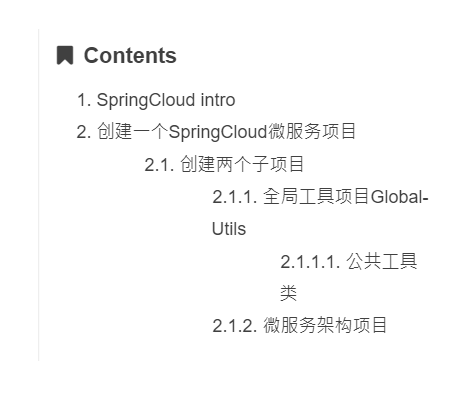
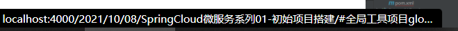
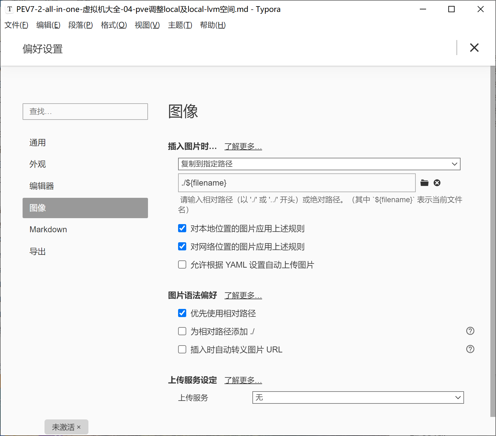

> 2025-09-19: 修复hexo-toc插件目录链接无法跳转问题。通过修改node_modules\hexo-toc\lib\filter.js文件，注释掉会导致toc-link没有href属性的代码，解决目录点击无反应的问题。
> 
> 原始代码：
> ```javascript
> $title.attr('id', id);
> $title.children('a').remove();
> $title.html( '<span id="' + id + '">' + $title.html() + '</span>' );
> $title.removeAttr('id');
> ```
> 
> 修改后代码：
> ```javascript
> $title.attr('id', id);
> // $title.children('a').remove();
> // $title.html( '<span id="' + id + '">' + $title.html() + '</span>' );
> // $title.removeAttr('id');
> ```
>
> 2025-09-19: 添加不蒜子网站统计功能，在footer中显示站点总访问量、访客数和文章阅读量。

~~~
title: "[Hexo] Theme HuWeihuang"
catalog: true
toc_nav_num: true
date: 2017-09-18 10:51:24
subtitle: "This is hexo theme Demo."
header-img: "/img/article_header/article_header.png"
tags:
- Hexo
catagories:
- Hexo
updateDate: 2018-12-23 22:26:24
top: 1
~~~


# Hexo 博客搭建
个人博客快速搭建模板
## 版权
- Beantech 
- 胡伟煌
## 安装Hexo
~~~
npm install hexo-cli -g
~~~
如果下载速度慢的可以将npm的下载源换成国内镜像,推荐阿里巴巴的镜像.

```
// 安装cnpm并换源阿里巴巴
npm install -g cnpm --registry=https://registry.npm.taobao.org
// npm换源阿里巴巴
npm config set registry https://registry.npm.taobao.org

// 配置后可通过下面方式来验证是否成功
npm config get registry
// 或
npm info express
```

版本信息

~~~
Jermaine@R7000K MINGW64 /d/Development/IdeaProjects/hexo-blog (master)
$ hexo -v
hexo: 3.9.0
hexo-cli: 4.3.0
os: win32 10.0.19042
node: 12.2.0
v8: 7.4.288.21-node.17
uv: 1.28.0
zlib: 1.2.11
brotli: 1.0.7
ares: 1.15.0
modules: 72
nghttp2: 1.38.0
napi: 4
llhttp: 1.1.3
http_parser: 2.8.0
openssl: 1.1.1b
cldr: 35.1
icu: 64.2
tz: 2019a
unicode: 12.1

~~~

## 使用博客模板

### 初始化
~~~ git 
git clone 链接
cd hexo-theme
npm install
~~~

### 基本的Hexo语法
~~~ git
hexo new "postname" 新建一篇博客
hexo new post "<post name>" # 新建一篇博客
hexo clean && hexo generate # 清理并且生成项目
hexo server # 在本地运行hexo服务器
hexo deploy # 部署在远端
~~~

### 博客插入图片格式

测试

``
``

如果使用了markdown编辑器需要配置编辑器的相对路径.

### 如果图片路径报错

不然部署静态路径时会报错

### 第一种方式

~~~
设置 post_asset_folder  为 true, 安装插件 asset-image
npm install https://github.com/CodeFalling/hexo-asset-image
或者
npm install https://github.com/xcodebuild/hexo-asset-image
设置图片为相对路径
hexo clean && hexo generate && hexo s 运行查看
~~~

备注: 因为国内环境github拉取会非常慢, 我将hexo-asset-image作为资源文件上传到项目根目录下,方便你们复制进node_modules中

### 第二种方式

将根目录/下的hexo-asset-image.7z 解压后放进node_modules中即可


### 博客目录点击无跳转问题



点击后无效发现跳转为null

HEXO搭建博客，发现文章目录点击无反应，F12查看html，发现`toc-link`后面没有href属性

解决 : 

因此目前阶段，进入你项目根目录的 `node_modules\hexo-toc\lib\filter.js` 中，把 28 行～31 行修改为

~~~js
    $title.attr('id', id);
    // $title.children('a').remove();
    // $title.html( '<span id="' + id + '">' + $title.html() + '</span>' );
    // $title.removeAttr('id');
~~~

重启后既可跳转

### git ssh key 生成

~~~
ssh-keygen -t rsa -C "jermainenee@yeah.net"
~~~


## markdown配置



## **来作者**README文档如下

> Ported Theme of [Hux Blog](https://github.com/Huxpro/huxpro.github.io), Thank [Huxpro](https://github.com/Huxpro) for designing such a flawless theme.
>
> This BeanTech theme created by [YuHsuan](http://beantech.org) modified from the original Porter [Kaijun](http://kaijun.rocks/hexo-theme-huxblog/)

# [Live Demo](http://beantech.org)


# Usage

I publish the whole project for your convenience, so you can just follow the instruction down below, then you can easily customiz your own blog!

Let's begin!!!

## Init

```bash
git clone https://github.com/YenYuHsuan/hexo-theme-beantech.git ./hexo-beantech
cd hexo-beantech
npm install
```

## Modify

Modify `_config.yml` file with your own info.
Especially the section:

### Deployment

Replace to your own repo!

```yml
deploy:
  type: git
  repo: https://github.com/<yourAccount>/<repo>
  branch: <your-branch>
```

### Sidebar settings

Copy your avatar image to `<root>/img/` and modify the `_config.yml`:

```yml
sidebar: true    # whether or not using Sidebar.
sidebar-about-description: "<your description>"
sidebar-avatar: img/<your avatar path>
```

and activate your personal widget you like

```yml
widgets:         # here are widget you can use, you can comment out
- featured-tags
- short-about
- recent-posts
- friends-blog
- archive
- category
```

if you want to add sidebar widget, please add at `layout/_widget`.

### Signature Setup

Copy your signature image to `<root>/img/signature` and modify the `_config.yml`:

```yml
signature: true   # show signature
signature-img: img/signature/<your-signature-ID>
```

### Go to top icon Setup

My icon is using iron man, you can change to your own icon at `css/image`.

### Post tag

You can decide to show post tags or not.

```yml
home_posts_tag: true
```

```yml
home_posts_tag: false
```

### Markdown render

My markdown render engine plugin is [hexo-renderer-markdown-it](https://github.com/celsomiranda/hexo-renderer-markdown-it).

```yml
# Markdown-it config
## Docs: https://github.com/celsomiranda/hexo-renderer-markdown-it/wiki
markdown:
  render:
    html: true
    xhtmlOut: false
    breaks: true
    linkify: true
    typographer: true
    quotes: '“”‘’'
```

and if you want to change the header anchor 'ℬ', you can go to `layout/post.ejs` to change it.

```javascript
async("//cdn.bootcss.com/anchor-js/1.1.1/anchor.min.js",function(){
        anchors.options = {
          visible: 'hover',
          placement: 'left',
          icon: 'ℬ'
        };
        anchors.add().remove('.intro-header h1').remove('.subheading').remove('.sidebar-container h5');
    })
```

## Hexo Basics

Some hexo command:

```bash
hexo new post "<post name>" # you can change post to another layout if you want
hexo clean && hexo generate # generate the static file
hexo server # run hexo in local environment
hexo deploy # hexo will push the static files automatically into the specific branch(gh-pages) of your repo!
```

# Have fun ^_^ 

Please [Star](https://github.com/YenYuHsuan/hexo-theme-beantech) this Project if you like it! [Follow](https://github.com/YenYuHsuan) would also be appreciated!
Peace!