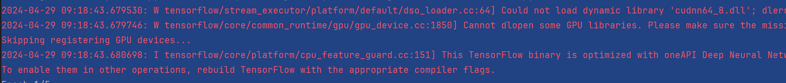
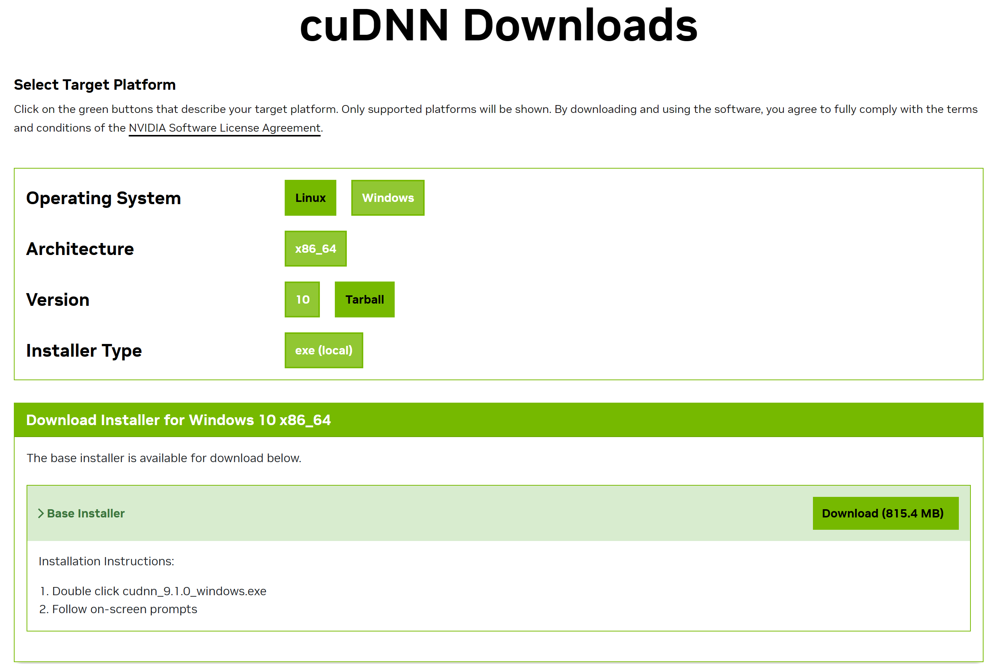
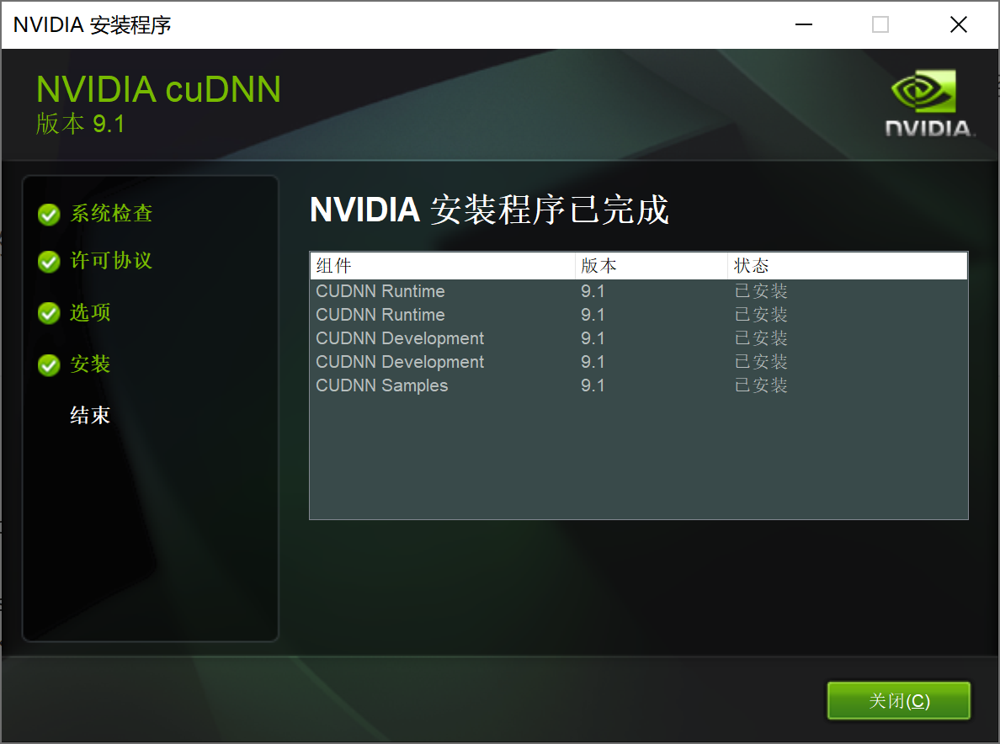
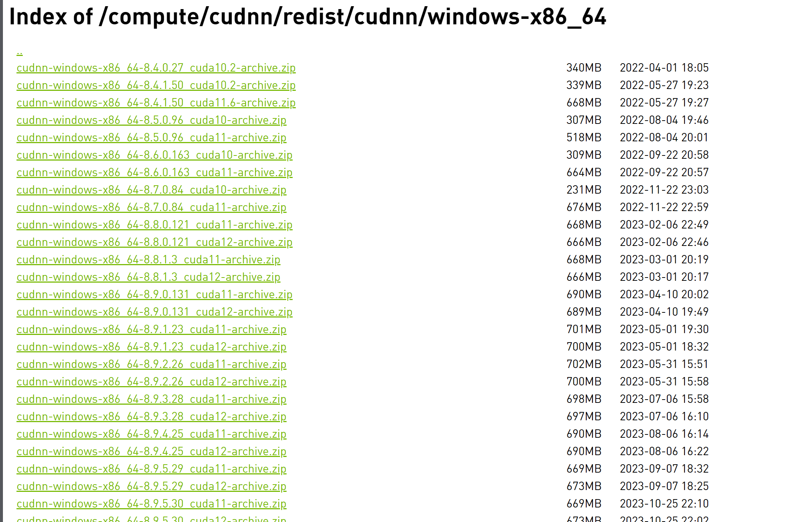
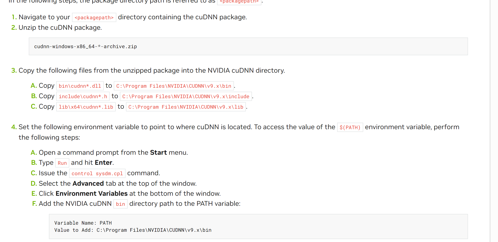
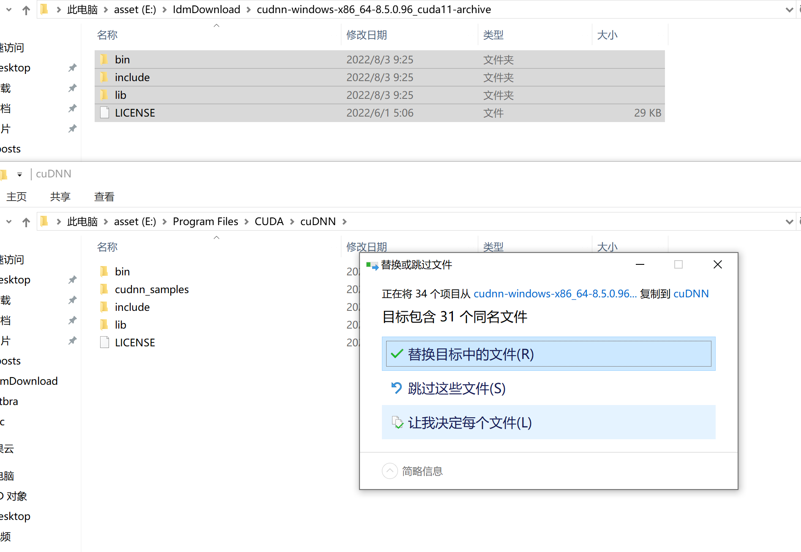
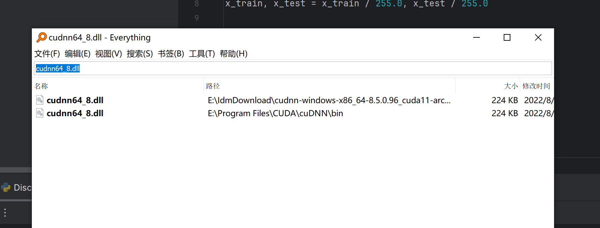

# Python启动视觉识别hello_world


## 简介

我们声称人工智能很有趣，但是我们还没有描述它是什么。历史上研究人员研究过几种不同版本的人工智能。有些根据对人类行为的复刻来定义智能，而另一些更喜欢用“**理性**”（rationality）来抽象正式地定义智能，直观上的理解是做“正确的事情”。智能主题的本身也各不相同：一些人将智能视为内部思维过程和推理的属性，而另一些人则关注智能的外部特征，也就是智能行为。[[1\]](javascript:void(0))

## 准备工作

- python3.9
- 显卡:本人是3060ti
- [CUDA Toolkit 11.0 Download | NVIDIA Developer](https://developer.nvidia.com/cuda-11.0-download-archive?target_os=Windows&target_arch=x86_64&target_version=10&target_type=exelocal)
  - 我最开始安装V12版本cuda发现没有任何效果, 改为11

- 一个小小的hello_world demo

1. **导入 TensorFlow 库**：首先，通过 `import tensorflow as tf` 导入 TensorFlow 库。
2. **导入 MNIST 数据集**：然后，通过 `from tensorflow.keras.datasets import mnist` 导入 MNIST 数据集。这个数据集包含了 60,000 个训练样本和 10,000 个测试样本，每个样本都是一个手写数字的灰度图像。
3. **数据预处理**：接着，对加载的数据进行预处理。通过将像素值缩放到 0 到 1 之间，将输入特征归一化。
4. **定义模型**：定义了一个简单的神经网络模型，使用了 Sequential 模型，并添加了 Flatten 层（用于将二维图像数据展平为一维），一个全连接层（Dense），一个 Dropout 层（用于防止过拟合），以及一个输出层。这个模型的结构是：输入层（28x28）-> Flatten 层 -> 全连接层（128个神经元，ReLU 激活函数）-> Dropout 层 -> 输出层（10个神经元，softmax 激活函数）。
5. **编译模型**：使用 `compile` 方法来编译模型，指定优化器（这里使用 Adam 优化器）、损失函数（这里使用 sparse_categorical_crossentropy，因为标签是整数）、以及评估指标（这里使用准确率）。
6. **训练模型**：使用 `fit` 方法来训练模型，传入训练集的特征和标签，以及训练的迭代次数（epochs）。
7. **评估模型**：使用 `evaluate` 方法来评估模型的性能，传入测试集的特征和标签。

- pip换源`pip config set global.index-url https://pypi.mirrors.ustc.edu.cn/simple`

  - 查看是否生效`pip config list`

  - ```
    C:\Users\Jermaine>pip config list
    globa1.index-ur1='https://pypi.mirrors.ustc.edu.cn/simple/'
    ```

  - 安装依赖测试

  - 

注意: 运行以下代码需要 `pip install tensorflow` 安装必须的依赖


~~~python
import tensorflow as tf
from tensorflow.keras.datasets import mnist

# 加载 MNIST 数据集
(x_train, y_train), (x_test, y_test) = mnist.load_data()

# 数据预处理
x_train, x_test = x_train / 255.0, x_test / 255.0

# 定义模型
model = tf.keras.models.Sequential([
    tf.keras.layers.Flatten(input_shape=(28, 28)),
    tf.keras.layers.Dense(128, activation='relu'),
    tf.keras.layers.Dropout(0.2),
    tf.keras.layers.Dense(10, activation='softmax')
])

# 编译模型
model.compile(optimizer='adam',
              loss='sparse_categorical_crossentropy',
              metrics=['accuracy'])

# 训练模型
model.fit(x_train, y_train, epochs=5)

# 评估模型
loss, accuracy = model.evaluate(x_test, y_test)
print("Test Loss:", loss)
print("Test Accuracy:", accuracy)
~~~


#### 运行以上代码报错


~~~log
"D:\Program Files\Python39\python.exe" E:\PycharmProjects\Python-Learing\src\DiscriminateNumber.py 
2024-04-28 15:15:58.803235: W tensorflow/stream_executor/platform/default/dso_loader.cc:64] Could not load dynamic library 'cudart64_110.dll'; dlerror: cudart64_110.dll not found
2024-04-28 15:15:58.803414: I tensorflow/stream_executor/cuda/cudart_stub.cc:29] Ignore above cudart dlerror if you do not have a GPU set up on your machine.
Traceback (most recent call last):
  File "E:\PycharmProjects\Python-Learing\src\DiscriminateNumber.py", line 1, in <module>
    import tensorflow as tf
  File "D:\Program Files\Python39\lib\site-packages\tensorflow\__init__.py", line 41, in <module>
    from tensorflow.python.tools import module_util as _module_util
  File "D:\Program Files\Python39\lib\site-packages\tensorflow\python\__init__.py", line 41, in <module>
    from tensorflow.python.eager import context
  File "D:\Program Files\Python39\lib\site-packages\tensorflow\python\eager\context.py", line 33, in <module>
    from tensorflow.core.framework import function_pb2
  File "D:\Program Files\Python39\lib\site-packages\tensorflow\core\framework\function_pb2.py", line 16, in <module>
    from tensorflow.core.framework import attr_value_pb2 as tensorflow_dot_core_dot_framework_dot_attr__value__pb2
  File "D:\Program Files\Python39\lib\site-packages\tensorflow\core\framework\attr_value_pb2.py", line 16, in <module>
    from tensorflow.core.framework import tensor_pb2 as tensorflow_dot_core_dot_framework_dot_tensor__pb2
  File "D:\Program Files\Python39\lib\site-packages\tensorflow\core\framework\tensor_pb2.py", line 16, in <module>
    from tensorflow.core.framework import resource_handle_pb2 as tensorflow_dot_core_dot_framework_dot_resource__handle__pb2
  File "D:\Program Files\Python39\lib\site-packages\tensorflow\core\framework\resource_handle_pb2.py", line 16, in <module>
    from tensorflow.core.framework import tensor_shape_pb2 as tensorflow_dot_core_dot_framework_dot_tensor__shape__pb2
  File "D:\Program Files\Python39\lib\site-packages\tensorflow\core\framework\tensor_shape_pb2.py", line 36, in <module>
    _descriptor.FieldDescriptor(
  File "D:\Program Files\Python39\lib\site-packages\google\protobuf\descriptor.py", line 621, in __new__
    _message.Message._CheckCalledFromGeneratedFile()
TypeError: Descriptors cannot be created directly.
If this call came from a _pb2.py file, your generated code is out of date and must be regenerated with protoc >= 3.19.0.
If you cannot immediately regenerate your protos, some other possible workarounds are:
 1. Downgrade the protobuf package to 3.20.x or lower.
 2. Set PROTOCOL_BUFFERS_PYTHON_IMPLEMENTATION=python (but this will use pure-Python parsing and will be much slower).

More information: https://developers.google.com/protocol-buffers/docs/news/2022-05-06#python-updates

Process finished with exit code 1

~~~


你可以在 NVIDIA 的官方网站上找到 CUDA Toolkit 的安装包和相关文档。以下是一些步骤，以便你能够在 NVIDIA 网站上找到适合你系统的 CUDA 安装包：

1. **打开 NVIDIA 官方网站**：打开浏览器，访问 NVIDIA 的官方网站 [https://www.nvidia.com](https://www.nvidia.com/)。
2. **导航到 CUDA 页面**：在网站上方的搜索框中输入 "CUDA"，然后选择相关的页面或者在导航菜单中找到 CUDA Toolkit 页面。通常，CUDA Toolkit 的下载页面会被列在 "开发者" 或者 "产品" 等菜单项下。
3. **选择适合你系统的版本**：在 CUDA Toolkit 的下载页面上，你会看到列出了各种版本的 CUDA Toolkit，包括不同的操作系统和 GPU 架构的版本。选择适合你系统的版本，并确保与你的 GPU 兼容。
4. **下载安装包**：点击选择的 CUDA 版本，然后在下载页面上找到适合你系统的安装包，并点击下载链接。
5. **阅读文档**：在下载安装包之前，建议你阅读 CUDA Toolkit 的相关文档和安装说明，以确保你了解如何正确地安装和配置 CUDA Toolkit。


## 问题

#### NVIDIA安装CUDA在安装阶段提示NVIDIA安装程序失败


[【DL-遇错】NVIDIA安装CUDA在安装阶段提示NVIDIA安装程序失败_cuda程序安装失败12.4-CSDN博客](https://blog.csdn.net/weixin_47274607/article/details/134878276)

在自定义安装选项这一步只选择CUDA这一项，其他选项全部不勾选，然后继续后面步骤即可安装成功


### 运行结果

~~~
"D:\Program Files\Python39\python.exe" E:\PycharmProjects\Python-Learing\src\DiscriminateNumber.py 
2024-04-29 09:18:43.679530: W tensorflow/stream_executor/platform/default/dso_loader.cc:64] Could not load dynamic library 'cudnn64_8.dll'; dlerror: cudnn64_8.dll not found
2024-04-29 09:18:43.679746: W tensorflow/core/common_runtime/gpu/gpu_device.cc:1850] Cannot dlopen some GPU libraries. Please make sure the missing libraries mentioned above are installed properly if you would like to use GPU. Follow the guide at https://www.tensorflow.org/install/gpu for how to download and setup the required libraries for your platform.
Skipping registering GPU devices...
2024-04-29 09:18:43.680698: I tensorflow/core/platform/cpu_feature_guard.cc:151] This TensorFlow binary is optimized with oneAPI Deep Neural Network Library (oneDNN) to use the following CPU instructions in performance-critical operations:  AVX AVX2
To enable them in other operations, rebuild TensorFlow with the appropriate compiler flags.
Epoch 1/5
1875/1875 [==============================] - 3s 2ms/step - loss: 0.2950 - accuracy: 0.9139
Epoch 2/5
1875/1875 [==============================] - 3s 2ms/step - loss: 0.1440 - accuracy: 0.9578
Epoch 3/5
1875/1875 [==============================] - 3s 2ms/step - loss: 0.1072 - accuracy: 0.9677
Epoch 4/5
1875/1875 [==============================] - 2s 910us/step - loss: 0.0871 - accuracy: 0.9734
Epoch 5/5
1875/1875 [==============================] - 1s 742us/step - loss: 0.0765 - accuracy: 0.9762
313/313 [==============================] - 0s 781us/step - loss: 0.0723 - accuracy: 0.9795
Test Loss: 0.07231290638446808
Test Accuracy: 0.9794999957084656

Process finished with exit code 0

~~~

没有使用显卡



#### 原因 

1. 缺少 cudnn64_8.dll：这个警告是因为缺少了 cuDNN 库文件。cuDNN 是用于加速深度神经网络计算的 NVIDIA 库。如果你希望在 GPU 上运行 TensorFlow，并且获得最佳性能，你需要安装并配置 cuDNN。你可以按照 TensorFlow 官方文档提供的指南进行安装和配置：[在 GPU 上安装 TensorFlow](https://www.tensorflow.org/install/gpu)。
2. GPU 设备注册跳过：由于缺少 GPU 库文件，TensorFlow 未能注册 GPU 设备。
3. 优化的 TensorFlow 二进制文件：这个消息说明你的 TensorFlow 二进制文件使用了 oneAPI Deep Neural Network Library (oneDNN) 来优化 CPU 上的性能。

#### 解决

1. **下载 cuDNN**：

   - 访问 NVIDIA 的[官方网站](https://developer.nvidia.com/cudnn)并注册（如果尚未注册），然后下载适用于你的系统的 cuDNN。确保选择与你安装的 CUDA 版本兼容的 cuDNN 版本。[cuDNN 9.1.0 Downloads | NVIDIA Developer](https://developer.nvidia.com/cudnn-downloads?target_os=Windows&target_arch=x86_64&target_version=10&target_type=exe_local)
   - 

2. **安装 cuDNN**：

   - 解压下载的 cuDNN 压缩文件，并按照 NVIDIA 的安装说明进行安装。[Index of /compute/cudnn/redist/cudnn/windows-x86_64 (nvidia.com)](https://developer.download.nvidia.com/compute/cudnn/redist/cudnn/windows-x86_64/)
   - [1. Introduction — Installation Guide Windows 12.4 documentation (nvidia.com)](https://docs.nvidia.com/cuda/cuda-installation-guide-microsoft-windows/index.html)
   - [Installing cuDNN on Windows — NVIDIA cuDNN v9.1.0 documentation](https://docs.nvidia.com/deeplearning/cudnn/latest/installation/windows.html)
   - 
   - 我的cuda版本是

3. **NVIDIA官方操作**：

4. 

   

5. **重新运行代码**：everything查找缺失的文件已找到

   

6. 

   - 完成以上步骤后，重新运行你的代码，你应该不会再收到缺少 cudnn64_8.dll 的错误。

   ~~~
   "D:\Program Files\Python39\python.exe" E:\PycharmProjects\Python-Learing\src\DiscriminateNumber.py 
   2024-04-29 09:28:31.471368: I tensorflow/core/platform/cpu_feature_guard.cc:151] This TensorFlow binary is optimized with oneAPI Deep Neural Network Library (oneDNN) to use the following CPU instructions in performance-critical operations:  AVX AVX2
   To enable them in other operations, rebuild TensorFlow with the appropriate compiler flags.
   2024-04-29 09:28:31.848419: I tensorflow/core/common_runtime/gpu/gpu_device.cc:1525] Created device /job:localhost/replica:0/task:0/device:GPU:0 with 5480 MB memory:  -> device: 0, name: NVIDIA GeForce RTX 3060 Ti, pci bus id: 0000:01:00.0, compute capability: 8.6
   Epoch 1/5
   2024-04-29 09:28:33.321392: I tensorflow/stream_executor/cuda/cuda_blas.cc:1774] TensorFloat-32 will be used for the matrix multiplication. This will only be logged once.
   1875/1875 [==============================] - 4s 1ms/step - loss: 0.2982 - accuracy: 0.9136
   Epoch 2/5
   1875/1875 [==============================] - 2s 1ms/step - loss: 0.1459 - accuracy: 0.9565
   Epoch 3/5
   1875/1875 [==============================] - 3s 2ms/step - loss: 0.1081 - accuracy: 0.9668
   Epoch 4/5
   1875/1875 [==============================] - 3s 1ms/step - loss: 0.0886 - accuracy: 0.9728
   Epoch 5/5
   1875/1875 [==============================] - 3s 1ms/step - loss: 0.0745 - accuracy: 0.9764
   313/313 [==============================] - 0s 1ms/step - loss: 0.0735 - accuracy: 0.9779
   Test Loss: 0.07349233329296112
   Test Accuracy: 0.9779000282287598
   
   Process finished with exit code 0
   
   ~~~

   成功解决了缺少 cuDNN 的问题，并且你的代码在 GPU 上成功运行，并且在 MNIST 数据集上获得了相当不错的准确率（约为 97.8%）。

   现在TensorFlow 已经配置好了 GPU 支持，并且在 GPU 上运行 TensorFlow 时能够获得更好的性能。

### 廖雪峰版本demo

~~~python
#!/usr/bin/env python3

import torch
from torchvision import transforms

from PIL import Image, ImageOps
from model import NeuralNetwork


device = 'cuda' if torch.cuda.is_available() else 'cpu'
print(f'using {device}')
model = NeuralNetwork().to(device)
path = './mnist.pth'
model.load_state_dict(torch.load(path))
print(f'loaded model from {path}')
print(model)


def test(path):
    print(f'test {path}...')
    image = Image.open(path).convert('RGB').resize((28, 28))
    image = ImageOps.invert(image)

    trans = transforms.Compose([
        transforms.Grayscale(1),
        transforms.ToTensor()
    ])
    image_tensor = trans(image).unsqueeze(0).to(device)
    model.eval()
    with torch.no_grad():
        output = model(image_tensor)
        probs = torch.nn.functional.softmax(output[0], 0)
    predict = torch.argmax(probs).item()
    return predict, probs[predict], probs


def main():
    for i in range(10):
        predict, prob, probs = test(f'./input/test-{i}.png')
        print(f'expected {i}, actual {predict}, {prob}, {probs}')


if __name__ == '__main__':
    main()

~~~


拉取廖雪峰博客的demo

[零基础AI入门指南 - 廖雪峰的官方网站 (liaoxuefeng.com)](https://www.liaoxuefeng.com/article/1543329456062498#0)


启动在5000端口, 

测试数字识别模型


2


#### 核心代码

~~~python

    trans = transforms.Compose([
        transforms.Grayscale(1),
        transforms.ToTensor()
    ])
    image_tensor = trans(image).unsqueeze(0).to(device)
    model.eval()
    with torch.no_grad():
        output = model(image_tensor)
        probs = torch.nn.functional.softmax(output[0], 0)
    predict = torch.argmax(probs).item()
~~~


调用torch框架的识别模型, 本地配置了模型参数

~~~python
#!/usr/bin/env python3

import torch.nn as nn


class NeuralNetwork(nn.Module):
    def __init__(self):
        super().__init__()
        self.conv1 = nn.Conv2d(1, 32, 3, 1)
        self.conv2 = nn.Conv2d(32, 64, 3, 1)
        self.fc1 = nn.Linear(in_features=64 * 5 * 5, out_features=128)
        self.fc2 = nn.Linear(in_features=128, out_features=10)

    def forward(self, x):
        x = nn.functional.relu(self.conv1(x))
        x = nn.functional.max_pool2d(x, kernel_size=2)
        x = nn.functional.relu(self.conv2(x))
        x = nn.functional.max_pool2d(x, kernel_size=2)
        x = x.view(-1, 64 * 5 * 5)
        x = nn.functional.relu(self.fc1(x))
        x = self.fc2(x)
        return x

~~~


## 引用资料

>[【DL-遇错】NVIDIA安装CUDA在安装阶段提示NVIDIA安装程序失败_cuda程序安装失败12.4-CSDN博客](https://blog.csdn.net/weixin_47274607/article/details/134878276)
>
>[Game AI Development Guide (openai.com)](https://chat.openai.com/c/bff96407-2472-4eaf-aea1-cf9a55e2b41f)
>
>[pip怎么更换源_pip更换源的方法有哪些-Python教程-PHP中文网](https://www.php.cn/faq/631330.html)
>
>https://www.liaoxuefeng.com/article/1543329456062498#0
>
>[cuDNN 9.1.0 Downloads | NVIDIA Developer](https://developer.nvidia.com/cudnn-downloads?target_os=Windows&target_arch=x86_64&target_version=10&target_type=exe_local)
>
>[Installing cuDNN on Windows — NVIDIA cuDNN v9.1.0 documentation](https://docs.nvidia.com/deeplearning/cudnn/latest/installation/windows.html)

