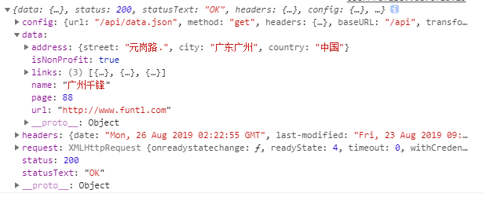

# Vue学习记录
  这边博客为自己学习vue的记录.开始篇幅较大,如果基础好的同学可以直接点击vue内容开始浏览.

## 使用 Axios 实现异步通信

### 什么是 Axios
Axios 是一个开源的可以用在浏览器端和 NodeJS 的异步通信框架，她的主要作用就是实现 AJAX 异步通信，其功能特点如下：

## 测试数据源
我在自己的阿里ECS上搭建了一个tomcat的web项目:data.json做为数据测试源
~~~ json
{
  "name": "广州千锋",
  "url": "http://www.funtl.com",
  "page": 88,
  "isNonProfit": true,
  "address": {
    "street": "元岗路.",
    "city": "广东广州",
    "country": "中国"
  },
  "links": [
    {
      "name": "Google",
      "url": "http://www.google.com"
    },
    {
      "name": "Baidu",
      "url": "http://www.baidu.com"
    },
    {
      "name": "SoSo",
      "url": "http://www.SoSo.com"
    }
  ]
}
~~~
## 开始使用axios请求data.json

### main.js
~~~ javascript
// 导入
import axios from '../node_modules/axios'
// 安装路由
Vue.prototype.axios = axios;

new Vue({
  el: '#app',
  // 启用路由
  router,
  axios,
  // 启用 ElementUI
  render: h => h(App)
});

~~~
### 路由配置 index.js
~~~ javascript 
import Vue from 'vue'
import Router from 'vue-router'

import Login from '../views/Login'
//user
import UserProfile from '../views/user/UserProfile'

Vue.use(Router);

export default new Router({
  mode: 'history',
  routes: [
    {
      // 登录页
      path: '/login',
      name: 'Login',
      component: Login
    },
    {
      // 首页
      path: '/main',
      props:true,
      name: 'Main',
      component: Main,
      children:[
        {path:'/user/profile/:id', name:'UserProfile', component:UserProfile}
      ]
    }

  ]
});
~~~

### 在UserProfile组件中发送axios请求
~~~ javascript
export default {
  name: "UserProfile",
  beforeRouteEnter: (to, from, next) => {
    console.log("准备进入个人信息页");
    // 注意，一定要在 next 中请求，因为该方法调用时 Vue 实例还没有创建，此时无法获取到 this 对象，在这里使用官方提供的回调函数拿到当前实例
    next(vm => {
      vm.getData();
    });
  },
  beforeRouteLeave: (to, from, next) => {
    console.log("准备离开个人信息页");
    next();
  },
  methods: {
    getData: function () {
      this.axios({
        method: 'get',
        url: 'http://服务器地址:8080/data.json'
      }).then(function (repos) {
        console.log(repos);
      }).catch(function (error) {
        console.log(error);
      });
    }
  }
}
~~~
### 启动Vue 项目

控制台输出`npm run dev`回车,控制台信息输出

~~~ console
 DONE  Compiled successfully in 547ms10:34:51 AM

 I  Your application is running here: http://localhost:8082
~~~
### 查看控制台信息
按下`F12`调出谷歌浏览器的前端调试工具.信息如下
~~~ console
Access to XMLHttpRequest at 'http://服务器地址:8080/data.json' 
from origin 'http://localhost:8082' has been blocked by CORS 
policy: No 'Access-Control-Allow-Origin' header is present on 
the requested resource.
~~~
发现是跨域问题,因为Vue的项目是在我PC上运行的,而data.json在我的ECS服务器上.所以出现了跨域问题.

## 解决方案
Axios的跨域是怎么处理的呢?

查看Vue版本信息
~~~ console
$ vue --version
2.9.6
~~~

### 配置BaseURL
在 main.js 中，配置下 Url 前缀

~~~ JavaScript
import Vue from 'vue'
import VueRouter from 'vue-router'
import router from './router'
import axios from '../node_modules/axios'

// 导入 ElementUI
import ElementUI from 'element-ui'
import 'element-ui/lib/theme-chalk/index.css'

import App from './App'

// 安装路由
Vue.use(VueRouter);
Vue.prototype.axios = axios;
// 安装 ElementUI
Vue.use(ElementUI);

axios.defaults.baseURL = '/api';
axios.defaults.headers.post['Content-Type'] = 'application/json';

Vue.config.productionTip = false;

new Vue({
  el: '#app',
  // 启用路由
  router,
  axios,
  // 启用 ElementUI
  render: h => h(App)
});

~~~
`axios.defaults.baseURL = '/api';`
这样每次发送请求都会带一个 /api 的前缀

`axios.defaults.headers.post['Content-Type'] = 'application/json';`

### 配置代理
config 文件夹下的 index.js 文件，在 proxyTable 中加上如下代码：
~~~ JavaScript
module.exports = {
  dev: {

    // Paths
    assetsSubDirectory: 'static',
    assetsPublicPath: '/',
    proxyTable: {
      '/api':{
        target: "http://116.62.110.99:8080",
        changeOrigin:true,
        pathRewrite:{
          '^/api':''
        }
      }
    },
    ....
  }
} 
~~~
### 修改请求URL 
在请求页面中,我的是`UserProfile.vue`
~~~ javascript
methods: {
  getData: function () {
    this.axios({
      method: 'get',
      url: '/data.json'
    }).then(function (repos) {
      console.log(repos.data);
    }).catch(function (error) {
      console.log(error);
    });
  }
}
~~~

### 查看结果
在浏览器中打开界面请求查看控制台信息如下:

### 参考资料
> Axiso 解决跨域访问
> https://blog.csdn.net/yuanlaijike/article/details/80522621
> 路由钩子与异步请求
> https://www.funtl.com/zh/vue-router/%E8%B7%AF%E7%94%B1%E9%92%A9%E5%AD%90%E4%B8%8E%E5%BC%82%E6%AD%A5%E8%AF%B7%E6%B1%82.html

