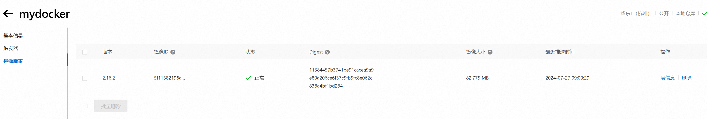

Docker 镜像迁移有几种方法，具体可以根据你的需求选择适合的方式。以下是几种常见的 Docker 镜像迁移方法：

### 1. 使用 `docker save` 和 `docker load`

这种方法适用于在本地文件系统之间传输镜像。

**步骤：**

1. 在源主机上，将镜像保存为一个 tar 文件：

   ```
   
   
   docker save -o <保存文件名>.tar <镜像名>:<标签>
   ```

   示例：

   ```
   
   
   docker save -o myimage.tar myimage:latest
   ```

2. 将生成的 tar 文件传输到目标主机。可以使用 SCP、FTP 等工具进行传输。

3. 在目标主机上加载镜像：

   ```
   
   
   docker load -i <保存文件名>.tar
   ```

   示例：

   ```
   
   
   docker load -i myimage.tar
   ```

### 2. 使用 Docker Registry

这种方法适用于通过网络传输镜像，特别是需要在多个主机之间传输镜像时。

**步骤：**

1. 在源主机上，将镜像推送到 Docker Registry（可以是 Docker Hub，或是自建的私有 Registry）：

   ```
   docker tag <镜像名>:<标签> <registry>/<镜像名>:<标签>
   docker push <registry>/<镜像名>:<标签>
   ```

   示例：

   ```
   docker tag myimage:latest myregistry.com/myimage:latest
   docker push myregistry.com/myimage:latest
   ```

2. 在目标主机上，从 Docker Registry 拉取镜像：

   ```
   docker pull <registry>/<镜像名>:<标签>
   ```

   示例：

   ```
   docker pull myregistry.com/myimage:latest
   ```

### 3. 使用 `docker save` 和 `docker import`

这种方法适用于需要在迁移时修改镜像内容的情况。

**步骤：**

1. 在源主机上，将镜像保存为一个 tar 文件：

   ```
   
   
   docker save -o <保存文件名>.tar <镜像名>:<标签>
   ```

   示例：

   ```
   
   
   docker save -o myimage.tar myimage:latest
   ```

2. 将生成的 tar 文件传输到目标主机。

3. 在目标主机上，通过 `docker import` 创建一个新的镜像：

   ```
   
   
   cat <保存文件名>.tar | docker import - <新镜像名>:<标签>
   ```

   示例：

   ```
   
   
   cat myimage.tar | docker import - mynewimage:latest
   ```

### 4. 使用 `docker export` 和 `docker import`

- 使用 `docker export` 和 `docker import` 时，不会导出或导入容器的卷（volumes）、网络配置或环境变量等元数据。
- 如果你需要迁移或备份整个容器（包括其状态、配置和卷），你可能需要考虑使用其他工具或方法，如 `docker save` 和 `docker load`（针对镜像及其依赖项）或自定义脚本来备份卷和网络配置。

这种方法适用于容器的迁移，尤其是需要保留容器状态的情况。

**步骤：**

1. 在源主机上，停止并导出容器：

   ```
   docker stop <容器ID>
   docker export <容器ID> -o <保存文件名>.tar
   ```

   示例：

   ```
   docker stop mycontainer
   docker export mycontainer -o mycontainer.tar
   ```

2. 将生成的 tar 文件传输到目标主机。

3. 在目标主机上，通过 `docker import` 创建一个新的镜像：

   ```
   
   
   cat <保存文件名>.tar | docker import - <新镜像名>:<标签>
   ```

   示例：

   ```
   
   
   cat mycontainer.tar | docker import - mynewcontainerimage:latest
   ```

选择适合你的场景的迁移方法，并根据步骤进行操作。


### 这里使用阿里云镜像库

## 1. 登录阿里云Docker Registry

```
docker login --username=jermainenee@yeah.net registry.cn-hangzhou.aliyuncs.com/ziming/mydocker
```

用于登录的用户名为阿里云账号全名，密码为开通服务时设置的密码。

~~~
root@R7000K:~# docker login --username=jermainenee@yeah.net registry.cn-hangzhou.aliyuncs.com/ziming/mydocker
Password:
WARNING! Your password will be stored unencrypted in /root/.docker/config.json.
Configure a credential helper to remove this warning. See
https://docs.docker.com/engine/reference/commandline/login/#credentials-store

Login Succeeded
~~~

### 推送

~~~
root@R7000K:~# docker tag 5f11582196a4 registry.cn-hangzhou.aliyuncs.com/ziming/mydocker/[镜像名称]:2.16.2
root@R7000K:~# docker push registry.cn-hangzhou.aliyuncs.com/ziming/mydocker/[镜像名称]:2.16.2
The push refers to repository [registry.cn-hangzhou.aliyuncs.com/ziming/mydocker]
f6177839027a: Pushed
4f6d7e40085b: Pushed
4776464837fd: Pushed
8c004456aeb5: Pushed
2.16.2: digest: sha256:11384457b3741be91cacea9a9e80a206ce6f37c5fb5fc8e062c838a4bf1bd284 size: 1154

~~~


您可以在访问凭证页面修改凭证密码。

## 2. 从Registry中拉取镜像

```
$ docker pull registry.cn-hangzhou.aliyuncs.com/ziming/mydocker:[镜像版本号]
```

## 3. 将镜像推送到Registry

```
$ docker login --username=jerma******@yeah.net registry.cn-hangzhou.aliyuncs.com$ docker tag [ImageId] registry.cn-hangzhou.aliyuncs.com/ziming/mydocker:[镜像版本号]$ docker push registry.cn-hangzhou.aliyuncs.com/ziming/mydocker:[镜像版本号]
```

请根据实际镜像信息替换示例中的[ImageId]和[镜像版本号]参数。

## 4. 选择合适的镜像仓库地址

从ECS推送镜像时，可以选择使用镜像仓库内网地址。推送速度将得到提升并且将不会损耗您的公网流量。

如果您使用的机器位于VPC网络，请使用 registry-vpc.cn-hangzhou.aliyuncs.com 作为Registry的域名登录。

## 5. 示例

使用"docker tag"命令重命名镜像，并将它通过专有网络地址推送至Registry。

```
$ docker imagesREPOSITORY                                                         TAG                 IMAGE ID            CREATED             VIRTUAL SIZEregistry.aliyuncs.com/acs/agent                                    0.7-dfb6816         37bb9c63c8b2        7 days ago          37.89 MB$ docker tag 37bb9c63c8b2 registry-vpc.cn-hangzhou.aliyuncs.com/acs/agent:0.7-dfb6816
```

使用 "docker push" 命令将该镜像推送至远程。

```
$ docker push registry-vpc.cn-hangzhou.aliyuncs.com/acs/agent:0.7-dfb6816
```

~~~
root@R7000K:~# docker tag 5f11582196a4 registry.cn-hangzhou.aliyuncs.com/ziming/mydocker:2.16.2
root@R7000K:~# docker push registry.cn-hangzhou.aliyuncs.com/ziming/mydocker:2.16.2
The push refers to repository [registry.cn-hangzhou.aliyuncs.com/ziming/mydocker]
f6177839027a: Pushed
4f6d7e40085b: Pushing [============>                                      ]  74.02MB/286.5MB
4776464837fd: Pushed
8c004456aeb5: Pushed

~~~

这里查看后台推送成功



拉取,我们在另外有一台主机进行拉取

如果你已经将 Docker 镜像推送到 Docker Registry（无论是 Docker Hub 还是私有 Registry），其他主机可以通过以下步骤拉取该镜像：

1. **登录到 Docker Registry**（如果是私有 Registry，可能需要先登录）：

   ```
   
   
   docker login <registry>
   ```

   示例（使用 Docker Hub）：

   ```
   
   
   docker login docker.io
   ```

   示例（使用私有 Registry）：

   ```
   
   
   docker login myregistry.com
   ```

   在登录时，你需要输入你在 Registry 上的用户名和密码。

2. **拉取镜像**：

   ```
   
   
   docker pull <registry>/<镜像名>:<标签>
   ```

   示例：

   ```
   
   
   docker pull docker.io/myimage:latest
   ```

   或者，如果是私有 Registry：

   ```
   
   
   docker pull myregistry.com/myimage:latest
   ```

3. **等待镜像下载完成**。拉取过程会自动从 Registry 下载镜像到本地主机。

通过这些步骤，其他主机就能够从 Docker Registry 上拉取到你之前推送的镜像了。确保目标主机具有访问相应 Registry 的权限，并且能够连接到网络。

## 引用资料

>
>
>
