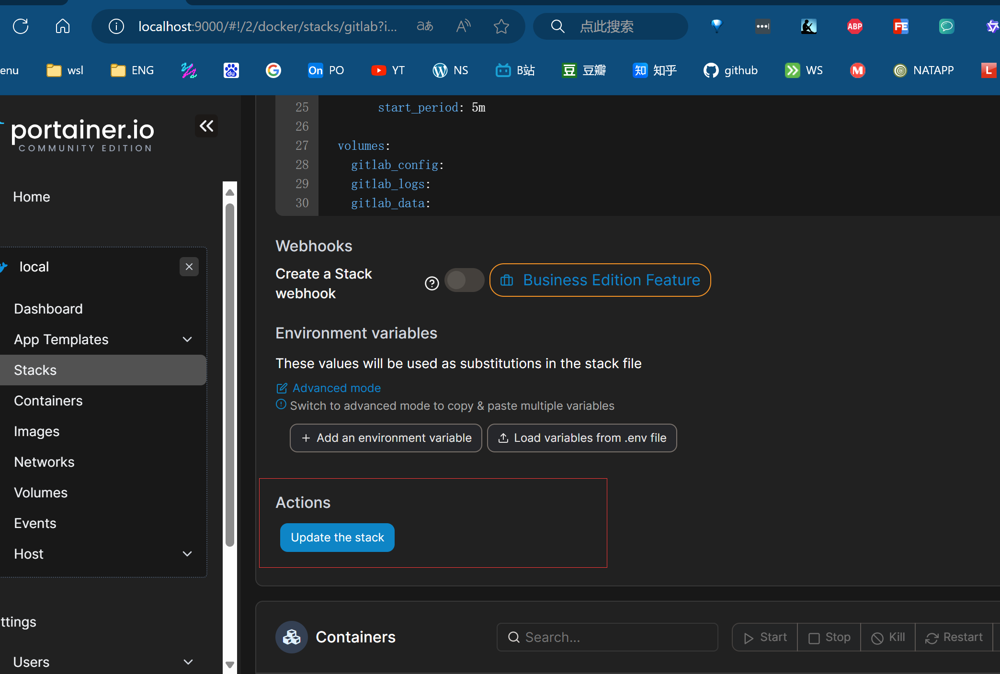
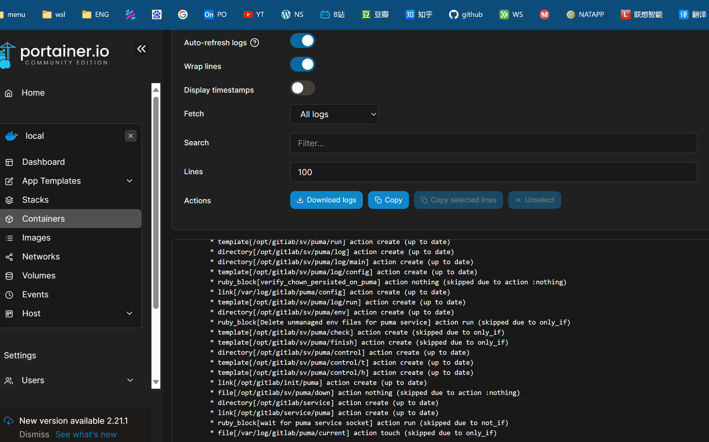
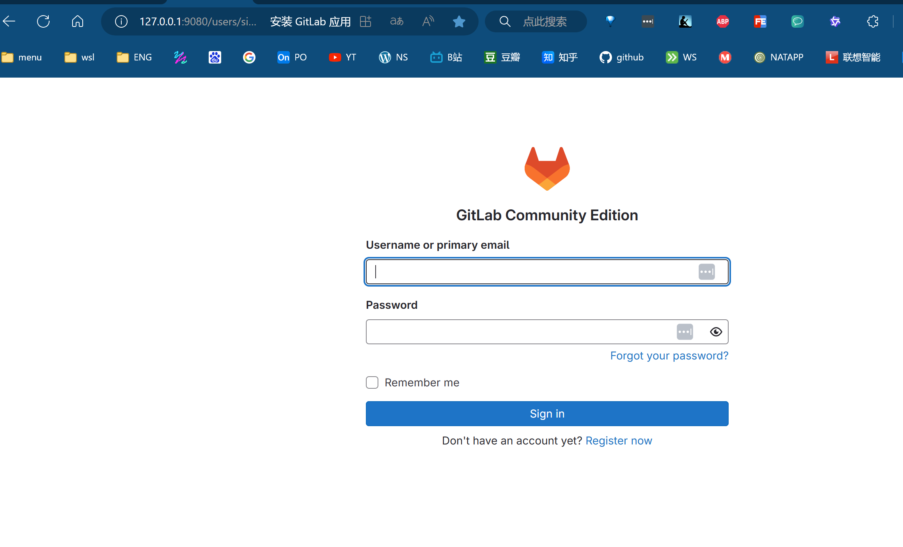
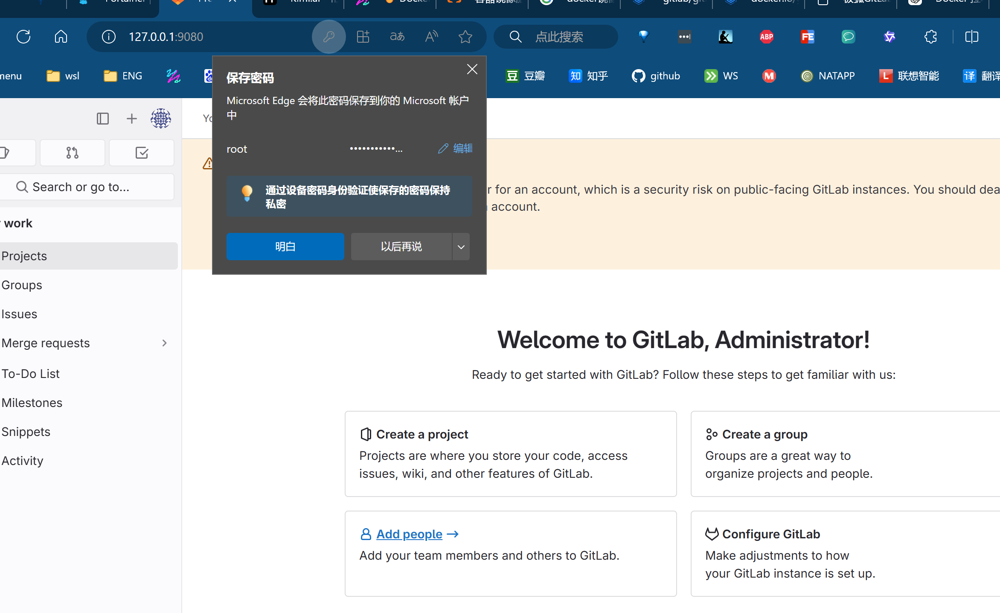

# Gitlab部署

## 简介

## 准备工作

- portainer

- docker下载源如果在中国大陆记得换源

- docker-compose脚本

~~~
  version: '3.8'
  services:
    gitlab:
      image: gitlab/gitlab-ce:latest
      container_name: gitlab
      restart: always
      environment:
        TZ: 'Asia/Shanghai'
        GITLAB_OMNIBUS_CONFIG: |
          external_url 'http://127.0.0.1:9080'
          gitlab_rails['gitlab_shell_ssh_port'] = 9022
      ports:
        - '9080:9080'
        - '9443:443'
        - '9022:22'
      volumes:
        - 'gitlab_config:/etc/gitlab'
        - 'gitlab_logs:/var/log/gitlab'
        - 'gitlab_data:/var/opt/gitlab'
      healthcheck:
        test: ["CMD", "curl", "--fail", "http://localhost:9080"]
        interval: 5m
        timeout: 10s
        retries: 5
        start_period: 5m
  
  volumes:
    gitlab_config:
    gitlab_logs:
    gitlab_data:
~~~

## 执行

### 查看初始密码

~~~
➜  ~ mv gitlab-ce.tar /mnt/d
➜  ~ docker exec -it gitlab cat /etc/gitlab/initial_root_password
# WARNING: This value is valid only in the following conditions
#          1. If provided manually (either via `GITLAB_ROOT_PASSWORD` environment variable or via `gitlab_rails['initial_root_password']` setting in `gitlab.rb`, it was provided before database was seeded for the first time (usually, the first reconfigure run).
#          2. Password hasn't been changed manually, either via UI or via command line.
#
#          If the password shown here doesn't work, you must reset the admin password following https://docs.gitlab.com/ee/security/reset_user_password.html#reset-your-root-password.

Password: 5kiAIcg+DTZ2e9mneefHyCrEpVX/cQJ2vwUiDXXMZsI=

# NOTE: This file will be automatically deleted in the first reconfigure run after 24 hours.
~~~

### 登录成功

## 引用资料

>[Kimi.ai - 帮你看更大的世界 (moonshot.cn)](https://kimi.moonshot.cn/chat/crhpqbprdij1knp6up0g)
>
>[🔥 Docker19-portainer-Docker图形化工具 - 十渊 | Blog (niziming.github.io)](https://niziming.github.io/2023/12/28/Docker19-portainer-Docker图形化工具/)
