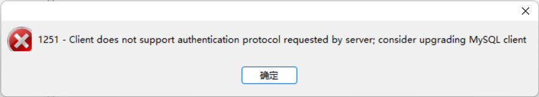
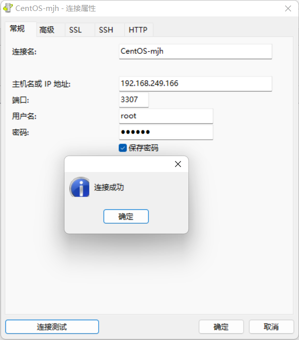

# 安装mysql


docker 安装mysql

要在Docker中安装MySQL，您可以使用官方的MySQL镜像。以下是安装MySQL的步骤和示例命令：

1. 拉取MySQL官方镜像：

```bash
docker pull mysql
```

1. 运行MySQL容器：

```bash
root@R7000K:/home# docker images
REPOSITORY            TAG       IMAGE ID       CREATED         SIZE
mysql                 8.0       a6a15556a7dd   2 weeks ago     603MB

docker run --name mysql -e MYSQL_ROOT_PASSWORD=G7FISndPso2sT3 -d mysql:8.0
```

在这里，`some-mysql`是您给容器指定的名字，`my-secret-pw`是您为MySQL root用户设置的密码，`tag`是您想要使用的MySQL版本的标签（例如5.7、8.0等），如果省略则默认使用最新版本。

1. （可选）如果您想要将MySQL数据持久化到宿主机，可以使用`-v`参数来挂载一个数据卷：

```bash
docker run --name some-mysql -v /my/own/datadir:/var/lib/mysql -e MYSQL_ROOT_PASSWORD=my-secret-pw -d mysql:tag
```

在这里，`/my/own/datadir`是宿主机上的目录，用于存储MySQL数据。

以上步骤会启动一个新的MySQL容器。您可以通过`docker ps`查看正在运行的容器，通过`docker logs some-mysql`查看容器日志以确认MySQL是否成功运行。


### 问题记录

##### 1251 - Client does not support authentication protocol requested by server; consider upgrading MySQL client



`alter user 'root'@'%' identified with mysql_native_password by '你的密码';`



### 方法二

添加用户,同时设置登陆加密方式为mysql_native_password,并且给它远程访问权限,完成后这个用户也可以访问.

添加远程登录用户

~~~
CREATE USER 'mjh'@'%' IDENTIFIED WITH mysql_native_password BY '123456';
GRANT ALL PRIVILEGES ON *.* TO 'mjh'@'%';
~~~


## 引用资料

>
>
>
