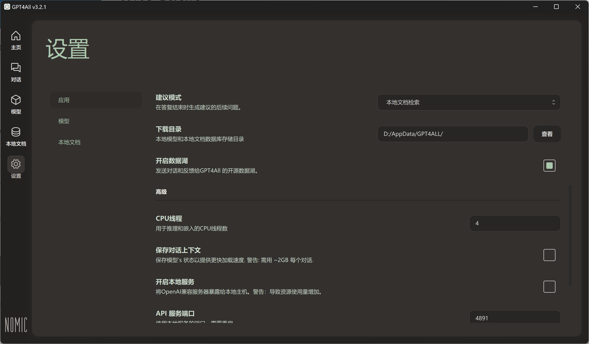
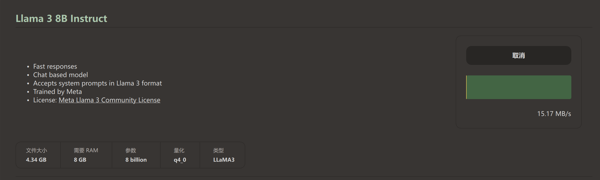
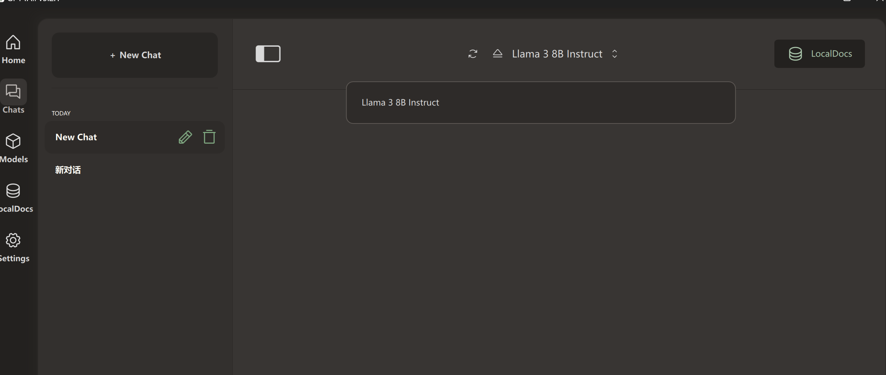
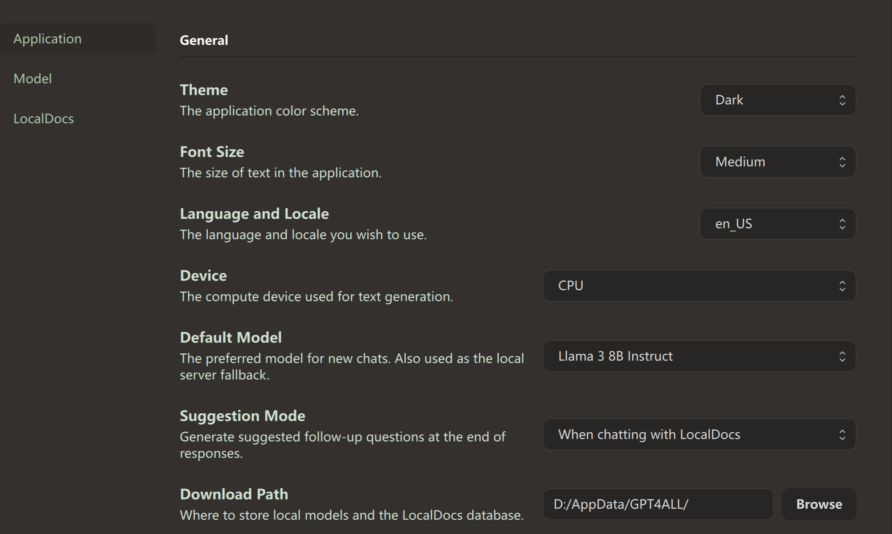
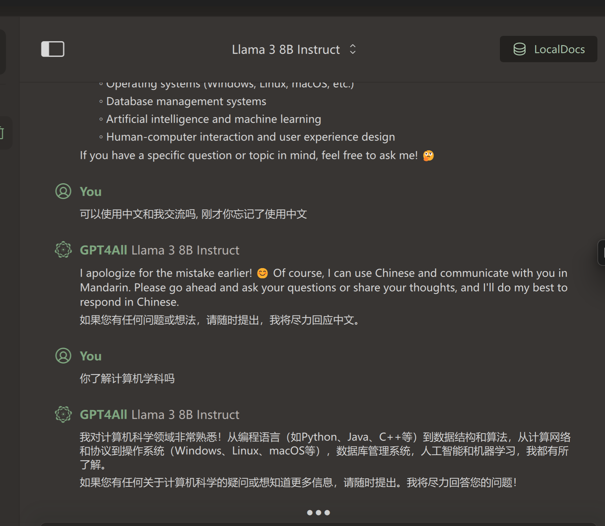

# GPT4ALL-v3.2.1-大语言模型本地部署01

GPT4All 是一个旨在为广泛用户群体提供大语言模型（LLMs）能力的开源项目。该项目的核心目标是降低大语言模型的部署和使用门槛，使个人和组织能够在本地环境中运行强大的自然语言处理（NLP）模型，而不需要依赖于云端服务。

### 主要特点

1. **本地部署**：
   - GPT4All 专注于本地运行，用户无需担心数据隐私问题，因为所有处理都在本地进行。
   - 适合资源受限的环境，比如个人电脑或企业内部服务器。
2. **轻量化**：
   - GPT4All 通过优化，能够在较低的硬件资源下运行。这意味着即使没有高端 GPU，也可以在 CPU 上运行模型，虽然速度会有所下降。
3. **开源**：
   - 完全开源，允许开发者自由修改、微调和部署。社区提供了许多模型和优化策略，帮助用户根据特定需求调整模型。
4. **多语言支持**：
   - GPT4All 支持多种语言，能够处理各种语言生成和理解任务。
5. **易于使用**：
   - 提供了简单的接口，易于集成到现有应用中。开发者可以通过 Python API、CLI 工具或 GUI 与模型交互。

### 技术背景

GPT4All 是基于 GPT 架构的一个开源衍生项目。它通过结合不同版本的 GPT（如 GPT-3、GPT-J、GPT-NeoX）的技术，创建了适合本地运行的优化版本。它使用了量化技术和其他模型压缩技术来减少计算需求。

### 优势和应用场景

- **隐私敏感的任务**：适合处理那些对数据隐私要求较高的任务，如企业内部文档处理、医疗数据分析等。
- **教育和研究**：GPT4All 为学术研究人员和学生提供了一个研究 NLP 技术的本地化平台。
- **开发和测试**：开发者可以快速在本地环境中进行模型的开发、测试和调优，而不依赖外部服务。

### 部署与使用

GPT4All 提供了多个部署选项，包括通过 Docker 容器、本地 Python 环境或编译后的二进制文件。具体的使用方法取决于用户的需求和技术背景。

### 限制与挑战

- **计算性能**：尽管经过优化，GPT4All 在缺乏强大硬件支持的情况下，推理速度仍不如云端部署的模型。
- **模型规模**：为了适应本地运行的需求，模型的规模通常较小，因此在复杂任务上的表现可能不如更大规模的模型。
- **社区支持**：尽管是开源项目，社区支持和文档相对较新，可能需要用户具备一定的技术背景。

### 实操

1.下载地址,下载后安装[GPT4All (nomic.ai) ](https://www.nomic.ai/gpt4all)没什么特别的直接下一步下一步

2.安装后下载目录修改一下，尽量不要C盘即可。

3.lama 3 8b instruct 根据用户自己电脑. 有GPU还是CPU进行配置查询下相关性能影响后部署。

对话使用

这里把硬件勾选上,因为电脑没有GPU所有选了CPU,默认大预言模型是llma 3

#### 开始使用

#### 下期开始介绍LMstudio

### 总结

GPT4All 是一个极具潜力的项目，它让更多的人能够使用和探索大语言模型的能力，同时保持对数据的完全控制。它特别适合那些对数据隐私有要求或希望在本地环境中进行实验的用户。

## 引用资料

>[GPT4All (nomic.ai)](https://www.nomic.ai/gpt4all)
>
>[Docker Language Model Deployment (chatgpt.com)](https://chatgpt.com/c/2e1099b5-65c8-46e5-9d46-f6826cae5ad3)
>
>[本地部署 Llama3 – 8B/70B 大模型！最简单的3种方法，支持CPU /GPU运行 ！100% 保证成功！！ | 零度解说_哔哩哔哩_bilibili](https://www.bilibili.com/video/BV1AT42117Ku/?spm_id_from=333.880.my_history.page.click&vd_source=da389cbd3389034c63c1a75ed108ace1)
