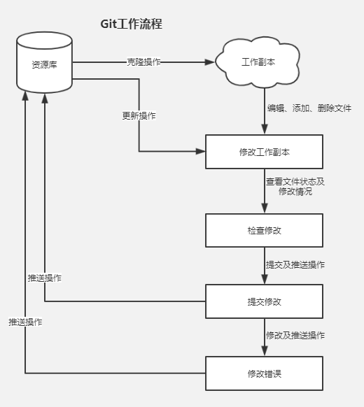

# Git简介
- Git 是一个开源的分布式版本控制系统，用于敏捷高效地处理任何或小或大的项目。
- Git 是 Linus Torvalds 为了帮助管理 Linux 内核开发而开发的一个开放源码的版本控制软件。
- Git 与常用的版本控制工具 CVS, Subversion 等不同，它采用了分布式版本库的方式，不必服务器端软件支持。

## Git 的一般工作流程
克隆 Git 资源作为工作目录。
在克隆的资源上添加或修改文件。
如果其他人修改了，你可以更新资源。
在提交前查看修改。
提交修改。
在修改完成后，如果发现错误，可以撤回提交并再次修改并提交。

## Git的畸变操作
### 获取与创建项目命令
- `git init`
用 git init 在目录中创建新的 Git 仓库。 你可以在任何时候、任何目录中这么做，完全是本地化的。

- `git clone [url]`
使用 git clone 拷贝一个 Git 仓库到本地，让自己能够查看该项目，或者进行修改。

### 基本快照
- `git add <filename>`
使用 git clone 拷贝一个 Git 仓库到本地，让自己能够查看该项目，或者进行修改。
~~~
// 添加当前目录所有文件到缓存
git add .
~~~

- `git status`
git status 以查看在你上次提交之后是否有修改。
~~~
git status
git status -s
~~~

- `git diff`
执行 git diff 来查看执行 git status 的结果的详细信息。
git diff 命令显示已写入缓存与已修改但尚未写入缓存的改动的区别。git diff 有两个主要的应用场景。
- 尚未缓存的改动：git diff
- 查看已缓存的改动： git diff --cached
- 查看已缓存的与未缓存的所有改动：git diff HEAD
- 显示摘要而非整个 diff：git diff --stat

- `git commit`
使用 git add 命令将想要快照的内容写入缓存区， 而执行 git commit 将缓存区内容添加到仓库中。
Git 为你的每一个提交都记录你的名字与电子邮箱地址，所以第一步需要配置用户名和邮箱地址。
~~~
git config --global user.name 'yourname'
git config --global user.email youremail
~~~
将文件写入缓存区并提供提交注释
~~~
git commit -m 'update message'
~~~

- `git reset HEAD`
git reset HEAD 命令用于取消已缓存的内容。
~~~
git reset HEAD -- <filename>
~~~
### 拉取与推送
- `git pull`
git pull 命令用于从另一个存储库或本地分支获取并集成 (整合)。git pull 命令的作用是：取回远程主机某个分支的更新，再与本地的指定分支合并，它的完整格式稍稍有点复杂。
~~~
git pull <远程主机名> <远程分支名>:<本地分支名>
~~~
将远程存储库中的更改合并到当前分支中。在默认模式下，git pull 是 git fetch 后跟 git merge FETCH_HEAD 的缩写。更准确地说，git pull 使用给定的参数运行 git fetch，并调用 git merge 将检索到的分支头合并到当前分支中.

- `git push`
git push 命令用于将本地分支的更新，推送到远程主机。它的格式与 git pull 命令相似。
~~~
git push <远程主机名> <本地分支名>:<远程分支名>
~~~

### 标签
- `git tag`
如果你达到一个重要的阶段，并希望永远记住那个特别的提交快照，你可以使用 git tag 给它打上标签。

比如说，我们想为我们的 商城 项目发布一个 "1.0.0" 版本。 我们可以用 git tag -a v1.0.0 命令给最新一次提交打上（HEAD） "v1.0.0" 的标签。

-a 选项意为 "创建一个带注解的标签"。 不用 -a 选项也可以执行的，但它不会记录这标签是啥时候打的，谁打的，也不会让你添加个标签的注解。 我推荐一直创建带注解的标签。
~~~
git tag -a v1.0.0
~~~
如果我们要查看所有标签可以使用以下命令：
~~~
git tag
~~~

## 参考资料
> https://www.liaoxuefeng.com/wiki/896043488029600
> https://www.funtl.com/zh/gitlab/Git-%E7%9A%84%E5%9F%BA%E6%9C%AC%E6%93%8D%E4%BD%9C.html#%E8%8E%B7%E5%8F%96%E4%B8%8E%E5%88%9B%E5%BB%BA%E9%A1%B9%E7%9B%AE%E5%91%BD%E4%BB%A4
