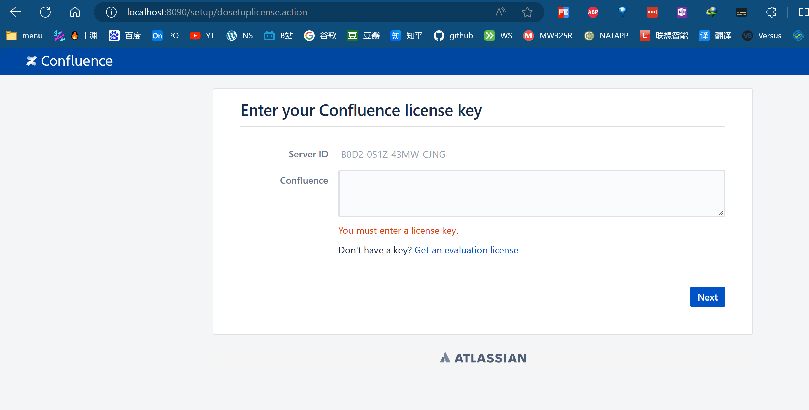
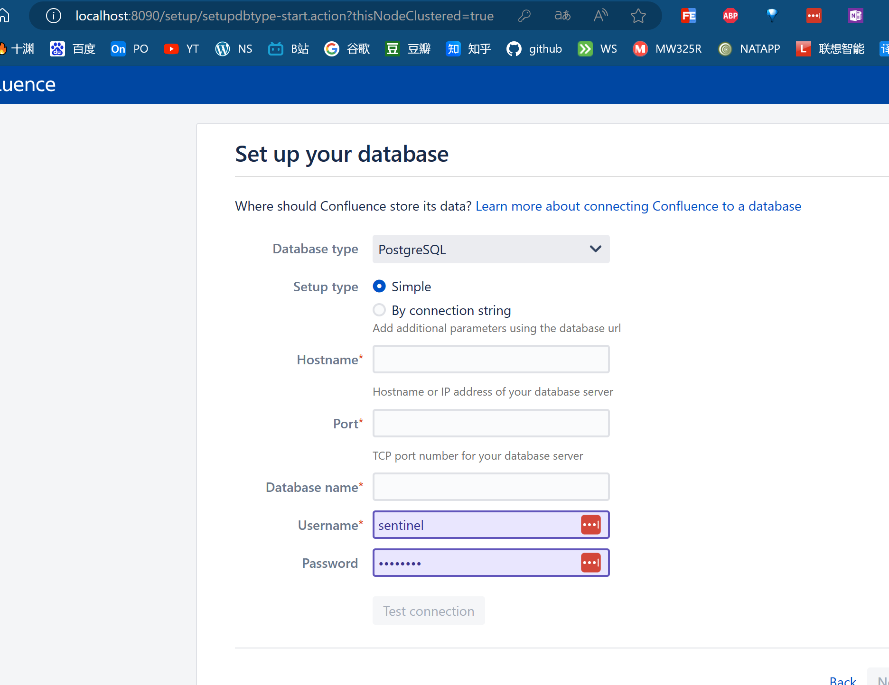
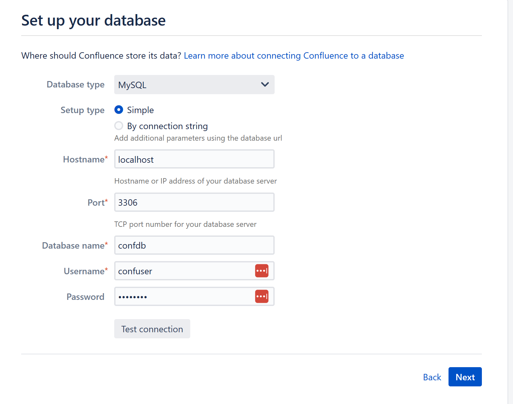

# Linux使用ubuntu22.04_LTS_初始化


## 简介

Linux操作系有许多初始配置的操作,有了这些操作，可以更方便的对Linux操作系统进行工作.

## 准备工作

安装Linux 22.04 LTS版本。

## Linux换源

查看当前的源。

`vim /etc/apt/sources.list`

~~~shell
deb http://archive.ubuntu.com/ubuntu/ jammy universe
# deb-src http://archive.ubuntu.com/ubuntu/ jammy universe
deb http://archive.ubuntu.com/ubuntu/ jammy-updates universe
# deb-src http://archive.ubuntu.com/ubuntu/ jammy-updates universe

## N.B. software from this repository is ENTIRELY UNSUPPORTED by the Ubuntu
## team, and may not be under a free licence. Please satisfy yourself as to
## your rights to use the software. Also, please note that software in
## multiverse WILL NOT receive any review or updates from the Ubuntu
## security team.
deb http://archive.ubuntu.com/ubuntu/ jammy multiverse
# deb-src http://archive.ubuntu.com/ubuntu/ jammy multiverse
deb http://archive.ubuntu.com/ubuntu/ jammy-updates multiverse
# deb-src http://archive.ubuntu.com/ubuntu/ jammy-updates multiverse

## N.B. software from this repository may not have been tested as
## extensively as that contained in the main release, although it includes
## newer versions of some applications which may provide useful features.
## Also, please note that software in backports WILL NOT receive any review
## or updates from the Ubuntu security team.
deb http://archive.ubuntu.com/ubuntu/ jammy-backports main restricted universe multiverse
# deb-src http://archive.ubuntu.com/ubuntu/ jammy-backports main restricted universe multiverse

deb http://security.ubuntu.com/ubuntu/ jammy-security main restricted
# deb-src http://security.ubuntu.com/ubuntu/ jammy-security main restricted
deb http://security.ubuntu.com/ubuntu/ jammy-security universe
# deb-src http://security.ubuntu.com/ubuntu/ jammy-security universe
deb http://security.ubuntu.com/ubuntu/ jammy-security multiverse
# deb-src http://security.ubuntu.com/ubuntu/ jammy-security multiverse
~~~

根据当前元的显示，可以看到是ubuntu原生的，但是这个东西在中国大陆是没办法使用的，我们需要将其进行更换。我们先把当前文件进行一个行一个，完了以后再另外生成一个清华源的，给他替换掉就可以了。

这里我并没有用root账户进行。而是使用的自己的账户在需要权限的地方给上sudo。

`sudo cp /etc/apt/sources.list /etc/apt/sources.list.backup`

## 更新源

```bash
sudo apt-get update
sudo apt-get upgrade
sudo apt-get 
```

~~~
# 默认注释了源码镜像以提高 apt update 速度，如有需要可自行取消注释
deb https://mirrors.tuna.tsinghua.edu.cn/ubuntu/ jammy main restricted universe multiverse
# deb-src https://mirrors.tuna.tsinghua.edu.cn/ubuntu/ jammy main restricted universe multiverse
deb https://mirrors.tuna.tsinghua.edu.cn/ubuntu/ jammy-updates main restricted universe multiverse
# deb-src https://mirrors.tuna.tsinghua.edu.cn/ubuntu/ jammy-updates main restricted universe multiverse
deb https://mirrors.tuna.tsinghua.edu.cn/ubuntu/ jammy-backports main restricted universe multiverse
# deb-src https://mirrors.tuna.tsinghua.edu.cn/ubuntu/ jammy-backports main restricted universe multiverse

# deb https://mirrors.tuna.tsinghua.edu.cn/ubuntu/ jammy-security main restricted universe multiverse
# # deb-src https://mirrors.tuna.tsinghua.edu.cn/ubuntu/ jammy-security main restricted universe multiverse

deb http://security.ubuntu.com/ubuntu/ jammy-security main restricted universe multiverse
# deb-src http://security.ubuntu.com/ubuntu/ jammy-security main restricted universe multiverse

# 预发布软件源，不建议启用
# deb https://mirrors.tuna.tsinghua.edu.cn/ubuntu/ jammy-proposed main restricted universe multiverse
# # deb-src https://mirrors.tuna.tsinghua.edu.cn/ubuntu/ jammy-proposed main restricted universe multiverse

deb http://mirrors.aliyun.com/ubuntu/ focal main restricted universe multiverse
deb-src http://mirrors.aliyun.com/ubuntu/ focal main restricted universe multiverse
deb http://mirrors.aliyun.com/ubuntu/ focal-security main restricted universe multiverse
deb-src http://mirrors.aliyun.com/ubuntu/ focal-security main restricted universe multiverse
deb http://mirrors.aliyun.com/ubuntu/ focal-updates main restricted universe multiverse
deb-src http://mirrors.aliyun.com/ubuntu/ focal-updates main restricted universe multiverse
deb http://mirrors.aliyun.com/ubuntu/ focal-proposed main restricted universe multiverse
deb-src http://mirrors.aliyun.com/ubuntu/ focal-proposed main restricted universe multiverse
deb http://mirrors.aliyun.com/ubuntu/ focal-backports main restricted universe multiverse
deb-src http://mirrors.aliyun.com/ubuntu/ focal-backports main restricted universe multiverse
~~~

## SSH服务的安装

`sudo apt install openssh-server`进行安装

~~~bash
ziming@Surface-Pro9:~$ sudo apt install openssh-server
Reading package lists... Done
Building dependency tree... Done
Reading state information... Done
openssh-server is already the newest version (1:8.9p1-3ubuntu0.5).
0 upgraded, 0 newly installed, 0 to remove and 2 not upgraded.
~~~

**第二步：检查服务器状态**

当你下载并安装完包后，SSH 服务器应该已经运行了，但是为了确保万无一失我们需要检查一下：

```text
service ssh status
```

你还可以使用 `systemctl` 命令：

```text
sudo systemctl status ssh
```

~~~shell
ziming@Surface-Pro9:~$ sudo systemctl status ssh
● ssh.service - OpenBSD Secure Shell server
     Loaded: loaded (/lib/systemd/system/ssh.service; enabled; vendor preset: enabled)
     Active: active (running) since Sun 2023-12-24 13:25:15 CST; 4min 11s ago
       Docs: man:sshd(8)
             man:sshd_config(5)
   Main PID: 4590 (sshd)
      Tasks: 1 (limit: 4589)
     Memory: 1.7M
     CGroup: /system.slice/ssh.service
             └─4590 "sshd: /usr/sbin/sshd -D [listener] 0 of 10-100 startups"

Dec 24 13:25:15 Surface-Pro9 systemd[1]: Starting OpenBSD Secure Shell server...
Dec 24 13:25:15 Surface-Pro9 sshd[4590]: Server listening on 0.0.0.0 port 22.
Dec 24 13:25:15 Surface-Pro9 sshd[4590]: Server listening on :: port 22.
Dec 24 13:25:15 Surface-Pro9 systemd[1]: Started OpenBSD Secure Shell server.
~~~


如果你的结果中 SSH 服务没有运行，使用这个命令运行它：

```text
sudo systemctl enable --now ssh
```

**第三步：允许 SSH 通过防火墙**

Ubuntu 带有名为 [UFW](https://link.zhihu.com/?target=https%3A//itsfoss.com/set-up-firewall-gufw/)（*简单的防火墙(Uncomplicated Firewall)*）的防火墙，这是管理网络规则的 `iptables` 的一个接口。如果启动了防火墙，它可能会阻止你连接服务器。

想要配置 UFW 允许你的接入，你需要运行如下命令：

```text
sudo ufw allow ssh

ziming@Surface-Pro9:~$ sudo ufw allow ssh
Rules updated
Rules updated (v6)
```

UFW 的运行状态可以通过运行 `sudo ufw status` 来检查。

现在，我们的 SSH 服务器已经开始运行了，在等待来自客户端的连接。

## 连接远程服务器

你本地的 Linux 系统已经安装了 SSH 客户端。如果没有，你可以在 Ubuntu 中使用如下命令安装：

```text
sudo apt install openssh-client
```

要连接你的 Ubuntu 系统，你需要知道它的 IP 地址，然后使用 `ssh` 命令，就像这样：

```text
ssh username@address
```

将 **用户名**（`username`）改为你的系统上的实际用户名，并将 **地址**（`address`）改为你服务器的 IP 地址。

如果你 [不知道 IP 地址](https://link.zhihu.com/?target=https%3A//itsfoss.com/check-ip-address-ubuntu/)，可以在服务器的终端输入 `ip a` 查看结果。应该会看到这样的结果：

可以看到我的 IP 地址是 `192.168.1.111`。让我们使用 `username@address` 格式进行连接。

```text
ssh team@192.168.1.111
```

这是你第一次连接到该 SSH 服务器，它会请求添加主机。输入 `yes` 并回车即可。

## zsh安装

`apt install zsh`

### oh-my-zsh

```bash
sh -c "$(wget https://gitee.com/niziming/general_linux_tools/raw/master/install/oh-my-zsh.sh -O -)"
```

或者

`git clone https://gitee.com/niziming/ohmyzsh.git`

进入里面

`sh ./ohmyzsh/tools/install.sh`


*# 查看当前系统支持哪些shell*  `cat /etc/shells`


## docker 安装 confluence

数据库创建

~~~mysql
CREATE DATABASE confdb CHARACTER SET utf8mb4 COLLATE utf8mb4_bin;

mysql> CREATE USER 'confuser'@'%' IDENTIFIED BY 'confuser';
Query OK, 0 rows affected (0.00 sec)

mysql> GRANT ALL ON confdb.* TO 'confuser'@'%';
Query OK, 0 rows affected (0.01 sec)

~~~


`docker pull atlassian/confluence-server:7.15.1`


`mkdir -p /usr/local/docker/confluence7`


~~~
docker run \
-d \
--name confluence \
--restart=always \
--privileged=true \
-p 8090:8090 \
-p 8091:8091 \
-v /usr/local/docker/confluence7:/var/atlassian/application-data/confluence \
atlassian/confluence-server:7.15.1

~~~










## 引用资料

>
>
>[在 Ubuntu 中配置 SSH 的完整指南 | Linux 中国 - 知乎 (zhihu.com)](https://zhuanlan.zhihu.com/p/577082732)
