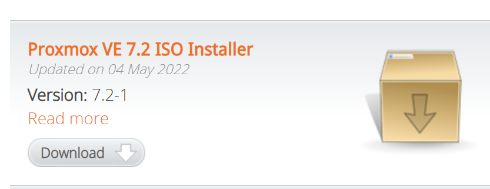
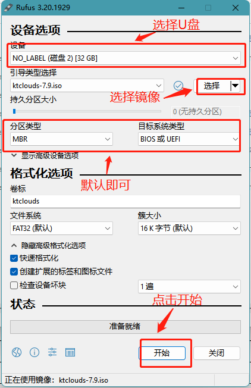
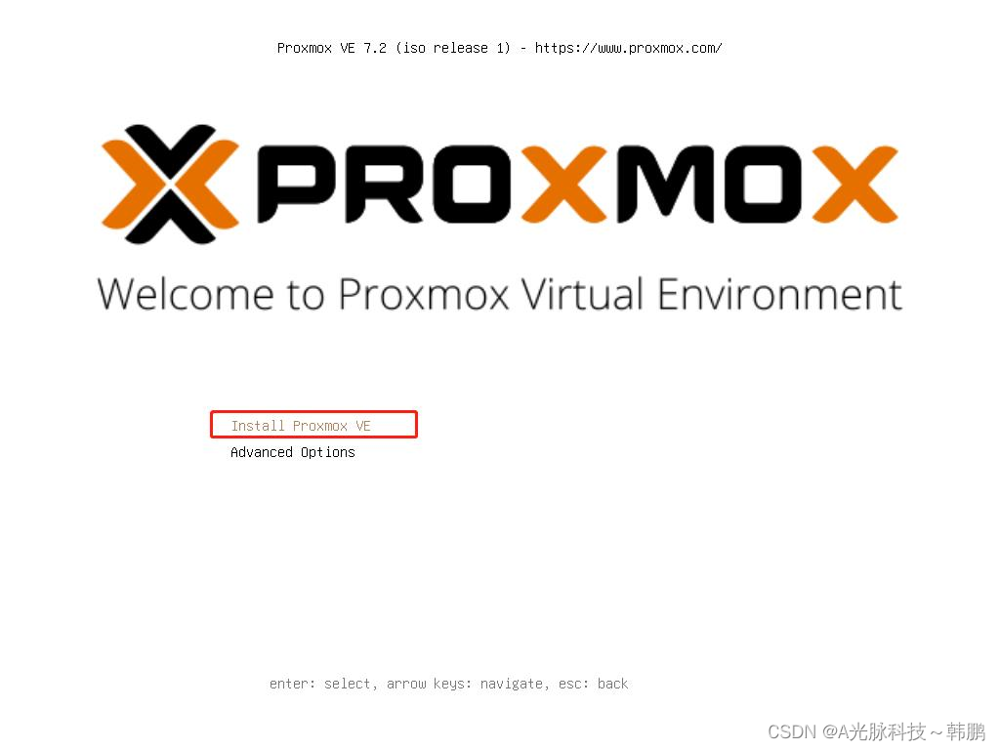
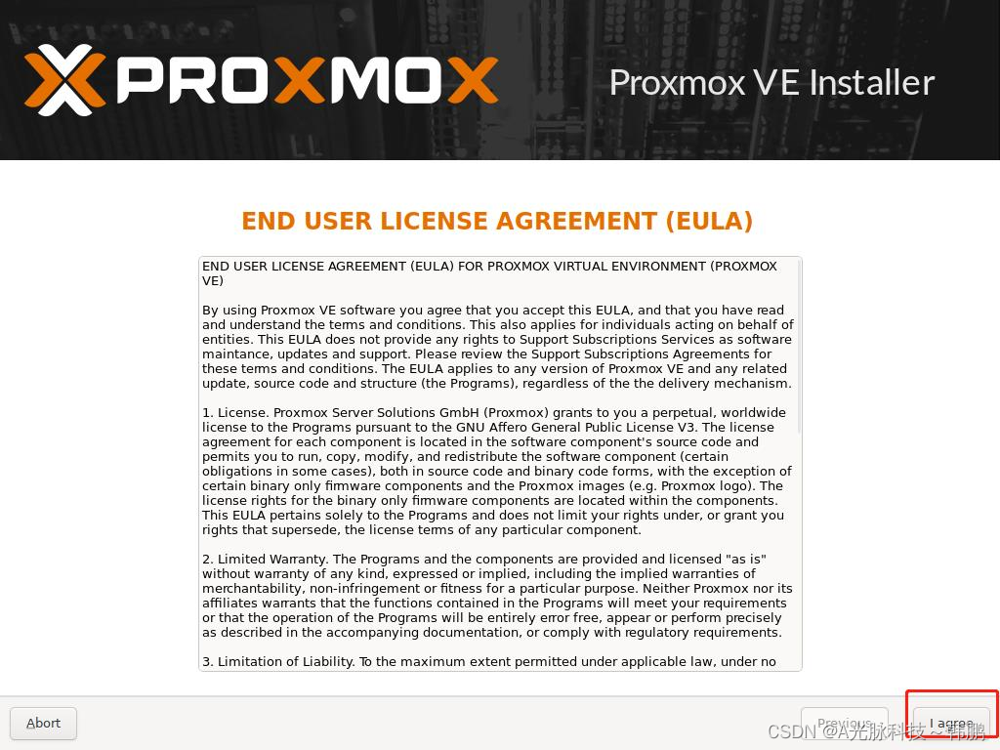
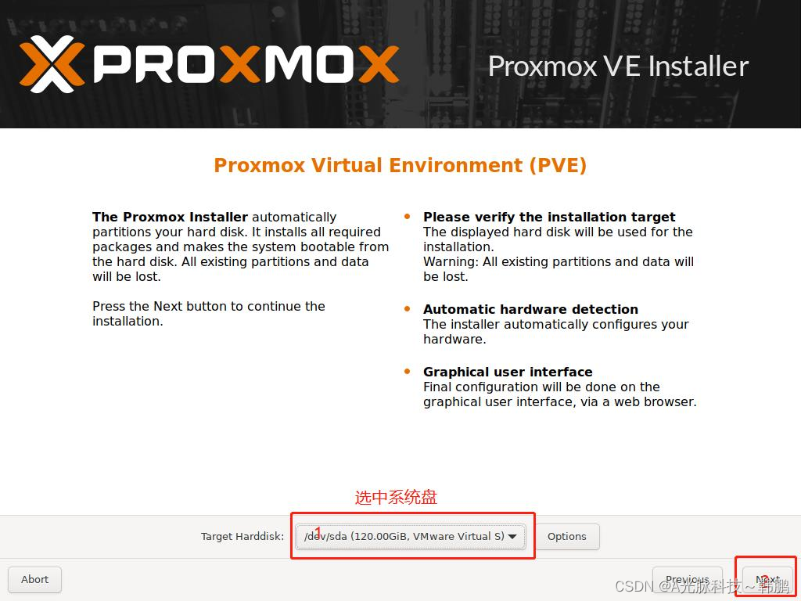
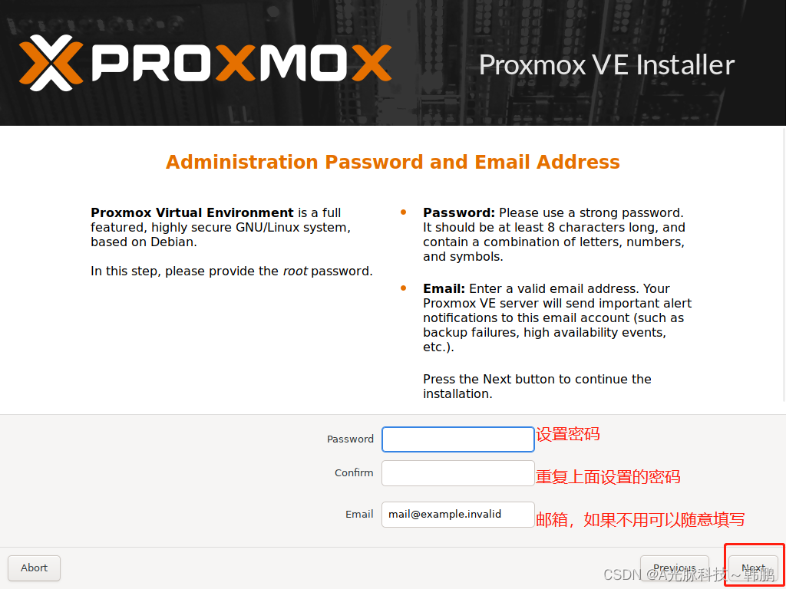
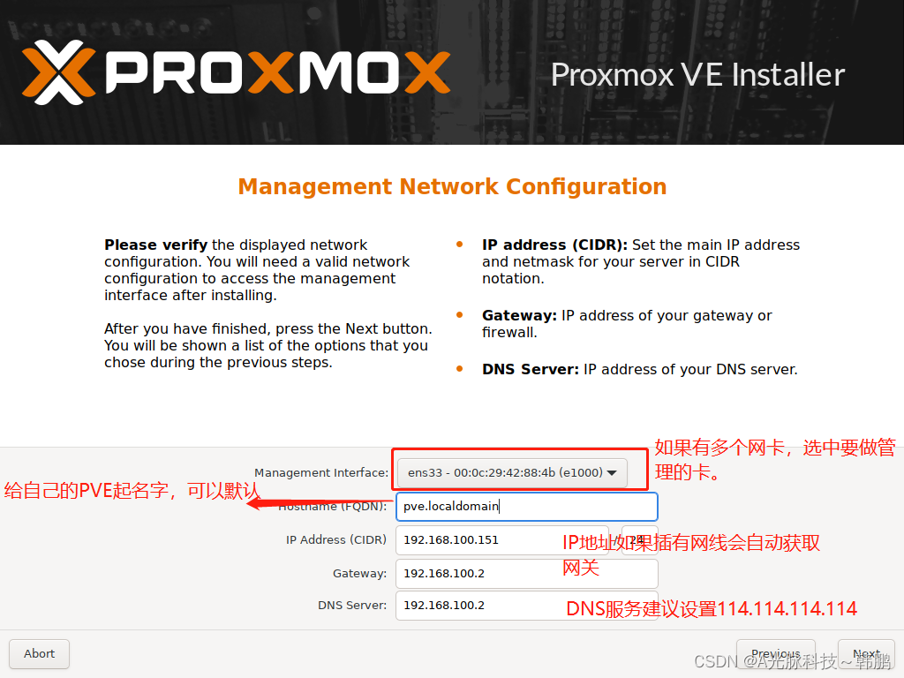
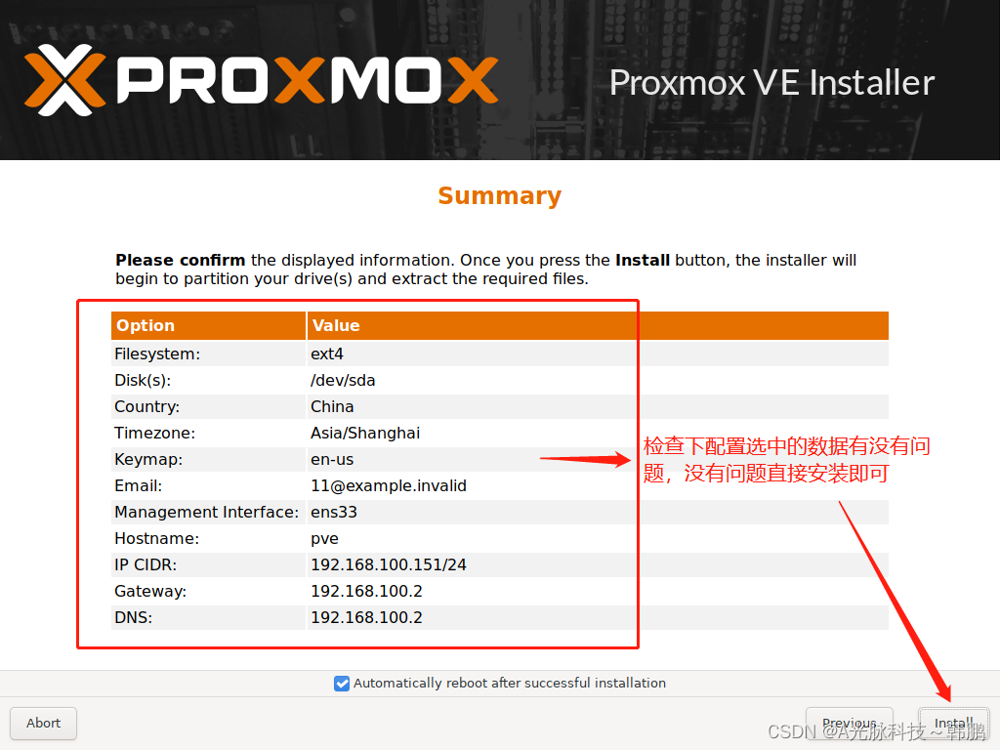
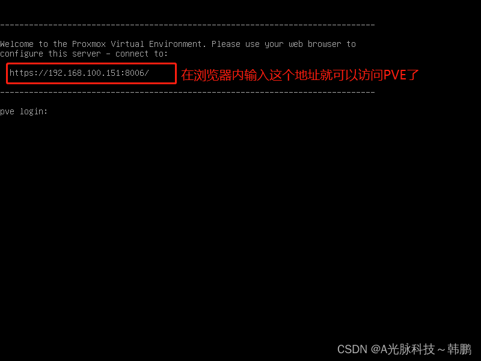
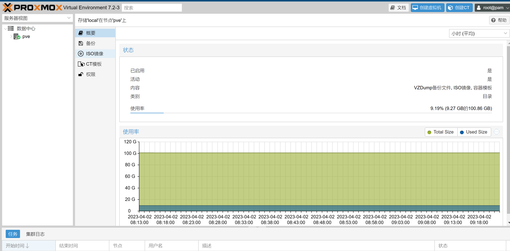

# PEV7.2_all_in_one_虚拟机大全_01_pve的下载与安装

## 简介

Proxmox VE is a complete open-source platform for enterprise virtualization. With the built-in web interface you can easily manage VMs and containers, software-defined storage and networking, high-availability clustering, and multiple out-of-the-box tools on a single solution.

## 准备工作

### 硬件部分

- 两台主机
- 将主机连入局域网
- 16gb UB

### 下载部分

下载: 

- pve
  -  [Download Proxmox software, documentation, agreements](https://www.proxmox.com/en/downloads)

这里我选择的7.2版本

ios:

- macOS 
  - 链接：https://pan.baidu.com/s/1np07kC-7zpQUEDfbzk0mdQ 
    提取码：vggr
- Windows 10 专业版 原生
  - ed2k://|file|zh-cn_windows_10_consumer_editions_version_22h2_updated_march_2023_x64_dvd_1e27e10b.iso|6106974208|094E653D4D14BA3869E74DE931A8233A|/
- Windows 10 精简版
  - AtlasOS https://39-165-71-37.d.cjjd20.com:30443/123-47/a6e64163/1631445-0/a6e6416388683a3d5e12cf187974342f?v=2&t=1680484465&s=b4364ec3f27174e9ca044c3e566954b3&filename=AtlasOS_22H2_19045.2311.iso&d=e8d958b5
- refuse
  - [Rufus - 轻松创建 USB 启动盘](http://rufus.ie/zh/)

## 开始

### 将PVE写入 U盘

### 重启主机进入bios

选择U盘启动后

选择系统盘

这里注意查看另一台电脑的ip

打开命令行工具输入 `ipconfig -all`

~~~
 IPv4 地址 . . . . . . . . . . . . : 192.168.0.104(首选)
   子网掩码  . . . . . . . . . . . . : 255.255.255.0
   获得租约的时间  . . . . . . . . . : 2023年4月2日 8:17:12
   租约过期的时间  . . . . . . . . . : 2023年4月2日 10:51:00
   默认网关. . . . . . . . . . . . . : 192.168.0.1
   DHCP 服务器 . . . . . . . . . . . : 192.168.0.1
   DHCPv6 IAID . . . . . . . . . . . : 55864555
   DNS 服务器  . . . . . . . . . . . : 192.168.1.1
                                       192.168.0.1
   TCPIP 上的 NetBIOS  . . . . . . . : 已启用
~~~

除了DNS以为其他的网段需要按照计算机网络知识配置PVE主机的IP信息

此时用另一台主机web浏览器输入以下地址

即可进入 PVE UI

## 引用资料

>[Proxmox - Powerful open-source server solutions](https://www.proxmox.com/en/)
>
>[Installing macOS 13 Ventura on Proxmox 7.2 – Nicholas Sherlock (nicksherlock.com)](https://www.nicksherlock.com/2022/10/installing-macos-13-ventura-on-proxmox/)
>
>[Atlas - We redesigned Windows for gaming. (atlasos.net)](https://atlasos.net/)
