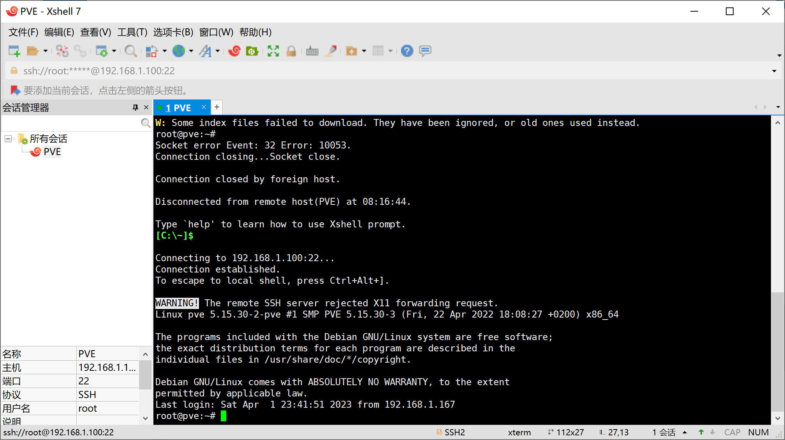

# PEV7.2_all_in_one_虚拟机大全_02_pve的基本配置

## 简介

pve是基于debain操作系统的它的扩展性和自由度是非常大的

## 准备工作

安装一个终端

这里安装的是xshell

## 开始

PVE 默认的软件源是用的国外服务器，所以我们的环境下进行软件更新、安装的时候都会比较慢。现在国内已经有许多的镜像仓库供我们使用。

删除 PVE 自己的软件源
PVE 本身也有自己的软件软，但是都是收费的。我们需要将其删除，不然在软件安装时会提示一些 401 的认证错误

`rm -rf /etc/apt/sources.list.d/pve-enterprise.list`
修改软件源
以防错误操作，我们先将文件进行备份

`cp /etc/apt/sources.list /etc/apt/sources.list.bak`
编辑默认软件源文件 

`nano /etc/apt/sources.list`
我们将默认的连接前面加上 # 号进行注释，或者删除这些连接

添加国内软件源

清华源

~~~

deb https://mirrors.tuna.tsinghua.edu.cn/debian/ bullseye main contrib non-free
deb https://mirrors.tuna.tsinghua.edu.cn/debian/ bullseye-updates main contrib non-free
deb https://mirrors.tuna.tsinghua.edu.cn/debian/ bullseye-backports main contrib non-free
deb https://mirrors.tuna.tsinghua.edu.cn/debian-security bullseye-security main contrib non-free
deb https://mirrors.tuna.tsinghua.edu.cn/proxmox/debian bullseye pve-no-subscription
~~~

中科大源

~~~
deb https://mirrors.ustc.edu.cn/debian/ bullseye main contrib non-free
deb https://mirrors.ustc.edu.cn/debian/ bullseye-updates main contrib non-free
deb https://mirrors.ustc.edu.cn/debian/ bullseye-backports main contrib non-free
deb https://mirrors.ustc.edu.cn/debian-security bullseye-security main contrib
deb https://mirrors.ustc.edu.cn/proxmox/debian bullseye pve-no-subscription
~~~

选择以上其中一个粘贴到 /etc/apt/sources.list 文件中

就想下面这样

粘贴完成后按 ctrl + x

会提示是否保存，我们输入（不区分大小写） y 进行保存

更新`apt-get update`

## 引用资料

>可以看到就已经是使用的我们修改过后的软件源了 作者：过气的村支书 https://www.bilibili.com/read/cv18982499 出处：bilibili
>
>
