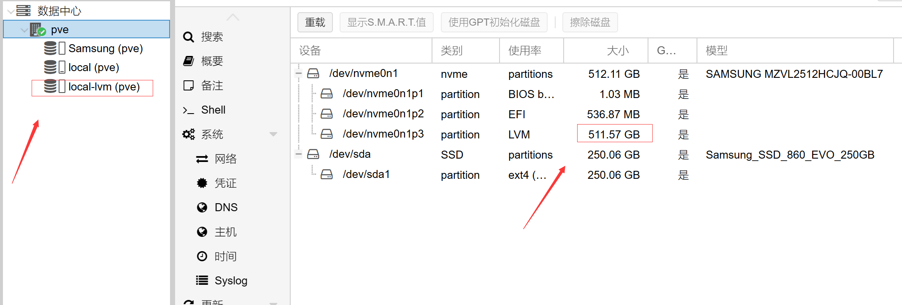
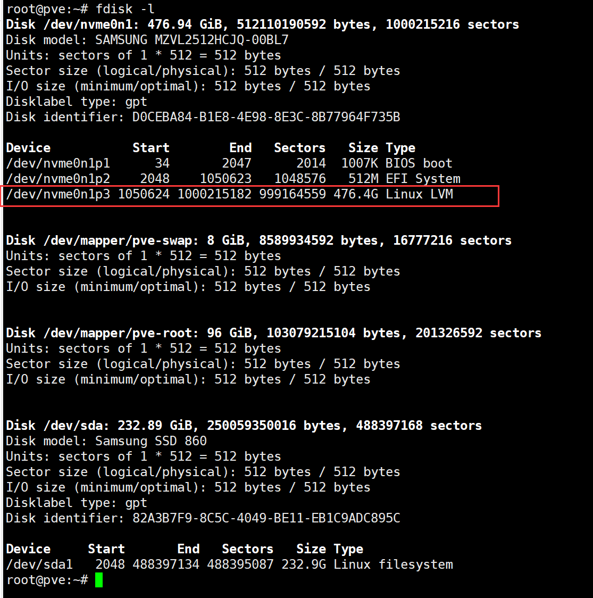

# 调整local及local-lvm空间

## 简介

pvm lvm太大了

## 准备工作

~~~
fdisk -l #查看各个分区的大小

~~~

LVM空间过大

### 开始调整

调整空间时出现
Thin pool volumes cannot be reduced in size yet.
1 备份删除lvm
2 使用lvextend扩大local空间
3 恢复lvm

~~~
lvreduce -L -2G 分区路径 #减少分区空间
lvextend -L +1G 分区路径 #减少分区空间
resize2fs 分区路径 # 执行后实际大小其实是还不会变化的,还需要下边的命令, 作用是执行上边的扩容操作
~~~

### 实际开始

~~~
lvreduce -L -376G
~~~

## 引用资料

>[(42条消息) Proxmo VE(pve) 调整local 以及local-lvm空间_pve local local-lvm_300斤的胖子。的博客-CSDN博客](https://blog.csdn.net/qq_40858216/article/details/105071040)
>
>[proxmox ve (PVE) 调整虚拟机(VM)的磁盘大小 - 大司徒 - 博客园 (cnblogs.com)](https://www.cnblogs.com/chuanghongmeng/p/16278040.html)
>
>
