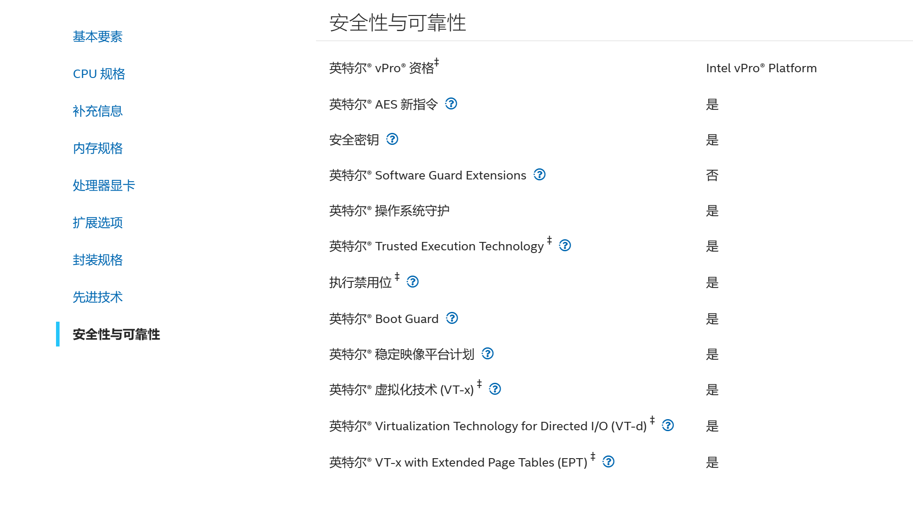
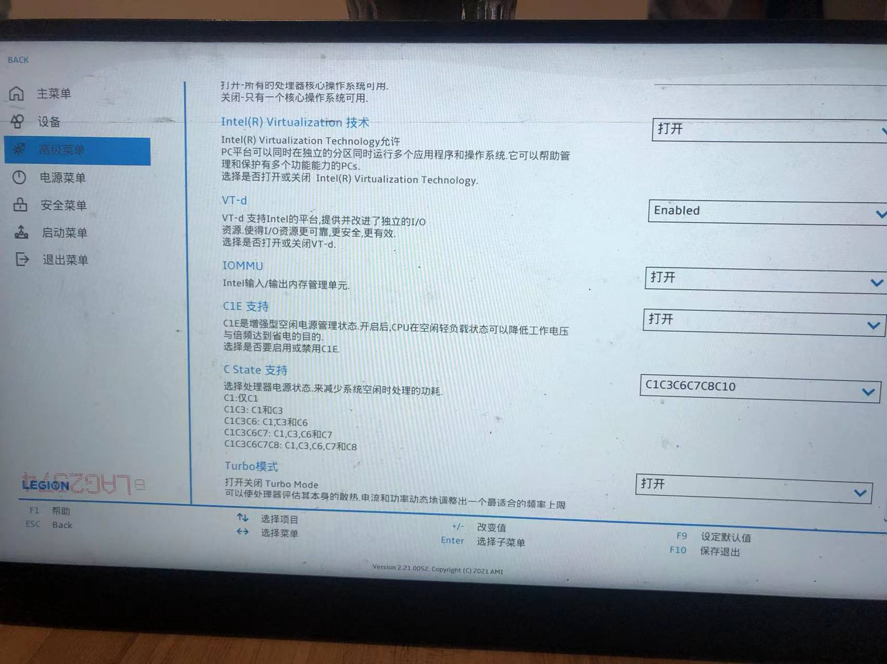
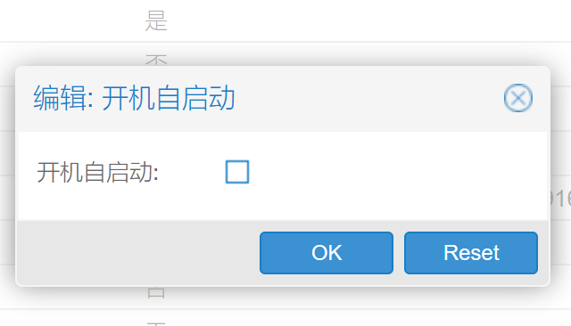
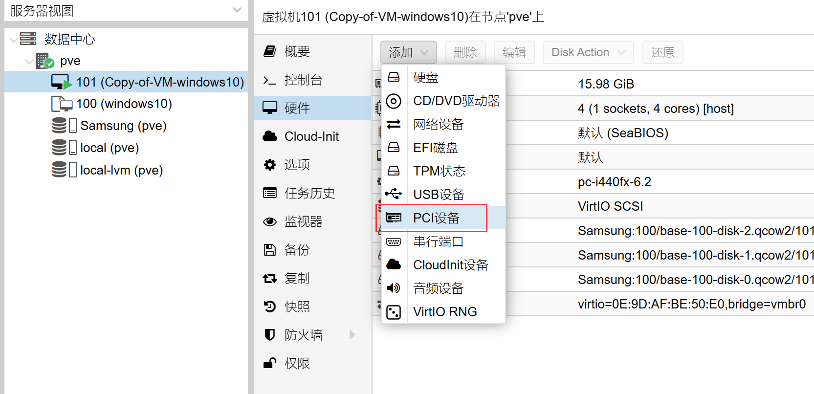
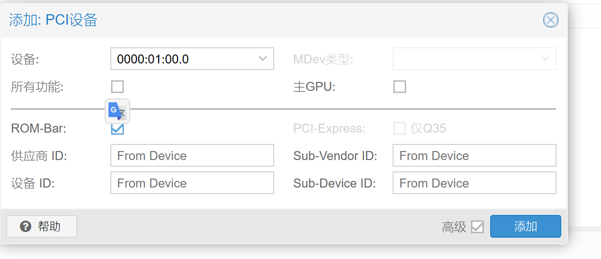
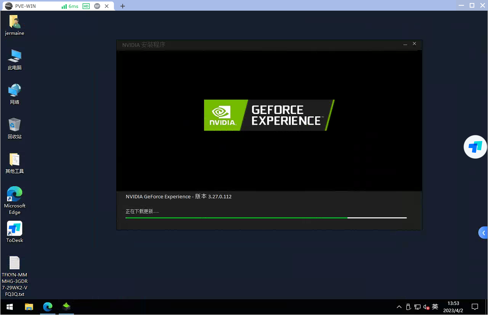
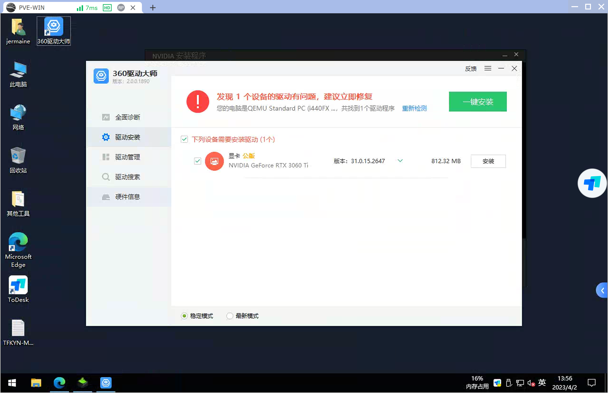

# pve虚拟机直通硬件


## 简介


## 准备工作

- 查询自己的cpu是否支持硬件直通
  - Intel用户可到 [https://www.intel.cn](https://www.intel.cn/)
  - Intel用户可到 [https://www.intel.cn](https://www.intel.cn/)



进入bios开启相关选项




## 开始

### **启用IOMMU功能**

用网页端的 PVE shell 或 ssh 连接至 PVE，输入以下命令：


```bash
nano /etc/default/grub
```

在文档中找到 “GRUB_CMDLINE_LINUX_DEFAULT=”quiet””一行，

**对于 Intel CPU 用户**，将改行修改为：


```json
GRUB_CMDLINE_LINUX_DEFAULT="quiet intel_iommu=on iommu=pt"
```

**对于 AMD CPU 用户**，将该行修改为：


```json
GRUB_CMDLINE_LINUX_DEFAULT="quiet amd_iommu=on iommu=pt"
```

修改完成后，按 Ctrl+O 保存，按 Ctrl+X 退出文本编辑器。

然后输入下一行命令更新 Grub：`update-grub`

```bash
[1]+  Stopped                 nano /etc/default/grub
root@pve:~# nano /etc/default/grub
root@pve:~# nano /etc/default/grub
root@pve:~# update-grub
Generating grub configuration file ...
Found linux image: /boot/vmlinuz-5.15.30-2-pve
Found initrd image: /boot/initrd.img-5.15.30-2-pve
Found memtest86+ image: /boot/memtest86+.bin
Found memtest86+ multiboot image: /boot/memtest86+_multiboot.bin
Warning: os-prober will not be executed to detect other bootable partitions.
Systems on them will not be added to the GRUB boot configuration.
Check GRUB_DISABLE_OS_PROBER documentation entry.
Adding boot menu entry for UEFI Firmware Settings ...
done

```

### **加载相应的内核模块**

在命令行中输入以下命令：


```json
echo vfio >> /etc/modules
echo vfio_iommu_type1 >> /etc/modules
echo vfio_pci >> /etc/modules
echo vfio_virqfd >> /etc/modules
```

然后输入`update-initramfs -k all -u`

**注意 這個錯誤在[PVE](https://www.31du.cn/tag/pve)執行命令經常出現 ，無視即可**

No /etc/kernel/proxmox-boot-uuids found, skipping ESP sync.

\#No /etc/kernel/proxmox-boot-uuids found, skipping ESP sync.
\#这个错误直接忽略，因为proxmox 安装的debian 并不是一个完整的系统引起


来更新内核参数。然后**重启 PVE**。

**验证IOMMU是否开启成功**

重启之后，在命令行输入以下命令：


```bash
dmesg | grep iommu
```

若有如类似于下图回显，则说明开启成功：

~~~shell
root@pve:~# dmesg | grep iommu
[    0.249405] iommu: Default domain type: Translated 
[    0.249405] iommu: DMA domain TLB invalidation policy: lazy mode 
[    0.287371] pci 0000:00:00.0: Adding to iommu group 0
[    0.287377] pci 0000:00:01.0: Adding to iommu group 1
[    0.287387] pci 0000:00:06.0: Adding to iommu group 2
[    0.287394] pci 0000:00:14.0: Adding to iommu group 3
[    0.287397] pci 0000:00:14.2: Adding to iommu group 3
[    0.287401] pci 0000:00:14.3: Adding to iommu group 4
[    0.287407] pci 0000:00:15.0: Adding to iommu group 5
[    0.287410] pci 0000:00:15.2: Adding to iommu group 5
[    0.287415] pci 0000:00:16.0: Adding to iommu group 6
[    0.287419] pci 0000:00:17.0: Adding to iommu group 7
[    0.287431] pci 0000:00:1d.0: Adding to iommu group 8
[    0.287439] pci 0000:00:1f.0: Adding to iommu group 9
[    0.287443] pci 0000:00:1f.3: Adding to iommu group 9
[    0.287448] pci 0000:00:1f.4: Adding to iommu group 9
[    0.287451] pci 0000:00:1f.5: Adding to iommu group 9
[    0.287465] pci 0000:01:00.0: Adding to iommu group 10
[    0.287477] pci 0000:01:00.1: Adding to iommu group 10
[    0.287487] pci 0000:02:00.0: Adding to iommu group 11
[    0.287500] pci 0000:03:00.0: Adding to iommu group 12
~~~

再输入：

```bash
find /sys/kernel/iommu_groups/ -type l
```

如果有类似于下图回显，就代表成功：

~~~shell

root@pve:~# find /sys/kernel/iommu_groups/ -type l
/sys/kernel/iommu_groups/7/devices/0000:00:17.0
/sys/kernel/iommu_groups/5/devices/0000:00:15.2
/sys/kernel/iommu_groups/5/devices/0000:00:15.0
/sys/kernel/iommu_groups/3/devices/0000:00:14.2
/sys/kernel/iommu_groups/3/devices/0000:00:14.0
/sys/kernel/iommu_groups/11/devices/0000:02:00.0
/sys/kernel/iommu_groups/1/devices/0000:00:01.0
/sys/kernel/iommu_groups/8/devices/0000:00:1d.0
/sys/kernel/iommu_groups/6/devices/0000:00:16.0
/sys/kernel/iommu_groups/4/devices/0000:00:14.3
/sys/kernel/iommu_groups/12/devices/0000:03:00.0
/sys/kernel/iommu_groups/2/devices/0000:00:06.0
/sys/kernel/iommu_groups/10/devices/0000:01:00.0
/sys/kernel/iommu_groups/10/devices/0000:01:00.1
/sys/kernel/iommu_groups/0/devices/0000:00:00.0
/sys/kernel/iommu_groups/9/devices/0000:00:1f.0
/sys/kernel/iommu_groups/9/devices/0000:00:1f.5
/sys/kernel/iommu_groups/9/devices/0000:00:1f.3
/sys/kernel/iommu_groups/9/devices/0000:00:1f.4

~~~

### **显卡直通**

注意

**一般地，不推荐将显卡直通给特定虚拟机，有些命令执行不好会造成不可挽回的损失。建议将直通显卡的虚拟机不要勾选“开机自启动”，以便出现问题还可以用命令行救回。**



依据自己显卡型号，在命令行输入以下命令：


```shell
#直通 AMD 显卡，请使用下面命令

echo "blacklist radeon" >> /etc/modprobe.d/blacklist.conf 
echo "blacklist amdgpu" >> /etc/modprobe.d/blacklist.conf
 
#直通 Nvidia 显卡，请使用下面命令

echo "blacklist nouveau" >> /etc/modprobe.d/blacklist.conf 
echo "blacklist nvidia" >> /etc/modprobe.d/blacklist.conf 
echo "blacklist nvidiafb" >> /etc/modprobe.d/blacklist.conf
 
#直通 Intel 核显，请使用下面命令

echo "blacklist snd_hda_intel" >> /etc/modprobe.d/blacklist.conf 
echo "blacklist snd_hda_codec_hdmi" >> /etc/modprobe.d/blacklist.conf 
echo "blacklist i915" >> /etc/modprobe.d/blacklist.conf 
```

### 将显卡绑定至 vfio-pci:

使用 `lspci` 命令，查看自己显卡的 pci id：

~~~sh
root@pve:~# lspci
00:00.0 Host bridge: Intel Corporation Device 4c53 (rev 01)
00:01.0 PCI bridge: Intel Corporation Device 4c01 (rev 01)
00:06.0 PCI bridge: Intel Corporation Device 4c09 (rev 01)
00:14.0 USB controller: Intel Corporation Device 43ed (rev 11)
00:14.2 RAM memory: Intel Corporation Device 43ef (rev 11)
00:14.3 Network controller: Intel Corporation Device 43f0 (rev 11)
00:15.0 Serial bus controller [0c80]: Intel Corporation Device 43e8 (rev 11)
00:15.2 Serial bus controller [0c80]: Intel Corporation Device 43ea (rev 11)
00:16.0 Communication controller: Intel Corporation Device 43e0 (rev 11)
00:17.0 SATA controller: Intel Corporation Device 43d2 (rev 11)
00:1d.0 PCI bridge: Intel Corporation Device 43b0 (rev 11)
00:1f.0 ISA bridge: Intel Corporation Device 4387 (rev 11)
00:1f.3 Audio device: Intel Corporation Device 43c8 (rev 11)
00:1f.4 SMBus: Intel Corporation Device 43a3 (rev 11)
00:1f.5 Serial bus controller [0c80]: Intel Corporation Device 43a4 (rev 11)
01:00.0 VGA compatible controller: NVIDIA Corporation Device 2489 (rev a1)
01:00.1 Audio device: NVIDIA Corporation GA104 High Definition Audio Controller (rev a1)
02:00.0 Non-Volatile memory controller: Samsung Electronics Co Ltd NVMe SSD Controller PM9A1/980PRO
03:00.0 Ethernet controller: Realtek Semiconductor Co., Ltd. RTL8111/8168/8411 PCI Express Gigabit Ethernet Controller (rev 15)

~~~

01:00.0 VGA compatible controller: NVIDIA Corporation Device 2489 (rev a1)

01:00.1 Audio device: NVIDIA Corporation GA104 High Definition Audio Controller (rev a1)

以上图为例，显卡的pci id为 01:00.0 。上面的是显卡，下面的是显卡中的声卡。在直通时两者都要一起直通。接下来，输入` lspci -n` 命令，查看对应pci id 的 设备 id 和 制造商 id：

~~~
root@pve:~# lspci -n
00:00.0 0600: 8086:4c53 (rev 01)
00:01.0 0604: 8086:4c01 (rev 01)
00:06.0 0604: 8086:4c09 (rev 01)
00:14.0 0c03: 8086:43ed (rev 11)
00:14.2 0500: 8086:43ef (rev 11)
00:14.3 0280: 8086:43f0 (rev 11)
00:15.0 0c80: 8086:43e8 (rev 11)
00:15.2 0c80: 8086:43ea (rev 11)
00:16.0 0780: 8086:43e0 (rev 11)
00:17.0 0106: 8086:43d2 (rev 11)
00:1d.0 0604: 8086:43b0 (rev 11)
00:1f.0 0601: 8086:4387 (rev 11)
00:1f.3 0403: 8086:43c8 (rev 11)
00:1f.4 0c05: 8086:43a3 (rev 11)
00:1f.5 0c80: 8086:43a4 (rev 11)
01:00.0 0300: 10de:2489 (rev a1)
01:00.1 0403: 10de:228b (rev a1)
02:00.0 0108: 144d:a80a
03:00.0 0200: 10ec:8168 (rev 15)

~~~

01:00.0 0300: 10de:2489 (rev a1)
01:00.1 0403: 10de:228b (rev a1)


以上图的 01:00.0 为例，01:00.0为显卡，01:00.1 为声卡，复制两者后面的 设备id:制造商id（以上图为例，为 10de:2489 和 10de:228b），然后输入以下命令绑定（将<设备id1:制造商id1>和<设备id2:制造商id2>替换为自己设备里的）：

~~~
echo "options vfio-pci ids=<设备id1:制造商id1>,<设备id2:制造商id2>" > /etc/modprobe.d/vfio.conf
~~~

以上图为例，则命令为：

```bash
echo "options vfio-pci ids=10de:2489,10de:228b" > /etc/modprobe.d/vfio.conf
```

执行完上述命令后，输入以下命令确定回显已设置为自己设备的两个id：

```bash
cat /etc/modprobe.d/blacklist.conf
cat /etc/modprobe.d/vfio.conf
```

~~~
root@pve:~# cat /etc/modprobe.d/blacklist.conf
blacklist nouveau
blacklist nvidia
blacklist nvidiafb
root@pve:~# cat /etc/modprobe.d/vfio.conf
options vfio-pci ids=10de:2489,10de:228b

~~~

注意 : 对于 **Nvidia 显卡**，需要再输入一条命令更新内核：


```bash
echo "options kvm ignore_msrs=1" > /etc/modprobe.d/kvm.conf
```

随后重启 PVE。


### 开启直通

#### 添加PCI设备



然后开始显卡在 PVE 虚拟机里的直通，在硬件里添加“PCI 设备”，设备选择自己显卡型号，勾选 PCI-Express，**注意千万不要勾选“主 GPU”**。若不能勾选 PCI-Express，将机器类型**更改为 q35**：



随后正常开机然后安装显卡驱动即可。



PVE 的硬件直通是一个道阻且长的过程，建议在非生产环境中执行，并在执行前对相关配置及系统进行备份。受系统更新影响，本篇文章可能不适用于最新系统。




## 引用资料

>[在 PVE 7 中启用硬件直通功能 – 拾梦纪 (never666.uk)](https://never666.uk/1631/)
>
>[可無視 No /etc/kernel/proxmox-boot-uuids found, skipping ESP sync.錯誤_三十一度 (31du.cn)](https://www.31du.cn/blog/no-etc-kernel-proxmox-boot-uuids-found-skipping-esp-sync.html)
