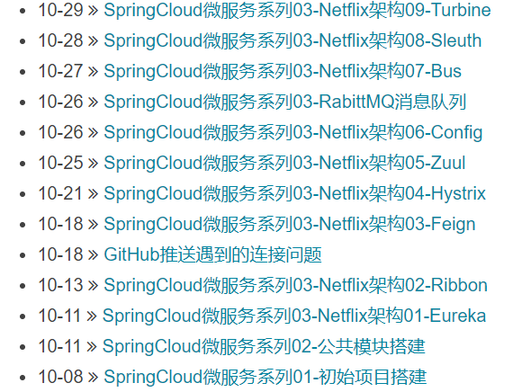
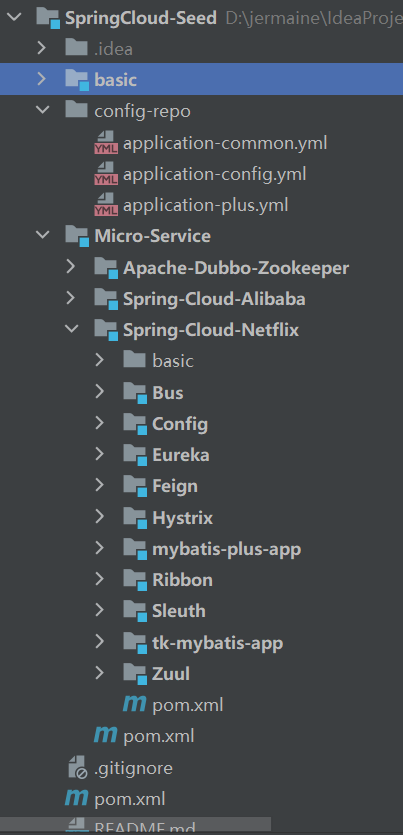

# Spring-Cloud-Netflix系列完结总结

目前业界对 Spring Cloud 使用最广的就是 Spring Cloud Netflix ,整个系列包括,Spring Cloud 为开发人员提供了快速构建分布式系统中一些常见模式的工具（例如配置管理，服务发现，断路器，智能路由，微代理，控制总线）。分布式系统的协调导致了样板模式, 使用 Spring Cloud 开发人员可以快速地支持实现这些模式的服务和应用程序。他们将在任何分布式环境中运行良好，包括开发人员自己的笔记本电脑，裸机数据中心，以及 Cloud Foundry 等托管平台。

（1）Eureka，服务注册和发现，它提供了一个服务注册中心、服务发现的客户端，还有一个方便的查看所有注册的服务的界面。 所有的服务使用Eureka的服务发现客户端来将自己注册到Eureka的服务器上。

（2）Zuul，网关，所有的客户端请求通过这个网关访问后台的服务。他可以使用一定的路由配置来判断某一个URL由哪个服务来处理。并从Eureka获取注册的服务来转发请求。

（3）Ribbon，即负载均衡，Zuul网关将一个请求发送给某一个服务的应用的时候，如果一个服务启动了多个实例，就会通过Ribbon来通过一定的负载均衡策略来发送给某一个服务实例。

（4）Feign，服务客户端，服务之间如果需要相互访问，可以使用RestTemplate，也可以使用Feign客户端访问。它默认会使用Ribbon来实现负载均衡。

（5）Hystrix，监控和断路器。我们只需要在服务接口上添加Hystrix标签，就可以实现对这个接口的监控和断路器功能。

（6）Hystrix Dashboard，监控面板，他提供了一个界面，可以监控各个服务上的服务调用所消耗的时间等。

（7）Turbine，监控聚合，使用Hystrix监控，我们需要打开每一个服务实例的监控信息来查看。而Turbine可以帮助我们把所有的服务实例的监控信息聚合到一个地方统一查看。



## 简介

整个Spring-Cloud-Netflix系列完结



## 整个项目目录结构

```txt
D:\jermaine\IdeaProjects\SpringCloud-Seed
├─.gitignore
├─pom.xml
├─README.md
├─Micro-Service
|       ├─pom.xml
|       ├─Spring-Cloud-Netflix
|       |          ├─pom.xml
|       |          ├─Zuul
|       |          |  ├─pom.xml
|       |          |  ├─target
|       |          |  |   ├─generated-sources
|       |          |  |   |         ├─annotations
|       |          |  |   ├─classes
|       |          |  |   |    ├─application.yml
|       |          |  |   |    ├─cn
|       |          |  |   |    | ├─zm
|       |          |  |   |    | | ├─ZuulApp.class
|       |          |  |   |    | | ├─netflix
|       |          |  |   |    | | |    ├─zuul
|       |          |  |   |    | | |    |  ├─web
|       |          |  |   |    | | |    |  |  ├─rest
|       |          |  |   |    | | |    |  |  |  └ZuulTestController.class
|       |          |  |   |    | | |    |  ├─config
|       |          |  |   |    | | |    |  |   ├─SwaggerResourceConfig.class
|       |          |  |   |    | | |    |  |   └ZuulAppFilter.class
|       |          |  ├─src
|       |          |  |  ├─test
|       |          |  |  |  ├─java
|       |          |  |  ├─main
|       |          |  |  |  ├─resources
|       |          |  |  |  |     └application.yml
|       |          |  |  |  ├─java
|       |          |  |  |  |  ├─cn
|       |          |  |  |  |  | ├─zm
|       |          |  |  |  |  | | ├─ZuulApp.java
|       |          |  |  |  |  | | ├─netflix
|       |          |  |  |  |  | | |    ├─zuul
|       |          |  |  |  |  | | |    |  ├─web
|       |          |  |  |  |  | | |    |  |  ├─rest
|       |          |  |  |  |  | | |    |  |  |  └ZuulTestController.java
|       |          |  |  |  |  | | |    |  ├─config
|       |          |  |  |  |  | | |    |  |   ├─SwaggerResourceConfig.java
|       |          |  |  |  |  | | |    |  |   └ZuulAppFilter.java
|       |          ├─tk-mybatis-app
|       |          |       ├─pom.xml
|       |          |       ├─target
|       |          |       |   ├─test-classes
|       |          |       |   |      ├─DemoApplicationTests$AbilityEntity.class
|       |          |       |   |      └DemoApplicationTests.class
|       |          |       |   ├─generated-test-sources
|       |          |       |   |           ├─test-annotations
|       |          |       |   ├─generated-sources
|       |          |       |   |         ├─annotations
|       |          |       |   ├─classes
|       |          |       |   |    ├─application.yml
|       |          |       |   |    ├─cn
|       |          |       |   |    | ├─zm
|       |          |       |   |    | | ├─TkMybatisApp.class
|       |          |       |   |    | | ├─netflix
|       |          |       |   |    | | |    ├─tkmybatis
|       |          |       |   |    | | |    |     ├─web
|       |          |       |   |    | | |    |     |  ├─service
|       |          |       |   |    | | |    |     |  |    ├─IAccountService.class
|       |          |       |   |    | | |    |     |  |    ├─impl
|       |          |       |   |    | | |    |     |  |    |  └AccountServiceImpl.class
|       |          |       |   |    | | |    |     |  ├─rest
|       |          |       |   |    | | |    |     |  |  └AccountController.class
|       |          |       |   |    | | |    |     |  ├─mapper
|       |          |       |   |    | | |    |     |  |   └AccountMapper.class
|       |          |       |   |    | | |    |     |  ├─entity
|       |          |       |   |    | | |    |     |  |   ├─Account.class
|       |          |       |   |    | | |    |     |  |   ├─vo
|       |          |       |   |    | | |    |     |  |   | └AccountVO.class
|       |          |       |   |    | | |    |     |  |   ├─dto
|       |          |       |   |    | | |    |     |  |   |  └AccountDTO.class
|       |          |       ├─src
|       |          |       |  ├─test
|       |          |       |  |  ├─java
|       |          |       |  |  |  └DemoApplicationTests.java
|       |          |       |  ├─main
|       |          |       |  |  ├─resources
|       |          |       |  |  |     ├─application.yml
|       |          |       |  |  |     ├─mapper
|       |          |       |  |  ├─java
|       |          |       |  |  |  ├─cn
|       |          |       |  |  |  | ├─zm
|       |          |       |  |  |  | | ├─TkMybatisApp.java
|       |          |       |  |  |  | | ├─netflix
|       |          |       |  |  |  | | |    ├─tkmybatis
|       |          |       |  |  |  | | |    |     ├─web
|       |          |       |  |  |  | | |    |     |  ├─service
|       |          |       |  |  |  | | |    |     |  |    ├─IAccountService.java
|       |          |       |  |  |  | | |    |     |  |    ├─impl
|       |          |       |  |  |  | | |    |     |  |    |  └AccountServiceImpl.java
|       |          |       |  |  |  | | |    |     |  ├─rest
|       |          |       |  |  |  | | |    |     |  |  └AccountController.java
|       |          |       |  |  |  | | |    |     |  ├─mapper
|       |          |       |  |  |  | | |    |     |  |   └AccountMapper.java
|       |          |       |  |  |  | | |    |     |  ├─entity
|       |          |       |  |  |  | | |    |     |  |   ├─Account.java
|       |          |       |  |  |  | | |    |     |  |   ├─vo
|       |          |       |  |  |  | | |    |     |  |   | └AccountVO.java
|       |          |       |  |  |  | | |    |     |  |   ├─dto
|       |          |       |  |  |  | | |    |     |  |   |  └AccountDTO.java
|       |          ├─Sleuth
|       |          |   ├─pom.xml
|       |          |   ├─service-tk
|       |          |   |     ├─pom.xml
|       |          |   |     ├─target
|       |          |   |     |   ├─test-classes
|       |          |   |     |   |      ├─DemoApplicationTests$AbilityEntity.class
|       |          |   |     |   |      └DemoApplicationTests.class
|       |          |   |     |   ├─generated-test-sources
|       |          |   |     |   |           ├─test-annotations
|       |          |   |     |   ├─generated-sources
|       |          |   |     |   |         ├─annotations
|       |          |   |     |   ├─classes
|       |          |   |     |   |    ├─application.yml
|       |          |   |     |   |    ├─cn
|       |          |   |     |   |    | ├─zm
|       |          |   |     |   |    | | ├─ServiceTkApp.class
|       |          |   |     |   |    | | ├─netflix
|       |          |   |     |   |    | | |    ├─tkmybatis
|       |          |   |     |   |    | | |    |     ├─web
|       |          |   |     |   |    | | |    |     |  ├─service
|       |          |   |     |   |    | | |    |     |  |    ├─IAccountService.class
|       |          |   |     |   |    | | |    |     |  |    ├─PlusService.class
|       |          |   |     |   |    | | |    |     |  |    ├─impl
|       |          |   |     |   |    | | |    |     |  |    |  └AccountServiceImpl.class
|       |          |   |     |   |    | | |    |     |  ├─rest
|       |          |   |     |   |    | | |    |     |  |  ├─AccountController.class
|       |          |   |     |   |    | | |    |     |  |  └TestController.class
|       |          |   |     |   |    | | |    |     |  ├─mapper
|       |          |   |     |   |    | | |    |     |  |   └AccountMapper.class
|       |          |   |     |   |    | | |    |     |  ├─entity
|       |          |   |     |   |    | | |    |     |  |   ├─Account.class
|       |          |   |     |   |    | | |    |     |  |   ├─vo
|       |          |   |     |   |    | | |    |     |  |   | └AccountVO.class
|       |          |   |     |   |    | | |    |     |  |   ├─dto
|       |          |   |     |   |    | | |    |     |  |   |  └AccountDTO.class
|       |          |   |     ├─src
|       |          |   |     |  ├─test
|       |          |   |     |  |  ├─java
|       |          |   |     |  |  |  └DemoApplicationTests.java
|       |          |   |     |  ├─main
|       |          |   |     |  |  ├─resources
|       |          |   |     |  |  |     ├─application.yml
|       |          |   |     |  |  |     ├─mapper
|       |          |   |     |  |  ├─java
|       |          |   |     |  |  |  ├─cn
|       |          |   |     |  |  |  | ├─zm
|       |          |   |     |  |  |  | | ├─ServiceTkApp.java
|       |          |   |     |  |  |  | | ├─netflix
|       |          |   |     |  |  |  | | |    ├─tkmybatis
|       |          |   |     |  |  |  | | |    |     ├─web
|       |          |   |     |  |  |  | | |    |     |  ├─service
|       |          |   |     |  |  |  | | |    |     |  |    ├─IAccountService.java
|       |          |   |     |  |  |  | | |    |     |  |    ├─PlusService.java
|       |          |   |     |  |  |  | | |    |     |  |    ├─impl
|       |          |   |     |  |  |  | | |    |     |  |    |  └AccountServiceImpl.java
|       |          |   |     |  |  |  | | |    |     |  ├─rest
|       |          |   |     |  |  |  | | |    |     |  |  ├─AccountController.java
|       |          |   |     |  |  |  | | |    |     |  |  └TestController.java
|       |          |   |     |  |  |  | | |    |     |  ├─mapper
|       |          |   |     |  |  |  | | |    |     |  |   └AccountMapper.java
|       |          |   |     |  |  |  | | |    |     |  ├─entity
|       |          |   |     |  |  |  | | |    |     |  |   ├─Account.java
|       |          |   |     |  |  |  | | |    |     |  |   ├─vo
|       |          |   |     |  |  |  | | |    |     |  |   | └AccountVO.java
|       |          |   |     |  |  |  | | |    |     |  |   ├─dto
|       |          |   |     |  |  |  | | |    |     |  |   |  └AccountDTO.java
|       |          |   ├─service-plus
|       |          |   |      ├─pom.xml
|       |          |   |      ├─target
|       |          |   |      |   ├─generated-sources
|       |          |   |      |   |         ├─annotations
|       |          |   |      |   ├─classes
|       |          |   |      |   |    ├─application.yml
|       |          |   |      |   |    ├─cn
|       |          |   |      |   |    | ├─zm
|       |          |   |      |   |    | | ├─ServicePlusApp.class
|       |          |   |      |   |    | | ├─netflix
|       |          |   |      |   |    | | |    ├─mybatisplus
|       |          |   |      |   |    | | |    |      ├─web
|       |          |   |      |   |    | | |    |      |  ├─service
|       |          |   |      |   |    | | |    |      |  |    ├─IAccountService.class
|       |          |   |      |   |    | | |    |      |  |    ├─ServiceTkService.class
|       |          |   |      |   |    | | |    |      |  |    ├─impl
|       |          |   |      |   |    | | |    |      |  |    |  └AccountServiceImpl.class
|       |          |   |      |   |    | | |    |      |  ├─rest
|       |          |   |      |   |    | | |    |      |  |  ├─AccountController.class
|       |          |   |      |   |    | | |    |      |  |  └TestController.class
|       |          |   |      |   |    | | |    |      |  ├─mapper
|       |          |   |      |   |    | | |    |      |  |   └AccountMapper.class
|       |          |   |      |   |    | | |    |      |  ├─entity
|       |          |   |      |   |    | | |    |      |  |   ├─Account.class
|       |          |   |      |   |    | | |    |      |  |   ├─vo
|       |          |   |      |   |    | | |    |      |  |   | └AccountVO.class
|       |          |   |      |   |    | | |    |      |  |   ├─dto
|       |          |   |      |   |    | | |    |      |  |   |  └AccountDTO.class
|       |          |   |      ├─src
|       |          |   |      |  ├─test
|       |          |   |      |  |  ├─java
|       |          |   |      |  ├─main
|       |          |   |      |  |  ├─resources
|       |          |   |      |  |  |     └application.yml
|       |          |   |      |  |  ├─java
|       |          |   |      |  |  |  ├─cn
|       |          |   |      |  |  |  | ├─zm
|       |          |   |      |  |  |  | | ├─ServicePlusApp.java
|       |          |   |      |  |  |  | | ├─netflix
|       |          |   |      |  |  |  | | |    ├─mybatisplus
|       |          |   |      |  |  |  | | |    |      ├─web
|       |          |   |      |  |  |  | | |    |      |  ├─service
|       |          |   |      |  |  |  | | |    |      |  |    ├─IAccountService.java
|       |          |   |      |  |  |  | | |    |      |  |    ├─ServiceTkService.java
|       |          |   |      |  |  |  | | |    |      |  |    ├─impl
|       |          |   |      |  |  |  | | |    |      |  |    |  └AccountServiceImpl.java
|       |          |   |      |  |  |  | | |    |      |  ├─rest
|       |          |   |      |  |  |  | | |    |      |  |  ├─AccountController.java
|       |          |   |      |  |  |  | | |    |      |  |  └TestController.java
|       |          |   |      |  |  |  | | |    |      |  ├─mapper
|       |          |   |      |  |  |  | | |    |      |  |   └AccountMapper.java
|       |          |   |      |  |  |  | | |    |      |  ├─entity
|       |          |   |      |  |  |  | | |    |      |  |   ├─Account.java
|       |          |   |      |  |  |  | | |    |      |  |   ├─vo
|       |          |   |      |  |  |  | | |    |      |  |   | └AccountVO.java
|       |          |   |      |  |  |  | | |    |      |  |   ├─dto
|       |          |   |      |  |  |  | | |    |      |  |   |  └AccountDTO.java
|       |          ├─Ribbon
|       |          |   ├─pom.xml
|       |          |   ├─target
|       |          |   |   ├─test-classes
|       |          |   |   |      └TestApp.class
|       |          |   |   ├─generated-test-sources
|       |          |   |   |           ├─test-annotations
|       |          |   |   ├─generated-sources
|       |          |   |   |         ├─annotations
|       |          |   |   ├─classes
|       |          |   |   |    ├─application.yml
|       |          |   |   |    ├─cn
|       |          |   |   |    | ├─zm
|       |          |   |   |    | | ├─RibbonApp.class
|       |          |   |   |    | | ├─netflix
|       |          |   |   |    | | |    ├─ribbon
|       |          |   |   |    | | |    |   ├─web
|       |          |   |   |    | | |    |   |  ├─service
|       |          |   |   |    | | |    |   |  |    ├─RibbonService.class
|       |          |   |   |    | | |    |   |  |    ├─impl
|       |          |   |   |    | | |    |   |  |    |  └RibbonServiceImpl.class
|       |          |   |   |    | | |    |   |  ├─rest
|       |          |   |   |    | | |    |   |  |  └RibbonController.class
|       |          |   ├─src
|       |          |   |  ├─test
|       |          |   |  |  ├─java
|       |          |   |  |  |  └TestApp.java
|       |          |   |  ├─main
|       |          |   |  |  ├─resources
|       |          |   |  |  |     └application.yml
|       |          |   |  |  ├─java
|       |          |   |  |  |  ├─cn
|       |          |   |  |  |  | ├─zm
|       |          |   |  |  |  | | ├─RibbonApp.java
|       |          |   |  |  |  | | ├─netflix
|       |          |   |  |  |  | | |    ├─ribbon
|       |          |   |  |  |  | | |    |   ├─web
|       |          |   |  |  |  | | |    |   |  ├─service
|       |          |   |  |  |  | | |    |   |  |    ├─RibbonService.java
|       |          |   |  |  |  | | |    |   |  |    ├─impl
|       |          |   |  |  |  | | |    |   |  |    |  └RibbonServiceImpl.java
|       |          |   |  |  |  | | |    |   |  ├─rest
|       |          |   |  |  |  | | |    |   |  |  └RibbonController.java
|       |          ├─mybatis-plus-app
|       |          |        ├─pom.xml
|       |          |        ├─target
|       |          |        |   ├─generated-sources
|       |          |        |   |         ├─annotations
|       |          |        |   ├─classes
|       |          |        |   |    ├─bootstrap.yml
|       |          |        |   |    ├─cn
|       |          |        |   |    | ├─zm
|       |          |        |   |    | | ├─MybatisPlusApp.class
|       |          |        |   |    | | ├─netflix
|       |          |        |   |    | | |    ├─mybatisplus
|       |          |        |   |    | | |    |      ├─web
|       |          |        |   |    | | |    |      |  ├─service
|       |          |        |   |    | | |    |      |  |    ├─IAccountService.class
|       |          |        |   |    | | |    |      |  |    ├─impl
|       |          |        |   |    | | |    |      |  |    |  └AccountServiceImpl.class
|       |          |        |   |    | | |    |      |  ├─rest
|       |          |        |   |    | | |    |      |  |  ├─AccountController.class
|       |          |        |   |    | | |    |      |  |  └TestController.class
|       |          |        |   |    | | |    |      |  ├─mapper
|       |          |        |   |    | | |    |      |  |   └AccountMapper.class
|       |          |        |   |    | | |    |      |  ├─entity
|       |          |        |   |    | | |    |      |  |   ├─Account.class
|       |          |        |   |    | | |    |      |  |   ├─vo
|       |          |        |   |    | | |    |      |  |   | └AccountVO.class
|       |          |        |   |    | | |    |      |  |   ├─dto
|       |          |        |   |    | | |    |      |  |   |  └AccountDTO.class
|       |          |        ├─src
|       |          |        |  ├─test
|       |          |        |  |  ├─java
|       |          |        |  ├─main
|       |          |        |  |  ├─resources
|       |          |        |  |  |     └bootstrap.yml
|       |          |        |  |  ├─java
|       |          |        |  |  |  ├─cn
|       |          |        |  |  |  | ├─zm
|       |          |        |  |  |  | | ├─application.yml
|       |          |        |  |  |  | | ├─bootstrap.properties
|       |          |        |  |  |  | | ├─MybatisPlusApp.java
|       |          |        |  |  |  | | ├─netflix
|       |          |        |  |  |  | | |    ├─mybatisplus
|       |          |        |  |  |  | | |    |      ├─web
|       |          |        |  |  |  | | |    |      |  ├─service
|       |          |        |  |  |  | | |    |      |  |    ├─IAccountService.java
|       |          |        |  |  |  | | |    |      |  |    ├─impl
|       |          |        |  |  |  | | |    |      |  |    |  └AccountServiceImpl.java
|       |          |        |  |  |  | | |    |      |  ├─rest
|       |          |        |  |  |  | | |    |      |  |  ├─AccountController.java
|       |          |        |  |  |  | | |    |      |  |  └TestController.java
|       |          |        |  |  |  | | |    |      |  ├─mapper
|       |          |        |  |  |  | | |    |      |  |   └AccountMapper.java
|       |          |        |  |  |  | | |    |      |  ├─entity
|       |          |        |  |  |  | | |    |      |  |   ├─Account.java
|       |          |        |  |  |  | | |    |      |  |   ├─vo
|       |          |        |  |  |  | | |    |      |  |   | └AccountVO.java
|       |          |        |  |  |  | | |    |      |  |   ├─dto
|       |          |        |  |  |  | | |    |      |  |   |  └AccountDTO.java
|       |          ├─Hystrix
|       |          |    ├─pom.xml
|       |          |    ├─target
|       |          |    |   ├─generated-sources
|       |          |    |   |         ├─annotations
|       |          |    |   ├─classes
|       |          |    |   |    ├─application.yml
|       |          |    |   |    ├─cn
|       |          |    |   |    | ├─zm
|       |          |    |   |    | | ├─HystrixApp.class
|       |          |    |   |    | | ├─netflix
|       |          |    |   |    | | |    ├─hystrix
|       |          |    |   |    | | |    |    ├─web
|       |          |    |   |    | | |    |    |  ├─service
|       |          |    |   |    | | |    |    |  |    ├─HystrixService.class
|       |          |    |   |    | | |    |    |  |    ├─impl
|       |          |    |   |    | | |    |    |  |    |  └HystrixServiceImpl.class
|       |          |    |   |    | | |    |    |  ├─rest
|       |          |    |   |    | | |    |    |  |  └HystrixController.class
|       |          |    ├─src
|       |          |    |  ├─test
|       |          |    |  |  ├─java
|       |          |    |  ├─main
|       |          |    |  |  ├─resources
|       |          |    |  |  |     └application.yml
|       |          |    |  |  ├─java
|       |          |    |  |  |  ├─cn
|       |          |    |  |  |  | ├─zm
|       |          |    |  |  |  | | ├─HystrixApp.java
|       |          |    |  |  |  | | ├─netflix
|       |          |    |  |  |  | | |    ├─hystrix
|       |          |    |  |  |  | | |    |    ├─web
|       |          |    |  |  |  | | |    |    |  ├─service
|       |          |    |  |  |  | | |    |    |  |    ├─HystrixService.java
|       |          |    |  |  |  | | |    |    |  |    ├─impl
|       |          |    |  |  |  | | |    |    |  |    |  └HystrixServiceImpl.java
|       |          |    |  |  |  | | |    |    |  ├─rest
|       |          |    |  |  |  | | |    |    |  |  └HystrixController.java
|       |          ├─Feign
|       |          |   ├─pom.xml
|       |          |   ├─target
|       |          |   |   ├─generated-sources
|       |          |   |   |         ├─annotations
|       |          |   |   ├─classes
|       |          |   |   |    ├─application.yml
|       |          |   |   |    ├─cn
|       |          |   |   |    | ├─zm
|       |          |   |   |    | | ├─FeignApp.class
|       |          |   |   |    | | ├─netflix
|       |          |   |   |    | | |    ├─feign
|       |          |   |   |    | | |    |   ├─web
|       |          |   |   |    | | |    |   |  ├─service
|       |          |   |   |    | | |    |   |  |    ├─FeignHystrixService.class
|       |          |   |   |    | | |    |   |  |    ├─FeignService.class
|       |          |   |   |    | | |    |   |  |    ├─impl
|       |          |   |   |    | | |    |   |  |    |  └HystrixHandler.class
|       |          |   |   |    | | |    |   |  ├─rest
|       |          |   |   |    | | |    |   |  |  └FeignController.class
|       |          |   ├─src
|       |          |   |  ├─test
|       |          |   |  |  ├─java
|       |          |   |  ├─main
|       |          |   |  |  ├─resources
|       |          |   |  |  |     └application.yml
|       |          |   |  |  ├─java
|       |          |   |  |  |  ├─cn
|       |          |   |  |  |  | ├─zm
|       |          |   |  |  |  | | ├─FeignApp.java
|       |          |   |  |  |  | | ├─netflix
|       |          |   |  |  |  | | |    ├─feign
|       |          |   |  |  |  | | |    |   ├─web
|       |          |   |  |  |  | | |    |   |  ├─service
|       |          |   |  |  |  | | |    |   |  |    ├─FeignHystrixService.java
|       |          |   |  |  |  | | |    |   |  |    ├─FeignService.java
|       |          |   |  |  |  | | |    |   |  |    ├─impl
|       |          |   |  |  |  | | |    |   |  |    |  └HystrixHandler.java
|       |          |   |  |  |  | | |    |   |  ├─rest
|       |          |   |  |  |  | | |    |   |  |  └FeignController.java
|       |          ├─Eureka
|       |          |   ├─.gitignore
|       |          |   ├─HELP.md
|       |          |   ├─mvnw
|       |          |   ├─mvnw.cmd
|       |          |   ├─pom.xml
|       |          |   ├─target
|       |          |   |   ├─test-classes
|       |          |   |   ├─generated-test-sources
|       |          |   |   |           ├─test-annotations
|       |          |   |   ├─generated-sources
|       |          |   |   |         ├─annotations
|       |          |   |   ├─classes
|       |          |   |   |    ├─application.yml
|       |          |   |   |    ├─cn
|       |          |   |   |    | ├─zm
|       |          |   |   |    | | ├─eureka
|       |          |   |   |    | | |   └EurekaApp.class
|       |          |   ├─src
|       |          |   |  ├─test
|       |          |   |  |  ├─java
|       |          |   |  |  |  ├─cn
|       |          |   |  |  |  | ├─zm
|       |          |   |  |  |  | | ├─eureka
|       |          |   |  |  |  | | |   └EurekaApplicationTests.java
|       |          |   |  ├─main
|       |          |   |  |  ├─resources
|       |          |   |  |  |     └application.yml
|       |          |   |  |  ├─java
|       |          |   |  |  |  ├─cn
|       |          |   |  |  |  | ├─zm
|       |          |   |  |  |  | | ├─eureka
|       |          |   |  |  |  | | |   └EurekaApp.java
|       |          |   ├─.mvn
|       |          |   |  ├─wrapper
|       |          |   |  |    ├─maven-wrapper.jar
|       |          |   |  |    ├─maven-wrapper.properties
|       |          |   |  |    └MavenWrapperDownloader.java
|       |          ├─Config
|       |          |   ├─pom.xml
|       |          |   ├─target
|       |          |   |   ├─generated-sources
|       |          |   |   |         ├─annotations
|       |          |   |   ├─classes
|       |          |   |   |    ├─application.yml
|       |          |   |   |    ├─cn
|       |          |   |   |    | ├─zm
|       |          |   |   |    | | ├─ConfigServerApp.class
|       |          |   |   |    | | ├─netflix
|       |          |   |   |    | | |    ├─config
|       |          |   |   |    | | |    |   ├─web
|       |          |   |   |    | | |    |   |  ├─rest
|       |          |   |   |    | | |    |   |  |  └ConfigController.class
|       |          |   ├─src
|       |          |   |  ├─test
|       |          |   |  |  ├─java
|       |          |   |  ├─main
|       |          |   |  |  ├─resources
|       |          |   |  |  |     └application.yml
|       |          |   |  |  ├─java
|       |          |   |  |  |  ├─cn
|       |          |   |  |  |  | ├─zm
|       |          |   |  |  |  | | ├─ConfigServerApp.java
|       |          |   |  |  |  | | ├─netflix
|       |          |   |  |  |  | | |    ├─config
|       |          |   |  |  |  | | |    |   ├─web
|       |          |   |  |  |  | | |    |   |  ├─service
|       |          |   |  |  |  | | |    |   |  |    ├─impl
|       |          |   |  |  |  | | |    |   |  ├─rest
|       |          |   |  |  |  | | |    |   |  |  └ConfigController.java
|       |          ├─Bus
|       |          |  ├─pom.xml
|       |          |  ├─target
|       |          |  |   ├─generated-sources
|       |          |  |   |         ├─annotations
|       |          |  |   ├─classes
|       |          |  |   |    ├─bootstrap.yml
|       |          |  |   |    ├─cn
|       |          |  |   |    | ├─zm
|       |          |  |   |    | | ├─BusApp.class
|       |          |  |   |    | | ├─netflix
|       |          |  |   |    | | |    ├─bus
|       |          |  |   |    | | |    |  ├─web
|       |          |  |   |    | | |    |  |  ├─rest
|       |          |  |   |    | | |    |  |  |  └TestController.class
|       |          |  ├─src
|       |          |  |  ├─test
|       |          |  |  |  ├─java
|       |          |  |  ├─main
|       |          |  |  |  ├─resources
|       |          |  |  |  |     └bootstrap.yml
|       |          |  |  |  ├─java
|       |          |  |  |  |  ├─cn
|       |          |  |  |  |  | ├─zm
|       |          |  |  |  |  | | ├─bootstrap.properties
|       |          |  |  |  |  | | ├─BusApp.java
|       |          |  |  |  |  | | ├─netflix
|       |          |  |  |  |  | | |    ├─bus
|       |          |  |  |  |  | | |    |  ├─web
|       |          |  |  |  |  | | |    |  |  ├─rest
|       |          |  |  |  |  | | |    |  |  |  └TestController.java
|       |          ├─basic
|       |          |   ├─pom.xml
|       |          |   ├─src
|       |          |   |  ├─test
|       |          |   |  |  ├─java
|       |          |   |  ├─main
|       |          |   |  |  ├─resources
|       |          |   |  |  |     └application.yml
|       |          |   |  |  ├─java
|       |          |   |  |  |  ├─cn
|       |          |   |  |  |  | ├─zm
|       |          |   |  |  |  | | ├─BasicApp.java
|       |          |   |  |  |  | | ├─netflix
|       |          |   |  |  |  | | |    ├─basic
|       |          |   |  |  |  | | |    |   ├─web
|       |          |   |  |  |  | | |    |   |  ├─service
|       |          |   |  |  |  | | |    |   |  |    ├─impl
|       |          |   |  |  |  | | |    |   |  ├─rest
|       ├─Spring-Cloud-Alibaba
|       |          └pom.xml
|       ├─Apache-Dubbo-Zookeeper
|       |           ├─pom.xml
|       |           ├─src
|       |           |  ├─test
|       |           |  |  ├─java
|       |           |  ├─main
|       |           |  |  ├─resources
|       |           |  |  ├─java
├─config-repo
|      ├─application-common.yml
|      ├─application-config.yml
|      └application-plus.yml
├─basic
|   ├─pom.xml
|   ├─tk-mybatis
|   |     ├─pom.xml
|   |     ├─target
|   |     |   ├─test-classes
|   |     |   ├─generated-test-sources
|   |     |   |           ├─test-annotations
|   |     |   ├─generated-sources
|   |     |   |         ├─annotations
|   |     |   ├─classes
|   |     |   |    ├─application-tk.yml
|   |     |   |    ├─gen.properties
|   |     |   |    ├─generatorConfig.xml
|   |     |   |    ├─tk.gen.yml
|   |     |   |    ├─templates
|   |     |   |    |     ├─code
|   |     |   |    |     |  ├─controller.java.ftl
|   |     |   |    |     |  ├─entity.java.ftl
|   |     |   |    |     |  ├─mapper.java.ftl
|   |     |   |    |     |  ├─mapper.xml.ftl
|   |     |   |    |     |  ├─service.java.ftl
|   |     |   |    |     |  └serviceImpl.java.ftl
|   |     |   |    |     ├─backup
|   |     |   |    |     |   ├─controller.java.ftl
|   |     |   |    |     |   ├─entity.java.ftl
|   |     |   |    |     |   ├─mapper.java.ftl
|   |     |   |    |     |   ├─mapper.xml.ftl
|   |     |   |    |     |   ├─service.java.ftl
|   |     |   |    |     |   └serviceImpl.java.ftl
|   |     |   |    ├─cn
|   |     |   |    | ├─zm
|   |     |   |    | | ├─tk
|   |     |   |    | | | ├─CodeGenerator$1.class
|   |     |   |    | | | ├─CodeGenerator$2.class
|   |     |   |    | | | ├─CodeGenerator$3.class
|   |     |   |    | | | ├─CodeGenerator$4.class
|   |     |   |    | | | ├─CodeGenerator.class
|   |     |   |    | | | ├─utils
|   |     |   |    | | | |   ├─ConvertUtil.class
|   |     |   |    | | | |   ├─ObjectConvert.class
|   |     |   |    | | | |   └PageResult.class
|   |     |   |    | | | ├─func
|   |     |   |    | | | |  ├─ListFunc.class
|   |     |   |    | | | |  └Tao.class
|   |     |   |    | | | ├─config
|   |     |   |    | | | |   └MapperConfig.class
|   |     |   |    | | | ├─base
|   |     |   |    | | | |  ├─BaseController.class
|   |     |   |    | | | |  ├─service
|   |     |   |    | | | |  |    ├─BaseService.class
|   |     |   |    | | | |  |    └BaseServiceImpl.class
|   |     |   |    | | | |  ├─mapper
|   |     |   |    | | | |  |   ├─BaseMapper.class
|   |     |   |    | | | |  |   ├─ImapperSql.class
|   |     |   |    | | | |  |   ├─MapperConsumer.class
|   |     |   |    | | | |  |   ├─SelectByIdsMapper.class
|   |     |   |    | | | |  |   └SelectByIdsProvider.class
|   |     |   |    | | | ├─anno
|   |     |   |    | | | |  └Like.class
|   |     ├─src
|   |     |  ├─test
|   |     |  |  ├─java
|   |     |  |  |  └Test.java
|   |     |  ├─main
|   |     |  |  ├─resources
|   |     |  |  |     ├─application-tk.yml
|   |     |  |  |     ├─gen.properties
|   |     |  |  |     ├─generatorConfig.xml
|   |     |  |  |     ├─tk.gen.yml
|   |     |  |  |     ├─templates
|   |     |  |  |     |     ├─code
|   |     |  |  |     |     |  ├─controller.java.ftl
|   |     |  |  |     |     |  ├─entity.java.ftl
|   |     |  |  |     |     |  ├─mapper.java.ftl
|   |     |  |  |     |     |  ├─mapper.xml.ftl
|   |     |  |  |     |     |  ├─service.java.ftl
|   |     |  |  |     |     |  └serviceImpl.java.ftl
|   |     |  |  |     |     ├─backup
|   |     |  |  |     |     |   ├─controller.java.ftl
|   |     |  |  |     |     |   ├─entity.java.ftl
|   |     |  |  |     |     |   ├─mapper.java.ftl
|   |     |  |  |     |     |   ├─mapper.xml.ftl
|   |     |  |  |     |     |   ├─service.java.ftl
|   |     |  |  |     |     |   └serviceImpl.java.ftl
|   |     |  |  ├─java
|   |     |  |  |  ├─cn
|   |     |  |  |  | ├─zm
|   |     |  |  |  | | ├─tk
|   |     |  |  |  | | | ├─CodeGenerator.java
|   |     |  |  |  | | | ├─utils
|   |     |  |  |  | | | |   ├─ConvertUtil.java
|   |     |  |  |  | | | |   ├─ObjectConvert.java
|   |     |  |  |  | | | |   └PageResult.java
|   |     |  |  |  | | | ├─func
|   |     |  |  |  | | | |  ├─ListFunc.java
|   |     |  |  |  | | | |  └Tao.java
|   |     |  |  |  | | | ├─config
|   |     |  |  |  | | | |   └MapperConfig.java
|   |     |  |  |  | | | ├─base
|   |     |  |  |  | | | |  ├─BaseController.java
|   |     |  |  |  | | | |  ├─service
|   |     |  |  |  | | | |  |    ├─BaseService.java
|   |     |  |  |  | | | |  |    └BaseServiceImpl.java
|   |     |  |  |  | | | |  ├─mapper
|   |     |  |  |  | | | |  |   ├─BaseMapper.java
|   |     |  |  |  | | | |  |   ├─Imapper.java
|   |     |  |  |  | | | |  |   ├─ImapperSql.java
|   |     |  |  |  | | | |  |   ├─MapperConsumer.java
|   |     |  |  |  | | | |  |   ├─SelectByIdsMapper.java
|   |     |  |  |  | | | |  |   └SelectByIdsProvider.java
|   |     |  |  |  | | | ├─anno
|   |     |  |  |  | | | |  └Like.java
|   ├─RabittMQ
|   |    ├─pom.xml
|   |    ├─target
|   |    |   ├─generated-sources
|   |    |   |         ├─annotations
|   |    |   ├─classes
|   |    |   |    ├─cn
|   |    |   |    | ├─zm
|   |    |   |    | | ├─mq
|   |    |   |    | | | ├─EmitLog.class
|   |    |   |    | | | ├─EmitLogDirect.class
|   |    |   |    | | | ├─EmitLogTopic.class
|   |    |   |    | | | ├─NewTask.class
|   |    |   |    | | | ├─PublisherConfirms.class
|   |    |   |    | | | ├─ReceiveLogs.class
|   |    |   |    | | | ├─ReceiveLogsDirect.class
|   |    |   |    | | | ├─ReceiveLogsTopic.class
|   |    |   |    | | | ├─Recv.class
|   |    |   |    | | | ├─RPCClient.class
|   |    |   |    | | | ├─RPCServer.class
|   |    |   |    | | | ├─Send.class
|   |    |   |    | | | └Worker.class
|   |    ├─src
|   |    |  ├─test
|   |    |  |  ├─java
|   |    |  ├─main
|   |    |  |  ├─resources
|   |    |  |  ├─java
|   |    |  |  |  ├─cn
|   |    |  |  |  | ├─zm
|   |    |  |  |  | | ├─mq
|   |    |  |  |  | | | ├─EmitLog.java
|   |    |  |  |  | | | ├─EmitLogDirect.java
|   |    |  |  |  | | | ├─EmitLogTopic.java
|   |    |  |  |  | | | ├─NewTask.java
|   |    |  |  |  | | | ├─PublisherConfirms.java
|   |    |  |  |  | | | ├─ReceiveLogs.java
|   |    |  |  |  | | | ├─ReceiveLogsDirect.java
|   |    |  |  |  | | | ├─ReceiveLogsTopic.java
|   |    |  |  |  | | | ├─Recv.java
|   |    |  |  |  | | | ├─RPCClient.java
|   |    |  |  |  | | | ├─RPCServer.java
|   |    |  |  |  | | | ├─Send.java
|   |    |  |  |  | | | └Worker.java
|   ├─netty
|   |   ├─pom.xml
|   |   ├─target
|   |   |   ├─generated-sources
|   |   |   |         ├─annotations
|   |   |   ├─classes
|   |   |   |    ├─websocketentity.json
|   |   |   |    ├─cn
|   |   |   |    | ├─zm
|   |   |   |    | | ├─netty
|   |   |   |    | | |   ├─service
|   |   |   |    | | |   |    ├─PushService.class
|   |   |   |    | | |   |    ├─impl
|   |   |   |    | | |   |    |  └PushServiceImpl.class
|   |   |   |    | | |   ├─server
|   |   |   |    | | |   |   ├─NettyServer$1.class
|   |   |   |    | | |   |   └NettyServer.class
|   |   |   |    | | |   ├─handler
|   |   |   |    | | |   |    ├─NettyHandler.class
|   |   |   |    | | |   |    └WebSocketHandler.class
|   |   |   |    | | |   ├─entity
|   |   |   |    | | |   |   └WebSocketEntity.class
|   |   |   |    | | |   ├─contoller
|   |   |   |    | | |   |     └PushController.class
|   |   ├─src
|   |   |  ├─main
|   |   |  |  ├─resources
|   |   |  |  |     └websocketentity.json
|   |   |  |  ├─java
|   |   |  |  |  ├─cn
|   |   |  |  |  | ├─zm
|   |   |  |  |  | | ├─netty
|   |   |  |  |  | | |   ├─service
|   |   |  |  |  | | |   |    ├─PushService.java
|   |   |  |  |  | | |   |    ├─impl
|   |   |  |  |  | | |   |    |  └PushServiceImpl.java
|   |   |  |  |  | | |   ├─server
|   |   |  |  |  | | |   |   └NettyServer.java
|   |   |  |  |  | | |   ├─handler
|   |   |  |  |  | | |   |    ├─NettyHandler.java
|   |   |  |  |  | | |   |    └WebSocketHandler.java
|   |   |  |  |  | | |   ├─entity
|   |   |  |  |  | | |   |   └WebSocketEntity.java
|   |   |  |  |  | | |   ├─contoller
|   |   |  |  |  | | |   |     └PushController.java
|   ├─mybatis-plus
|   |      ├─pom.xml
|   |      ├─target
|   |      |   ├─test-classes
|   |      |   ├─generated-test-sources
|   |      |   |           ├─test-annotations
|   |      |   ├─generated-sources
|   |      |   |         ├─annotations
|   |      |   ├─classes
|   |      |   |    ├─application-plus.yml
|   |      |   |    ├─gen.yml
|   |      |   |    ├─templates
|   |      |   |    |     ├─code
|   |      |   |    |     |  ├─controller.java.ftl
|   |      |   |    |     |  ├─entity.java.ftl
|   |      |   |    |     |  ├─mapper.java.ftl
|   |      |   |    |     |  ├─mapper.xml.ftl
|   |      |   |    |     |  ├─service.java.ftl
|   |      |   |    |     |  └serviceImpl.java.ftl
|   |      |   |    |     ├─backup
|   |      |   |    |     |   ├─controller.java.ftl
|   |      |   |    |     |   ├─entity.java.ftl
|   |      |   |    |     |   ├─mapper.java.ftl
|   |      |   |    |     |   ├─mapper.xml.ftl
|   |      |   |    |     |   ├─service.java.ftl
|   |      |   |    |     |   └serviceImpl.java.ftl
|   |      |   |    ├─cn
|   |      |   |    | ├─zm
|   |      |   |    | | ├─plus
|   |      |   |    | | |  ├─CodeGenerator$1.class
|   |      |   |    | | |  ├─CodeGenerator$2.class
|   |      |   |    | | |  ├─CodeGenerator$3.class
|   |      |   |    | | |  ├─CodeGenerator$4.class
|   |      |   |    | | |  ├─CodeGenerator.class
|   |      |   |    | | |  ├─utils
|   |      |   |    | | |  |   ├─ConvertUtil.class
|   |      |   |    | | |  |   └ObjectConvert.class
|   |      |   |    | | |  ├─config
|   |      |   |    | | |  |   └MybatisPlusConfiguration.class
|   |      |   |    | | |  ├─base
|   |      |   |    | | |  |  └BaseController.class
|   |      ├─src
|   |      |  ├─test
|   |      |  |  ├─java
|   |      |  |  |  ├─cn
|   |      |  |  |  | ├─zm
|   |      |  |  |  | | ├─plus
|   |      |  |  |  | | |  └ScrewApplicationTests.java
|   |      |  ├─main
|   |      |  |  ├─resources
|   |      |  |  |     ├─application-plus.yml
|   |      |  |  |     ├─gen.yml
|   |      |  |  |     ├─templates
|   |      |  |  |     |     ├─code
|   |      |  |  |     |     |  ├─controller.java.ftl
|   |      |  |  |     |     |  ├─entity.java.ftl
|   |      |  |  |     |     |  ├─mapper.java.ftl
|   |      |  |  |     |     |  ├─mapper.xml.ftl
|   |      |  |  |     |     |  ├─service.java.ftl
|   |      |  |  |     |     |  └serviceImpl.java.ftl
|   |      |  |  |     |     ├─backup
|   |      |  |  |     |     |   ├─controller.java.ftl
|   |      |  |  |     |     |   ├─entity.java.ftl
|   |      |  |  |     |     |   ├─mapper.java.ftl
|   |      |  |  |     |     |   ├─mapper.xml.ftl
|   |      |  |  |     |     |   ├─service.java.ftl
|   |      |  |  |     |     |   └serviceImpl.java.ftl
|   |      |  |  ├─java
|   |      |  |  |  ├─cn
|   |      |  |  |  | ├─zm
|   |      |  |  |  | | ├─plus
|   |      |  |  |  | | |  ├─CodeGenerator.java
|   |      |  |  |  | | |  ├─utils
|   |      |  |  |  | | |  |   ├─ConvertUtil.java
|   |      |  |  |  | | |  |   └ObjectConvert.java
|   |      |  |  |  | | |  ├─config
|   |      |  |  |  | | |  |   ├─DruidConfig.java
|   |      |  |  |  | | |  |   └MybatisPlusConfiguration.java
|   |      |  |  |  | | |  ├─base
|   |      |  |  |  | | |  |  └BaseController.java
|   ├─common
|   |   ├─pom.xml
|   |   ├─target
|   |   |   ├─generated-sources
|   |   |   |         ├─annotations
|   |   |   ├─classes
|   |   |   |    ├─application-common.yml
|   |   |   |    ├─cn
|   |   |   |    | ├─zm
|   |   |   |    | | ├─common
|   |   |   |    | | |   ├─utils
|   |   |   |    | | |   |   └ConcurrentUtils.class
|   |   |   |    | | |   ├─strategy
|   |   |   |    | | |   |    ├─CreateDataTransferObject.class
|   |   |   |    | | |   |    ├─QueryDataTransferObject.class
|   |   |   |    | | |   |    └UpdateDataTransferObject.class
|   |   |   |    | | |   ├─enums
|   |   |   |    | | |   |   └ResEnum.class
|   |   |   |    | | |   ├─config
|   |   |   |    | | |   |   ├─CorsConfiguration.class
|   |   |   |    | | |   |   ├─FastJsonConfiguration.class
|   |   |   |    | | |   |   ├─GlobalConfig.class
|   |   |   |    | | |   |   ├─Knife4jConfiguration.class
|   |   |   |    | | |   |   ├─LocalDateTimeConfiguration.class
|   |   |   |    | | |   |   └ThreadPoolConfiguration.class
|   |   |   |    | | |   ├─base
|   |   |   |    | | |   |  ├─GlobalExceptionHandler.class
|   |   |   |    | | |   |  ├─MyLocalDateTimeDeserializer.class
|   |   |   |    | | |   |  ├─MyLocalDateTimeSerializer.class
|   |   |   |    | | |   |  ├─ResResult.class
|   |   |   |    | | |   |  ├─ServiceException.class
|   |   |   |    | | |   |  ├─ServiceExceptionBuilder.class
|   |   |   |    | | |   |  └WebsocketServer.class
|   |   |   |    | | |   ├─aspect
|   |   |   |    | | |   |   └DataTransferObjectAspect.class
|   |   |   |    | | |   ├─annotation
|   |   |   |    | | |   |     └SetNull.class
|   |   ├─src
|   |   |  ├─main
|   |   |  |  ├─resources
|   |   |  |  |     └application-common.yml
|   |   |  |  ├─java
|   |   |  |  |  ├─cn
|   |   |  |  |  | ├─zm
|   |   |  |  |  | | ├─common
|   |   |  |  |  | | |   ├─utils
|   |   |  |  |  | | |   |   ├─ConcurrentUtils.java
|   |   |  |  |  | | |   |   └MinIoUtil.java
|   |   |  |  |  | | |   ├─strategy
|   |   |  |  |  | | |   |    ├─CreateDataTransferObject.java
|   |   |  |  |  | | |   |    ├─QueryDataTransferObject.java
|   |   |  |  |  | | |   |    └UpdateDataTransferObject.java
|   |   |  |  |  | | |   ├─enums
|   |   |  |  |  | | |   |   └ResEnum.java
|   |   |  |  |  | | |   ├─config
|   |   |  |  |  | | |   |   ├─CorsConfiguration.java
|   |   |  |  |  | | |   |   ├─FastJsonConfiguration.java
|   |   |  |  |  | | |   |   ├─GlobalConfig.java
|   |   |  |  |  | | |   |   ├─Knife4jConfiguration.java
|   |   |  |  |  | | |   |   ├─Knife4jConfigurationSpringBoot.java
|   |   |  |  |  | | |   |   ├─LocalDateTimeConfiguration.java
|   |   |  |  |  | | |   |   └ThreadPoolConfiguration.java
|   |   |  |  |  | | |   ├─base
|   |   |  |  |  | | |   |  ├─GlobalExceptionHandler.java
|   |   |  |  |  | | |   |  ├─MyLocalDateTimeDeserializer.java
|   |   |  |  |  | | |   |  ├─MyLocalDateTimeSerializer.java
|   |   |  |  |  | | |   |  ├─ResResult.java
|   |   |  |  |  | | |   |  ├─ServiceException.java
|   |   |  |  |  | | |   |  ├─ServiceExceptionBuilder.java
|   |   |  |  |  | | |   |  └WebsocketServer.java
|   |   |  |  |  | | |   ├─aspect
|   |   |  |  |  | | |   |   └DataTransferObjectAspect.java
|   |   |  |  |  | | |   ├─annotation
|   |   |  |  |  | | |   |     └SetNull.java
|   ├─async-programing
|   |        ├─pom.xml
|   |        ├─target
|   |        |   ├─generated-sources
|   |        |   |         ├─annotations
|   |        |   ├─classes
|   |        |   |    ├─cn
|   |        |   |    | ├─zm
|   |        |   |    | | ├─async
|   |        |   |    | | |   ├─service
|   |        |   |    | | |   |    ├─AsyncService.class
|   |        |   |    | | |   |    ├─CompositeService.class
|   |        |   |    | | |   |    ├─impl
|   |        |   |    | | |   |    |  ├─AsyncServiceImpl.class
|   |        |   |    | | |   |    |  └CompositeServiceImpl.class
|   |        |   |    | | |   ├─rest
|   |        |   |    | | |   |  └AsycController.class
|   |        ├─src
|   |        |  ├─main
|   |        |  |  ├─java
|   |        |  |  |  ├─cn
|   |        |  |  |  | ├─zm
|   |        |  |  |  | | ├─async
|   |        |  |  |  | | |   ├─service
|   |        |  |  |  | | |   |    ├─AsyncService.java
|   |        |  |  |  | | |   |    ├─CompositeService.java
|   |        |  |  |  | | |   |    ├─impl
|   |        |  |  |  | | |   |    |  ├─AsyncServiceImpl.java
|   |        |  |  |  | | |   |    |  └CompositeServiceImpl.java
|   |        |  |  |  | | |   ├─rest
|   |        |  |  |  | | |   |  └AsycController.java
```


## 引用资料

>整个项目地址
>
>https://github.com/niziming/SpringCloud-Seed
>
>
