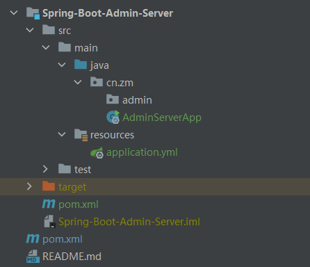
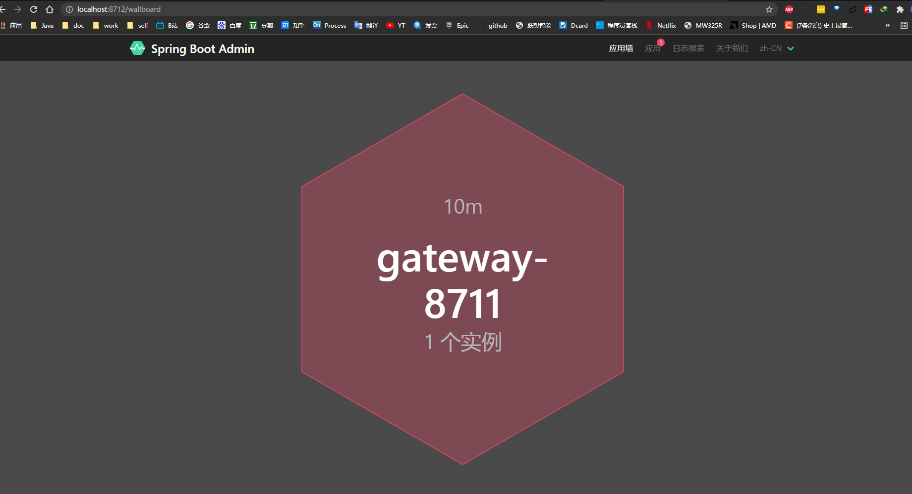
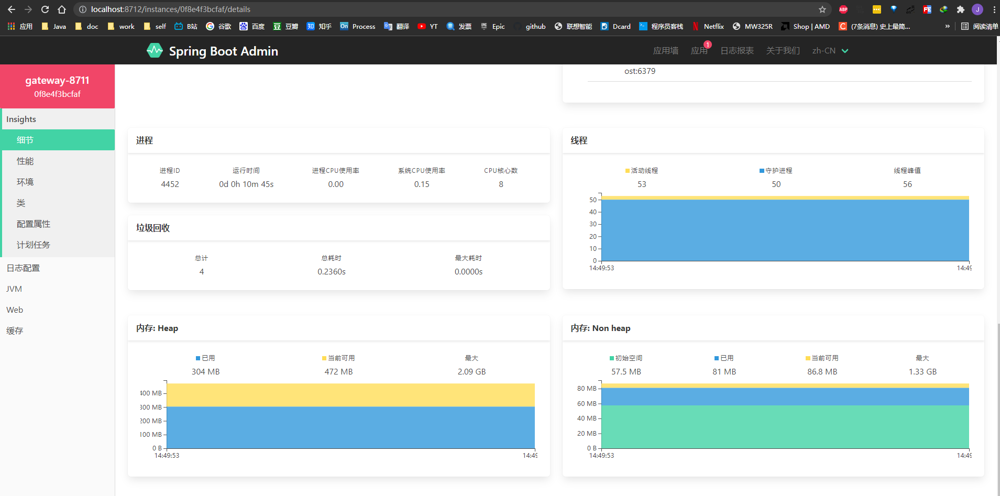
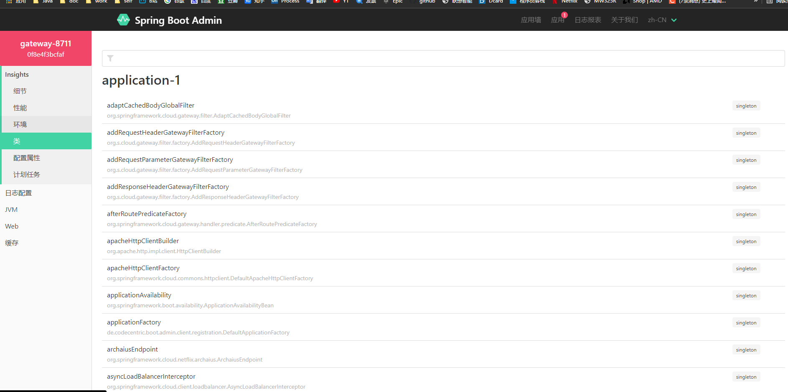
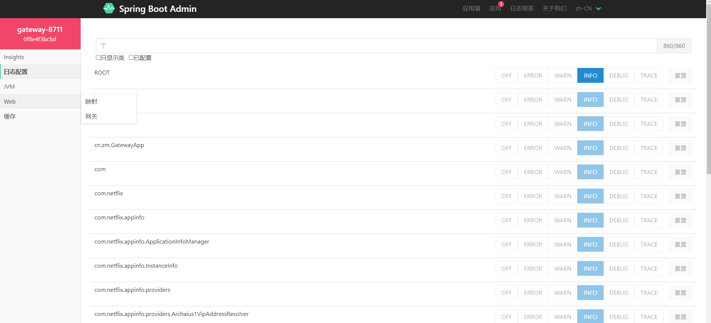

# SpringBootAdmin-01-快速开始

Spring Boot Admin是一个开源社区项目，用于管理和监控SpringBoot应用程序。 应用程序作为Spring Boot Admin Client向为Spring Boot Admin Server注册（通过HTTP）或使用SpringCloud注册中心（例如Eureka，Consul）发现。 UI是的AngularJs应用程序，展示Spring Boot Admin Client的Actuator端点上的一些监控。

常见的功能或者监控如下：

- 显示健康状况
- 显示详细信息，例如
  - JVM和内存指标
  - micrometer.io指标
  - 数据源指标
  - 缓存指标
- 显示构建信息编号
- 关注并下载日志文件
- 查看jvm系统和环境属性
- 查看Spring Boot配置属性
- 支持Spring Cloud的postable / env-和/ refresh-endpoint
- 轻松的日志级管理
- 与JMX-beans交互
- 查看线程转储
- 查看http跟踪
- 查看auditevents
- 查看http-endpoints
- 查看计划任务
- 查看和删除活动会话（使用spring-session）
- 查看Flyway / Liquibase数据库迁移
- 下载heapdump
- 状态变更通知（通过电子邮件，Slack，Hipchat，……）
- 状态更改的事件日志（非持久性）


## 准备工作

- 新建admin项目
- 之前的gateway项目

### 快速开始

admin-server项目 目录结构如下:



pom.xml

```xml
<?xml version="1.0" encoding="UTF-8"?>
<project xmlns="http://maven.apache.org/POM/4.0.0"
         xmlns:xsi="http://www.w3.org/2001/XMLSchema-instance"
         xsi:schemaLocation="http://maven.apache.org/POM/4.0.0 http://maven.apache.org/xsd/maven-4.0.0.xsd">
    <parent>
        <artifactId>Spring-Cloud-Alibaba</artifactId>
        <groupId>cn.zm</groupId>
        <version>1.0-SNAPSHOT</version>
    </parent>
    <modelVersion>4.0.0</modelVersion>

    <artifactId>Spring-Boot-Admin-Server</artifactId>

    <properties>
        <maven.compiler.source>8</maven.compiler.source>
        <maven.compiler.target>8</maven.compiler.target>
    </properties>

    <dependencies>
        <dependency>
            <groupId>de.codecentric</groupId>
            <artifactId>spring-boot-admin-starter-server</artifactId>
            <version>2.3.1</version>
        </dependency>
        <dependency>
            <groupId>org.springframework.boot</groupId>
            <artifactId>spring-boot-starter-web</artifactId>
        </dependency>
    </dependencies>

</project>
```

application.yml

```yml
spring:
  application:
    name: admin-server
server:
  port: 8712
```

然后在工程的启动类AdminServerApplication加上@EnableAdminServer注解，开启AdminServer的功能，代码如下：

```java
package cn.zm;

import de.codecentric.boot.admin.server.config.EnableAdminServer;
import org.springframework.boot.SpringApplication;
import org.springframework.boot.autoconfigure.SpringBootApplication;

@EnableAdminServer
@SpringBootApplication
public class AdminServerApp {
  public static void main(String[] args) {
    SpringApplication.run(AdminServerApp.class, args);
  }
}
```

admin-client项目

```xml
<dependency>
    <groupId>de.codecentric</groupId>
    <artifactId>spring-boot-admin-starter-client</artifactId>
    <version>2.3.1</version>
</dependency>
```

之前的gateway项目修改下profiles

```yml
server:
  port: 8711
spring:
  profiles:
    active: admin-clinet
  application:
    name: gateway-8711

---
spring:
  profiles: admin-clinet
  boot:
    admin:
      client:
        url: http://localhost:8712
management:
  endpoints:
    web:
      exposure:
        include: '*'
  endpoint:
    health:
      show-details: ALWAYS
```

### 测试

查看监控页面

http://localhost:8712












## 引用资料

>
>
>https://www.fangzhipeng.com/springcloud/2019/01/04/sc-f-boot-admin.html
