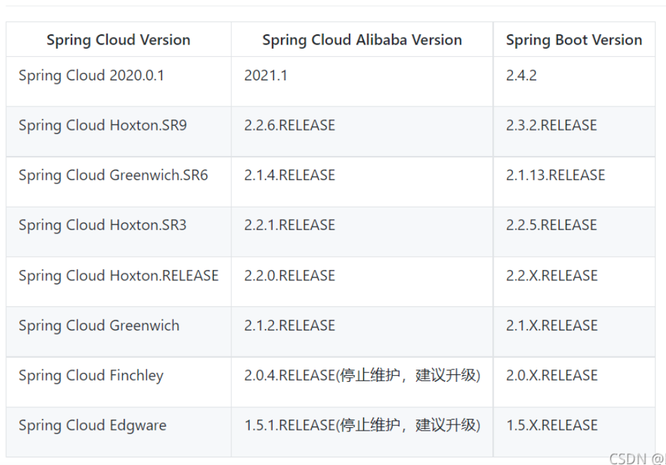
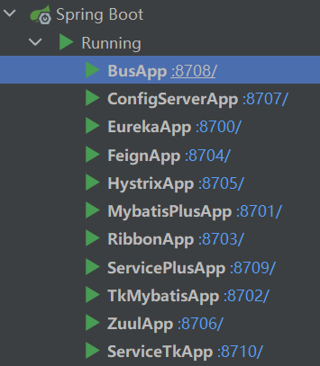

# SpringCloud-SpringBoot-SpringCloudAlibaba稳定版本对应关系

如果版本不匹配的项目会出现很多意料之外的错误,因为后续需要开始cloud alibaba框架的使用,所以把之前的所有项目的基本panrent依赖换成了以下表格的第二栏.

~~~xml
     <version>2.3.2.RELEASE</version>
     <!--<version>2.2.4.RELEASE</version>-->
~~~

## 测试

依赖更换后,所有项目正常运行

## 引用资料

>版本说明
>
>https://github.com/alibaba/spring-cloud-alibaba/wiki/%E7%89%88%E6%9C%AC%E8%AF%B4%E6%98%8E
>
>https://blog.csdn.net/weixin_43679491/article/details/120037205
