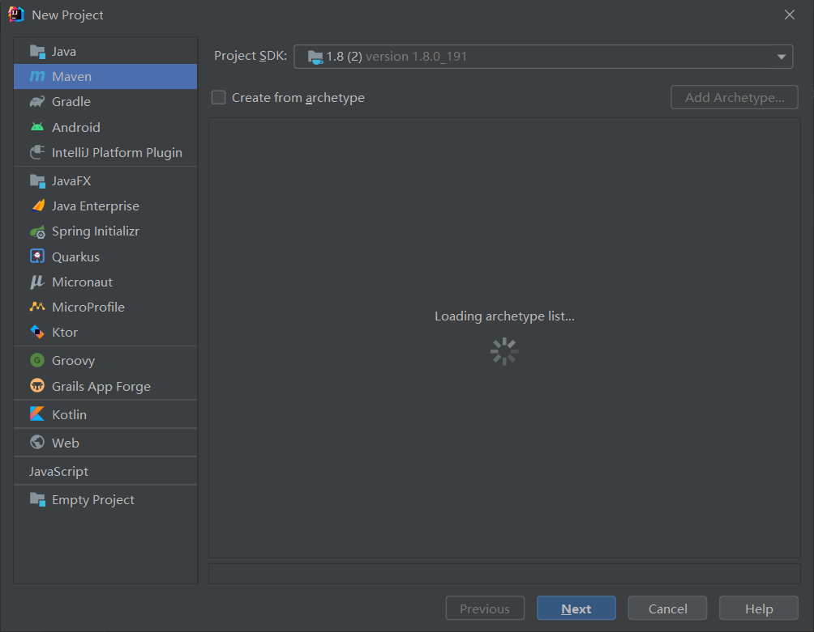
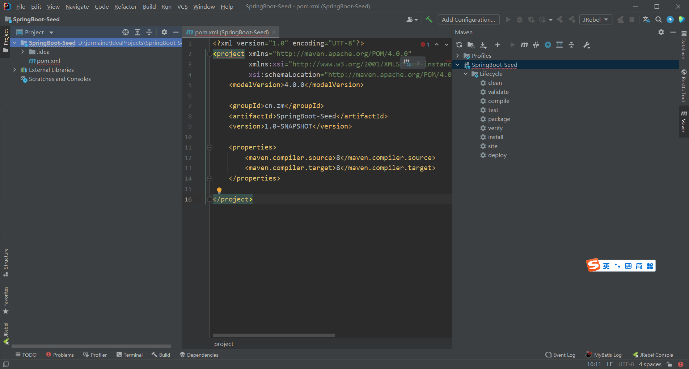
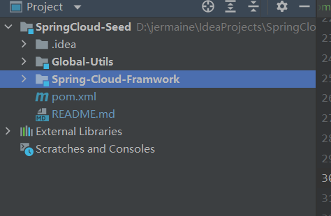
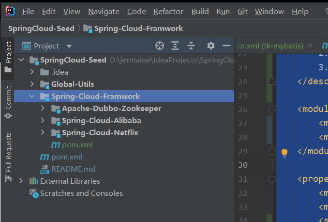

# SpringCloud intro

Spring Cloud provides tools for developers to quickly build some of the common patterns in distributed systems (e.g. configuration management, service discovery, circuit breakers, intelligent routing, micro-proxy, control bus, one-time tokens, global locks, leadership election, distributed sessions, cluster state). Coordination of distributed systems leads to boiler plate patterns, and using Spring Cloud developers can quickly stand up services and applications that implement those patterns. They will work well in any distributed environment, including the developer’s own laptop, bare metal data centres, and managed platforms such as Cloud Foundry.

Spring Cloud 为开发者提供了快速构建分布式系统中一些常见模式的工具（例如配置管理、服务发现、断路器、智能路由、微代理、控制总线、一次性令牌、全局锁、领导选举、分布式会话、集群状态）。分布式系统的协调导致了样板模式，使用 Spring Cloud 开发人员可以快速建立实现这些模式的服务和应用程序。它们将在任何分布式环境中运行良好，包括开发人员自己的笔记本电脑、裸机数据中心和 Cloud Foundry 等托管平台。

# 创建一个SpringCloud微服务项目

直接创建一个maven项目SpringCloud-Seed

~~~xml
<?xml version="1.0" encoding="UTF-8"?>
<project xmlns="http://maven.apache.org/POM/4.0.0"
         xmlns:xsi="http://www.w3.org/2001/XMLSchema-instance"
         xsi:schemaLocation="http://maven.apache.org/POM/4.0.0 http://maven.apache.org/xsd/maven-4.0.0.xsd">
    <modelVersion>4.0.0</modelVersion>

    <parent>
        <groupId>org.springframework.boot</groupId>
        <artifactId>spring-boot-starter-parent</artifactId>
        <version>2.2.4.RELEASE</version>
        <relativePath/> <!-- lookup parent from repository -->
    </parent>

    <packaging>pom</packaging>
    <groupId>cn.zm</groupId>
    <artifactId>SpringCloud-Seed</artifactId>
    <version>1.0-SNAPSHOT</version>

    <description>
        三种主流方案的微服务种子项目
        1.Spring Cloud Netflix
        2.Spring-Cloud-Alibaba
        3.Apache-Dubbo-Zookeeper
    </description>

    <modules>
        <module>Global-Utils</module>
        <module>Spring-Cloud-Framwork</module>
    </modules>

    <properties>
        <maven.compiler.source>8</maven.compiler.source>
        <maven.compiler.target>8</maven.compiler.target>
        <spring-boot.version>2.3.7.RELEASE</spring-boot.version>
    </properties>

    <dependencies>
        <!-- spring-boot -->
        <dependency>
            <groupId>org.springframework.boot</groupId>
            <artifactId>spring-boot-dependencies</artifactId>
            <version>${spring-boot.version}</version>
            <type>pom</type>
            <scope>import</scope>
        </dependency>
    </dependencies>

</project>
~~~

## 创建两个子项目

### 全局工具项目Global-Utils

> 里面包含一些工具类, 持久类框架, ws 服务等

#### 公共工具类

~~~xml
<?xml version="1.0" encoding="UTF-8"?>
<project xmlns="http://maven.apache.org/POM/4.0.0"
         xmlns:xsi="http://www.w3.org/2001/XMLSchema-instance"
         xsi:schemaLocation="http://maven.apache.org/POM/4.0.0 http://maven.apache.org/xsd/maven-4.0.0.xsd">
    <parent>
        <artifactId>Global-Utils</artifactId>
        <groupId>cn.zm</groupId>
        <version>1.0-SNAPSHOT</version>
    </parent>
    <modelVersion>4.0.0</modelVersion>

    <artifactId>common</artifactId>

    <description>公共工具模块</description>

    <properties>
        <maven.compiler.source>8</maven.compiler.source>
        <maven.compiler.target>8</maven.compiler.target>
        <!--<mysql.version>8.0.22</mysql.version>-->
        <!--<commons-lang3.version>3.10</commons-lang3.version>-->
        <druid.version>1.1.22</druid.version>
        <!--<lombok.version>1.18.16</lombok.version>-->
        <hutool.version>5.3.10</hutool.version>
        <knife4j.version>2.0.7</knife4j.version>
        <fastjson.version>1.2.58</fastjson.version>
    </properties>

    <dependencies>
        <!-- mysql-connector -->
        <dependency>
            <groupId>mysql</groupId>
            <artifactId>mysql-connector-java</artifactId>
            <!--<version>${mysql.version}</version>-->
            <exclusions>
                <exclusion>
                    <groupId>com.google.protobuf</groupId>
                    <artifactId>protobuf-java</artifactId>
                </exclusion>
            </exclusions>
        </dependency>

        <!--druid线程池-->
        <dependency>
            <groupId>com.alibaba</groupId>
            <artifactId>druid-spring-boot-starter</artifactId>
            <version>${druid.version}</version>
        </dependency>

        <!--lombok-->
        <dependency>
            <groupId>org.projectlombok</groupId>
            <artifactId>lombok</artifactId>
            <!--<version>${lombok.version}</version>-->
            <!--<scope>compile</scope>-->
        </dependency>

        <!-- commons-lang3 -->
        <dependency>
            <groupId>org.apache.commons</groupId>
            <artifactId>commons-lang3</artifactId>
            <!--<version>${commons-lang3.version}</version>-->
        </dependency>

        <!-- web -->
        <dependency>
            <groupId>org.springframework.boot</groupId>
            <artifactId>spring-boot-starter-web</artifactId>
        </dependency>

        <!-- fastjson -->
        <dependency>
            <groupId>com.alibaba</groupId>
            <artifactId>fastjson</artifactId>
            <version>${fastjson.version}</version>
        </dependency>

        <!-- knife4j -->
        <dependency>
            <groupId>com.github.xiaoymin</groupId>
            <artifactId>knife4j-micro-spring-boot-starter</artifactId>
            <version>${knife4j.version}</version>
        </dependency>
        <dependency>
            <groupId>com.github.xiaoymin</groupId>
            <artifactId>knife4j-spring-boot-starter</artifactId>
            <version>${knife4j.version}</version>
        </dependency>

        <!-- hutool 工具 -->
        <dependency>
            <groupId>cn.hutool</groupId>
            <artifactId>hutool-all</artifactId>
            <version>${hutool.version}</version>
        </dependency>

        <!-- aop -->
        <dependency>
            <groupId>org.springframework.boot</groupId>
            <artifactId>spring-boot-starter-aop</artifactId>
        </dependency>
    </dependencies>

</project>
~~~

### 微服务架构项目

~~~xml
<?xml version="1.0" encoding="UTF-8"?>
<project xmlns="http://maven.apache.org/POM/4.0.0"
         xmlns:xsi="http://www.w3.org/2001/XMLSchema-instance"
         xsi:schemaLocation="http://maven.apache.org/POM/4.0.0 http://maven.apache.org/xsd/maven-4.0.0.xsd">
    <parent>
        <artifactId>SpringCloud-Seed</artifactId>
        <groupId>cn.zm</groupId>
        <version>1.0-SNAPSHOT</version>
    </parent>
    <modelVersion>4.0.0</modelVersion>

    <artifactId>Spring-Cloud-Framwork</artifactId>

    <description>三大流派微服务架构顶级模块</description>

    <packaging>pom</packaging>

    <properties>
        <maven.compiler.source>8</maven.compiler.source>
        <maven.compiler.target>8</maven.compiler.target>
    </properties>

    <modules>
        <module>Spring-Cloud-Netflix</module>
        <module>Spring-Cloud-Alibaba</module>
        <module>Apache-Dubbo-Zookeeper</module>
    </modules>

</project>
~~~

> 被项目目前进行Netflix架构流程, 仅需要追加一下图片模块的内容就行

