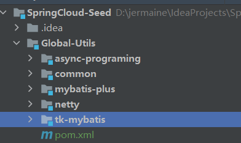
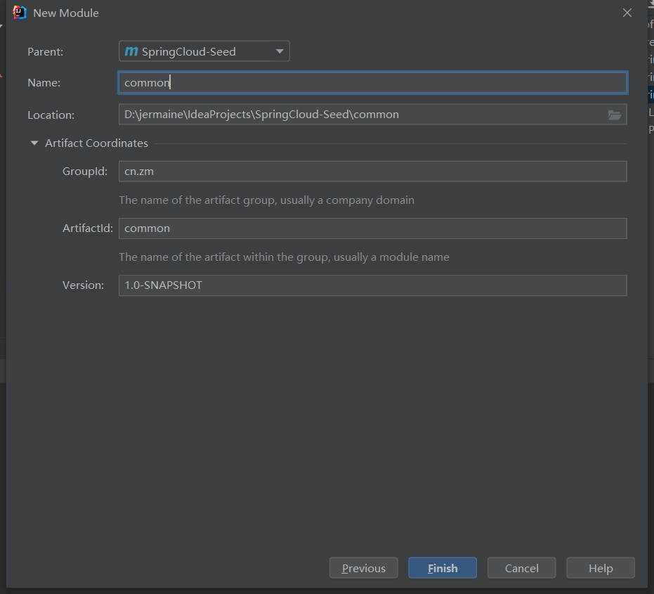
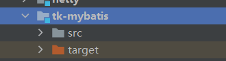
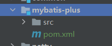
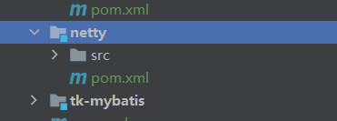

### 全局工具项目Global-Utils

此模块名字随意,后面也可以更改的,能准确表达此模块的用意即可,此模块方便后续的开发模块依赖,免得每个项目都需要重新依赖一套.

- common
  - druid线程池
  - 基础配置基本类,基本响应全局异常捕获等
  - knife4j
- netty
- mybatis-plus
- tk-mybatis

#### 整体目录架构图

> 里面包含一些工具类, 持久类框架, ws 服务等

#### common公共工具模块

~~~xml
<?xml version="1.0" encoding="UTF-8"?>
<project xmlns="http://maven.apache.org/POM/4.0.0"
         xmlns:xsi="http://www.w3.org/2001/XMLSchema-instance"
         xsi:schemaLocation="http://maven.apache.org/POM/4.0.0 http://maven.apache.org/xsd/maven-4.0.0.xsd">
    <parent>
        <artifactId>Global-Utils</artifactId>
        <groupId>cn.zm</groupId>
        <version>1.0-SNAPSHOT</version>
    </parent>
    <modelVersion>4.0.0</modelVersion>

    <artifactId>common</artifactId>

    <description>公共工具模块</description>

    <properties>
        <maven.compiler.source>8</maven.compiler.source>
        <maven.compiler.target>8</maven.compiler.target>
        <!--<mysql.version>8.0.22</mysql.version>-->
        <!--<commons-lang3.version>3.10</commons-lang3.version>-->
        <druid.version>1.1.22</druid.version>
        <!--<lombok.version>1.18.16</lombok.version>-->
        <hutool.version>5.3.10</hutool.version>
        <knife4j.version>2.0.7</knife4j.version>
        <fastjson.version>1.2.58</fastjson.version>
    </properties>

    <dependencies>
        <!-- mysql-connector -->
        <dependency>
            <groupId>mysql</groupId>
            <artifactId>mysql-connector-java</artifactId>
            <!--<version>${mysql.version}</version>-->
            <exclusions>
                <exclusion>
                    <groupId>com.google.protobuf</groupId>
                    <artifactId>protobuf-java</artifactId>
                </exclusion>
            </exclusions>
        </dependency>

        <!--druid线程池-->
        <dependency>
            <groupId>com.alibaba</groupId>
            <artifactId>druid-spring-boot-starter</artifactId>
            <version>${druid.version}</version>
        </dependency>

        <!--lombok-->
        <dependency>
            <groupId>org.projectlombok</groupId>
            <artifactId>lombok</artifactId>
            <!--<version>${lombok.version}</version>-->
            <!--<scope>compile</scope>-->
        </dependency>

        <!-- commons-lang3 -->
        <dependency>
            <groupId>org.apache.commons</groupId>
            <artifactId>commons-lang3</artifactId>
            <!--<version>${commons-lang3.version}</version>-->
        </dependency>

        <!-- web -->
        <dependency>
            <groupId>org.springframework.boot</groupId>
            <artifactId>spring-boot-starter-web</artifactId>
        </dependency>

        <!-- fastjson -->
        <dependency>
            <groupId>com.alibaba</groupId>
            <artifactId>fastjson</artifactId>
            <version>${fastjson.version}</version>
        </dependency>

        <!-- knife4j -->
        <dependency>
            <groupId>com.github.xiaoymin</groupId>
            <artifactId>knife4j-micro-spring-boot-starter</artifactId>
            <version>${knife4j.version}</version>
        </dependency>
        <dependency>
            <groupId>com.github.xiaoymin</groupId>
            <artifactId>knife4j-spring-boot-starter</artifactId>
            <version>${knife4j.version}</version>
        </dependency>

        <!-- hutool 工具 -->
        <dependency>
            <groupId>cn.hutool</groupId>
            <artifactId>hutool-all</artifactId>
            <version>${hutool.version}</version>
        </dependency>

        <!-- aop -->
        <dependency>
            <groupId>org.springframework.boot</groupId>
            <artifactId>spring-boot-starter-aop</artifactId>
        </dependency>
    </dependencies>

</project>
~~~

#### tk-mybatis模块

~~~xml
<?xml version="1.0" encoding="UTF-8"?>
<project xmlns="http://maven.apache.org/POM/4.0.0"
         xmlns:xsi="http://www.w3.org/2001/XMLSchema-instance"
         xsi:schemaLocation="http://maven.apache.org/POM/4.0.0 http://maven.apache.org/xsd/maven-4.0.0.xsd">
    <parent>
        <artifactId>SpringCloud-Seed</artifactId>
        <groupId>cn.zm</groupId>
        <version>1.0-SNAPSHOT</version>
        <!--<relativePath/> &lt;!&ndash; lookup parent from repository &ndash;&gt;-->
    </parent>
    <modelVersion>4.0.0</modelVersion>

    <artifactId>Global-Utils</artifactId>

    <packaging>pom</packaging>

    <description>全局工具模块</description>
    <modules>
        <module>common</module>
        <module>tk-mybatis</module>
        <module>mybatis-plus</module>
        <module>netty</module>
        <module>async-programing</module>
    </modules>
    <properties>
        <maven.compiler.source>8</maven.compiler.source>
        <maven.compiler.target>8</maven.compiler.target>
        <base.version>1.0-SNAPSHOT</base.version>
    </properties>

    <dependencyManagement>
        <dependencies>
            <dependency>
                <groupId>cn.zm</groupId>
                <artifactId>common</artifactId>
                <version>${base.version}</version>
            </dependency>
            <dependency>
                <groupId>cn.zm</groupId>
                <artifactId>mybatis-plus</artifactId>
                <version>${base.version}</version>
            </dependency>
            <dependency>
                <groupId>cn.zm</groupId>
                <artifactId>tk-mybatis</artifactId>
                <version>${base.version}</version>
            </dependency>
        </dependencies>
    </dependencyManagement>

</project>
~~~

#### mybatis-plus模块

#### 

~~~xml
<?xml version="1.0" encoding="UTF-8"?>
<project xmlns="http://maven.apache.org/POM/4.0.0"
         xmlns:xsi="http://www.w3.org/2001/XMLSchema-instance"
         xsi:schemaLocation="http://maven.apache.org/POM/4.0.0 http://maven.apache.org/xsd/maven-4.0.0.xsd">
    <parent>
        <artifactId>Global-Utils</artifactId>
        <groupId>cn.zm</groupId>
        <version>1.0-SNAPSHOT</version>
    </parent>
    <modelVersion>4.0.0</modelVersion>

    <artifactId>mybatis-plus</artifactId>
    <packaging>jar</packaging>

    <properties>
        <maven.compiler.source>8</maven.compiler.source>
        <maven.compiler.target>8</maven.compiler.target>
        <mybatis-plus.version>3.2.0</mybatis-plus.version>
        <!--<freemarker.version>1.1.22</freemarker.version>-->
    </properties>

    <dependencies>
        <!--公共模块-->
        <dependency>
            <groupId>cn.zm</groupId>
            <artifactId>common</artifactId>
        </dependency>

        <!--mybatis-plus -->
        <dependency>
            <groupId>com.baomidou</groupId>
            <artifactId>mybatis-plus-boot-starter</artifactId>
            <version>${mybatis-plus.version}</version>
        </dependency>

        <!--代码生成相关依赖-->
        <dependency>
            <groupId>com.baomidou</groupId>
            <artifactId>mybatis-plus-generator</artifactId>
            <version>${mybatis-plus.version}</version>
            <scope>compile</scope>
        </dependency>

        <!--freemarker模板引擎-->
        <dependency>
            <groupId>org.springframework.boot</groupId>
            <artifactId>spring-boot-starter-freemarker</artifactId>
            <!--<version>${freemarker.version}</version>-->
            <scope>compile</scope>
        </dependency>
    </dependencies>

</project>
~~~

#### netty模块

~~~xml
<?xml version="1.0" encoding="UTF-8"?>
<project xmlns="http://maven.apache.org/POM/4.0.0"
         xmlns:xsi="http://www.w3.org/2001/XMLSchema-instance"
         xsi:schemaLocation="http://maven.apache.org/POM/4.0.0 http://maven.apache.org/xsd/maven-4.0.0.xsd">
    <parent>
        <artifactId>Global-Utils</artifactId>
        <groupId>cn.zm</groupId>
        <version>1.0-SNAPSHOT</version>
    </parent>
    <modelVersion>4.0.0</modelVersion>

    <packaging>jar</packaging>

    <artifactId>netty</artifactId>

    <dependencies>
        <dependency>
            <groupId>cn.zm</groupId>
            <artifactId>common</artifactId>
        </dependency>
        <!--netty-->
        <dependency>
            <groupId>io.netty</groupId>
            <artifactId>netty-all</artifactId>
        </dependency>
    </dependencies>

</project>
~~~

### 
