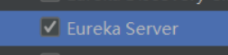
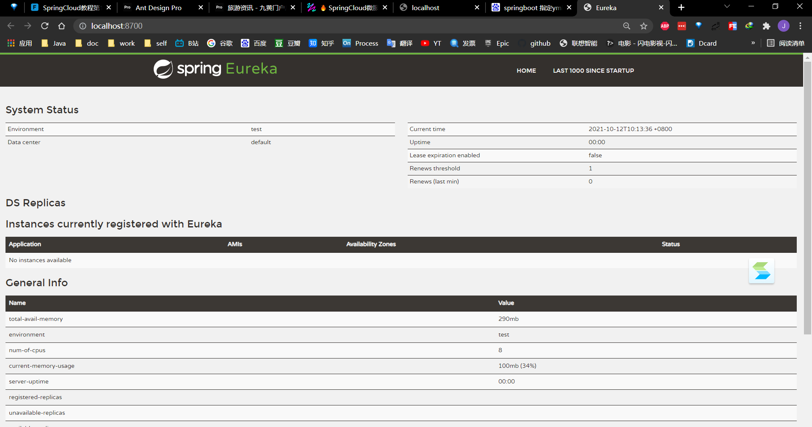
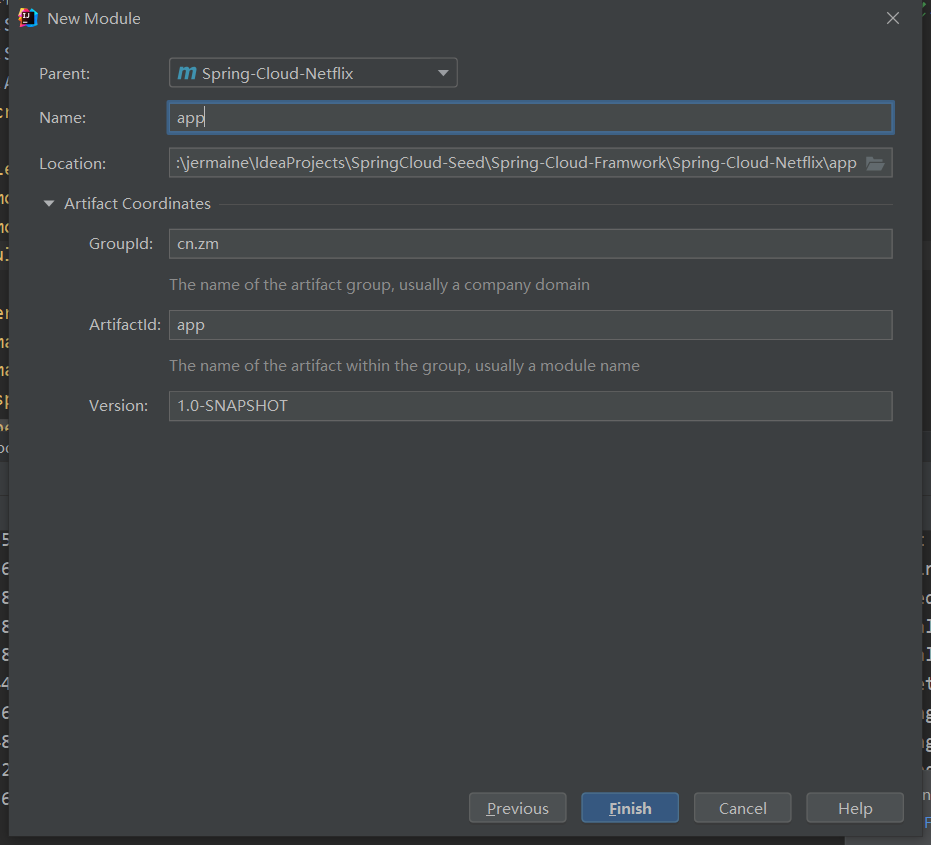
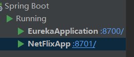
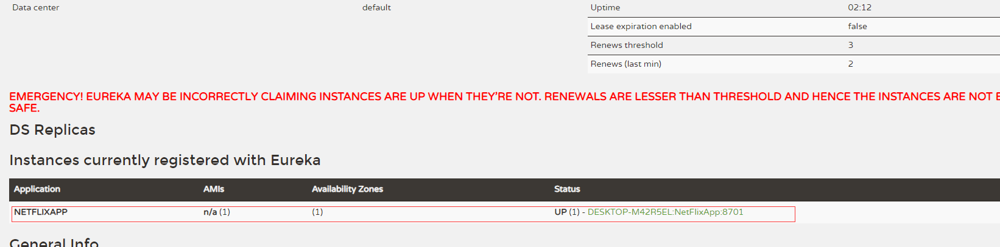
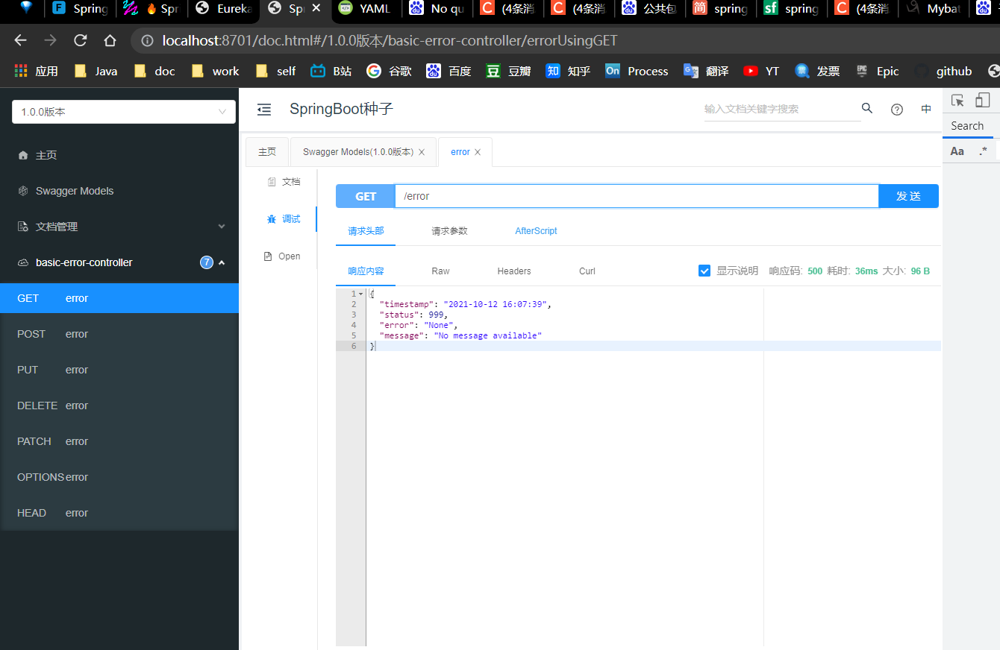
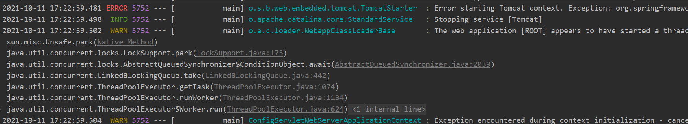
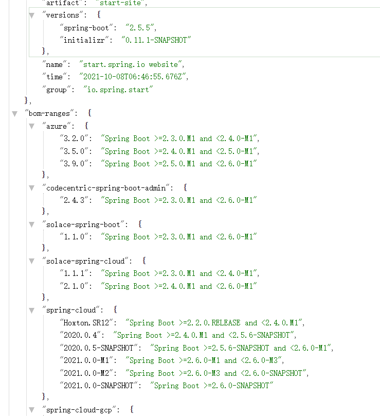

# Eureka服务注册中心模块

在这里，我们需要用的的组件上Spring Cloud Netflix的Eureka ,eureka是一个服务注册和发现模块。


下一步->选择 


### 启动一个服务注册中心

~~~
package cn.zm.eureka;

import org.springframework.boot.SpringApplication;
import org.springframework.boot.autoconfigure.SpringBootApplication;
import org.springframework.cloud.netflix.eureka.server.EnableEurekaServer;

// 启动一个服务注册中心，只需要一个注解@EnableEurekaServer，这个注解需要在springboot工程的启动application类上加：
@EnableEurekaServer
@SpringBootApplication
public class EurekaApplication {
    public static void main(String[] args) {
        SpringApplication.run(EurekaApplication.class, args);
    }

}

~~~

eureka是一个高可用的组件，它没有后端缓存，每一个实例注册之后需要向注册中心发送心跳（因此可以在内存中完成），在默认情况下erureka server也是一个eureka client ,必须要指定一个 server。eureka server的配置文件appication.yml：

### yml配置

- 避免在注册中心注册自己

registerWithEureka: false
fetchRegistry: false

~~~yml
server:
  port: 8700
eureka:
  instance:
    hostname: eureka-server
  client:
    registerWithEureka: false
    fetchRegistry: false
    serviceUrl:
      defaultZone: http://${eureka.instance.hostname}:${server.port}/eureka/
~~~

### 启动测试服务

输入http://localhost:8700/ 正常启动



### 创建一个服务提供者

这里在netflix模块下创建一个mybatis的web应用测试



#### 引入mybatis-plus模块此模块也包含了common通用模块

~~~xml
<?xml version="1.0" encoding="UTF-8"?>
<project xmlns="http://maven.apache.org/POM/4.0.0"
         xmlns:xsi="http://www.w3.org/2001/XMLSchema-instance"
         xsi:schemaLocation="http://maven.apache.org/POM/4.0.0 http://maven.apache.org/xsd/maven-4.0.0.xsd">
    <parent>
        <artifactId>Spring-Cloud-Netflix</artifactId>
        <groupId>cn.zm</groupId>
        <version>1.0-SNAPSHOT</version>
    </parent>
    <modelVersion>4.0.0</modelVersion>

    <artifactId>NetFlixApp</artifactId>

    <properties>
        <maven.compiler.source>8</maven.compiler.source>
        <maven.compiler.target>8</maven.compiler.target>
        <spring-cloud.version></spring-cloud.version>
    </properties>

    <dependencies>
        <dependency>
            <groupId>cn.zm</groupId>
            <artifactId>mybatis-plus</artifactId>
        </dependency>
		<!--eureka client-->
        <dependency>
            <groupId>org.springframework.cloud</groupId>
            <artifactId>spring-cloud-starter-netflix-eureka-client</artifactId>
        </dependency>
    </dependencies>


</project>
~~~

#### 开启eureka客户实例

@EnableEurekaClient 仅需一句既可开启客户端

~~~java
package cn.zm.netflix.app;

import org.springframework.boot.SpringApplication;
import org.springframework.boot.autoconfigure.SpringBootApplication;
import org.springframework.cloud.netflix.eureka.EnableEurekaClient;

@EnableEurekaClient
@SpringBootApplication(scanBasePackages = {"cn.zm.common.config", "cn.zm.plus.config"})
public class NetFlixApp {
    public static void main(String[] args) {
        SpringApplication.run(NetFlixApp.class, args);
    }
}
~~~

#### 启动client





可以看到client已经在注册中心注册实例

**需要注意的事项**

可以用一下代码指定加载公共依赖模块的组件这样应用模块就可以不用再写配置了,多个应用模块依赖统一个组件,一次构建处处开发.

```java
@SpringBootApplication(scanBasePackages = {"cn.zm.common.config", "cn.zm.plus.config"})
```

#### client端的swagger

正常访问



### 可能遇到的错误



~~~java
 Error starting Tomcat context. Exception: org.springframework.beans.factory.BeanCreationException. Message: Error creating bean with name 'servletEndpointRegistrar' defined in class path resource [org/springframework/boot/actuate/autoconfigure/endpoint/web/ServletEndpointManagementContextConfiguration$WebMvcServletEndpointManagementContextConfiguration.class]: Bean instantiation via factory method failed; nested exception is org.springframework.beans.BeanInstantiationException: Failed to instantiate [org.springframework.boot.actuate.endpoint.web.ServletEndpointRegistrar]: Factory method 'servletEndpointRegistrar' threw exception; nested exception is org.springframework.beans.factory.UnsatisfiedDependencyException: Error creating bean with name 'refreshEndpoint' defined in class path resource [org/springframework/cloud/autoconfigure/RefreshEndpointAutoConfiguration$RefreshEndpointConfiguration.class]: Unsatisfied dependency expressed through method 'refreshEndpoint' parameter 0; nested exception is org.springframework.beans.factory.BeanCreationException: Error creating bean with name 'configDataContextRefresher' defined in class path resource [org/springframework/cloud/autoconfigure/RefreshAutoConfiguration.class]: Post-processing of merged bean definition failed; nested exception is java.lang.IllegalStateException: Failed to introspect Class [org.springframework.cloud.context.refresh.ConfigDataContextRefresher] from ClassLoader [sun.misc.Launcher$AppClassLoader@18b4aac2]

~~~

提示tomcat无法正常启动

原因: springboot的版本与springcloud的版本不匹配造成的

解决: 找到对应的springboot版本对应的springcloud版本修改即可



原xml配置:

~~~xml
    <properties>
        <java.version>1.8</java.version>
        <project.build.sourceEncoding>UTF-8</project.build.sourceEncoding>
        <project.reporting.outputEncoding>UTF-8</project.reporting.outputEncoding>
        <spring-cloud.version>2020.0.4</spring-cloud.version>
    </properties>
~~~

修改为:

~~~xml
    <properties>
        <java.version>1.8</java.version>
        <project.build.sourceEncoding>UTF-8</project.build.sourceEncoding>
        <project.reporting.outputEncoding>UTF-8</project.reporting.outputEncoding>
        <spring-cloud.version>Hoxton.SR12</spring-cloud.version>
    </properties>
~~~

参考资料:

> https://start.spring.io/actuator/info 含有所有springcloud对应springboot对应版本
>
> https://www.fangzhipeng.com/springcloud/2017/06/01/sc01-eureka.html eureka的教程


