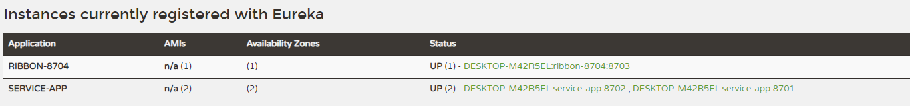
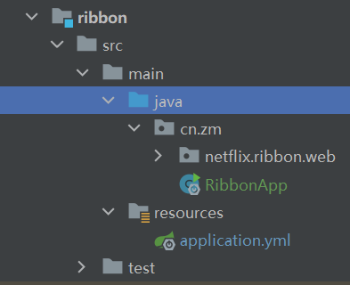
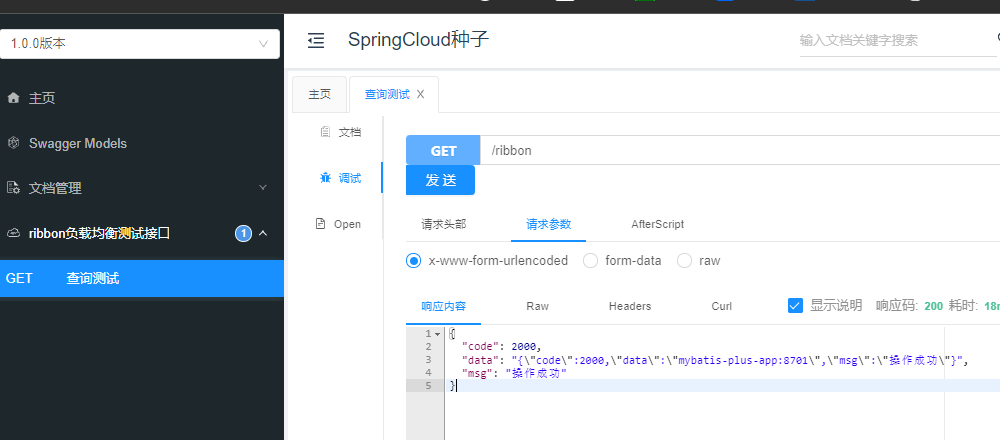
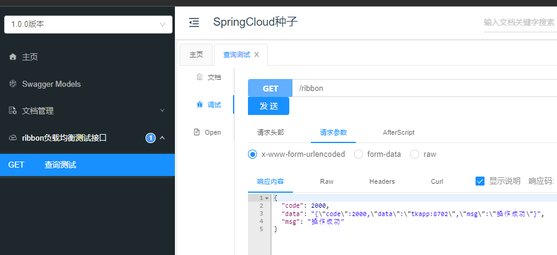

在微服务架构中，业务都会被拆分成一个独立的服务，服务与服务的通讯是基于http restful的。Spring cloud有两种服务调用方式，一种是ribbon+restTemplate，另一种是feign。在这一篇文章首先讲解下基于ribbon+rest。

# ribbon

简介:   Spring Cloud Ribbon是一个基于HTTP和TCP的客户端负载均衡工具，它基于Netflix Ribbon实现。通过Spring Cloud的封装，可以让我们轻松地将面向服务的REST模版请求自动转换成客户端负载均衡的服务调用。Spring Cloud Ribbon虽然只是一个工具类框架，它不像服务注册中心、配置中心、API网关那样需要独立部署，但是它几乎存在于每一个Spring Cloud构建的微服务和基础设施中。因为微服务间的调用，API网关的请求转发等内容，实际上都是通过Ribbon来实现的，包括后续我们将要介绍的Feign，它也是基于Ribbon实现的工具。所以，对Spring Cloud Ribbon的理解和使用，对于我们使用Spring Cloud来构建微服务非常重要。


## 建立生产者项目

将之前的tk和plus两个项目的配置修改成同一个服务名称

### TK项目暴露在8702端口

~~~yml
server:
  port: 8702
spring:
  profiles:
    active: common, tk
  application:
    name: service-app

logging:
  level:
    cn.zm: debug

# eureka
eureka:
  client:
    serviceUrl:
      defaultZone: http://localhost:8700/eureka/
~~~


编写一个服务接口

~~~java
package cn.zm.netflix.mybatisplus.web.rest;

import cn.zm.common.base.ResponseResult;
import cn.zm.netflix.mybatisplus.web.entity.dto.AccountDTO;
import cn.zm.netflix.mybatisplus.web.entity.vo.AccountVO;
import cn.zm.netflix.mybatisplus.web.service.IAccountService;
import org.springframework.beans.factory.annotation.Value;
import org.springframework.web.bind.annotation.RestController;
import cn.zm.plus.base.BaseController;
import com.baomidou.mybatisplus.core.metadata.IPage;
import io.swagger.annotations.ApiImplicitParam;
import io.swagger.annotations.ApiImplicitParams;
import io.swagger.annotations.ApiOperation;
import io.swagger.annotations.Api;
import org.springframework.validation.annotation.Validated;
import org.springframework.web.bind.annotation.*;
import javax.annotation.Resource;
import javax.management.MalformedObjectNameException;
import javax.management.ObjectName;
import java.lang.management.ManagementFactory;
import java.util.Objects;

/**
 * 
 * @author 十渊
 * @since 2021-10-12
 */
@RequestMapping("account")
@RestController
@Api(tags = "用户表")
public class AccountController extends BaseController {
    @Value("${server.port}")
    private String port;

    @GetMapping("ribbon/service")
    @ApiOperation("负载均衡测试")
    public ResponseResult ribbonService() {
        // TODO 负载均衡测试
        return ResponseResult.succ("mybatis-plus-app:"+port);
    }


}

~~~

### plus项目暴露在8701端口

~~~yml
server:
  port: 8701
spring:
  profiles:
    active: common, plus
  application:
    name: service-app

logging:
  level:
    cn.zm: debug

# eureka
eureka:
  client:
    serviceUrl:
      defaultZone: http://localhost:8700/eureka/

~~~

编写一个服务接口

~~~java
package cn.zm.netflix.tkmybatis.web.rest;

import cn.hutool.core.util.ArrayUtil;
import cn.zm.common.base.ResponseResult;
import cn.zm.netflix.tkmybatis.web.entity.Account;
import cn.zm.netflix.tkmybatis.web.entity.dto.AccountDTO;
import cn.zm.netflix.tkmybatis.web.entity.vo.AccountVO;
import cn.zm.netflix.tkmybatis.web.mapper.AccountMapper;
import cn.zm.netflix.tkmybatis.web.service.IAccountService;
import cn.zm.tk.utils.ConvertUtil;
import cn.zm.tk.utils.PageResult;
import org.springframework.beans.factory.annotation.Autowired;
import org.springframework.beans.factory.annotation.Qualifier;
import org.springframework.beans.factory.annotation.Value;
import org.springframework.web.bind.annotation.RestController;
import cn.zm.tk.base.BaseController;
import java.util.stream.Collectors;
import com.github.pagehelper.Page;
import io.swagger.annotations.ApiImplicitParam;
import io.swagger.annotations.ApiImplicitParams;
import io.swagger.annotations.ApiOperation;
import io.swagger.annotations.Api;
import org.springframework.validation.annotation.Validated;
import org.springframework.web.bind.annotation.*;
import javax.annotation.Resource;
import java.util.Objects;
import java.util.List;


/**
 * 
 * @author 十渊
 * @since 2021-10-13
 */
@RequestMapping("account")
@RestController
@Api(tags = "接口")
public class AccountController extends BaseController {
    @Value("${server.port}")
    private String port;

    @GetMapping("ribbon/service")
    @ApiOperation("负载均衡测试")
    public ResponseResult ribbonService() {
        // TODO 负载均衡测试
        return ResponseResult.succ("tkapp:"+port);
    }
}
~~~

多个实例服务准备好了



## 建立消费者项目

### ribbon项目



pom文件配置如下

~~~xml
<?xml version="1.0" encoding="UTF-8"?>
<project xmlns="http://maven.apache.org/POM/4.0.0"
         xmlns:xsi="http://www.w3.org/2001/XMLSchema-instance"
         xsi:schemaLocation="http://maven.apache.org/POM/4.0.0 http://maven.apache.org/xsd/maven-4.0.0.xsd">
    <parent>
        <artifactId>Spring-Cloud-Netflix</artifactId>
        <groupId>cn.zm</groupId>
        <version>1.0-SNAPSHOT</version>
    </parent>
    <modelVersion>4.0.0</modelVersion>

    <artifactId>ribbon</artifactId>

    <properties>
        <maven.compiler.source>8</maven.compiler.source>
        <maven.compiler.target>8</maven.compiler.target>
    </properties>

    <dependencies>
        <!--统一依赖-->
        <dependency>
            <groupId>cn.zm</groupId>
            <artifactId>common</artifactId>
            <exclusions>
                <exclusion>
                    <groupId>com.alibaba</groupId>
                    <artifactId>druid-spring-boot-starter</artifactId>
                </exclusion>
            </exclusions>
        </dependency>

        <!--ribbon 负载均衡依赖客户端集成-->
        <dependency>
            <groupId>org.springframework.cloud</groupId>
            <artifactId>spring-cloud-starter-netflix-ribbon</artifactId>
        </dependency>

        <!--eureka client-->
        <dependency>
            <groupId>org.springframework.cloud</groupId>
            <artifactId>spring-cloud-starter-netflix-eureka-client</artifactId>
        </dependency>

        <!-- 导入配置文件处理器，配置文件进行绑定就会有提示 -->
        <dependency>
            <groupId>org.springframework.boot</groupId>
            <artifactId>spring-boot-configuration-processor</artifactId>
        </dependency>
    </dependencies>
</project>
~~~

#### RibbonApp 启动项目

```java
package cn.zm;

import org.springframework.boot.SpringApplication;
import org.springframework.boot.autoconfigure.SpringBootApplication;
import org.springframework.cloud.client.discovery.EnableDiscoveryClient;
import org.springframework.cloud.client.loadbalancer.LoadBalanced;
import org.springframework.context.annotation.Bean;
import org.springframework.web.client.RestTemplate;

// 在工程的启动类中,通过@EnableDiscoveryClient向服务中心注册
@EnableDiscoveryClient
@SpringBootApplication
public class RibbonApp {
    public static void main(String[] args) {
        SpringApplication.run(RibbonApp.class, args);
    }

    /** 功能描述: <br>
     * <向程序的ioc注入一个bean: restTemplate;
     * 并通过@LoadBalanced注解表明这个restRemplate
     * 开启负载均衡的功能。>
     *
     * @param
     *
     * @author 倪子铭
     * @date 2021/10/18 10:16
     * @return org.springframework.web.client.RestTemplate
     */
    @Bean
    @LoadBalanced
    RestTemplate restTemplate () {
        return new RestTemplate();
    }
}
```

服务层接口

```java
package cn.zm.netflix.ribbon.web.service;

public interface RibbonService {
    String consume();
}
```

实现类

```java
package cn.zm.netflix.ribbon.web.service.impl;

import cn.zm.netflix.ribbon.web.service.RibbonService;
import org.springframework.stereotype.Service;
import org.springframework.web.client.RestTemplate;

import javax.annotation.Resource;

@Service
public class RibbonServiceImpl implements RibbonService {
    @Resource
    RestTemplate restTemplate;

    @Override
    public String consume() {
        return restTemplate.getForObject("http://SERVICE-APP/account/ribbon/service", String.class);
    }
}
```

控制层

```java
package cn.zm.netflix.ribbon.web.rest;

import cn.zm.common.base.ResponseResult;
import cn.zm.netflix.ribbon.web.service.RibbonService;
import org.springframework.web.bind.annotation.RestController;
import io.swagger.annotations.ApiOperation;
import io.swagger.annotations.Api;
import org.springframework.web.bind.annotation.*;

import javax.annotation.Resource;

/**
 * 
 * @author 十渊
 * @since 2021-10-12
 */
@RequestMapping("ribbon")
@RestController
@Api(tags = "ribbon负载均衡测试接口")
public class RibbonController {
    @Resource
    RibbonService ribbonService;

    @GetMapping
    @ApiOperation("查询测试")
    public ResponseResult get() {
        return ResponseResult.succ(ribbonService.consume());
    }

}
```

### 测试负载均衡

点击调用负载均衡测试接口



再次点击



### 参考资料

> https://www.jianshu.com/p/1bd66db5dc46
>
> https://blog.didispace.com/springcloud2/
>
> https://www.fangzhipeng.com/springcloud/2017/06/02/sc02-rest-ribbon.html
>
> https://projects.spring.io/spring-cloud/spring-cloud.html#spring-cloud-ribbon

