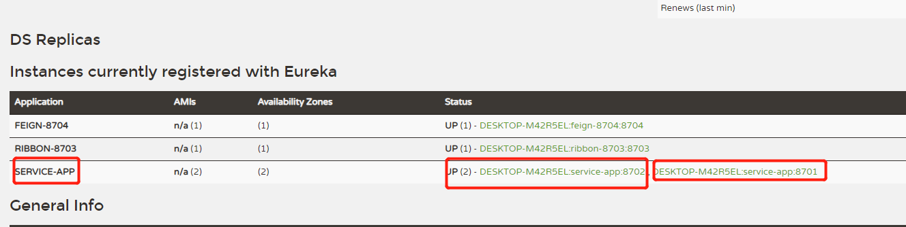
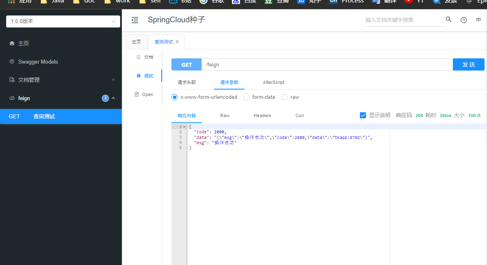
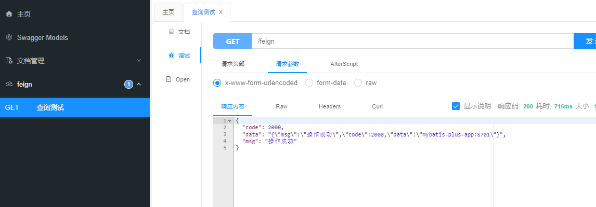
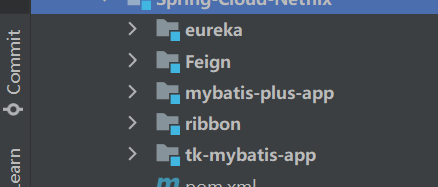
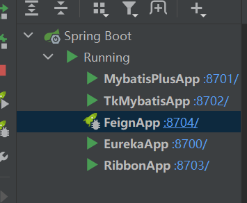

# SpringCloud微服务系列03-Netflix架构03-feign

## Springboot整合 openfeign(基于最新Hoxton.SR8)

### 新建feign模块

整合统一依赖,避免重复配置

~~~xml
<?xml version="1.0" encoding="UTF-8"?>
<project xmlns="http://maven.apache.org/POM/4.0.0"
         xmlns:xsi="http://www.w3.org/2001/XMLSchema-instance"
         xsi:schemaLocation="http://maven.apache.org/POM/4.0.0 http://maven.apache.org/xsd/maven-4.0.0.xsd">
    <parent>
        <artifactId>Spring-Cloud-Netflix</artifactId>
        <groupId>cn.zm</groupId>
        <version>1.0-SNAPSHOT</version>
    </parent>
    <modelVersion>4.0.0</modelVersion>

    <artifactId>Feign</artifactId>

    <properties>
        <maven.compiler.source>8</maven.compiler.source>
        <maven.compiler.target>8</maven.compiler.target>
    </properties>

    <dependencies>
        <!--统一依赖-->
        <dependency>
            <groupId>cn.zm</groupId>
            <artifactId>common</artifactId>
            <exclusions>
                <exclusion>
                    <groupId>com.alibaba</groupId>
                    <artifactId>druid-spring-boot-starter</artifactId>
                </exclusion>
            </exclusions>
        </dependency>

        <!--feign 依赖-->
        <dependency>
            <groupId>org.springframework.cloud</groupId>
            <artifactId>spring-cloud-starter-openfeign</artifactId>
        </dependency>

        <!--eureka client-->
        <dependency>
            <groupId>org.springframework.cloud</groupId>
            <artifactId>spring-cloud-starter-netflix-eureka-client</artifactId>
        </dependency>

        <!-- 导入配置文件处理器，配置文件进行绑定就会有提示 -->
        <dependency>
            <groupId>org.springframework.boot</groupId>
            <artifactId>spring-boot-configuration-processor</artifactId>
        </dependency>
    </dependencies>
</project>
~~~

### main 方法

~~~java
package cn.zm;

import org.springframework.boot.SpringApplication;
import org.springframework.boot.autoconfigure.SpringBootApplication;
import org.springframework.cloud.client.discovery.EnableDiscoveryClient;
import org.springframework.cloud.openfeign.EnableFeignClients;

// 在工程的启动类中,通过@EnableDiscoveryClient向服务中心注册
// @EnableFeignClients注解开启Feign的功能
@EnableFeignClients
@EnableDiscoveryClient
@SpringBootApplication
public class FeignApp {
    public static void main(String[] args) {
        SpringApplication.run(FeignApp.class, args);
    }
}

~~~

### feign服务

~~~java
package cn.zm.netflix.feign.web.service;

import org.springframework.cloud.openfeign.FeignClient;
import org.springframework.web.bind.annotation.GetMapping;

@FeignClient("SERVICE-APP")
public interface FeignService {
    @GetMapping("/account/ribbon/service")
    String testFeign();
}

~~~

### 控制层

~~~java
package cn.zm.netflix.feign.web.rest;

import cn.zm.common.base.ResponseResult;
import cn.zm.netflix.feign.web.service.FeignService;
import io.swagger.annotations.Api;
import io.swagger.annotations.ApiOperation;
import org.springframework.web.bind.annotation.GetMapping;
import org.springframework.web.bind.annotation.RequestMapping;
import org.springframework.web.bind.annotation.RestController;

import javax.annotation.Resource;

/**
 * 
 * @author 十渊
 * @since 2021-10-12
 */
@RequestMapping("feign")
@RestController
@Api(tags = "feign")
public class FeignController {
    @Resource
    FeignService feignService;

    @GetMapping
    @ApiOperation("查询测试")
    public ResponseResult get() {
        return ResponseResult.succ(feignService.testFeign());
    }

}

~~~

### 调用服务测试

这里的服务开启的是之前测试使用的tkapp, 和mybatisapp.避免重新搭建项目麻烦.

再次点击负载均衡测试如下

### 整体目录结构

### 参考资料

> https://www.fangzhipeng.com/springcloud/2017/06/03/sc03-feign.html
>
> https://blog.csdn.net/asoklove/article/details/117191654

