# SpringCloud微服务系列03-Netflix架构04-Hystrix

## 熔断概念

- **服务熔断**：
       一般是指软件系统中，由于某些原因使得服务出现了过载现象，为防止造成整个系统故障，从而采用的一种保护措施，所以很多地方把熔断亦称为过载保护。很多时候刚开始可能只是系统出现了局部的、小规模的故障，然而由于种种原因，故障影响的范围越来越大，最终导致了全局性的后果。
  **适用场景**：防止应用程序直接调用那些很可能会调用失败的远程服务或共享资源

- **服务降级**:
       当服务器压力剧增的情况下，根据当前业务情况及流量对一些服务和页面有策略的降级，以此释放服务器资源以保证核心任务的正常运行

 ## Hystrix

 Hystrix 是一个帮助解决分布式系统交互时超时处理和容错的类库, 它同样拥有保护系统的能力。Netflix的众多开源项目之一。

## 准备工作

- Hystrix 项目包含feign,ribbon的依赖及实现
- 两个springapp启动服务生产者(在前面几个章节都一直在使用的项目)

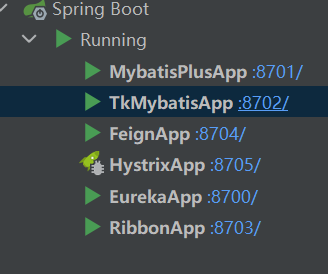

## 基于ribbon的熔断处理

新建一个项目测试熔断

```xml
<?xml version="1.0" encoding="UTF-8"?>
<project xmlns="http://maven.apache.org/POM/4.0.0"
         xmlns:xsi="http://www.w3.org/2001/XMLSchema-instance"
         xsi:schemaLocation="http://maven.apache.org/POM/4.0.0 http://maven.apache.org/xsd/maven-4.0.0.xsd">
    <parent>
        <artifactId>Spring-Cloud-Netflix</artifactId>
        <groupId>cn.zm</groupId>
        <version>1.0-SNAPSHOT</version>
    </parent>
    <modelVersion>4.0.0</modelVersion>

    <artifactId>Hystrix</artifactId>

    <properties>
        <maven.compiler.source>8</maven.compiler.source>
        <maven.compiler.target>8</maven.compiler.target>
    </properties>

    <dependencies>
        <!--统一依赖-->
        <dependency>
            <groupId>cn.zm</groupId>
            <artifactId>common</artifactId>
            <exclusions>
                <exclusion>
                    <groupId>com.alibaba</groupId>
                    <artifactId>druid-spring-boot-starter</artifactId>
                </exclusion>
            </exclusions>
        </dependency>

        <!--hystrix 熔断-->
        <dependency>
            <groupId>org.springframework.cloud</groupId>
            <artifactId>spring-cloud-starter-netflix-hystrix</artifactId>
        </dependency>

        <!-- eureka client 此包已包含 spring-cloud-netflix-hystrix -->
        <dependency>
            <groupId>org.springframework.cloud</groupId>
            <artifactId>spring-cloud-starter-netflix-eureka-client</artifactId>
            <!--<exclusions>-->
            <!--    <exclusion>-->
            <!--        <groupId>org.springframework.cloud</groupId>-->
            <!--        <artifactId>spring-cloud-netflix-hystrix</artifactId>-->
            <!--    </exclusion>-->
            <!--</exclusions>-->
        </dependency>

        <!-- 导入配置文件处理器，配置文件进行绑定就会有提示 -->
        <dependency>
            <groupId>org.springframework.boot</groupId>
            <artifactId>spring-boot-configuration-processor</artifactId>
        </dependency>

        <dependency>
            <groupId>org.springframework.boot</groupId>
            <artifactId>spring-boot-starter-actuator</artifactId>
        </dependency>
    </dependencies>

</project>
```

### yml配置

```yml
server:
  port: 8705
spring:
  profiles:
    active: common
  application:
    name: Hystrix-8705

logging:
  level:
    cn.zm: debug

# eureka
eureka:
  client:
    serviceUrl:
      defaultZone: http://localhost:8700/eureka/

#hystrix dashbroad
management:
  endpoints:
    web:
      exposure:
        include: "*"
```

### 启动类

```java
package cn.zm;

import org.springframework.boot.SpringApplication;
import org.springframework.boot.autoconfigure.SpringBootApplication;
import org.springframework.cloud.client.circuitbreaker.EnableCircuitBreaker;
import org.springframework.cloud.client.discovery.EnableDiscoveryClient;
import org.springframework.cloud.client.loadbalancer.LoadBalanced;
import org.springframework.cloud.netflix.hystrix.EnableHystrix;
// import org.springframework.cloud.netflix.hystrix.dashboard.EnableHystrixDashboard;
import org.springframework.context.annotation.Bean;
import org.springframework.web.client.RestTemplate;

// 在工程的启动类中,通过@EnableDiscoveryClient向服务中心注册
@EnableHystrix
@EnableDiscoveryClient
@SpringBootApplication
public class HystrixApp {
    public static void main(String[] args) {
        SpringApplication.run(HystrixApp.class, args);
    }

    @Bean
    @LoadBalanced
    RestTemplate restTemplate() {
        return new RestTemplate();
    }
}
```

### 基于ribbon服务层的熔断处理

```java
package cn.zm.netflix.hystrix.web.service;

public interface HystrixService {
    /** 功能描述: <br>
     * <ribbon方式的熔断处理>
     *
     * @param
     *
     * @author 十渊
     * @date 2021/10/22 9:49
     * @return java.lang.String
     */
    String ribbonHystrix();

    /** 功能描述: <br>
     * <熔断处理信息>
     *
     * @param
     *
     * @author 十渊
     * @date 2021/10/22 9:50
     * @return java.lang.String
     */
    String hystrixInfo();
}
```

### 实现类

```java
package cn.zm.netflix.hystrix.web.service.impl;

import cn.zm.netflix.hystrix.web.service.HystrixService;
import com.netflix.hystrix.contrib.javanica.annotation.HystrixCommand;
import org.springframework.stereotype.Service;
import org.springframework.web.client.RestTemplate;

import javax.annotation.Resource;

/**
 * @author 十渊
 */
@Service
public class HystrixServiceImpl implements HystrixService {
    @Resource
    RestTemplate restTemplate;
	
    @HystrixCommand(fallbackMethod = "hystrixInfo")
    @Override
    public String ribbonHystrix() {
        return restTemplate.getForObject("http://SERVICE-APP/account/ribbon/service", String.class);
    }

    @Override
    public String hystrixInfo() {
        return "{'info': 'hystrix handler'}";
    }
}
```

### 测试

- 服务启动时正常访问

  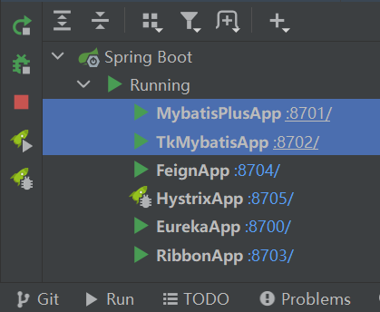

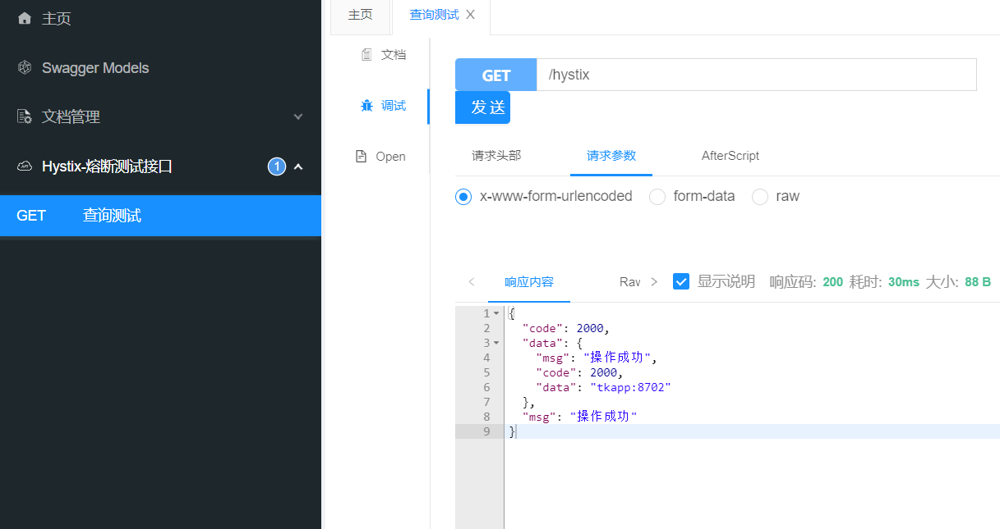

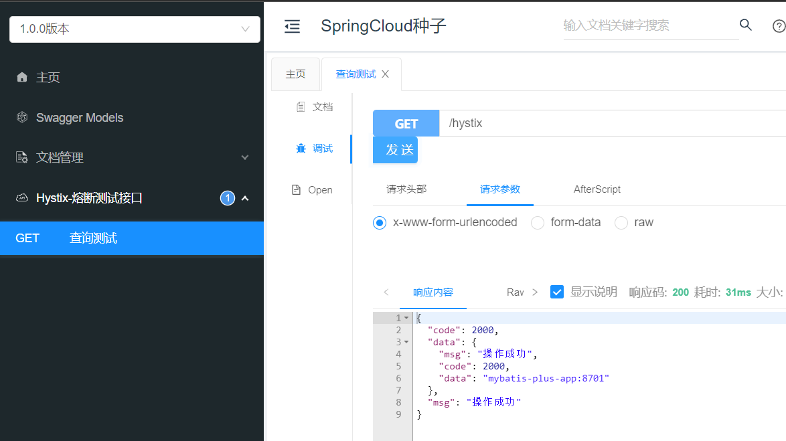

- 将服务停止

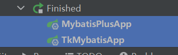

再次访问,熔断机制触发.

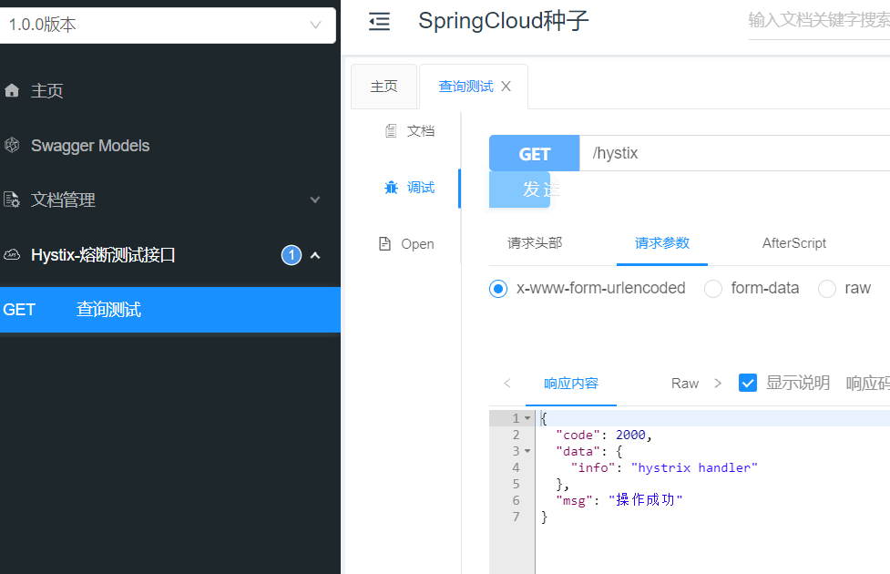

## 基于feign的熔断处理

feign自带熔断器的,所以模块采用之前的feign模块,追加配置

```yml
# Feign是自带断路器的,以下配置开启熔断器
feign:
  hystrix:
    enabled: true
```

### 新建 FeignHystrixService 服务

```java
package cn.zm.netflix.feign.web.service;

import cn.zm.netflix.feign.web.service.impl.HystrixHandler;
import org.springframework.cloud.openfeign.FeignClient;
import org.springframework.web.bind.annotation.GetMapping;

@FeignClient(value = "SERVICE-APP", fallback = HystrixHandler.class)
public interface FeignHystrixService {
    @GetMapping("/account/ribbon/service")
    String testHystrix();
}
```

### 实现类

```java
package cn.zm.netflix.feign.web.service.impl;

import cn.zm.netflix.feign.web.service.FeignHystrixService;
import org.springframework.stereotype.Component;

@Component
public class HystrixHandler implements FeignHystrixService {
    @Override
    public String testHystrix() {
        return "{'info': 'hystrix feign'}";
    }
}
```

### 启动会报一个错误

~~~log
  .   ____          _            __ _ _
 /\\ / ___'_ __ _ _(_)_ __  __ _ \ \ \ \
( ( )\___ | '_ | '_| | '_ \/ _` | \ \ \ \
 \\/  ___)| |_)| | | | | || (_| |  ) ) ) )
  '  |____| .__|_| |_|_| |_\__, | / / / /
 =========|_|==============|___/=/_/_/_/
 :: Spring Boot ::        (v2.2.4.RELEASE)

2021-10-22 15:37:27.454  INFO 19208 --- [           main] cn.zm.FeignApp                           : The following profiles are active: common
2021-10-22 15:37:28.047  WARN 19208 --- [           main] ConfigServletWebServerApplicationContext : Exception encountered during context initialization - cancelling refresh attempt: org.springframework.beans.factory.support.BeanDefinitionOverrideException: Invalid bean definition with name 'SERVICE-APP.FeignClientSpecification' defined in null: Cannot register bean definition [Generic bean: class [org.springframework.cloud.openfeign.FeignClientSpecification]; scope=; abstract=false; lazyInit=null; autowireMode=0; dependencyCheck=0; autowireCandidate=true; primary=false; factoryBeanName=null; factoryMethodName=null; initMethodName=null; destroyMethodName=null] for bean 'SERVICE-APP.FeignClientSpecification': There is already [Generic bean: class [org.springframework.cloud.openfeign.FeignClientSpecification]; scope=; abstract=false; lazyInit=null; autowireMode=0; dependencyCheck=0; autowireCandidate=true; primary=false; factoryBeanName=null; factoryMethodName=null; initMethodName=null; destroyMethodName=null] bound.
2021-10-22 15:37:28.053  INFO 19208 --- [           main] ConditionEvaluationReportLoggingListener : 

Error starting ApplicationContext. To display the conditions report re-run your application with 'debug' enabled.
2021-10-22 15:37:28.056 ERROR 19208 --- [           main] o.s.b.d.LoggingFailureAnalysisReporter   : 

***************************
APPLICATION FAILED TO START
***************************

Description:

The bean 'SERVICE-APP.FeignClientSpecification' could not be registered. A bean with that name has already been defined and overriding is disabled.

Action:

Consider renaming one of the beans or enabling overriding by setting spring.main.allow-bean-definition-overriding=true


Process finished with exit code 1

~~~

解决yml添加

~~~yml
#允许存在多个Feign调用相同Service的接口
spring:
  main:
    #允许存在多个Feign调用相同Service的接口
    allow-bean-definition-overriding: true
~~~

### 控制层新增一个接口

```java
@Resource
FeignHystrixService feignHystrixService;

@GetMapping("hystrix")
@ApiOperation("feign 熔断器 查询测试")
public ResponseResult hystrix() {
    return ResponseResult.succ(JSON.parseObject(feignHystrixService.testHystrix()));
}
```

### 测试

接口正常访问

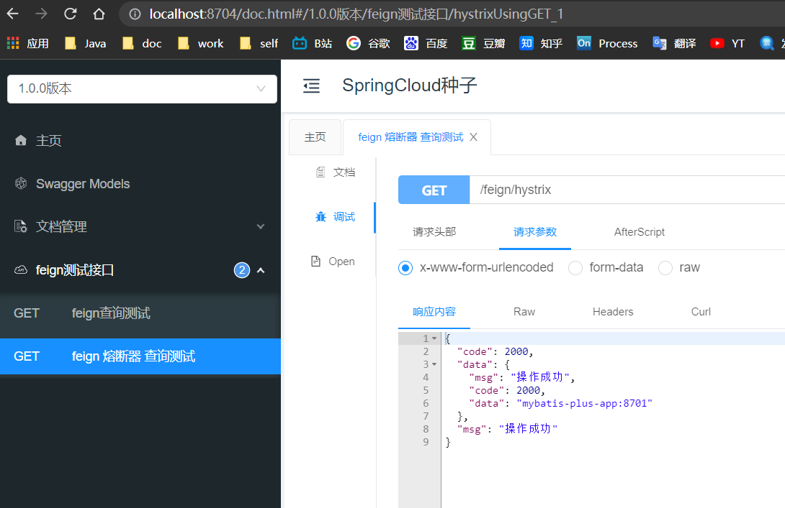


停止服务提供服务

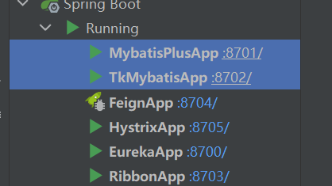

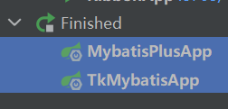

再次测试,熔断触发

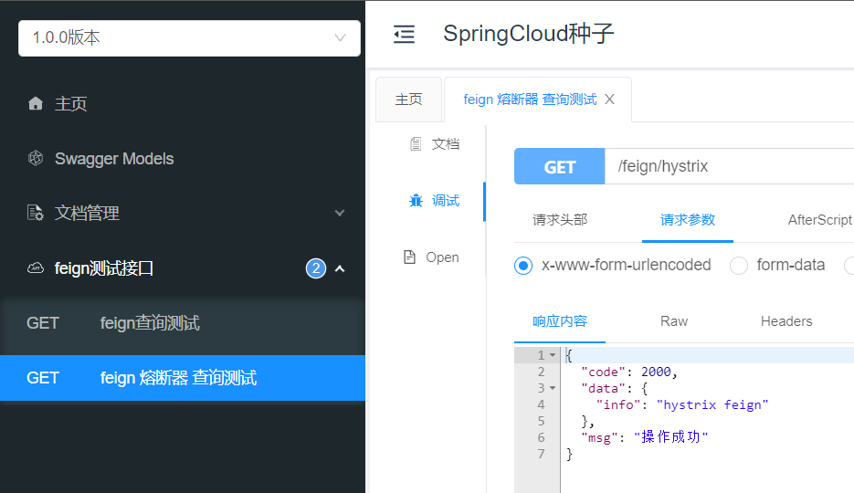

### 目录结构

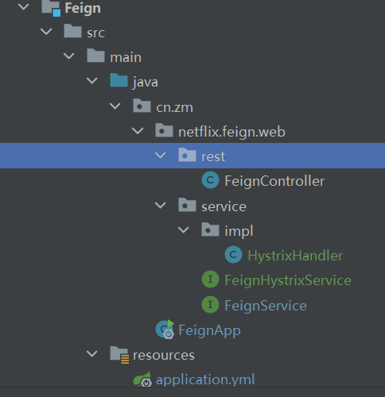


## Hystrix Dashboard (断路器：Hystrix 仪表盘)

还是使用hystrix 这个项目

### 依赖追加

```xml
<!--actuator-->
<dependency>
    <groupId>org.springframework.boot</groupId>
    <artifactId>spring-boot-starter-actuator</artifactId>
</dependency>
<!--hystrix-dashboard-->
<dependency>
    <groupId>org.springframework.cloud</groupId>
    <artifactId>spring-cloud-starter-netflix-hystrix-dashboard</artifactId>
</dependency>
```

在yml中加入配置

```yml
#hystrix dashbroad
management:
  endpoints:
    web:
      exposure:
        include: "*"

hystrix:
  dashboard:
    proxy-stream-allow-list: "localhost"
```

在主程序启动类中加入@EnableHystrixDashboard注解，开启hystrixDashboard：

`@EnableHystrixDashboard`

```java
package cn.zm;

import com.netflix.hystrix.contrib.metrics.eventstream.HystrixMetricsStreamServlet;
import org.springframework.boot.SpringApplication;
import org.springframework.boot.autoconfigure.SpringBootApplication;
import org.springframework.boot.web.servlet.ServletRegistrationBean;
import org.springframework.cloud.client.discovery.EnableDiscoveryClient;
import org.springframework.cloud.client.loadbalancer.LoadBalanced;
import org.springframework.cloud.netflix.hystrix.EnableHystrix;
import org.springframework.cloud.netflix.hystrix.dashboard.EnableHystrixDashboard;
import org.springframework.context.annotation.Bean;
import org.springframework.web.client.RestTemplate;

// 在工程的启动类中,通过@EnableDiscoveryClient向服务中心注册
// @EnableHystrix注解开启Hystrix：
@EnableHystrix
@EnableHystrixDashboard
@EnableDiscoveryClient
@SpringBootApplication
public class HystrixApp {
    public static void main(String[] args) {
        SpringApplication.run(HystrixApp.class, args);
    }

    @Bean
    @LoadBalanced
    RestTemplate restTemplate() {
        return new RestTemplate();
    }

    @Bean
    public ServletRegistrationBean getServlet() {
        HystrixMetricsStreamServlet streamServlet = new HystrixMetricsStreamServlet();
        ServletRegistrationBean registrationBean = new ServletRegistrationBean(streamServlet);
        registrationBean.setLoadOnStartup(1);
        registrationBean.addUrlMappings("/hystrix.stream");
        registrationBean.setName("HystrixMetricsStreamServlet");
        return registrationBean;
    }
}
```

访问http://localhost:8764/hystrix

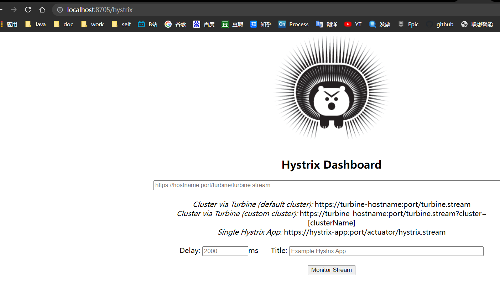

输入 http://localhost:8705/hystrix.stream title: test

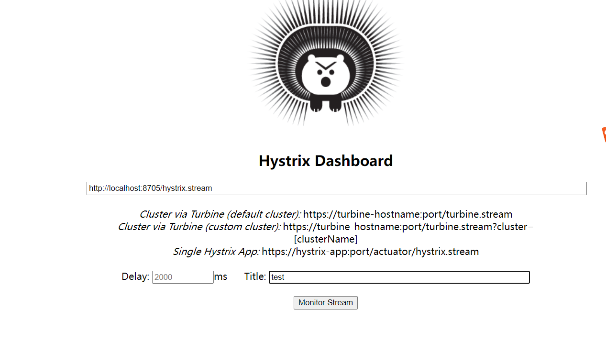

访问接口

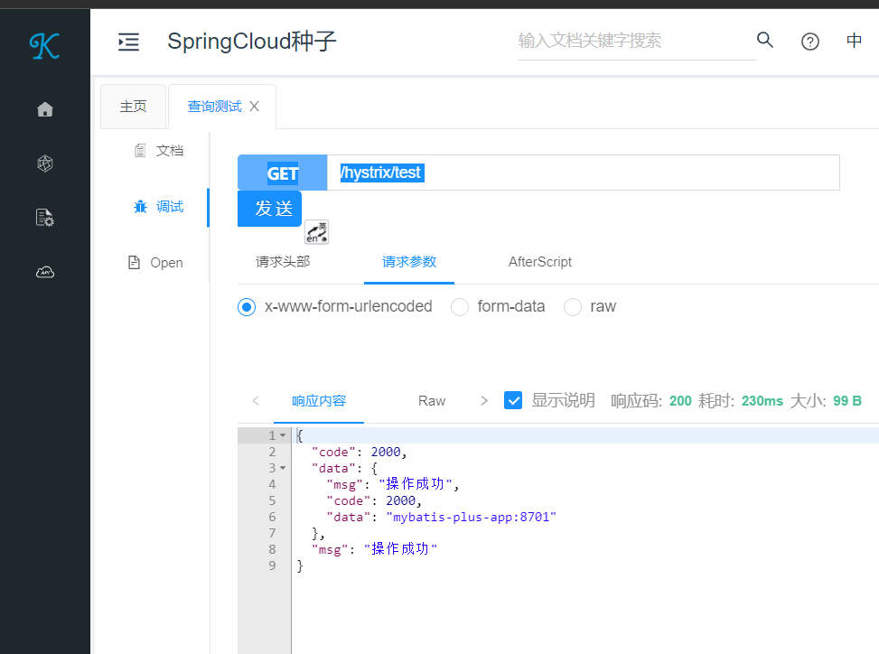

显示UI

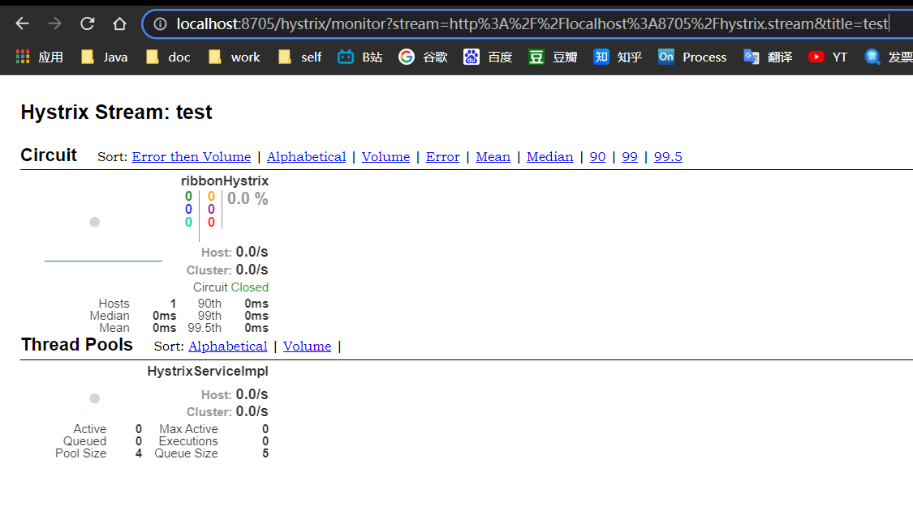

### 遇到的问题

~~~
ashboardConfiguration$ProxyStreamServlet : Failed opening connection to http://localhost:8091/hystrix.stream?delay=100 : 404 : HTTP/1.1 404 
~~~


在Application类中增加如下代码可以解决404问题

```java
  @Bean
  public ServletRegistrationBean getServlet() {
    HystrixMetricsStreamServlet streamServlet = new HystrixMetricsStreamServlet();
    ServletRegistrationBean registrationBean = new ServletRegistrationBean(streamServlet);
    registrationBean.setLoadOnStartup(1);
    registrationBean.addUrlMappings("/hystrix.stream");
    registrationBean.setName("HystrixMetricsStreamServlet");
    return registrationBean;
  }
```

## 引用资料

> https://github.com/niziming/SpringCloud-Seed.git // 此微服务配套源码
>
> https://www.fangzhipeng.com/springcloud/2017/06/04/sc04-hystrix.html
>
> https://blog.csdn.net/xTand/article/details/119282101
>
> https://www.dandelioncloud.cn/article/details/20201115220656324825
>
> 

