# SpringCloud微服务系列03-Netflix架构05-Zuul

## 简介

本篇将介绍API网关的基本概念、[Zuul](https://github.com/Netflix/zuul)网关的功能和工作机制。结合代码介绍如何使用Zuul构建一个简单的网关、介绍Zuul的路由配置方式、了解Filter工作原理并实现一些扩展功能。

Zuul是Spring Cloud全家桶中的微服务API网关。

所有从设备或网站来的请求都会经过Zuul到达后端的Netflix应用程序。作为一个边界性质的应用程序，Zuul提供了动态路由、监控、弹性负载和安全功能。Zuul底层利用各种filter实现如下功能：

- 认证和安全 识别每个需要认证的资源，拒绝不符合要求的请求。
- 性能监测 在服务边界追踪并统计数据，提供精确的生产视图。
- 动态路由 根据需要将请求动态路由到后端集群。
- 压力测试 逐渐增加对集群的流量以了解其性能。
- 负载卸载 预先为每种类型的请求分配容量，当请求超过容量时自动丢弃。
- 静态资源处理 直接在边界返回某些响应。

## 准备工作

继续使用之前的服务,然后新建一个zuul服务.

## 新建Zuul项目

xml里面有各个依赖的注释

~~~xml
<?xml version="1.0" encoding="UTF-8"?>
<project xmlns="http://maven.apache.org/POM/4.0.0"
         xmlns:xsi="http://www.w3.org/2001/XMLSchema-instance"
         xsi:schemaLocation="http://maven.apache.org/POM/4.0.0 http://maven.apache.org/xsd/maven-4.0.0.xsd">
    <parent>
        <artifactId>Spring-Cloud-Netflix</artifactId>
        <groupId>cn.zm</groupId>
        <version>1.0-SNAPSHOT</version>
    </parent>
    <modelVersion>4.0.0</modelVersion>

    <artifactId>Zuul</artifactId>

    <properties>
        <maven.compiler.source>8</maven.compiler.source>
        <maven.compiler.target>8</maven.compiler.target>
    </properties>

    <dependencies>
        <!--统一依赖-->
        <dependency>
            <groupId>cn.zm</groupId>
            <artifactId>common</artifactId>
            <exclusions>
                <exclusion>
                    <groupId>com.alibaba</groupId>
                    <artifactId>druid-spring-boot-starter</artifactId>
                </exclusion>
            </exclusions>
        </dependency>

        <!--zuul 依赖-->
        <dependency>
            <groupId>org.springframework.cloud</groupId>
            <artifactId>spring-cloud-starter-netflix-zuul</artifactId>
        </dependency>

        <!-- eureka client 此包已包含 spring-cloud-netflix-hystrix -->
        <dependency>
            <groupId>org.springframework.cloud</groupId>
            <artifactId>spring-cloud-starter-netflix-eureka-client</artifactId>
            <exclusions>
                <exclusion>
                    <groupId>org.springframework.cloud</groupId>
                    <artifactId>spring-cloud-netflix-hystrix</artifactId>
                </exclusion>
            </exclusions>
        </dependency>

        <!-- 导入配置文件处理器，配置文件进行绑定就会有提示 -->
        <dependency>
            <groupId>org.springframework.boot</groupId>
            <artifactId>spring-boot-configuration-processor</artifactId>
        </dependency>

    </dependencies>

</project>
~~~

yml配置如下:

```yml
server:
  port: 8706
spring:
  profiles:
    active: common
  application:
    name: Zuul-8706

zuul:
  routes:
    api-a:
      path: /api-a/**
      serviceId: ribbon-8703
    api-b:
      path: /api-b/**
      serviceId: service-app

# eureka
eureka:
  client:
    serviceUrl:
      defaultZone: http://localhost:8700/eureka/
logging:
  level:
    cn.zm: debug
```

入口applicaton类加上注解@EnableZuulProxy，开启zuul的功能

```java
package cn.zm;

import org.springframework.boot.SpringApplication;
import org.springframework.boot.autoconfigure.SpringBootApplication;
import org.springframework.cloud.netflix.eureka.EnableEurekaClient;
import org.springframework.cloud.netflix.zuul.EnableZuulProxy;

// 入口applicaton类加上注解@EnableZuulProxy，开启zuul的功能
@EnableZuulProxy
@EnableEurekaClient
@SpringBootApplication
public class ZuulApp {
    public static void main(String[] args) {
        SpringApplication.run(ZuulApp.class, args);
    }
}
```

### 测试zuul

启动router中配置的项目

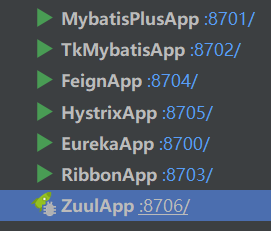

测试api网关的a路由转发情况,http://localhost:8706/api-a/ribbon测试

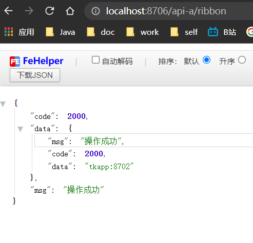

测试api网关的b路由转发情况,http://localhost:8706/api-b/account/ribbon/service测试

```yml
zuul:
  routes:
    api-a:
      path: /api-a/**
      serviceId: ribbon-8703
    api-b:
      path: /api-b/**
      serviceId: service-app
```

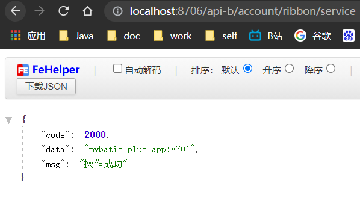


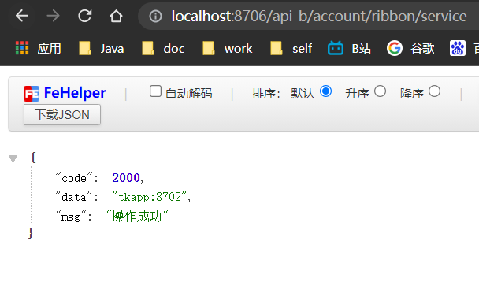

## Zuul的过滤功能

新建类继承ZuulFilter重写其过滤方法,各个方法的作用已在注释中写明.

```java
package cn.zm.netflix.zuul.config;

import com.netflix.zuul.ZuulFilter;
import com.netflix.zuul.context.RequestContext;
import com.netflix.zuul.exception.ZuulException;
import lombok.extern.slf4j.Slf4j;
import org.springframework.stereotype.Component;
import org.springframework.util.Assert;
import javax.servlet.http.HttpServletRequest;
import javax.servlet.http.HttpServletResponse;

@Slf4j
@Component
public class ZuulAppFilter extends ZuulFilter {


    /** 功能描述: <br>
     * <filterType：返回一个字符串代表过滤器的类型，
     * 在zuul中定义了四种不同生命周期的过滤器类型，具体如下：>
     *
     * @param
     *
     * @author 十渊
     * @date 2021/10/25 10:17
     * @return java.lang.String
     */
    @Override
    public String filterType() {
        // pre：路由之前
        // routing：路由之时
        // post： 路由之后
        // error：发送错误调用
        return "pre";
    }

    /** 功能描述: <br>
     * <过滤的顺序>
     *
     * @param
     *
     * @author 十渊
     * @date 2021/10/25 10:18
     * @return int
     */
    @Override
    public int filterOrder() {
        return 0;
    }

    /** 功能描述: <br>
     * <这里可以写逻辑判断，是否要过滤，本文true,永远过滤。>
     *
     * @param
     *
     * @author 十渊
     * @date 2021/10/25 10:18
     * @return boolean
     */
    @Override
    public boolean shouldFilter() {
        return true;
    }

    /** 功能描述: <br>
     * <过滤器的具体逻辑。可用很复杂，
     * 包括查sql，nosql去判断该请求到底有没有权限访问。>
     *
     * @param
     *
     * @author 十渊
     * @date 2021/10/25 10:19
     * @return java.lang.Object
     */
    @Override
    public Object run() throws ZuulException {
        return null;
    }
}
```

### 测试zuul过滤

打上断点访问路由 进入断点

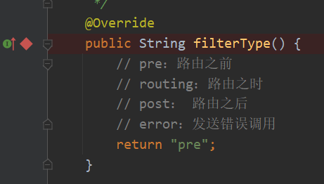

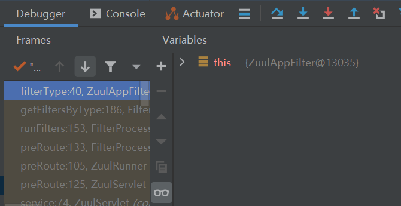

写入过滤规则查看

```java
@Override
public Object run() throws ZuulException {
    RequestContext ctx = RequestContext.getCurrentContext();
    HttpServletRequest request = ctx.getRequest();
    HttpServletResponse response = ctx.getResponse();
    log.info(String.format("%s >>> %s", request.getMethod(), request.getRequestURL().toString()));
    Object accessToken = request.getParameter("token");
    // try {
    //     Assert.notNull(accessToken, "token is empty");
    // } catch (Exception e) {
    //     resolver.resolveException(request, response, null, e);
    // }
    if(accessToken == null) {
        log.warn("token is empty");
        ctx.setSendZuulResponse(false);
        ctx.setResponseStatusCode(401);
        try {
            ctx.getResponse().getWriter().write("token is empty");
        }catch (Exception e){}

        return null;
    }
    log.info("ok");
    return null;
}
```

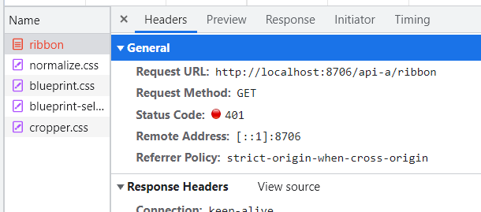

### 将过滤器的异常交由统一异常处理器处理

还是在ZuulAppFilter类中,在filter当中引入HandlerExceptionResolver类，通过该类的resolveException方法抛出自定义异常，代码如下：

```java
@Autowired
@Qualifier("handlerExceptionResolver")
private HandlerExceptionResolver resolver;

    /** 功能描述: <br>
     * <过滤器的具体逻辑。可用很复杂，
     * 包括查sql，nosql去判断该请求到底有没有权限访问。>
     *
     * @param
     *
     * @author 十渊
     * @date 2021/10/25 10:19
     * @return java.lang.Object
     */
    @Override
    public Object run() throws ZuulException {
        RequestContext ctx = RequestContext.getCurrentContext();
        HttpServletRequest request = ctx.getRequest();
        HttpServletResponse response = ctx.getResponse();
        log.info(String.format("%s >>> %s", request.getMethod(), request.getRequestURL().toString()));
        Object accessToken = request.getParameter("token");
        try {
            Assert.notNull(accessToken, "token is empty 401 err");
        } catch (Exception e) {
            resolver.resolveException(request, response, null, e);
        }
        // if(accessToken == null) {
        //     log.warn("token is empty");
        //     ctx.setSendZuulResponse(false);
        //     ctx.setResponseStatusCode(401);
        //     try {
        //         ctx.getResponse().getWriter().write("token is empty");
        //     }catch (Exception e){}
        //
        //     return null;
        // }
        log.info("ok");
        return null;
    }

```

通过resolveException方法抛出的自定义异常可以被RestControllerAdvice捕获，从而满足我们的需求，最终得到的响应格式：

再次测试访问, 被全局异常处理类自动拦截并返回json给前端

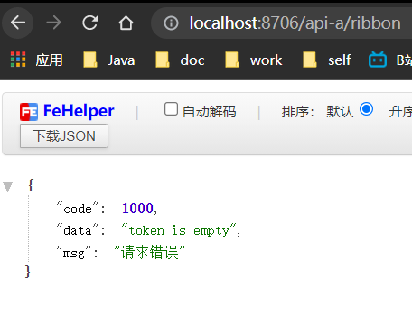

## Spring Cloud Zuul集成Knife4j

在Spring Cloud微服务架构中,各个子服务都是分散的,每个服务集成了Swagger文档,但是接口对接时需要单独分别访问,很麻烦,效率低下,

而Zuul可以帮助我们解决此难题,将多个微服务的Swagger接口聚合到一个文档中,这样整个微服务架构下只会存在一个文档出口,统一文档口径.

### 统一依赖修改

这个地方就体现了我们开始把common模块当做基本模块的好处了.这样只需要修改基础模块的依赖,其他依赖了common的模块也同时修改了.

common模块pom,**这里必须依赖2.0.8及其以上版本,这个版本切换分组时才回自动填写base-path**千万注意

```xml
	<properties>
		<knife4j.version>2.0.8</knife4j.version>
    </properties>

<!-- knife4j -->
<!--在Spring Cloud的微服务架构下,每个微服务其实并不需要引入前端的Ui资源
,因此在每个微服务的Spring Boot项目下,引入knife4j提供的微服务starter-->
<dependency>
    <groupId>com.github.xiaoymin</groupId>
    <artifactId>knife4j-micro-spring-boot-starter</artifactId>
    <version>${knife4j.version}</version>
</dependency>

<!--在网关聚合文档服务下,可以再把前端的ui资源引入-->
<dependency>
    <groupId>com.github.xiaoymin</groupId>
    <artifactId>knife4j-spring-boot-starter</artifactId>
    <version>${knife4j.version}</version>
</dependency>
```


统一配置

```java
package cn.zm.common.config;

import org.assertj.core.util.Lists;
import org.springframework.context.annotation.Bean;
import org.springframework.context.annotation.Configuration;
import org.springframework.context.annotation.Import;
import org.springframework.core.annotation.Order;
import org.springframework.web.bind.annotation.RestController;
import springfox.bean.validators.configuration.BeanValidatorPluginsConfiguration;
import springfox.documentation.builders.ApiInfoBuilder;
import springfox.documentation.builders.PathSelectors;
import springfox.documentation.builders.RequestHandlerSelectors;
import springfox.documentation.service.ApiKey;
import springfox.documentation.service.AuthorizationScope;
import springfox.documentation.service.SecurityReference;
import springfox.documentation.service.SecurityScheme;
import springfox.documentation.spi.DocumentationType;
import springfox.documentation.spi.service.contexts.SecurityContext;
import springfox.documentation.spring.web.plugins.Docket;
import springfox.documentation.swagger2.annotations.EnableSwagger2WebMvc;

import java.util.List;

/** 功能描述: <br>
 * <Knife4j 配置>
 * 每个微服务都集成Swagger的配置
 * @author 十渊
 * @date 2021/10/12 11:23
 * @return
 */
@Configuration
@EnableSwagger2WebMvc
@Import(BeanValidatorPluginsConfiguration.class)
public class Knife4jConfiguration {
    @Order(value = 1)
    @Bean(value = "defaultApi2")
    public Docket defaultApi2() {
        return new Docket(DocumentationType.SWAGGER_2)
                .apiInfo(new ApiInfoBuilder()
                        .title("SpringCloud种子")
                        .description("seed")
                        .version("1.0")
                        .build())
                //分组名称
                // .groupName("1.0.0版本")
                .select()
                //这里指定Controller扫描包路径
                // .apis(RequestHandlerSelectors.any())
                // .apis(RequestHandlerSelectors.basePackage("cn.zm.web.rest"))
                .apis(RequestHandlerSelectors.withClassAnnotation(RestController.class))
                .paths(PathSelectors.any())
                .build()
                .securityContexts(
                    Lists
                        .newArrayList(
                            securityContext(),
                            securityContext1()
                        ))
                .securitySchemes(
                    Lists
                        .<SecurityScheme>newArrayList(
                            apiKey(),
                            apiKey1()
                    ))
                ;
    }

    private ApiKey apiKey() {
        return new ApiKey("BearerToken", "Authorization", "header");
    }
    private ApiKey apiKey1() {
        return new ApiKey("BearerToken1", "Authorization-x", "header");
    }
    private SecurityContext securityContext() {
        return SecurityContext.builder()
            .securityReferences(defaultAuth())
            .forPaths(PathSelectors.regex("/.*"))
            .build();
    }
    private SecurityContext securityContext1() {
        return SecurityContext.builder()
            .securityReferences(defaultAuth1())
            .forPaths(PathSelectors.regex("/.*"))
            .build();
    }
    List<SecurityReference> defaultAuth() {
        AuthorizationScope authorizationScope = new AuthorizationScope("global", "accessEverything");
        AuthorizationScope[] authorizationScopes = new AuthorizationScope[1];
        authorizationScopes[0] = authorizationScope;
        return Lists.newArrayList(new SecurityReference("BearerToken", authorizationScopes));
    }
    List<SecurityReference> defaultAuth1() {
        AuthorizationScope authorizationScope = new AuthorizationScope("global", "accessEverything");
        AuthorizationScope[] authorizationScopes = new AuthorizationScope[1];
        authorizationScopes[0] = authorizationScope;
        return Lists.newArrayList(new SecurityReference("BearerToken1", authorizationScopes));
    }
}
```

### zuul模块配置

SwaggerResourceConfig.java

```java
package cn.zm.netflix.zuul.config;

import lombok.extern.slf4j.Slf4j;
import org.springframework.beans.factory.annotation.Autowired;
import org.springframework.cloud.netflix.zuul.filters.Route;
import org.springframework.cloud.netflix.zuul.filters.RouteLocator;
import org.springframework.context.annotation.Primary;
import org.springframework.stereotype.Component;
import springfox.documentation.swagger.web.SwaggerResource;
import springfox.documentation.swagger.web.SwaggerResourcesProvider;

import java.util.ArrayList;
import java.util.List;

@Component
@Primary
@Slf4j
public class SwaggerResourceConfig implements SwaggerResourcesProvider {
    @Autowired
    RouteLocator routeLocator;

    @Override
    public List<SwaggerResource> get() {
        //获取所有router
        List<SwaggerResource> resources = new ArrayList<>();
        List<Route> routes = routeLocator.getRoutes();
        log.info("Route Size:{}", routes.size());
        for (Route route : routes) {
            resources.add(
                swaggerResource(
                    route.getId(),
                    route.getFullPath()
                            .replace("**", "v2/api-docs")
            ));
        }
        return resources;
    }

    private SwaggerResource swaggerResource(String name, String location) {
        log.info("name:{}, location:{}", name, location);
        SwaggerResource swaggerResource = new SwaggerResource();
        swaggerResource.setName(name);
        swaggerResource.setLocation(location);
        swaggerResource.setSwaggerVersion("2.0");
        return swaggerResource;
    }
}
```

### 测试

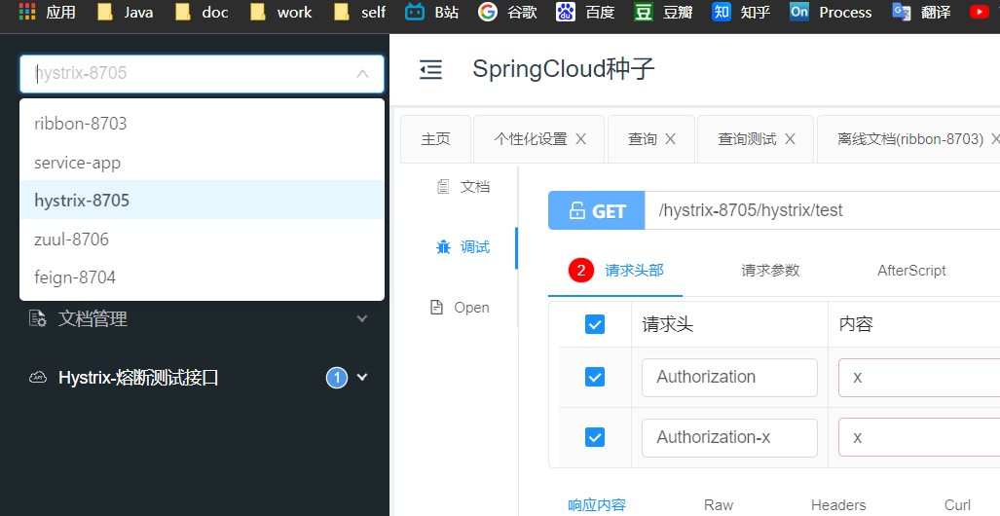

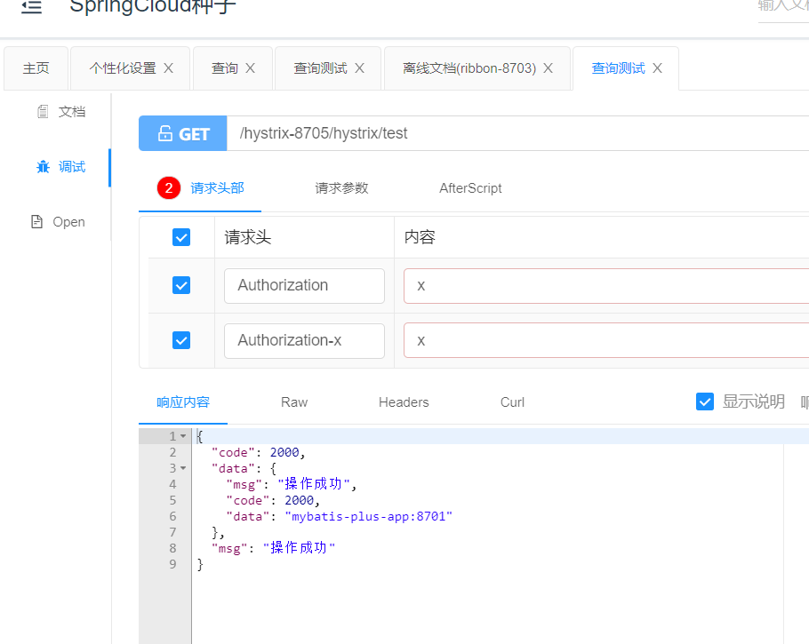

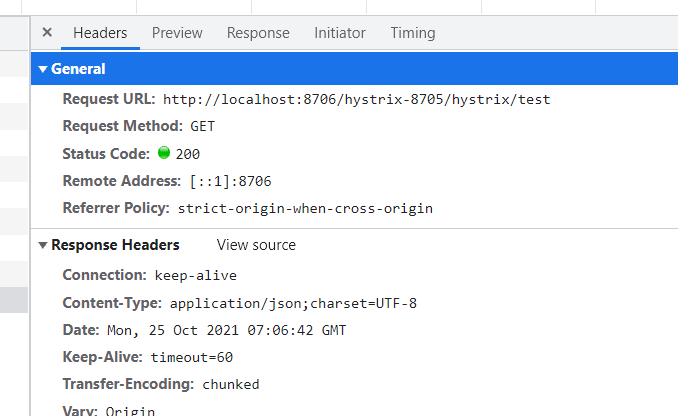


## Spring Cloud Zuul集成Security

保留后续写入


## 参考资料

> https://blog.csdn.net/qq_27384769/article/details/82991261
>
> SpringBoot 过滤器filter当中的自定义异常捕获问题
>
> https://blog.csdn.net/m0_37731470/article/details/116754395?spm=1001.2101.3001.6650.1&utm_medium=distribute.pc_relevant.none-task-blog-2%7Edefault%7ECTRLIST%7Edefault-1.no_search_link&depth_1-utm_source=distribute.pc_relevant.none-task-blog-2%7Edefault%7ECTRLIST%7Edefault-1.no_search_link
