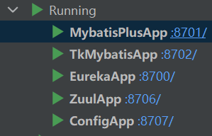
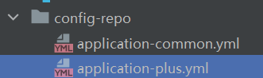
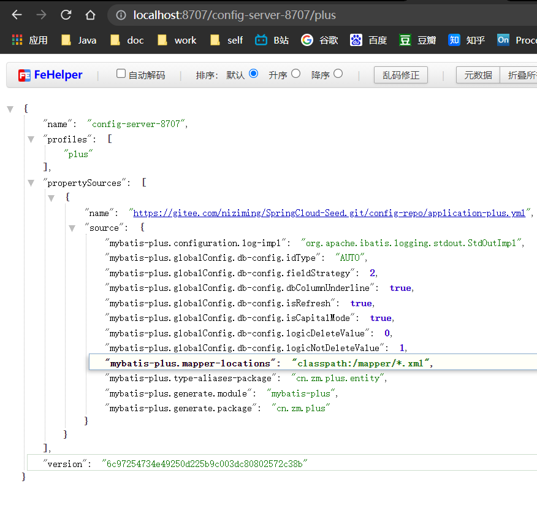
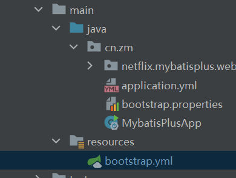
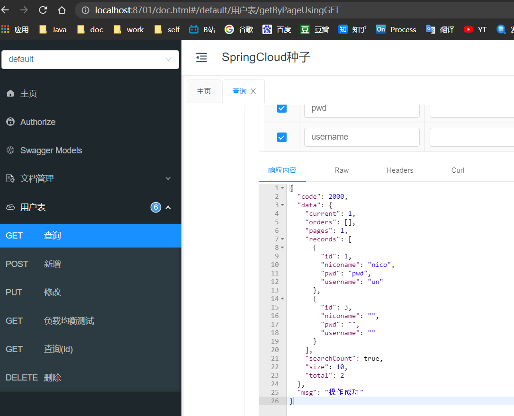
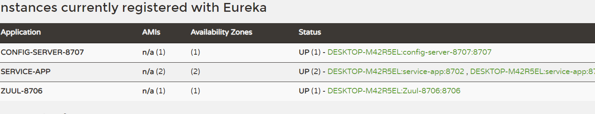

# SpringCloud微服务系列03-Netflix架构06-Config

Spring Cloud Config项目是一个解决分布式系统的配置管理方案。它包含了Client和Server两个部分，server提供配置文件的存储、以接口的形式将配置文件的内容提供出去，client通过接口获取数据、并依据此数据初始化自己的应用。

## 准备工作

之前章节中使用的各个模块



## config server

新建config模块

### pom配置

```xml
<?xml version="1.0" encoding="UTF-8"?>
<project xmlns="http://maven.apache.org/POM/4.0.0"
         xmlns:xsi="http://www.w3.org/2001/XMLSchema-instance"
         xsi:schemaLocation="http://maven.apache.org/POM/4.0.0 http://maven.apache.org/xsd/maven-4.0.0.xsd">
    <parent>
        <artifactId>Spring-Cloud-Netflix</artifactId>
        <groupId>cn.zm</groupId>
        <version>1.0-SNAPSHOT</version>
    </parent>
    <modelVersion>4.0.0</modelVersion>

    <artifactId>Config</artifactId>

    <properties>
        <maven.compiler.source>8</maven.compiler.source>
        <maven.compiler.target>8</maven.compiler.target>
    </properties>

    <dependencies>

        <!--统一依赖-->
        <dependency>
            <groupId>cn.zm</groupId>
            <artifactId>common</artifactId>
            <exclusions>
                <exclusion>
                    <groupId>com.alibaba</groupId>
                    <artifactId>druid-spring-boot-starter</artifactId>
                </exclusion>
            </exclusions>
        </dependency>

        <!--config 依赖-->
        <dependency>
            <groupId>org.springframework.cloud</groupId>
            <artifactId>spring-cloud-config-server</artifactId>
        </dependency>

        <!--eureka client-->
        <dependency>
            <groupId>org.springframework.cloud</groupId>
            <artifactId>spring-cloud-starter-netflix-eureka-client</artifactId>
        </dependency>

        <!-- 导入配置文件处理器，配置文件进行绑定就会有提示 -->
        <dependency>
            <groupId>org.springframework.boot</groupId>
            <artifactId>spring-boot-configuration-processor</artifactId>
        </dependency>
    </dependencies>


</project>
```


### yml配置

spring.cloud.config.server.git.uri：配置git仓库地址
spring.cloud.config.server.git.searchPaths：配置仓库路径
spring.cloud.config.label：配置仓库的分支
spring.cloud.config.server.git.username：访问git仓库的用户名
spring.cloud.config.server.git.password：访问git仓库的用户密码
如果Git仓库为公开仓库，可以不填写用户名和密码，如果是私有仓库需要填写，本例子是公开仓库，放心使用。

**关于git仓库的使用问题,因为众所周知的原因github 访问不稳定会出现443,这里简建议使用国内的git仓库,不让会出现很多问题**

```yml
server:
  port: 8707
spring:
  profiles:
    active: common
  application:
    name: config-server-8707
#  spring.cloud.config.server.git.uri：配置git仓库地址
#  spring.cloud.config.server.git.searchPaths：配置仓库路径
#  spring.cloud.config.label：配置仓库的分支
#  spring.cloud.config.server.git.username：访问git仓库的用户名
#  spring.cloud.config.server.git.password：访问git仓库的用户密码
#  如果Git仓库为公开仓库，可以不填写用户名和密码，如果是私有仓库需要填写，本例子是公开仓库，放心使用。
  cloud:
    config:
      server:
        git:
          uri: https://gitee.com/niziming/SpringCloud-Seed.git
          search-paths: config-repo
          force-pull: true
        default-label: main

logging:
  level:
    cn.zm: debug

# eureka
eureka:
  client:
    serviceUrl:
      defaultZone: http://localhost:8700/eureka/
```

### 上传配置到git仓库

这里准备的是mybatisplusapp这个模块的配置,方便后面client测试



- common.yml

```yml
#db config
spring:
  datasource:
    druid:
      driver-class-name: com.mysql.cj.jdbc.Driver
      url: jdbc:mysql://localhost:3306/test_dev?useUnicode=true&characterEncoding=UTF-8&useJDBCCompliantTimezoneShift=true&useLegacyDatetimeCode=false&serverTimezone=GMT%2B8
      username: root
      password: root
      #连接池配置
      initial-size: 5
      max-active: 100
      min-idle: 5
      max-wait: 60000
      pool-prepared-statements: true
      max-pool-prepared-statement-per-connection-size: 20
      validation-query-timeout: 60000
      validation-query: SELECT 1 FROM DUAL
      test-on-borrow: false
      test-on-return: false
      test-while-idle: true
      time-between-eviction-runs-millis: 60000
      min-evictable-idle-time-millis: 100000
      ###监控配置 begin###
      # WebStatFilter配置，说明请参考Druid Wiki，配置_配置WebStatFilter
      web-stat-filter:
        enabled: true
        url-pattern: /*
        exclusions: /druid/*,*.js,*.gif,*.jpg,*.png,*.css,*.ico
        # StatViewServlet配置，说明请参考Druid Wiki，配置_StatViewServlet配置
      stat-view-servlet:
        enabled: true
        url-pattern: /druid/*
        reset-enable: false
        login-username: admin
        login-password: admin
        allow: 127.0.0.1
      # 配置StatFilter
      filter:
        stat:
          db-type: mysql
          log-slow-sql: true
          slow-sql-millis: 5000
        # 配置WallFilter
        wall:
          enabled: false # 是否允许删除
          db-type: mysql
          config:
            delete-allow: false
            drop-table-allow: false
knife4j:
  basic:
    enable: true
```

- plus.yml

```yml
mybatis-plus:
  configuration:
    log-impl: org.apache.ibatis.logging.stdout.StdOutImpl
  globalConfig:
    db-config:
      #主键类型  0:"数据库ID自增", 1:"用户输入ID",2:"全局唯一ID (数字类型唯一ID)", 3:"全局唯一ID UUID";
      idType: AUTO
      #字段策略 0:"忽略判断",1:"非 NULL 判断"),2:"非空判断"
      fieldStrategy: 2
      #驼峰下划线转换
      dbColumnUnderline: true
      #刷新mapper 调试神器
      isRefresh: true
      #数据库大写下划线转换
      isCapitalMode: true
      #逻辑删除配置
      logicDeleteValue: 0
      logicNotDeleteValue: 1
  mapper-locations: classpath:/mapper/*.xml   #XML文件路径
  type-aliases-package: cn.zm.plus.entity
  generate:
    module: mybatis-plus
    package: cn.zm.plus
```

### 主入口代码

在程序的入口Application类加上@EnableConfigServer注解开启配置服务器的功能

```java
package cn.zm;

import org.springframework.boot.SpringApplication;
import org.springframework.boot.autoconfigure.SpringBootApplication;
import org.springframework.cloud.config.server.EnableConfigServer;
import org.springframework.cloud.netflix.eureka.EnableEurekaClient;
import org.springframework.web.bind.annotation.RequestMapping;
import org.springframework.web.bind.annotation.RestController;

// 在程序的入口Application类加上@EnableConfigServer注解开启配置服务器的功能
@EnableConfigServer
@EnableEurekaClient
@SpringBootApplication
public class ConfigServerApp {
    public static void main(String[] args) {
        SpringApplication.run(ConfigServerApp.class, args);
    }
}
```

### http请求地址和资源文件映射

证明配置服务中心可以从远程程序获取配置信息。

http请求地址和资源文件映射如下:

- /{application}/{profile}[/{label}]
- /{application}-{profile}.yml
- /{label}/{application}-{profile}.yml
- /{application}-{profile}.properties
- /{label}/{application}-{profile}.properties


### 启动config server 服务测试


根据以上规则访问yml文件查看



成功拉取yml文件

## config client

这里使用的是前面章节使用的server-app,将之前的mybatisplusapp的yml配置备份

### pom配置

相当于在之前的基础上新增config client的依赖

```xml
    <!-- spring cloud config 客户端包 -->
    <dependency>
        <groupId>org.springframework.cloud</groupId>
        <artifactId>spring-cloud-starter-config</artifactId>
    </dependency>
```

完整的pom如下


```xml
<?xml version="1.0" encoding="UTF-8"?>
<project xmlns="http://maven.apache.org/POM/4.0.0"
         xmlns:xsi="http://www.w3.org/2001/XMLSchema-instance"
         xsi:schemaLocation="http://maven.apache.org/POM/4.0.0 http://maven.apache.org/xsd/maven-4.0.0.xsd">
    <parent>
        <artifactId>Spring-Cloud-Netflix</artifactId>
        <groupId>cn.zm</groupId>
        <version>1.0-SNAPSHOT</version>
    </parent>
    <modelVersion>4.0.0</modelVersion>

    <artifactId>mybatis-plus-app</artifactId>

    <properties>
        <maven.compiler.source>8</maven.compiler.source>
        <maven.compiler.target>8</maven.compiler.target>
    </properties>

    <dependencies>
        <!-- spring cloud config 客户端包 -->
        <dependency>
            <groupId>org.springframework.cloud</groupId>
            <artifactId>spring-cloud-starter-config</artifactId>
        </dependency>

        <!--mybatis-plus-->
        <dependency>
            <groupId>cn.zm</groupId>
            <artifactId>mybatis-plus</artifactId>
        </dependency>

        <!--eureka client-->
        <dependency>
            <groupId>org.springframework.cloud</groupId>
            <artifactId>spring-cloud-starter-netflix-eureka-client</artifactId>
        </dependency>

        <!-- 导入配置文件处理器，配置文件进行绑定就会有提示 -->
        <dependency>
            <groupId>org.springframework.boot</groupId>
            <artifactId>spring-boot-configuration-processor</artifactId>
        </dependency>
    </dependencies>


</project>
```

### bootstrap.yml

这里就不需要application.yml了



```yml
server:
  port: 8701
# eureka
eureka:
  client:
    serviceUrl:
      defaultZone: http://localhost:8700/eureka/
spring:
  application:
    name: service-app
  cloud:
    config:
      uri: http://localhost:8707/
      label: main
      profile: common, plus
```

### 启动测试client

根据日志发现正常启动应用了配置

~~~log
2021-10-26 14:09:06.171  INFO 3140 --- [           main] c.c.c.ConfigServicePropertySourceLocator : Located environment: name=service-app, profiles=[common, plus], label=main, version=6c97254734e49250d225b9c003dc80802572c38b, state=null
2021-10-26 14:09:06.172  INFO 3140 --- [           main] b.c.PropertySourceBootstrapConfiguration : Located property source: [BootstrapPropertySource {name='bootstrapProperties-configClient'}, BootstrapPropertySource {name='bootstrapProperties-https://gitee.com/niziming/SpringCloud-Seed.git/config-repo/application-plus.yml'}, BootstrapPropertySource {name='bootstrapProperties-https://gitee.com/niziming/SpringCloud-Seed.git/config-repo/application-common.yml'}]
2021-10-26 14:09:06.176  INFO 3140 --- [           main] cn.zm.MybatisPlusApp                     : No active profile set, falling back to default profiles: default
2021-10-26 14:09:07.324  INFO 3140 --- [           main] o.s.cloud.context.scope.GenericScope     : BeanFactory id=cf37de59-8d09-3886-8e16-9a0f7155dd1f

~~~

点击knife4j文档工具查看接口是否正常使用



### eureka状态



至此所有的config已演示完毕

## 引用资料

>Spring Cloud Config 实现配置中心，看这一篇就够了
>
>https://www.cnblogs.com/fengzheng/p/11242128.html
>
>https://blog.csdn.net/forezp/article/details/70148833
>
>https://www.fangzhipeng.com/springcloud/2018/08/06/sc-f6-config.html
