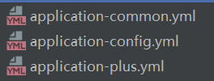
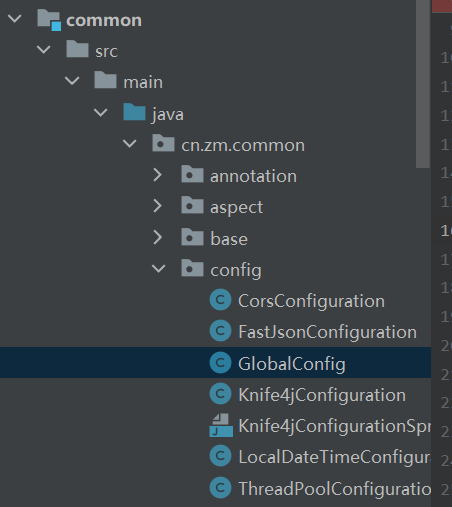
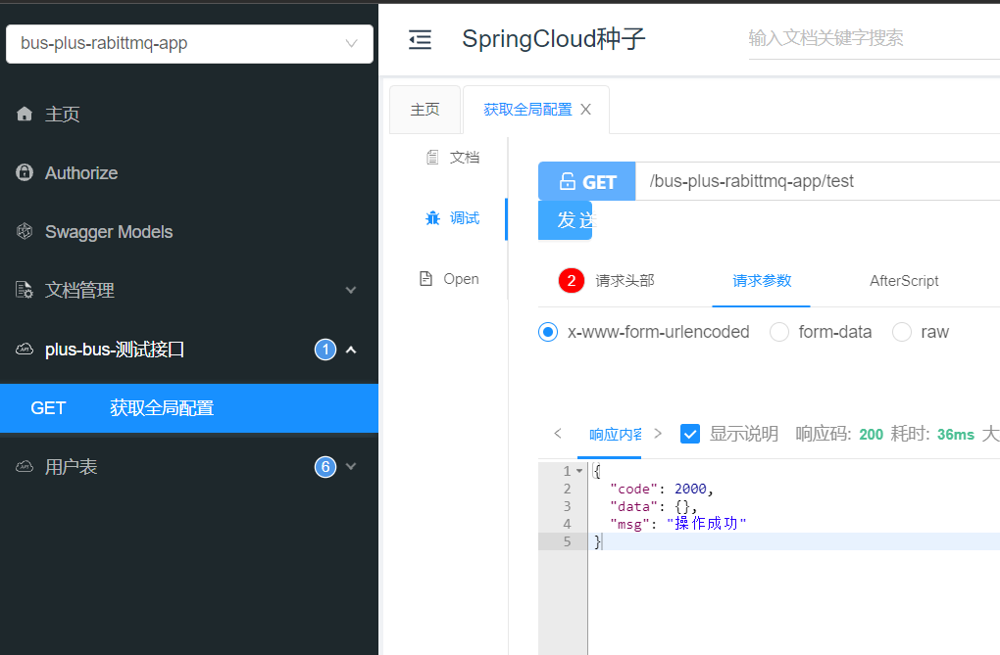
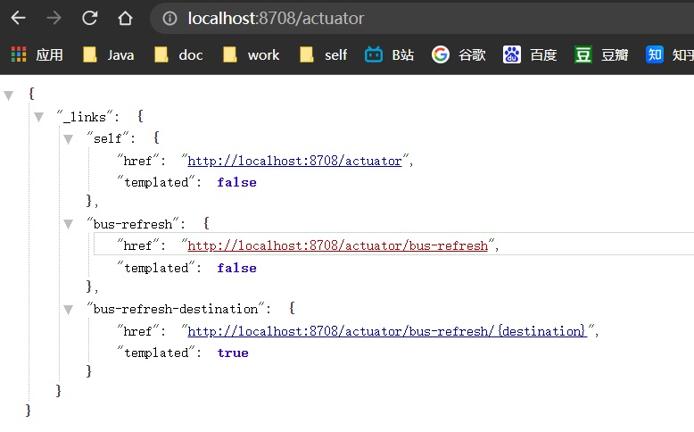
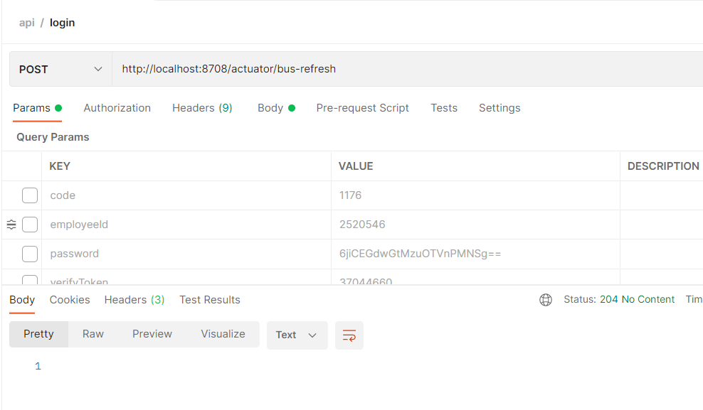
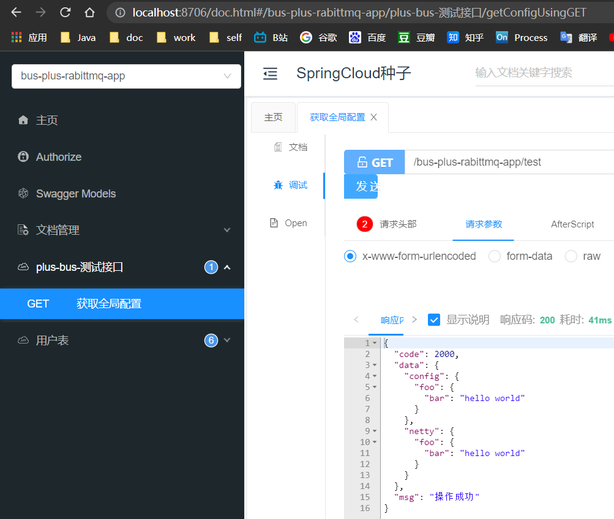

---

title: SpringCloud微服务系列03-Netflix架构07-Bus
subtitle: SpringCloud微服务系列03-Netflix架构07-Bus
catalog: true
tags: [Bus, RabbitMQ, 微服务]
date: 2021-10-27 10:53:35
header-img:
---

# SpringCloud微服务系列03-Netflix架构07-Bus

微服务项目中，使用到Spring Cloud Config来托管各模块的配置文件后，会有一个尴尬的问题 ： Config服务端并不能动态的感知Git上配置文件的变化，当git上配置文件更新后，如果不采取其它措施，就只能重启相关应用，从而达到配置的更新，那么如何不重启项目， 就能实现配置的更新呢？ 我们可以使用 Spring Cloud Bus来完成 。那么对项目改造如下

## 准备工作

- RabbitMQ,在本地将服务启动
- 之前的mybatisplusapp项目做为client

- bus项目

## Bus模块

### 项目创建

拷贝一份mybatisplusapp然后改成Bus项目


### pom文件如下

```xml
<?xml version="1.0" encoding="UTF-8"?>
<project xmlns="http://maven.apache.org/POM/4.0.0"
         xmlns:xsi="http://www.w3.org/2001/XMLSchema-instance"
         xsi:schemaLocation="http://maven.apache.org/POM/4.0.0 http://maven.apache.org/xsd/maven-4.0.0.xsd">
    <parent>
        <artifactId>Spring-Cloud-Netflix</artifactId>
        <groupId>cn.zm</groupId>
        <version>1.0-SNAPSHOT</version>
    </parent>
    <modelVersion>4.0.0</modelVersion>

    <artifactId>Bus</artifactId>

    <properties>
        <maven.compiler.source>8</maven.compiler.source>
        <maven.compiler.target>8</maven.compiler.target>
    </properties>

    <dependencies>

        <!--微服务下 RabbitMq 依赖-->
        <dependency>
            <groupId>org.springframework.cloud</groupId>
            <artifactId>spring-cloud-starter-bus-amqp</artifactId>
        </dependency>

        <!-- spring cloud config 客户端包 -->
        <dependency>
            <groupId>org.springframework.cloud</groupId>
            <artifactId>spring-cloud-starter-config</artifactId>
        </dependency>

        <!--mybatis-plus-->
        <dependency>
            <groupId>cn.zm</groupId>
            <artifactId>mybatis-plus</artifactId>
        </dependency>

        <!--eureka client-->
        <dependency>
            <groupId>org.springframework.cloud</groupId>
            <artifactId>spring-cloud-starter-netflix-eureka-client</artifactId>
        </dependency>

        <!-- 导入配置文件处理器，配置文件进行绑定就会有提示 -->
        <dependency>
            <groupId>org.springframework.boot</groupId>
            <artifactId>spring-boot-configuration-processor</artifactId>
        </dependency>
    </dependencies>
</project>
```

###  bootstrap.yml 文件

rabbitmq的账户密码就是之前章节注册的,并开放了权限的账户密码

```yml
server:
  port: 8708
spring:
  application:
    name: bus-plus-rabittmq-app
################## rabbitmq ##################
  rabbitmq:
    host: localhost
    port: 5672
    username: admin
    password: admin
  cloud:
################## cloud config ##################
    config:
      uri: http://localhost:8707/
      label: main
      profile: common, plus, config
################## bus ##################
    bus:
      enabled: true
      trace:
        enabled: true
################## eureka ##################
eureka:
  client:
    serviceUrl:
      defaultZone: http://localhost:8700/eureka/
################## actuator ##################
management:
  endpoints:
    web:
      exposure:
        include: bus-refresh
```

### 接口类

接口上加上@RefreshScope注解

Scope(`org.springframework.beans.factory.config.Scope`)是Spring 2.0开始就有的核心的概念

RefreshScope(`org.springframework.cloud.context.scope.refresh`)是spring cloud提供的一种特殊的scope实现，用来实现配置、实例热加载。

Scope -> GenericScope -> RefreshScope

```java
package cn.zm.netflix.bus.web.rest;

import cn.zm.common.base.ResponseResult;
import cn.zm.common.config.GlobalConfig;
import io.swagger.annotations.Api;
import io.swagger.annotations.ApiOperation;
import org.springframework.cloud.context.config.annotation.RefreshScope;
import org.springframework.web.bind.annotation.*;

import javax.annotation.Resource;
/**
 * 
 * @author 十渊
 * @since 2021-10-12
 */
// @RefreshScope 这个注解
@RefreshScope
@RequestMapping("test")
@RestController
@Api(tags = "plus-bus-测试接口")
public class TestController {

    @Resource
    private GlobalConfig globalConfig;

    @GetMapping
    @ApiOperation("获取全局配置")
    public ResponseResult getConfig() {
        // TODO 查询
        return ResponseResult.succ(globalConfig);
    }
}
```

 ### 测试

新建config文件





#### 注入配置bean

```java
package cn.zm.common.config;

import com.alibaba.fastjson.JSONObject;
import lombok.Data;
import org.springframework.boot.context.properties.ConfigurationProperties;
import org.springframework.stereotype.Component;

import java.util.Map;

/**
 * @author 十渊
 */
@Component
@Data
@ConfigurationProperties(prefix = "global")
public class GlobalConfig {
    private Map<String, JSONObject> config;
    private Map<String, JSONObject> netty;
}
```

新建的application-config.yml为空,测试接口结果返回为空



打开actuator后台接口,注意这个地方的bus-refresh就是我们之前Bus模块的yml配置

```yml
################## actuator ##################
management:
  endpoints:
    web:
      exposure:
        include: bus-refresh
```




使用postman 用 post接口调用 bus-refresh接口刷新bean



再次调用接口查看



/actuator/bus-refresh接口可以指定服务，即使用”destination”参数，比如 “/actuator/bus-refresh?destination=customers:**” 即刷新服务名为customers的所有服务。


## 引用资料

>本项目所有代码
>
>https://github.com/niziming/SpringCloud-Seed
>
>https://www.fangzhipeng.com/springcloud/2018/08/08/sc-f8-bus.html
>
>
