# SpringCloud微服务系列03-Netflix架构08-Sleuth

Sleuth是Spring Cloud的组件之一，它为Spring Cloud实现了一种分布式追踪解决方案，兼容Zipkin，HTrace和其他基于日志的追踪系统，例如 ELK（Elasticsearch 、Logstash、 Kibana）。

Zipkin是一款开源的分布式实时数据追踪系统（Distributed Tracking System），基于 Google Dapper的论文设计而来，由 Twitter 公司开发贡献。其主要功能是聚集来自各个异构系统的实时监控数据。分布式跟踪系统还有其他比较成熟的实现，例如：Naver的Pinpoint、Apache的HTrace、阿里的鹰眼Tracing、京东的Hydra、新浪的Watchman，美团点评的CAT，skywalking等。

## 为什么用 Zipkin

随着业务越来越复杂，系统也随之进行各种拆分，特别是随着微服务架构和容器技术的兴起，看似简单的一个应用，后台可能有几十个甚至几百个服务在支撑；一个前端的请求可能需要多次的服务调用最后才能完成；当请求变慢或者不可用时，我们无法得知是哪个后台服务引起的，这时就需要解决如何快速定位服务故障点，Zipkin分布式跟踪系统就能很好的解决这样的问题。

## 相关术语

Sleuth引入了许多 Dapper中的术语：

Span ---- 基本的工作单元。无论是发送一个RPC或是向RPC发送一个响应都是一个Span。每一个Span通过一个64位ID来进行唯一标识，并通过另一个64位ID对Span所在的Trace进行唯一标识。

Span能够启动和停止，他们不断地追踪自身的时间信息，当你创建了一个Span，你必须在未来的某个时刻停止它。

提示：启动一个Trace的初始化Span被叫作 Root Span ，它的 Span ID 和 Trace Id 相同。

Trace ---- 由一系列Span 组成的一个树状结构。例如，如果你要执行一个分布式大数据的存储操作，这个Trace也许会由你的PUT请求来形成。

Annotation：用来及时记录一个事件的存在。通过引入 Brave 库，我们不用再去设置一系列的特别事件，从而让 Zipkin 能够知道客户端和服务器是谁、请求是从哪里开始的、又到哪里结束。出于学习的目的，还是把这些事件在这里列举一下：

cs （Client Sent） - 客户端发起一个请求，这个注释指示了一个Span的开始。

sr （Server Received） - 服务端接收请求并开始处理它，如果用 sr 时间戳减去 cs 时间戳便能看出有多少网络延迟。

ss（Server Sent）- 注释请求处理完成(响应已发送给客户端)，如果用 ss 时间戳减去sr 时间戳便可得出服务端处理请求耗费的时间。

cr（Client Received）- 预示了一个 Span的结束，客户端成功地接收到了服务端的响应，如果用 cr 时间戳减去 cs 时间戳便可得出客户端从服务端获得响应所需耗费的整个时间。

~~~
sr - cs = 请求在网络上的耗时
ss - sr = 服务端处理请求的耗时
cr - ss = 回应在网络上的耗时
cr - cs = 一次调用的整体耗时
~~~

下图展示了一个系统中的 Span 和 Trace 大概的样子：

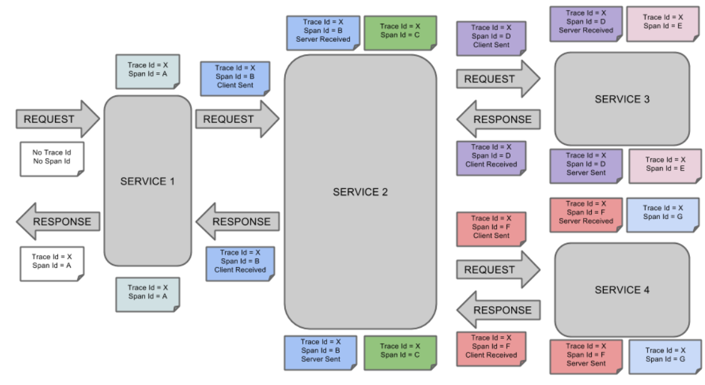

颜色相同的注释表示是同一个Span（这里一共有7个Span，编号从 Ａ到Ｇ），以下面这个注释为例：

~~~
Trace Id = X
Span Id = D
Client Sent
~~~

这个注释表示当前Span的Trace Id 为 X，Span Id 为 D，同时，发生了 Client Sent 事件。

下图展示了父子关系的Span的调用链路：

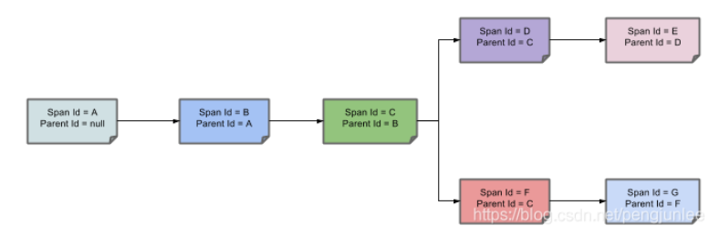


## 服务追踪分析

微服务架构上通过业务来划分服务的，通过REST调用，对外暴露的一个接口，可能需要很多个服务协同才能完成这个接口功能，如果链路上任何一个服务出现问题或者网络超时，都会形成导致接口调用失败。随着业务的不断扩张，服务之间互相调用会越来越复杂。

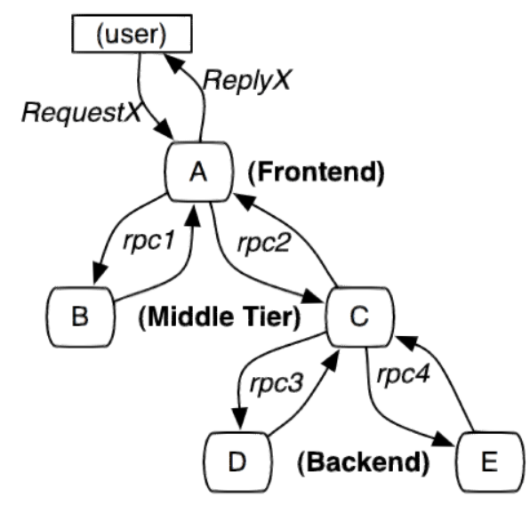

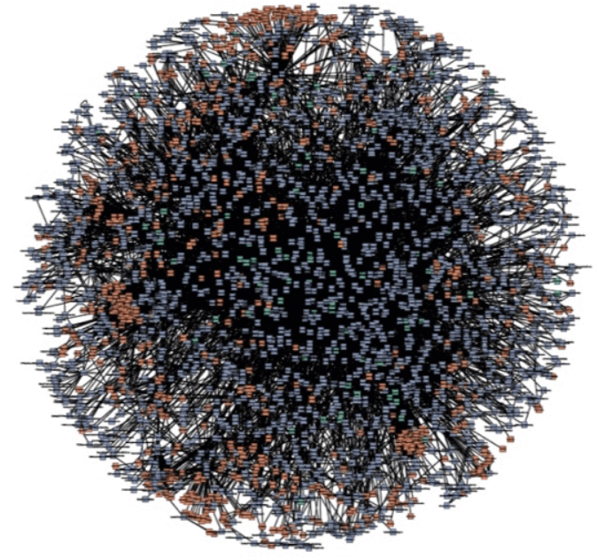

## 准备工作

- 前面章节的eureka服务

  - 两个service服务可以使用之前的mybatisplusapp项目和tkmybatisapp项目

- 新建Sleuth模块

- 依赖基础的模块

- zipkin-server服务(下载jar包运行)

  - https://search.maven.org/remote_content?g=io.zipkin.java&a=zipkin-server&v=LATEST&c=exec

  - https://www.imooc.com/article/291572
  - https://zipkin.io/
  - java -jar zipkin-server-2.12.9-exec.jar 启动

  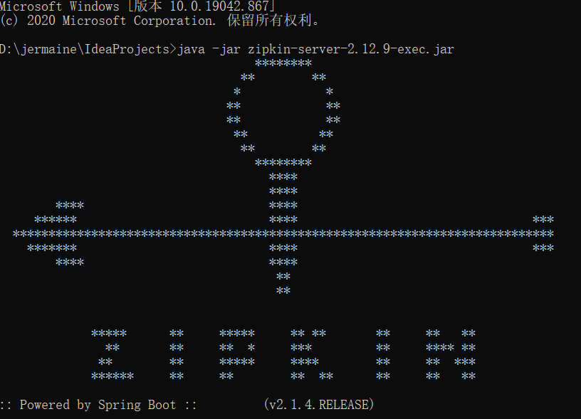

查看启动日志

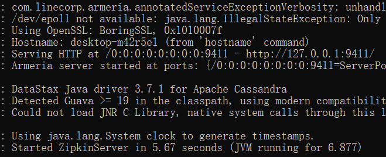

zipkin-server 暴露在了 http://127.0.0.1:9411/

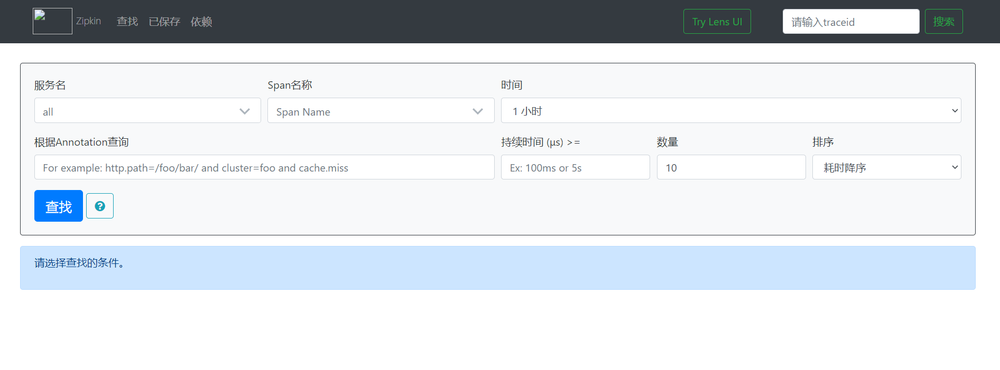

## 快速开始

新建sleuth模块底下拥有两个子模块,这里使用的是之前的tkmybatisapp和mybatisplusapp模块复制的;

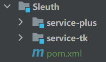

### sleuth模块

pom文件如下,此模块不需要任何代码,只是让层级结构更清晰.

```pom
<?xml version="1.0" encoding="UTF-8"?>
<project xmlns="http://maven.apache.org/POM/4.0.0"
         xmlns:xsi="http://www.w3.org/2001/XMLSchema-instance"
         xsi:schemaLocation="http://maven.apache.org/POM/4.0.0 http://maven.apache.org/xsd/maven-4.0.0.xsd">
    <parent>
        <artifactId>Spring-Cloud-Netflix</artifactId>
        <groupId>cn.zm</groupId>
        <version>1.0-SNAPSHOT</version>
    </parent>
    <modelVersion>4.0.0</modelVersion>

    <artifactId>Sleuth</artifactId>

    <packaging>pom</packaging>

    <properties>
        <maven.compiler.source>8</maven.compiler.source>
        <maven.compiler.target>8</maven.compiler.target>
    </properties>

    <modules>
        <module>service-plus</module>
        <module>service-tk</module>
    </modules>

</project>
```

### service-plus模块

pom,这里引入了sleuth的子项目zipkin

```xml
<?xml version="1.0" encoding="UTF-8"?>
<project xmlns="http://maven.apache.org/POM/4.0.0"
         xmlns:xsi="http://www.w3.org/2001/XMLSchema-instance"
         xsi:schemaLocation="http://maven.apache.org/POM/4.0.0 http://maven.apache.org/xsd/maven-4.0.0.xsd">
    <parent>
        <artifactId>Sleuth</artifactId>
        <groupId>cn.zm</groupId>
        <version>1.0-SNAPSHOT</version>
    </parent>
    <modelVersion>4.0.0</modelVersion>

    <artifactId>service-plus</artifactId>

    <properties>
        <maven.compiler.source>8</maven.compiler.source>
        <maven.compiler.target>8</maven.compiler.target>
    </properties>

    <dependencies>
        <!--mybatis-plus-->
        <dependency>
            <groupId>cn.zm</groupId>
            <artifactId>mybatis-plus</artifactId>
        </dependency>

        <!--feign 依赖-->
        <dependency>
            <groupId>org.springframework.cloud</groupId>
            <artifactId>spring-cloud-starter-openfeign</artifactId>
        </dependency>

        <!--zipkin 链路管理-->
        <dependency>
            <groupId>org.springframework.cloud</groupId>
            <artifactId>spring-cloud-starter-zipkin</artifactId>
        </dependency>

        <!--eureka client-->
        <dependency>
            <groupId>org.springframework.cloud</groupId>
            <artifactId>spring-cloud-starter-netflix-eureka-client</artifactId>
        </dependency>

        <!-- 导入配置文件处理器，配置文件进行绑定就会有提示 -->
        <dependency>
            <groupId>org.springframework.boot</groupId>
            <artifactId>spring-boot-configuration-processor</artifactId>
        </dependency>
    </dependencies>

</project>
```

yml文件配置zipkin: base-url: http://localhost:9411,用的之前准备的服务

```yml
server:
  port: 8709
spring:
  profiles:
    active: common, plus
  application:
    name: service-plus-8709
  zipkin:
    base-url: http://localhost:9411

logging:
  level:
    cn.zm: debug

# eureka
eureka:
  client:
    serviceUrl:
      defaultZone: http://localhost:8700/eureka/
global:
  config:
    foo:
      bar: hello world
  netty:
    foo:
      bar: hello world
```

app入口注入Sampler bean


```java
package cn.zm;

import brave.sampler.Sampler;
import org.springframework.boot.SpringApplication;
import org.springframework.boot.autoconfigure.SpringBootApplication;
import org.springframework.cloud.netflix.eureka.EnableEurekaClient;
import org.springframework.cloud.openfeign.EnableFeignClients;
import org.springframework.context.annotation.Bean;

@EnableFeignClients
@EnableEurekaClient
@SpringBootApplication
public class ServicePlusApp {
    public static void main(String[] args) {
        SpringApplication.run(ServicePlusApp.class, args);
    }
    @Bean
    public Sampler defaultSampler() {
        return Sampler.ALWAYS_SAMPLE;
    }
}
```

ServiceTkService类

```java
package cn.zm.netflix.mybatisplus.web.service;

import org.springframework.cloud.openfeign.FeignClient;
import org.springframework.web.bind.annotation.GetMapping;

@FeignClient("service-tk-8710")
public interface ServiceTkService {
    @GetMapping("/account/ribbon/service")
    String getTkInfo();
}
```

TestController控制层

```java
package cn.zm.netflix.mybatisplus.web.rest;

import cn.zm.common.base.ResResult;
import cn.zm.common.config.GlobalConfig;
import cn.zm.netflix.mybatisplus.web.service.ServiceTkService;
import cn.zm.plus.base.BaseController;
import com.alibaba.fastjson.JSON;
import io.swagger.annotations.Api;
import io.swagger.annotations.ApiOperation;
import org.springframework.web.bind.annotation.*;

import javax.annotation.Resource;
/**
 * 
 * @author 十渊
 * @since 2021-10-12
 */
@RequestMapping("test")
@RestController
@Api(tags = "plus测试接口")
public class TestController extends BaseController {

    @Resource
    private GlobalConfig globalConfig;
    @Resource
    private ServiceTkService serviceTkService;

    @GetMapping
    @ApiOperation("获取全局配置")
    public ResResult getConfig() {
        // TODO 查询
        return ResResult.succ(globalConfig);
    }

    @GetMapping("getTkInfo")
    @ApiOperation("调用tk服务接口")
    public ResResult getTkInfo() {
        // TODO 查询
        return ResResult.succ(JSON.parse(serviceTkService.getTkInfo()));
    }
}
```

### service-tk模块

pom文件

```xml
<?xml version="1.0" encoding="UTF-8"?>
<project xmlns="http://maven.apache.org/POM/4.0.0"
         xmlns:xsi="http://www.w3.org/2001/XMLSchema-instance"
         xsi:schemaLocation="http://maven.apache.org/POM/4.0.0 http://maven.apache.org/xsd/maven-4.0.0.xsd">
    <parent>
        <artifactId>Sleuth</artifactId>
        <groupId>cn.zm</groupId>
        <version>1.0-SNAPSHOT</version>
    </parent>
    <modelVersion>4.0.0</modelVersion>

    <groupId>cn.zm.netflix</groupId>
    <artifactId>service-tk</artifactId>

    <properties>
        <maven.compiler.source>8</maven.compiler.source>
        <maven.compiler.target>8</maven.compiler.target>
    </properties>

    <dependencies>
        <dependency>
            <groupId>cn.zm</groupId>
            <artifactId>tk-mybatis</artifactId>
        </dependency>

        <!--feign 依赖-->
        <dependency>
            <groupId>org.springframework.cloud</groupId>
            <artifactId>spring-cloud-starter-openfeign</artifactId>
        </dependency>

        <!--zipkin 链路管理-->
        <dependency>
            <groupId>org.springframework.cloud</groupId>
            <artifactId>spring-cloud-starter-zipkin</artifactId>
        </dependency>

        <!--eureka client-->
        <dependency>
            <groupId>org.springframework.cloud</groupId>
            <artifactId>spring-cloud-starter-netflix-eureka-client</artifactId>
        </dependency>
        <!-- test -->
        <dependency>
            <groupId>org.springframework.boot</groupId>
            <artifactId>spring-boot-starter-test</artifactId>
            <scope>test</scope>
        </dependency>
    </dependencies>


    <build>
        <!--如果不添加此节点mybatis的mapper.xml文件都会被漏掉。 -->
        <!--<resources>-->
        <!--    <resource>-->
        <!--        <directory>src/main/java</directory>-->
        <!--        <includes>-->
        <!--            <include>**/*.properties</include>-->
        <!--            <include>**/*.xml</include>-->
        <!--        </includes>-->
        <!--        <filtering>false</filtering>-->
        <!--    </resource>-->
        <!--    <resource>-->
        <!--        <directory>src/main/resources</directory>-->
        <!--        <includes>-->
        <!--            <include>**/*.properties</include>-->
        <!--            <include>**/*.xml</include>-->
        <!--        </includes>-->
        <!--        <filtering>false</filtering>-->
        <!--    </resource>-->
        <!--</resources>-->
    </build>

</project>
```

yml配置

```yml
server:
  port: 8710
spring:
  profiles:
    active: common, tk
  application:
    name: service-tk-8710
  zipkin:
    base-url: http://localhost:9411

logging:
  level:
    cn.zm: debug

# eureka
eureka:
  client:
    serviceUrl:
      defaultZone: http://localhost:8700/eureka/
```

app入口类,**注意这里的mappescan已经迁移至tk-mybatis的config中,这样相当于每个子模块都不用再去写这个配置**

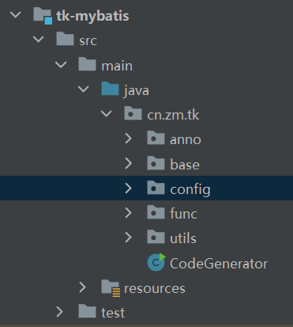

MapperConfig类,扫描mapper bean

```java
package cn.zm.tk.config;

import org.springframework.context.annotation.Configuration;
import tk.mybatis.spring.annotation.MapperScan;

@Configuration
@MapperScan("cn.zm.**.mapper")
public class MapperConfig {
}
```

```java
package cn.zm;

import brave.sampler.Sampler;
import org.springframework.boot.SpringApplication;
import org.springframework.boot.autoconfigure.SpringBootApplication;
import org.springframework.cloud.netflix.eureka.EnableEurekaClient;
import org.springframework.cloud.openfeign.EnableFeignClients;
import org.springframework.context.annotation.Bean;

@EnableEurekaClient
@EnableFeignClients
@SpringBootApplication
public class ServiceTkApp {
    public static void main(String[] args) {

        SpringApplication.run(ServiceTkApp.class, args);
    }

    @Bean
    public Sampler defaultSampler() {
        return Sampler.ALWAYS_SAMPLE;
    }
}
```

PlusService类

```java
package cn.zm.netflix.tkmybatis.web.service;

import org.springframework.cloud.openfeign.FeignClient;
import org.springframework.web.bind.annotation.GetMapping;

@FeignClient("service-plus-8709")
public interface PlusService {
    @GetMapping("/account/ribbon/service")
    String getPlusInfo();
}
```

TestController控制层

```java
package cn.zm.netflix.tkmybatis.web.rest;

import cn.zm.common.base.ResResult;
import cn.zm.common.config.GlobalConfig;
import cn.zm.netflix.tkmybatis.web.service.PlusService;
import cn.zm.tk.base.BaseController;
import com.alibaba.fastjson.JSON;
import io.swagger.annotations.Api;
import io.swagger.annotations.ApiOperation;
import org.springframework.web.bind.annotation.GetMapping;
import org.springframework.web.bind.annotation.RequestMapping;
import org.springframework.web.bind.annotation.RestController;

import javax.annotation.Resource;

/**
 * 
 * @author 十渊
 * @since 2021-10-12
 */
@RequestMapping("test")
@RestController
@Api(tags = "tk测试接口")
public class TestController extends BaseController {

    @Resource
    private GlobalConfig globalConfig;
    @Resource
    private PlusService plusService;

    @GetMapping
    @ApiOperation("获取全局配置")
    public ResResult getConfig() {
        // TODO 查询
        return ResResult.succ(globalConfig);
    }

    @GetMapping("getPlusInfo")
    @ApiOperation("调用Plus服务接口")
    public ResResult getPlusInfo() {
        // TODO 查询
        String plusInfo = plusService.getPlusInfo();
        return ResResult.succ(JSON.parse(plusInfo));
    }
}
```

## 测试

启动app

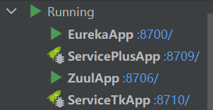

因为zuul网关上有我们的统一knife4j配置,所以启动此项目方便测试

进入zuul的接口文档工具

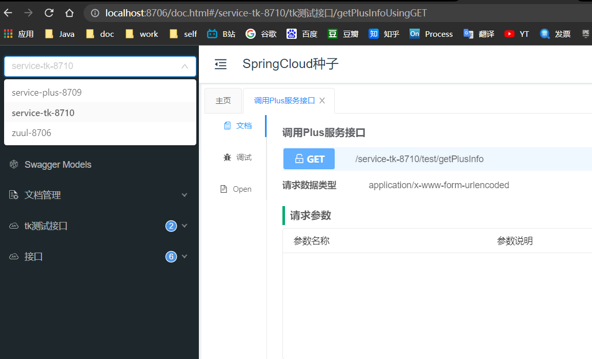

在tk项目中使用feign调用plus的接口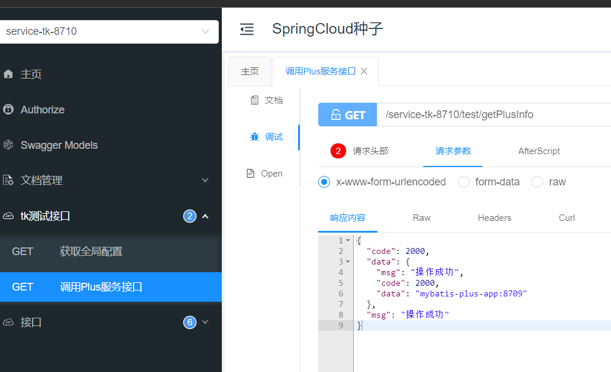

在plus项目中使用feign调用tk的接口

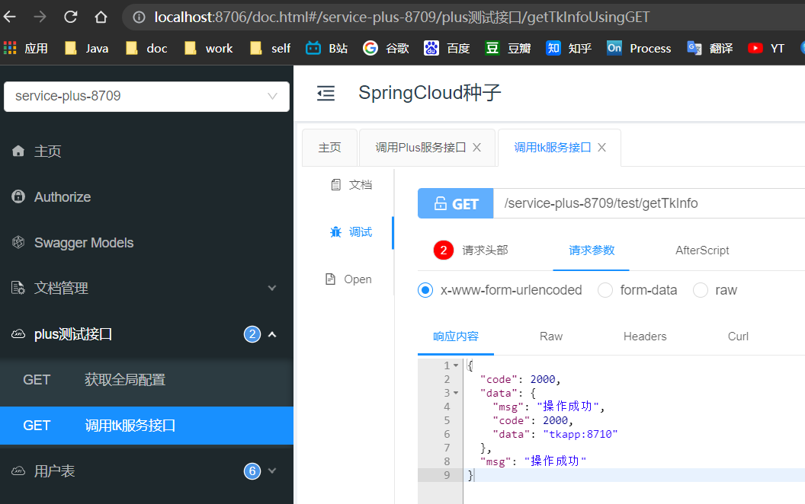

查看zipkin的可视化界面

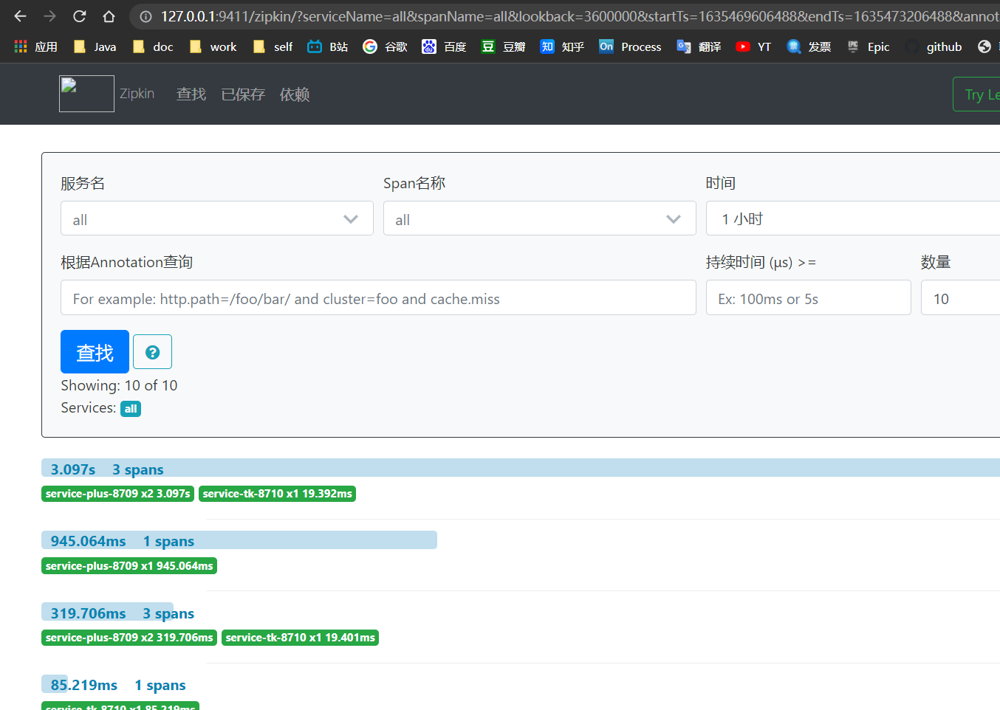

查看调用链

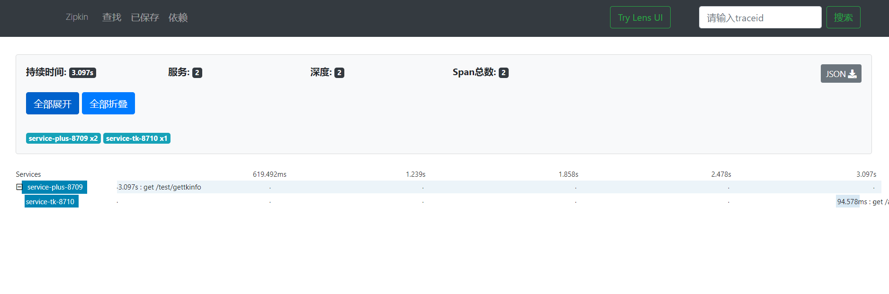

## 引用资料

>本项目所有代码
>
>https://github.com/niziming/SpringCloud-Seed
>
>https://github.com/spring-cloud/spring-cloud-sleuth
>
>https://www.fangzhipeng.com/springcloud/2018/08/09/sc-f9-sleuth.html
>
>https://www.cnblogs.com/jmcui/p/10940372.html
>
>https://blog.csdn.net/pengjunlee/article/details/87797969
