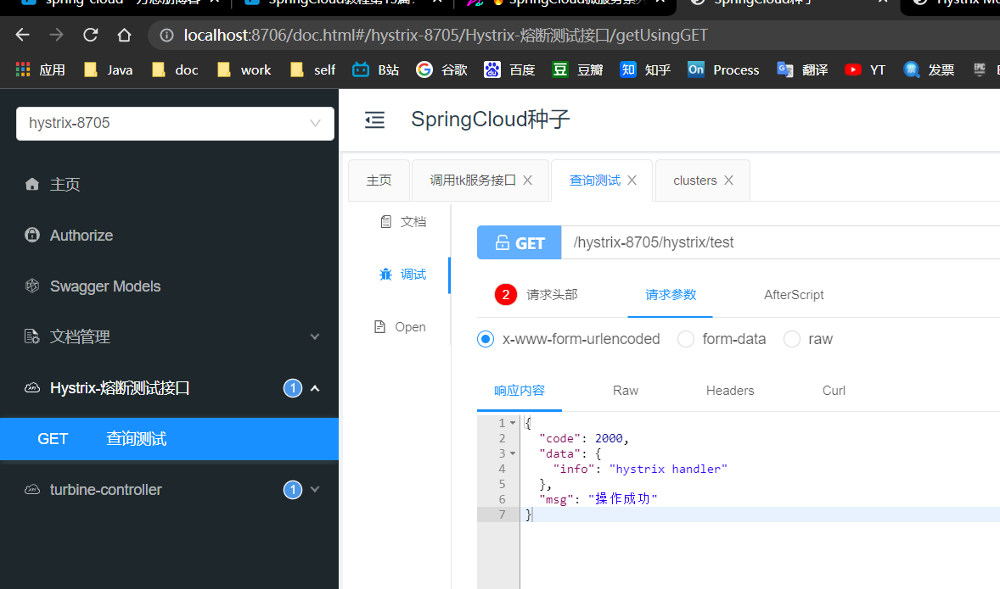
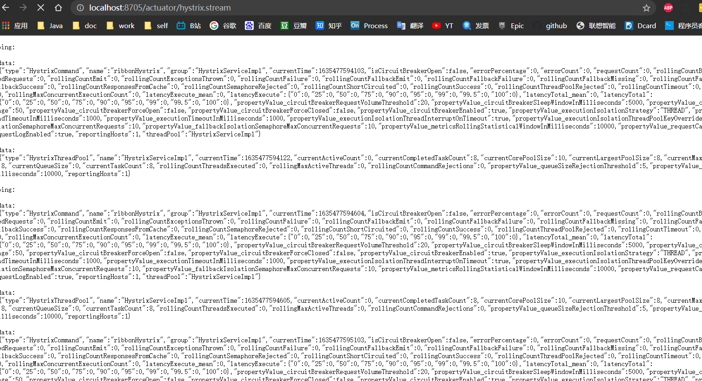
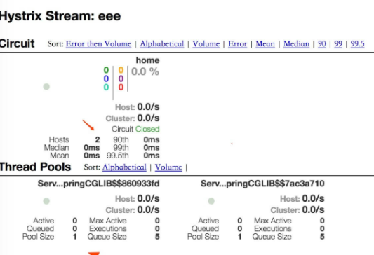

# SpringCloud微服务系列03-Netflix架构09-Turbine

前面的文章讲述了如何利用Hystrix Dashboard去监控断路器的Hystrix command。当我们有很多个服务的时候，这就需要聚合所以服务的Hystrix Dashboard的数据了。这就需要用到Spring Cloud的另一个组件了，即Hystrix Turbine。

## 简介

看单个的Hystrix Dashboard的数据并没有什么多大的价值，要想看这个系统的Hystrix Dashboard数据就需要用到Hystrix Turbine。Hystrix Turbine将每个服务Hystrix Dashboard数据进行了整合。Hystrix Turbine的使用非常简单，只需要引入相应的依赖和加上注解和配置就可以了。

## 准备工作

之前只用的hystrix模块及其他两个service模块


## 快速开始

引入依赖

```xml
        <dependency>
            <groupId>org.springframework.cloud</groupId>
            <artifactId>spring-cloud-starter-netflix-turbine</artifactId>
        </dependency>
```

app入口类

在其入口类ServiceTurbineApplication加上注解@EnableTurbine，开启turbine，@EnableTurbine注解包含了@EnableDiscoveryClient注解，即开启了注册服务。

```java
package cn.zm;

import com.netflix.hystrix.contrib.metrics.eventstream.HystrixMetricsStreamServlet;
import org.springframework.boot.SpringApplication;
import org.springframework.boot.autoconfigure.SpringBootApplication;
import org.springframework.boot.web.servlet.ServletRegistrationBean;
import org.springframework.cloud.client.discovery.EnableDiscoveryClient;
import org.springframework.cloud.client.loadbalancer.LoadBalanced;
import org.springframework.cloud.netflix.hystrix.EnableHystrix;
import org.springframework.cloud.netflix.hystrix.dashboard.EnableHystrixDashboard;
import org.springframework.cloud.netflix.turbine.EnableTurbine;
import org.springframework.context.annotation.Bean;
import org.springframework.web.client.RestTemplate;

// 在工程的启动类中,通过@EnableDiscoveryClient向服务中心注册
// @EnableHystrix注解开启Hystrix：
// 在其入口类ServiceTurbineApplication加上注解@EnableTurbine，开启turbine，@EnableTurbine注解包含了@EnableDiscoveryClient注解，即开启了注册服务。
@EnableHystrix
@EnableHystrixDashboard
@EnableTurbine
@SpringBootApplication
public class HystrixApp {
    public static void main(String[] args) {
        SpringApplication.run(HystrixApp.class, args);
    }

    @Bean
    @LoadBalanced
    RestTemplate restTemplate() {
        return new RestTemplate();
    }

    @Bean
    public ServletRegistrationBean getServlet() {
        HystrixMetricsStreamServlet streamServlet = new HystrixMetricsStreamServlet();
        ServletRegistrationBean registrationBean = new ServletRegistrationBean(streamServlet);
        registrationBean.setLoadOnStartup(1);
        registrationBean.addUrlMappings("/hystrix.stream");
        registrationBean.setName("HystrixMetricsStreamServlet");
        return registrationBean;
    }
}
```

配置文件application.yml：

```yml
server:
  port: 8705
spring:
  profiles:
    active: common
  application:
    name: Hystrix-8705

logging:
  level:
    cn.zm: debug

# eureka
eureka:
  client:
    serviceUrl:
      defaultZone: http://localhost:8700/eureka/

# acutor
management:
  endpoints:
    web:
      exposure:
        include: "*"
      cors:
        allowed-origins: "*"
        allowed-methods: "*"

hystrix:
  dashboard:
    proxy-stream-allow-list: "localhost"

turbine:
  app-config: service-hi,service-lucy
  aggregator:
    clusterConfig: default
  clusterNameExpression: new String("default")
  combine-host: true
  instanceUrlSuffix:
    default: actuator/hystrix.stream
```

## Turbine演示测试

网关调用熔断接口



查看ping http://localhost:8705/actuator/hystrix.stream





## 引用资料

>https://www.fangzhipeng.com/springcloud/2018/08/13/sc-f13-turbine.html
>
>
