# SpringCloud微服务系列03-RabittMQ消息队列

消息（Message）是指在应用间传送的数据。消息可以非常简单，比如只包含文本字符串，也可以更复杂，可能包含嵌入对象。

消息队列（Message Queue）是一种应用间的通信方式，消息发送后可以立即返回，由消息系统来确保消息的可靠传递。消息发布者只管把消息发布到 MQ 中而不用管谁来取，消息使用者只管从 MQ 中取消息而不管是谁发布的。这样发布者和使用者都不用知道对方的存在。

## RabittMQ简介

RabbitMQ 是一个由 Erlang 语言开发的 AMQP 的开源实现。

AMQP ：Advanced Message Queue，高级消息队列协议。它是应用层协议的一个开放标准，为面向消息的中间件设计，基于此协议的客户端与消息中间件可传递消息，并不受产品、开发语言等条件的限制。

RabbitMQ 最初起源于金融系统，用于在分布式系统中存储转发消息，在易用性、扩展性、高可用性等方面表现不俗。具体特点包括：

1. 可靠性（Reliability）
    RabbitMQ 使用一些机制来保证可靠性，如持久化、传输确认、发布确认。
2. 灵活的路由（Flexible Routing）
    在消息进入队列之前，通过 Exchange 来路由消息的。对于典型的路由功能，RabbitMQ 已经提供了一些内置的 Exchange 来实现。针对更复杂的路由功能，可以将多个 Exchange 绑定在一起，也通过插件机制实现自己的 Exchange 。
3. 消息集群（Clustering）
    多个 RabbitMQ 服务器可以组成一个集群，形成一个逻辑 Broker 。
4. 高可用（Highly Available Queues）
    队列可以在集群中的机器上进行镜像，使得在部分节点出问题的情况下队列仍然可用。
5. 多种协议（Multi-protocol）
    RabbitMQ 支持多种消息队列协议，比如 STOMP、MQTT 等等。
6. 多语言客户端（Many Clients）
    RabbitMQ 几乎支持所有常用语言，比如 Java、.NET、Ruby 等等。
7. 管理界面（Management UI）
    RabbitMQ 提供了一个易用的用户界面，使得用户可以监控和管理消息 Broker 的许多方面。
8. 跟踪机制（Tracing）
    如果消息异常，RabbitMQ 提供了消息跟踪机制，使用者可以找出发生了什么。
9. 插件机制（Plugin System）
    RabbitMQ 提供了许多插件，来从多方面进行扩展，也可以编写自己的插件。

## RabbitMQ 中的概念模型

##### 消息模型

所有 MQ 产品从模型抽象上来说都是一样的过程：
 消费者（consumer）订阅某个队列。生产者（producer）创建消息，然后发布到队列（queue）中，最后将消息发送到监听的消费者。

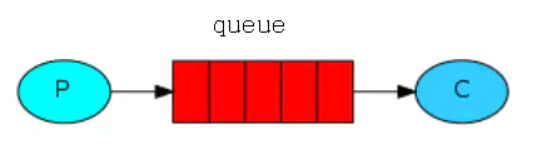

消息流

##### RabbitMQ 基本概念

上面只是最简单抽象的描述，具体到 RabbitMQ 则有更详细的概念需要解释。上面介绍过 RabbitMQ 是 AMQP 协议的一个开源实现，所以其内部实际上也是 AMQP 中的基本概念：

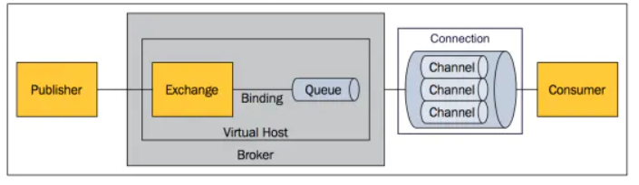

RabbitMQ 内部结构

1. Message
    消息，消息是不具名的，它由消息头和消息体组成。消息体是不透明的，而消息头则由一系列的可选属性组成，这些属性包括routing-key（路由键）、priority（相对于其他消息的优先权）、delivery-mode（指出该消息可能需要持久性存储）等。
2. Publisher
    消息的生产者，也是一个向交换器发布消息的客户端应用程序。
3. Exchange
    交换器，用来接收生产者发送的消息并将这些消息路由给服务器中的队列。
4. Binding
    绑定，用于消息队列和交换器之间的关联。一个绑定就是基于路由键将交换器和消息队列连接起来的路由规则，所以可以将交换器理解成一个由绑定构成的路由表。
5. Queue
    消息队列，用来保存消息直到发送给消费者。它是消息的容器，也是消息的终点。一个消息可投入一个或多个队列。消息一直在队列里面，等待消费者连接到这个队列将其取走。
6. Connection
    网络连接，比如一个TCP连接。
7. Channel
    信道，多路复用连接中的一条独立的双向数据流通道。信道是建立在真实的TCP连接内地虚拟连接，AMQP 命令都是通过信道发出去的，不管是发布消息、订阅队列还是接收消息，这些动作都是通过信道完成。因为对于操作系统来说建立和销毁 TCP 都是非常昂贵的开销，所以引入了信道的概念，以复用一条 TCP 连接。
8. Consumer
    消息的消费者，表示一个从消息队列中取得消息的客户端应用程序。
9. Virtual Host
    虚拟主机，表示一批交换器、消息队列和相关对象。虚拟主机是共享相同的身份认证和加密环境的独立服务器域。每个 vhost 本质上就是一个 mini 版的 RabbitMQ 服务器，拥有自己的队列、交换器、绑定和权限机制。vhost 是 AMQP 概念的基础，必须在连接时指定，RabbitMQ 默认的 vhost 是 / 。
10. Broker
     表示消息队列服务器实体。

##### AMQP 中的消息路由

AMQP 中消息的路由过程和 Java 开发者熟悉的 JMS 存在一些差别，AMQP 中增加了 Exchange 和 Binding 的角色。生产者把消息发布到 Exchange 上，消息最终到达队列并被消费者接收，而 Binding 决定交换器的消息应该发送到那个队列。

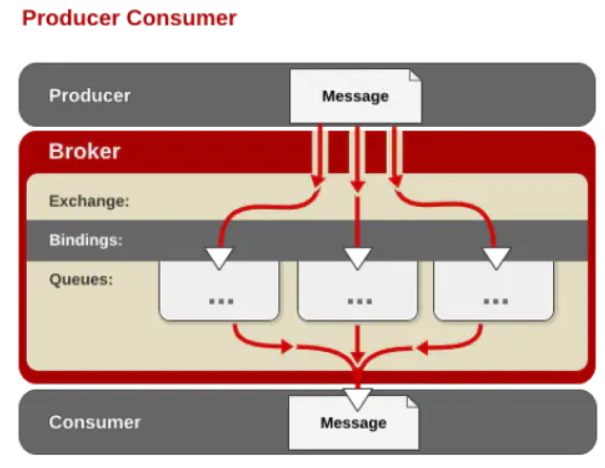

​                                                                   AMQP 的消息路由过程

##### Exchange 类型

Exchange分发消息时根据类型的不同分发策略有区别，目前共四种类型：direct、fanout、topic、headers 。headers 匹配 AMQP 消息的 header 而不是路由键，此外 headers 交换器和 direct 交换器完全一致，但性能差很多，目前几乎用不到了，所以直接看另外三种类型：

1. direct

   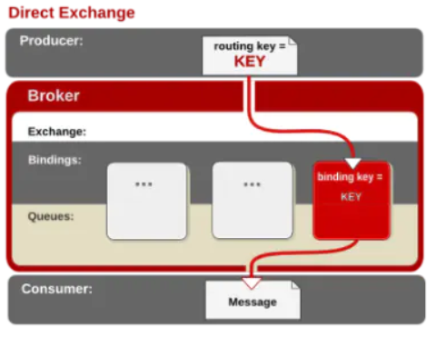

   direct 交换器

   消息中的路由键（routing key）如果和 Binding 中的 binding key 一致， 交换器就将消息发到对应的队列中。路由键与队列名完全匹配，如果一个队列绑定到交换机要求路由键为“dog”，则只转发 routing key 标记为“dog”的消息，不会转发“dog.puppy”，也不会转发“dog.guard”等等。它是完全匹配、单播的模式。

2. fanout

   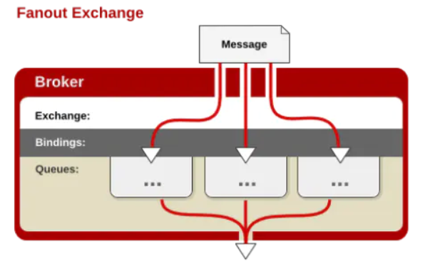

   fanout 交换器

   每个发到 fanout 类型交换器的消息都会分到所有绑定的队列上去。fanout 交换器不处理路由键，只是简单的将队列绑定到交换器上，每个发送到交换器的消息都会被转发到与该交换器绑定的所有队列上。很像子网广播，每台子网内的主机都获得了一份复制的消息。fanout 类型转发消息是最快的。

3. topic

   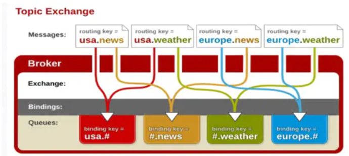

   topic 交换器

   topic 交换器通过模式匹配分配消息的路由键属性，将路由键和某个模式进行匹配，此时队列需要绑定到一个模式上。它将路由键和绑定键的字符串切分成单词，这些单词之间用点隔开。它同样也会识别两个通配符：符号“#”和符号“

   ”。#匹配0个或多个单词，

   匹配不多不少一个单词。

## 准备工作

- Installing RabbitMQ https://rabbitmq.com/download.html

- 之前的mybatisplusapp项目做为client
- bus项目新建

### RabittMQ 安装

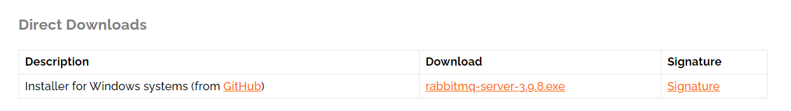

下载

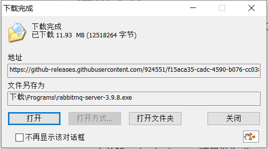

下载完成后点击安装

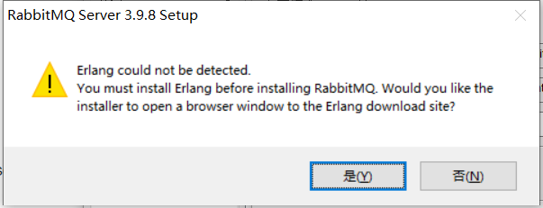

报错说Erlang没有找到, 点击是以后下载安装Erlang

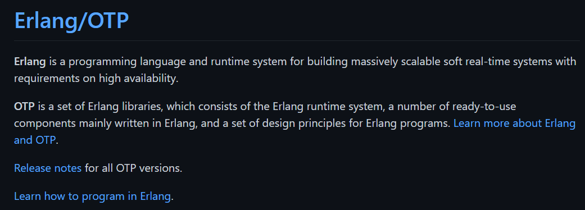

Erlang 是一种编程语言和运行时系统，用于构建具有高可用性要求的可大规模扩展的软实时系统。

OTP 是一组 Erlang 库，它由 Erlang 运行时系统、一些主要用 Erlang 编写的即用型组件和一组 Erlang 程序设计原则组成。了解有关 Erlang 和 OTP 的更多信息。

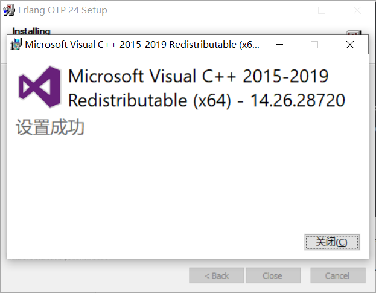

下载完成后安装

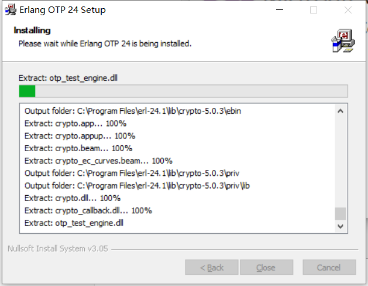

Erlang安装好后再安装RibbitMQ

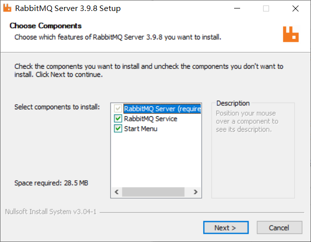

下一步下一步,完成

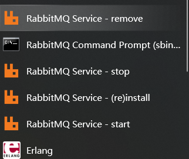

开始菜单看到已经安装完成

打开start

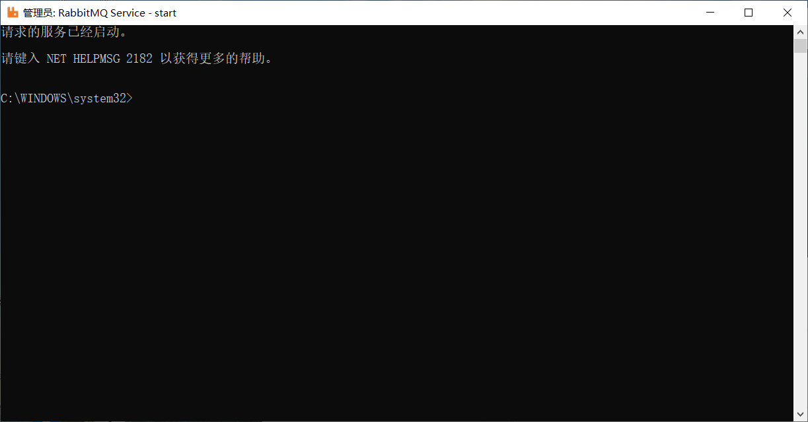

### RabittMQ如何使用

#### AMQP

AMQP，即Advanced Message Queuing Protocol,一个提供统一消息服务的应用层标准高级消息队列协议,是应用层协议的一个开放标准,为面向消息的中间件设计。基于此协议的客户端与消息中间件可传递消息，并不受客户端/中间件不同产品，不同的开发语言等条件的限制。Erlang中的实现有 RabbitMQ等。
Advanced Message Queuing Protocol 高级消息队列协议

#### Erlang语言
Erlang是一种通用的并发程序设计语言，它由乔·阿姆斯特朗（Joe Armstrong）在瑞典电信设备制造商爱立信所辖的计算机科学研究室开发，目的是创造一种可以应付大规模开发活动的程序设计语言和运行环境。Erlang于1987年发布正式版本，最早是爱立信拥有的私有软件，经过十年的发展，于1998年发表开放源代码版本。

Erlang是运作于虚拟机的解释型语言，但是现在也包含有乌普萨拉大学高性能Erlang计划（HiPE）[3]开发的原生代码编译器，自R11B-4版本开始，Erlang也支持脚本方式执行。在编程范型上，Erlang属于多重典范编程语言，涵盖函数式、并行及分布式。循序运行的Erlang是一个及早求值, 单次赋值和动态类型的函数式编程语言。
#### 消息队列(Message Queue)
在计算机科学中，消息队列（英语：Message queue）是一种进程间通信或同一进程的不同线程间的通信方式，软件的贮列用来处理一系列的输入，通常是来自用户。消息队列提供了异步的通信协议，每一个贮列中的纪录包含详细说明的数据，包含发生的时间，输入设备的种类，以及特定的输入参数，也就是说：消息的发送者和接收者不需要同时与消息队列交互。消息会保存在队列中，直到接收者取回它。

实际上，消息队列常常保存在链表结构中。拥有权限的进程可以向消息队列中写入或读取消息。
目前，有很多消息队列有很多开源的实现，包括JBoss Messaging、JORAM、Apache ActiveMQ、Sun Open Message Queue、RabbitMQ、IBM MQ、Apache Qpid和HTTPSQS。

#### RabbitMQ简介

RabbitMQ是实现了高级消息队列协议（AMQP）的开源消息代理软件（亦称面向消息的中间件）。RabbitMQ服务器是用Erlang语言编写的，而群集和故障转移是构建在开放电信平台框架上的。所有主要的编程语言均有与代理接口通讯的客户端库。

RabbitMQ支持以下操作系统：

- Windows
- Linux/Unix
- MAC OS X

RabbitMQ支持下列编程语言：

C# (using .net/c# client)
clojure (using Langohr)
erlang (using erlang client)
java (using java client)
javascript/node.js (using amqp.node)
perl (using Net::RabbitFoot)
python (using pika)
python-puka (using puka)
ruby (using Bunny)
ruby (using amqp gem)

#### 配置可视化RabbitMQ管理界面

打开命令行工具

安装可视化管理工具`rabbitmq-plugins enable rabbitmq_management`

~~~bash
Enabling plugins on node rabbit@DESKTOP-M42R5EL:
rabbitmq_management
The following plugins have been configured:
  rabbitmq_management
  rabbitmq_management_agent
  rabbitmq_web_dispatch
Applying plugin configuration to rabbit@DESKTOP-M42R5EL...
The following plugins have been enabled:
  rabbitmq_management
  rabbitmq_management_agent
  rabbitmq_web_dispatch

started 3 plugins.

~~~

安装完成

#### 打开管理界面

输入http://localhost:15672/进入

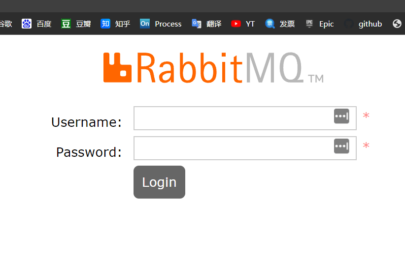

默认账户密码guest/guest,进入管理界面

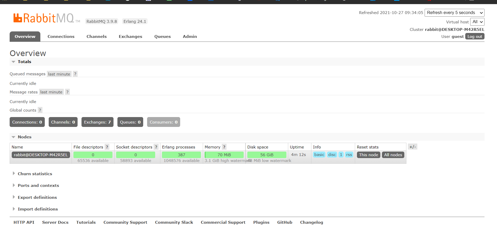

#### 创建用户

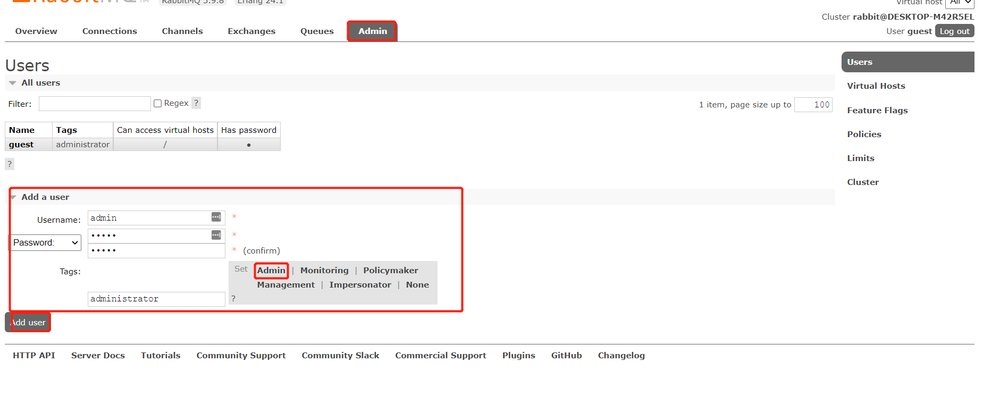

#### 配置权限

点击用户名

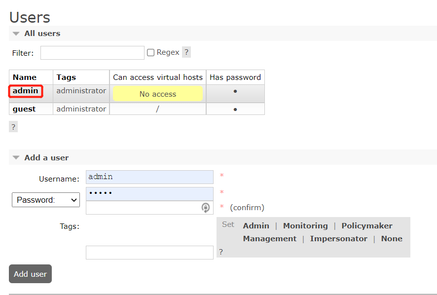

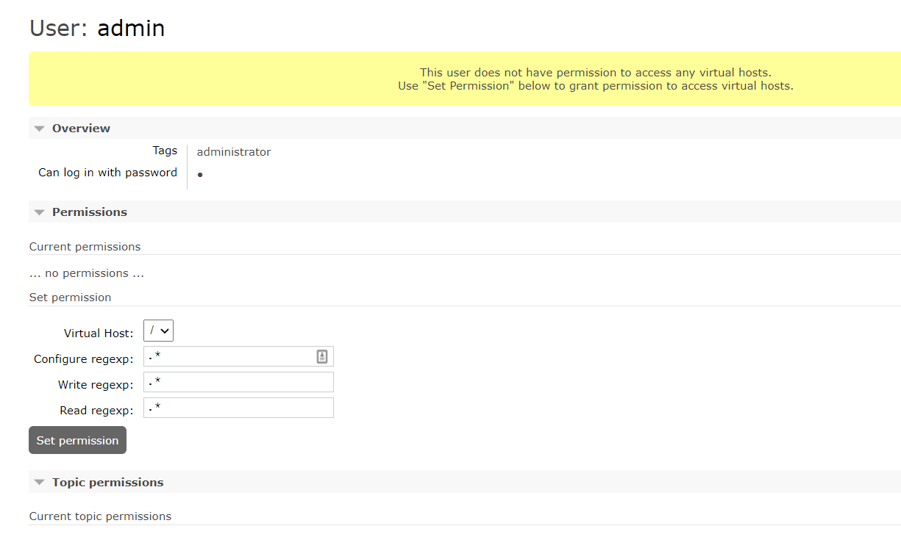

点击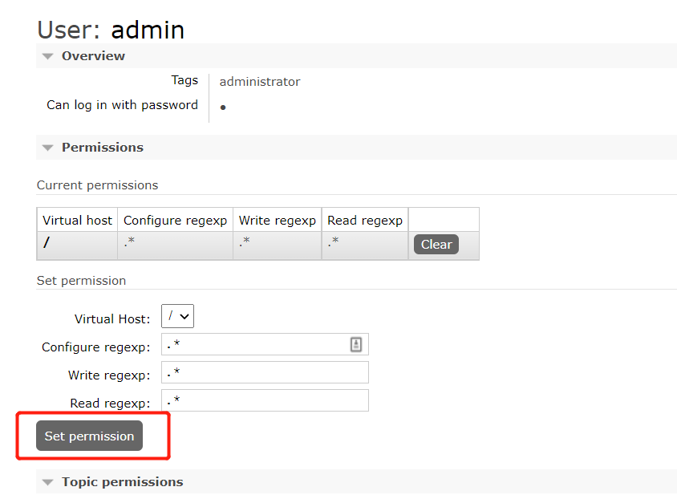

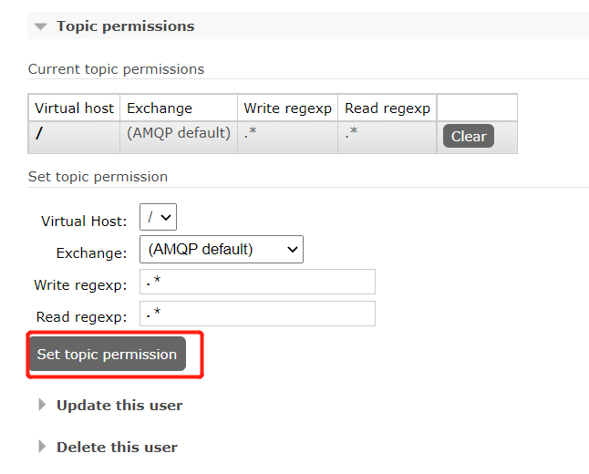

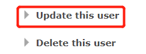

输入账户密码校验后权限成功

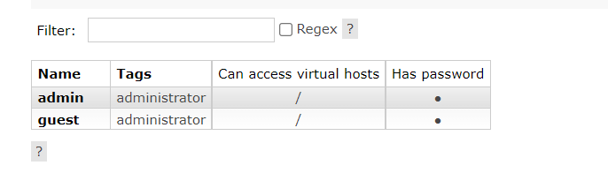

#### 在java中使用RabittMQ

演示demo

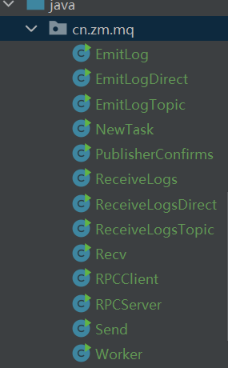

EmitLog
EmitLogDirect
EmitLogTopic
NewTask
PublisherConfirms
ReceiveLogs
ReceiveLogsDirect
ReceiveLogsTopic
Recv
RPCClient
RPCServer
Send
Worker

## 引用资料

>本项目所有代码
>
>https://github.com/niziming/SpringCloud-Seed
>
>Spring Cloud Bus的使用
>https://blog.csdn.net/m0_37564404/article/details/99680225
>
>Downloading and Installing RabbitMQ
>
>https://rabbitmq.com/download.html
>
>RabbitMQ的简单使用
>
>https://blog.csdn.net/wangbing25307/article/details/80845641
>
>Windows下安装使用RabbitMQ
>
>https://blog.csdn.net/steve_frank/article/details/106376239
>https://www.jianshu.com/p/79ca08116d57/
