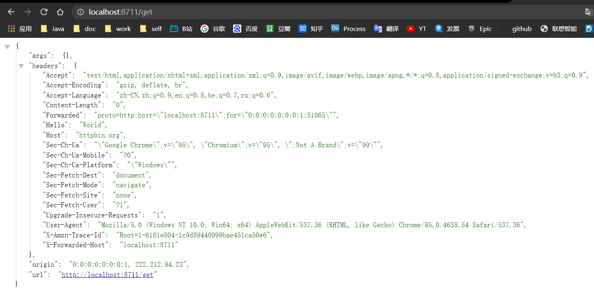
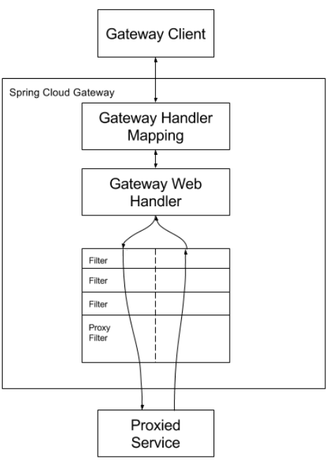
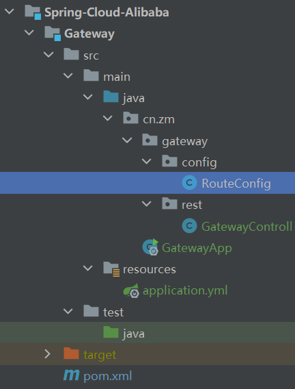

---

title: SpringCloud微服务系列04-Alibaba架构01-Gateway-01-intro
subtitle: SpringCloud微服务系列04-Alibaba架构01-Gateway-01-intro
catalog: true
tags: [SpringCloud, SpringCloudAlibaba, Gateway]
date: 2021-11-02 15:01:29
header-img:
---

# SpringCloud微服务系列04-Alibaba架构01-Gateway-01-intro

Spring Cloud Gateway是Spring Cloud官方推出的第二代网关框架，取代Zuul网关。网关作为流量的，在微服务系统中有着非常作用，网关常见的功能有路由转发、权限校验、限流控制等作用。本文首先用官方的案例带领大家来体验下Spring Cloud的一些简单的功能，在后续文章我会使用详细的案例和源码解析来详细讲解Spring Cloud Gateway.

## 准备工作

- Gateway模块
- Spring-Cloud-Alibaba 父模块
- springboot springcloud springcloudalibaba的依赖关系(参考上一章节)
- SpringCloud-Seed模块

## 快速开始

### 总依赖SpringCloud-Seed模块

```xml
<?xml version="1.0" encoding="UTF-8"?>
<project xmlns="http://maven.apache.org/POM/4.0.0"
         xmlns:xsi="http://www.w3.org/2001/XMLSchema-instance"
         xsi:schemaLocation="http://maven.apache.org/POM/4.0.0 http://maven.apache.org/xsd/maven-4.0.0.xsd">
    <modelVersion>4.0.0</modelVersion>

    <parent>
        <groupId>org.springframework.boot</groupId>
        <artifactId>spring-boot-starter-parent</artifactId>
        <version>2.3.2.RELEASE</version>
        <!--<version>2.2.4.RELEASE</version>-->
        <!--<relativePath/> &lt;!&ndash; lookup parent from repository &ndash;&gt;-->
    </parent>

    <packaging>pom</packaging>
    <groupId>cn.zm</groupId>
    <artifactId>SpringCloud-Seed</artifactId>
    <version>1.0-SNAPSHOT</version>

    <description>
        三种主流方案的微服务种子项目
        1.Spring Cloud Netflix
        2.Spring-Cloud-Alibaba
        3.Apache-Dubbo-Zookeeper
    </description>

    <modules>
        <module>basic</module>
        <module>Micro-Service</module>
    </modules>

    <properties>
        <maven.compiler.source>8</maven.compiler.source>
        <maven.compiler.target>8</maven.compiler.target>
    </properties>

    <dependencyManagement>
        <dependencies>
            <!-- spring-boot -->
            <dependency>
                <groupId>org.springframework.boot</groupId>
                <artifactId>spring-boot-dependencies</artifactId>
                <version>${project.version}</version>
                <type>pom</type>
            </dependency>

            <dependency>
                <groupId>cn.zm</groupId>
                <artifactId>common</artifactId>
                <version>${project.version}</version>
            </dependency>

            <dependency>
                <groupId>cn.zm</groupId>
                <artifactId>mybatis-plus</artifactId>
                <version>${project.version}</version>
            </dependency>

            <dependency>
                <groupId>cn.zm</groupId>
                <artifactId>tk-mybatis</artifactId>
                <version>${project.version}</version>
            </dependency>

        </dependencies>
    </dependencyManagement>

    <build>
        <plugins>

            <!--文档工具-->
            <plugin>
                <groupId>org.apache.maven.plugins</groupId>
                <artifactId>maven-javadoc-plugin</artifactId>
            </plugin>

        </plugins>
    </build>
</project>
```

### Spring-Cloud-Alibaba 父模块 pom

```xml
<?xml version="1.0" encoding="UTF-8"?>
<project xmlns="http://maven.apache.org/POM/4.0.0"
         xmlns:xsi="http://www.w3.org/2001/XMLSchema-instance"
         xsi:schemaLocation="http://maven.apache.org/POM/4.0.0 http://maven.apache.org/xsd/maven-4.0.0.xsd">
    <parent>
        <artifactId>Micro-Service</artifactId>
        <groupId>cn.zm</groupId>
        <version>1.0-SNAPSHOT</version>
    </parent>
    <modelVersion>4.0.0</modelVersion>

    <artifactId>Spring-Cloud-Alibaba</artifactId>
    <packaging>pom</packaging>

    <modules>
        <module>Gateway</module>
    </modules>

    <properties>
        <maven.compiler.source>8</maven.compiler.source>
        <maven.compiler.target>8</maven.compiler.target>
        <spring-cloud.version>Hoxton.SR9</spring-cloud.version>
        <alibaba-cloud.version>2.2.6.RELEASE</alibaba-cloud.version>
    </properties>

    <dependencyManagement>
        <dependencies>

            <!--Spring Cloud Alibaba-->
            <dependency>
                <groupId>com.alibaba.cloud</groupId>
                <artifactId>spring-cloud-alibaba-dependencies</artifactId>
                <version>${alibaba-cloud.version}</version>
                <type>pom</type>
                <scope>import</scope>
            </dependency>

            <!--netflix cloud 统一基础依赖-->
            <dependency>
                <groupId>org.springframework.cloud</groupId>
                <artifactId>spring-cloud-dependencies</artifactId>
                <version>${spring-cloud.version}</version>
                <type>pom</type>
                <scope>import</scope>
            </dependency>

        </dependencies>
    </dependencyManagement>

</project>
```


### Gateway POM文件

```xml
<?xml version="1.0" encoding="UTF-8"?>
<project xmlns="http://maven.apache.org/POM/4.0.0"
         xmlns:xsi="http://www.w3.org/2001/XMLSchema-instance"
         xsi:schemaLocation="http://maven.apache.org/POM/4.0.0 http://maven.apache.org/xsd/maven-4.0.0.xsd">
    <parent>
        <artifactId>Spring-Cloud-Alibaba</artifactId>
        <groupId>cn.zm</groupId>
        <version>1.0-SNAPSHOT</version>
    </parent>
    <modelVersion>4.0.0</modelVersion>

    <artifactId>Gateway</artifactId>

    <properties>
        <maven.compiler.source>8</maven.compiler.source>
        <maven.compiler.target>8</maven.compiler.target>
    </properties>

    <dependencies>

        <!--gateway 网关-->
        <dependency>
            <groupId>org.springframework.cloud</groupId>
            <artifactId>spring-cloud-starter-gateway</artifactId>
        </dependency>

        <!--熔断-->
        <dependency>
            <groupId>org.springframework.cloud</groupId>
            <artifactId>spring-cloud-starter-netflix-hystrix</artifactId>
        </dependency>

    </dependencies>


</project>
```

### yml文件

```yml
server:
  port: 8711
spring:
  profiles:
    active: common
  application:
    name: gateway-8711
```

### RouteConfig类

```java
package cn.zm.gateway.config;

import org.springframework.cloud.gateway.route.RouteLocator;
import org.springframework.cloud.gateway.route.builder.RouteLocatorBuilder;
import org.springframework.context.annotation.Bean;
import org.springframework.context.annotation.Configuration;

/**
 * 功能描述: <br>
 * <路由配置>
 *
 * @author 十渊
 * @date 2021/11/2 16:18
 * @return
 */
@Configuration
public class RouteConfig {
  private final String URL = "http://httpbin.org";
  private final String URL1 = "http://www.baidu.com";
  private final String URL2 = "/error";
  private final String FORWARD = "/gateway/fallback";

  @Bean
  public RouteLocator gatewayRoute(RouteLocatorBuilder builder) {
    return builder.routes()
      .route(p -> p
        .path("/get")
        .filters(f -> f.addRequestHeader("Hello", "World"))
        .uri(URL))
      .build();
  }
}
```

### 测试route

~~~json
{
"args": {},
"headers": {
"Accept": "text/html,application/xhtml+xml,application/xml;q=0.9,image/avif,image/webp,image/apng,*/*;q=0.8,application/signed-exchange;v=b3;q=0.9",
"Accept-Encoding": "gzip, deflate, br",
"Accept-Language": "zh-CN,zh;q=0.9,en;q=0.8,be;q=0.7,ru;q=0.6",
"Content-Length": "0",
"Forwarded": "proto=http;host=\"localhost:8711\";for=\"0:0:0:0:0:0:0:1:51065\"",
"Hello": "World",
"Host": "httpbin.org",
"Sec-Ch-Ua": "\"Google Chrome\";v=\"95\", \"Chromium\";v=\"95\", \";Not A Brand\";v=\"99\"",
"Sec-Ch-Ua-Mobile": "?0",
"Sec-Ch-Ua-Platform": "\"Windows\"",
"Sec-Fetch-Dest": "document",
"Sec-Fetch-Mode": "navigate",
"Sec-Fetch-Site": "none",
"Sec-Fetch-User": "?1",
"Upgrade-Insecure-Requests": "1",
"User-Agent": "Mozilla/5.0 (Windows NT 10.0; Win64; x64) AppleWebKit/537.36 (KHTML, like Gecko) Chrome/95.0.4638.54 Safari/537.36",
"X-Amzn-Trace-Id": "Root=1-6181e804-1c9d89440999bae451ca50e6",
"X-Forwarded-Host": "localhost:8711"
},
"origin": "0:0:0:0:0:0:0:1, 222.212.94.23",
"url": "http://localhost:8711/get"
}
~~~




### 熔断配置

RouteConfig类添加

```java
package cn.zm.gateway.config;

import org.springframework.cloud.gateway.route.RouteLocator;
import org.springframework.cloud.gateway.route.builder.RouteLocatorBuilder;
import org.springframework.context.annotation.Bean;
import org.springframework.context.annotation.Configuration;

/**
 * 功能描述: <br>
 * <路由配置>
 *
 * @author 十渊
 * @date 2021/11/2 16:18
 * @return
 */
@Configuration
public class RouteConfig {
  private final String URL = "http://httpbin.org";
  private final String URL1 = "http://www.baidu.com";
  private final String URL2 = "/error";
  private final String FORWARD = "/gateway/fallback";

  @Bean
  public RouteLocator gatewayRoute(RouteLocatorBuilder builder) {
    return builder.routes()
      .route(p -> p
        .path("/get")
        .filters(f -> f.addRequestHeader("Hello", "World"))
        .uri(URL))
      .route(p -> p
        .host("*.hystrix.com")
        .filters(f -> f
          .hystrix(config -> config
            .setName("mycmd")
            .setFallbackUri("forward:/fallback")))
        .uri(URL))
      .build();
  }
}
```

### 熔断配置测试

```yml
spring:
  profiles: after_route
  cloud:
    gateway:
      routes:
      	- id: error_hystix
          uri: http://127.0.0.1:8083/
          predicates:
            - Path=/feign/**
          filters:
            - StripPrefix=1 #去掉Path前缀,参数为1代表去掉/ribbon
            - name: Hystrix
              args:
                name: test
                fallbackUri: forward:/gateway/fallback
```

windows下cmd打开命令行工具

~~~
Microsoft Windows [版本 10.0.19042.867]
(c) 2020 Microsoft Corporation. 保留所有权利。

C:\Users\DELL>curl
curl: try 'curl --help' for more information
~~~

~~~
测试结果
C:\Users\DELL>curl http://localhost:8711/feign/aaa
我是hystrix熔断后界面
~~~


## Gateway三个核心概念

- Route路由
  路由。路由是网关最基础的部分，路由信息有一个ID、一个目的URL、一组断言和一组Filter组成。如果断言路由为真，则说明请求的URL和配置匹配
- Predicate断言
  参考的是Java8中的断言函数。Spring Cloud Gateway中的断言函数输入类型是Spring5.0框架中的ServerWebExchange。Spring Cloud Gateway中的断言函数允许开发者去定义匹配来自于http request中的任何信息，比如请求头和参数等。如果请求与断言相匹配则进行该路由。
- Filter过滤
  一个标准的Spring webFilter。Spring cloud gateway中的filter分为两种类型的Filter，分别是Gateway Filter(路由过滤)和Global Filter(全局过滤)。过滤器Filter将会对请求和响应进行修改处理


### Gateway执行流程



客户端向Spring Cloud Gateway发出请求。然后在Gateway Handler Mapping中找到与请求相匹配的路由,将其发送到Gateway
Web Handler。Handler再通过指定的过滤器链来将请求发送到我们实际的服务执行业务逻辑，然后返回。
过滤器之间用虚线分开是因为过滤器可能会在发送代理请求之前( "pre" )或之后( "post" )执行业务逻辑。| I
Filter在 "pre" 类型的过滤器可以做参数校验、权限校验、流量监控、日志输出、协议转换等,
在"post"类型的过滤器中可以做响应内容、响应头的修改，日志的输出，流量监控等有着非常重要的作用。


## 目录结构




## 引用资料

>https://spring.io/guides/gs/gateway 
>
>https://www.fangzhipeng.com/springcloud/2018/11/06/sc-f-gateway1.html
>
>https://github.com/alibaba/spring-cloud-alibaba/blob/master/README-zh.md
>
>https://www.fangzhipeng.com/springcloud/2018/12/21/sc-f-gatway1.html
>
>https://www.fangzhipeng.com/springcloud/2018/12/05/sc-f-gateway2.html
>
>https://www.fangzhipeng.com/springcloud/2018/12/21/sc-f-gatway3.html
>
>springcloud之gateway路由熔断
>
>https://blog.csdn.net/guaniuqaq/article/details/88256226
