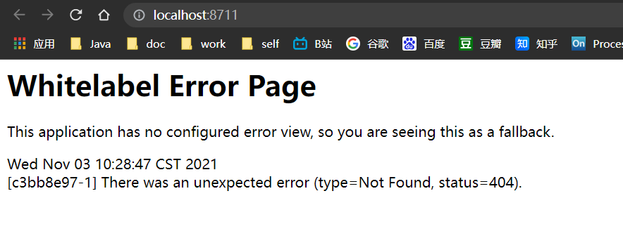
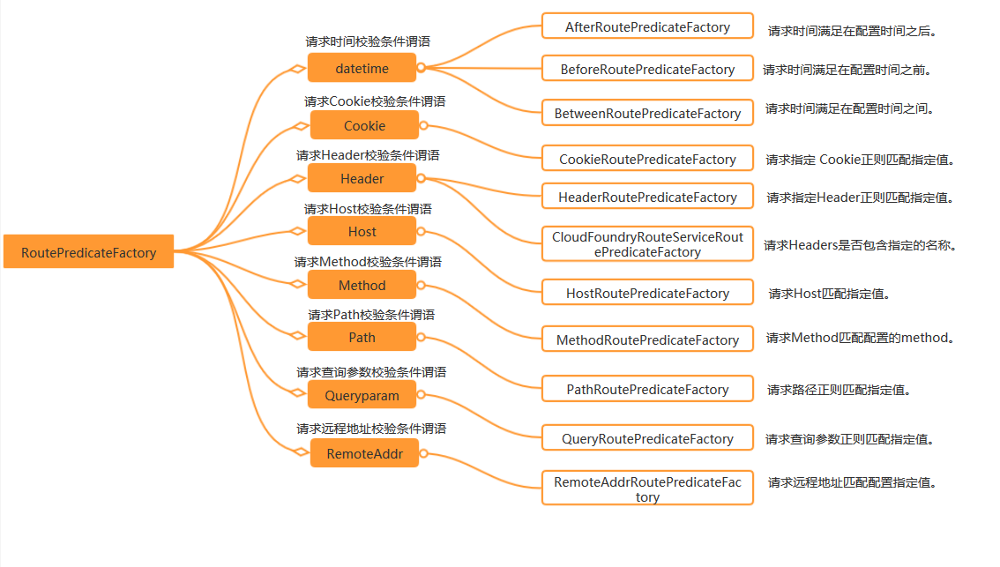

# SpringCloud微服务系列04-Alibaba架构01-Gateway-02-Predicate


## Route Predicate Factories

Spring Cloud Gateway 匹配路由作为 Spring WebFlux HandlerMapping 基础结构的一部分。 Spring Cloud Gateway 包括许多内置的路由谓词工厂。所有这些谓词都匹配 HTTP 请求的不同属性。可以组合多个路由谓词工厂，并通过逻辑与进行组合。

Spring Cloud Gateway matches routes as part of the Spring WebFlux `HandlerMapping` infrastructure. Spring Cloud Gateway includes many built-in Route Predicate Factories. All of these predicates match on different attributes of the HTTP request. Multiple Route Predicate Factories can be combined and are combined via logical `and`.

### After Route Predicate Factory

把RouteConfig.java注释掉

AfterRoutePredicateFactory，可配置一个时间，当请求的时间在配置时间之后，才交给 router去处理。否则则报错，不通过路由。

当请求的时间在这个配置的时间之后，请求会被路由到http://httpbin:org:80/get。:

在工程的application.yml配置如下：

```yml
server:
  port: 8711
spring:
  profiles:
    active: after_route
  application:
    name: gateway-8711

---

spring:
  profiles: after_route
  cloud:
    gateway:
      routes:
        - id: after_route
          uri: http://httpbin.org:80/get
#          当请求的时间在这个配置的时间之后，请求会被路由到http://httpbin:org:80/get。:
          predicates:
            - After=2017-01-20T17:42:47.789-07:00[America/Denver]
```

它实际被AfterRoutePredicateFactory这个类所处理，这个After就是指定了它的Gateway web handler类为AfterRoutePredicateFactory，同理，其他类型的predicate也遵循这个规则。

测试

进入服务http://localhost:8711/


after修改时间大于当前实际时间测试

```yml
#          当请求的时间在这个配置的时间之后，请求会被路由到http://httpbin:org:80/get。:
          predicates:
            - After=2022-01-20T17:42:47.789-07:00[America/Denver]
```

再次测试



### Before Route Predicate Factory

The Before Route Predicate Factory takes one parameter, a datetime. This predicate matches requests that happen before the current datetime.

和之前那个after的原理一养,只不过时间是方向


### Between Route Predicate Factory

```yml
predicates:
        - Between=2017-01-20T17:42:47.789-07:00[America/Denver], 2017-01-21T17:42:47.789-07:00[America/Denver]
```

在这个时间区间内可分发路由

### Cookie Route Predicate Factory

The Cookie Route Predicate Factory takes two parameters, the cookie name and a regular expression. This predicate matches cookies that have the given name and the value matches the regular expression.

Cookie Route Predicate Factory需要2个参数，一个时cookie名字，另一个时值，可以为正则表达式。它用于匹配请求中，带有该名称的cookie和cookie匹配正则表达式的请求。

```yml
spring:
  cloud:
    gateway:
      routes:
      - id: cookie_route
        uri: http://example.org
        predicates:
        - Cookie=chocolate, ch.p
```

在上面的配置中，请求带有cookie名为 name, cookie值为forezp 的请求将都会转发到uri为 http://httpbin.org:80/get的地址上。 使用curl命令进行请求，在请求中带上 cookie，会返回正确的结果，否则，请求报404错误。

当cookie匹配时转发

### Header Route Predicate Factory

The Header Route Predicate Factory takes two parameters, the header name and a regular expression. This predicate matches with a header that has the given name and the value matches the regular expression.

Header Route Predicate Factory需要2个参数，一个是header名，另外一个header值，该值可以是一个正则表达式。当此断言匹配了请求的header名和值时，断言通过，进入到router的规则中去。

```yml
spring:
  cloud:
    gateway:
      routes:
      - id: header_route
        uri: http://example.org
        predicates:
        - Header=X-Request-Id, \d+
```

在上面的配置中，当请求的Header中有X-Request-Id的header名，且header值为数字时，请求会被路由到配置的 uri. 使用curl执行以下命令:

~~~tex
C:\Users\DELL>curl -H Cookie:chocolate=ch.p http://localhost:8711/
<!DOCTYPE html>
<!--STATUS OK--><html> <head><meta http-equiv=content-type content=text/html;charset=utf-8><meta http-equiv=X-UA-Compatible content=IE=Edge><meta content=always name=referrer><link rel=stylesheet type=text/css href=http://s1.bdstatic.com/r/www/cache/bdorz/baidu.min.css><title>百度一下，你就知道</title></head> <body link=#0000cc> <div id=wrapper> <div id=head> <div class=head_wrapper> <div class=s_form> <div class=s_form_wrapper> <div id=lg>  </div> <form id=form name=f action=//www.baidu.com/s class=fm> <input type=hidden name=bdorz_come value=1> <input type=hidden name=ie value=utf-8> <input type=hidden name=f value=8> <input type=hidden name=rsv_bp value=1> <input type=hidden name=rsv_idx value=1> <input type=hidden name=tn value=baidu><span class="bg s_ipt_wr"><input id=kw name=wd class=s_ipt value maxlength=255 autocomplete=off autofocus></span><span class="bg s_btn_wr"><input type=submit id=su value=百度一下 class="bg s_btn"></span> </form> </div> </div> <div id=u1> <a href=http://news.baidu.com name=tj_trnews class=mnav>新闻</a> <a href=http://www.hao123.com name=tj_trhao123 class=mnav>hao123</a> <a href=http://map.baidu.com name=tj_trmap class=mnav>地图</a> <a href=http://v.baidu.com name=tj_trvideo class=mnav>视频</a> <a href=http://tieba.baidu.com name=tj_trtieba class=mnav>贴吧</a> <noscript> <a href=http://www.baidu.com/bdorz/login.gif?login&amp;tpl=mn&amp;u=http%3A%2F%2Fwww.baidu.com%2f%3fbdorz_come%3d1 name=tj_login class=lb>登录</a> </noscript> <script>document.write('<a href="http://www.baidu.com/bdorz/login.gif?login&tpl=mn&u='+ encodeURIComponent(window.location.href+ (window.location.search === "" ? "?" : "&")+ "bdorz_come=1")+ '" name="tj_login" class="lb">登录</a>');</script> <a href=//www.baidu.com/more/ name=tj_briicon class=bri style="display: block;">更多产品</a> </div> </div> </div> <div id=ftCon> <div id=ftConw> <p id=lh> <a href=http://home.baidu.com>关于百度</a> <a href=http://ir.baidu.com>About Baidu</a> </p> <p id=cp>&copy;2017&nbsp;Baidu&nbsp;<a href=http://www.baidu.com/duty/>使用百度前必读</a>&nbsp; <a href=http://jianyi.baidu.com/ class=cp-feedback>意见反馈</a>&nbsp;京ICP证030173号&nbsp;  </p> </div> </div> </div> </body> </html>
~~~


执行命令后，会正确的返回请求结果，结果省略。如果在请求中没有带上X-Request-Id的header名，并且值不为数字时，请求就会报404，路由没有被正确转发。

This route matches if the request has a header named `X-Request-Id` whos value matches the `\d+` regular expression (has a value of one or more digits).

### Host Route Predicate Factory

The Host Route Predicate Factory takes one parameter: the host name pattern. The pattern is an Ant style pattern with `.` as the separator. This predicates matches the `Host` header that matches the pattern.

```yml
spring:
  profiles:
    active: host_route
---
spring:
  cloud:
    gateway:
      routes:
      - id: host_route
        uri: http://httpbin.org:80/get
        predicates:
        - Host=**.jermaine.com
  profiles: host_route
```

在上面的配置中，请求头中含有Host为fangzhipeng.com的请求将会被路由转发转发到配置的uri。 启动工程，执行以下的curl命令，请求会返回正确的请求结果：

```txt
curl -H 'Host:www.fangzhipeng.com' localhost:8081
```

输入`curl -H Host:www.jerma.com http://localhost:8711` 结果如下

~~~txt
C:\Users\DELL>curl -H Host:www.jerma.com http://localhost:8711
{"timestamp":"2021-11-04T01:39:59.438+00:00","path":"/","status":404,"error":"Not Found","message":null,"requestId":"ed01fe77-5"}
~~~

输入`curl -H Host:www.jermaine.com http://localhost:8711`后结果如下

~~~txt
C:\Users\DELL>curl -H Host:www.jermaine.com http://localhost:8711
<!DOCTYPE html>
<html lang="en">
<head>
    <meta charset="UTF-8">
    <title>httpbin.org</title>
    <link href="https://fonts.googleapis.com/css?family=Open+Sans:400,700|Source+Code+Pro:300,600|Titillium+Web:400,600,700"
        rel="stylesheet">
    <link rel="stylesheet" type="text/css" href="/flasgger_static/swagger-ui.css">
    <link rel="icon" type="image/png" href="/static/favicon.ico" sizes="64x64 32x32 16x16" />
    <style>
        html {
            box-sizing: border-box;
            overflow: -moz-scrollbars-vertical;
            overflow-y: scroll;
        }
~~~

### Method Route Predicate Factory

The Method Route Predicate Factory takes one parameter: the HTTP method to match.

Method Route Predicate Factory 需要一个参数，即请求的类型。比如GET类型的请求都转发到此路由。在工程的配置文件加上以下的配置：

```yml
---
spring:
  cloud:
    gateway:
      routes:
      - id: method_route
        uri: http://httpbin.org:80/get
        predicates:
        - Method=GET
  profiles: method_route
```

` curl localhost:8081`

使用 curl命令模拟 post请求，则返回404结果。

`curl -XPOST localhost:8081`

### Path Route Predicate Factory

The Path Route Predicate Factory takes one parameter: a Spring `PathMatcher` pattern.

Path Route Predicate Factory 需要一个参数: 一个spel表达式，应用匹配路径。

在工程的配置文件application.yml文件中，做以下的配置：

这个是目前所有predicates中使用最频繁的:

```yml
---
spring:
  cloud:
    gateway:
      routes:
      - id: path_route
        uri: http://httpbin.org:80/get
        predicates:
        - Path=/foo/{segment}
  profiles: path_route
  
```

### Query Route Predicate Factory

The Query Route Predicate Factory takes two parameters: a required `param` and an optional `regexp`.

Query Route Predicate Factory 需要2个参数:一个参数名和一个参数值的正则表达式。在工程的配置文件application.yml做以下的配置：

```yml
---
spring:
  cloud:
    gateway:
      routes:
      - id: query_route
        uri: http://httpbin.org:80/get
        predicates:
        - Query=foo, ba.
  profiles: query_route
```

`curl localhost:8081?foo=bar`

Query Route Predicate Factory也可以只填一个参数，填一个参数时，则只匹配参数名，即请求的参数中含有配置的参数名，则命中路由。比如以下的配置中，配置了请求参数中含有参数名为foo 的参数将会被请求转发到uri为http://httpbin.org:80/get。

```yml
spring:
  cloud:
    gateway:
      routes:
      - id: query_route
        uri: http://httpbin.org:80/get
        predicates:
        - Query=foo
  profiles: query_route
```

### RemoteAddr Route Predicate Factory

he RemoteAddr Route Predicate Factory takes a list (min size 1) of CIDR-notation (IPv4 or IPv6) strings, e.g. `192.168.0.1/16` (where `192.168.0.1` is an IP address and `16` is a subnet mask).

**application.yml.** 

```
spring:
  cloud:
    gateway:
      routes:
      - id: remoteaddr_route
        uri: http://example.org
        predicates:
        - RemoteAddr=192.168.1.1/24
```


This route would match if the remote address of the request was, for example, `192.168.1.10`.

还有很多Predicate Factory可以参考https://cloud.spring.io/spring-cloud-static/spring-cloud-gateway/2.0.0.RELEASE/single/spring-cloud-gateway.html#gateway-starter

总结如一下图片




## 引用资料

>https://spring.io/guides/gs/gateway 
>
>https://www.fangzhipeng.com/springcloud/2018/11/06/sc-f-gateway1.html
>
>https://github.com/alibaba/spring-cloud-alibaba/blob/master/README-zh.md
>
>https://www.fangzhipeng.com/springcloud/2018/12/21/sc-f-gatway1.html
>
>https://www.fangzhipeng.com/springcloud/2018/12/05/sc-f-gateway2.html
>
>https://www.fangzhipeng.com/springcloud/2018/12/21/sc-f-gatway3.html
>
>springcloud之gateway路由熔断
>
>https://blog.csdn.net/guaniuqaq/article/details/88256226
