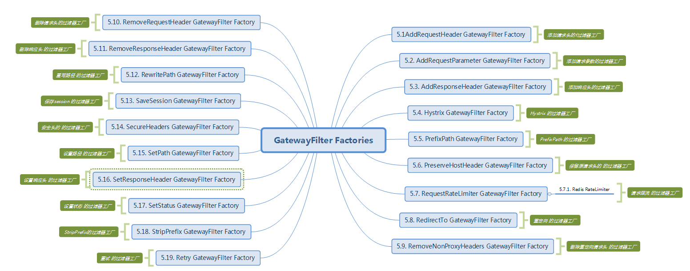
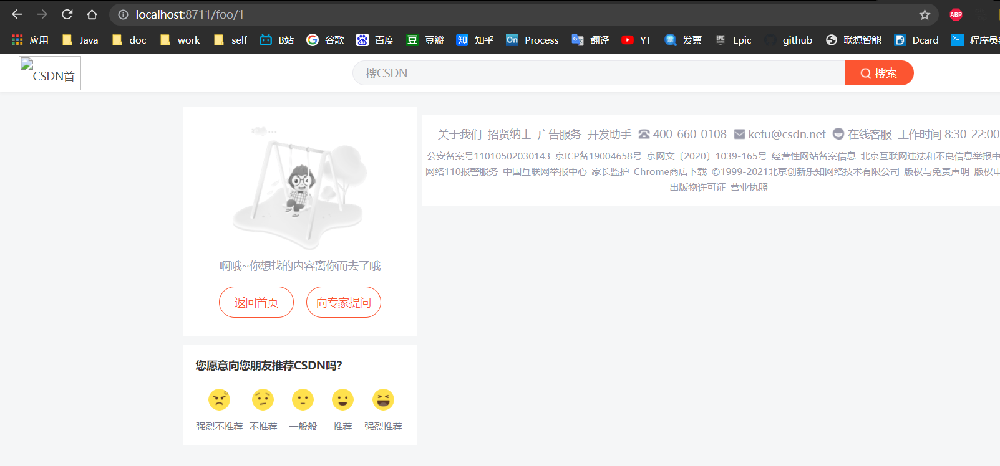
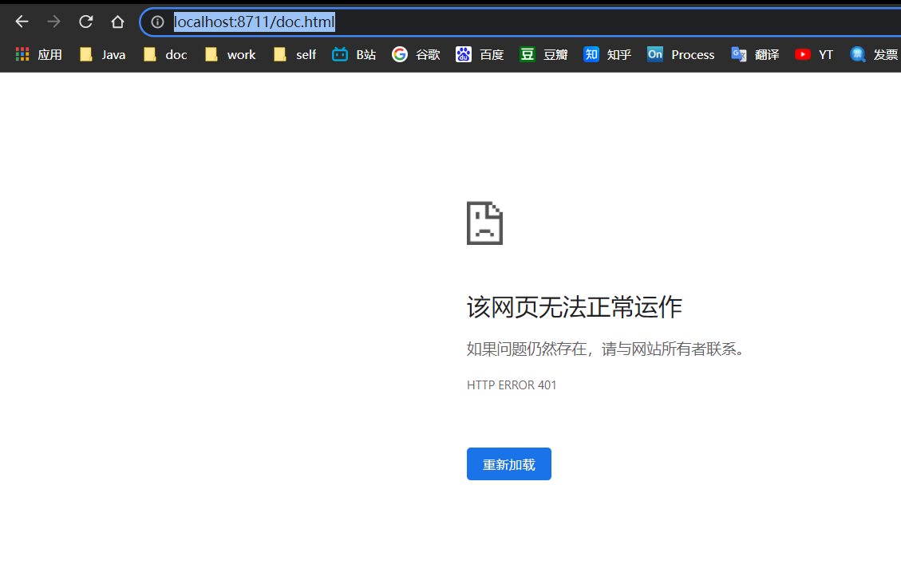
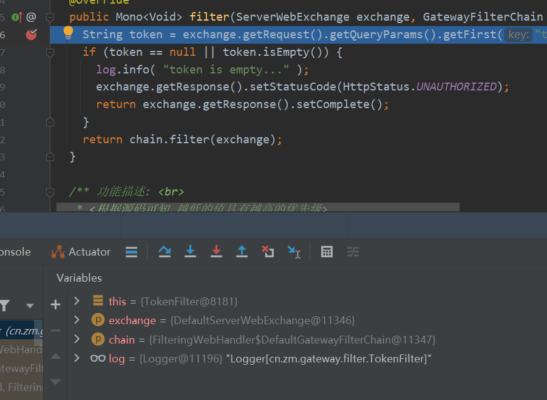

# SpringCloud微服务系列04-Alibaba架构01-Gateway-03-Filter

在上一篇文章详细的介绍了Gateway的Predict，Predict决定了请求由哪一个路由处理，在路由处理之前，需要经过“pre”类型的过滤器处理，处理返回响应之后，可以由“post”类型的过滤器处理。

## filter的作用和生命周期

由filter工作流程点，可以知道filter有着非常重要的作用，在“pre”类型的过滤器可以做参数校验、权限校验、流量监控、日志输出、协议转换等，在“post”类型的过滤器中可以做响应内容、响应头的修改，日志的输出，流量监控等。首先需要弄清一点为什么需要网关这一层，这就不得不说下filter的作用了。

## 作用

当我们有很多个服务时，比如下图中的user-service、goods-service、sales-service等服务，客户端请求各个服务的Api时，每个服务都需要做相同的事情，比如鉴权、限流、日志输出等。


对于这样重复的工作，有没有办法做的更好，答案是肯定的。在微服务的上一层加一个全局的权限控制、限流、日志输出的Api Gatewat服务，然后再将请求转发到具体的业务服务层。这个Api Gateway服务就是起到一个服务边界的作用，外接的请求访问系统，必须先通过网关层。


## 生命周期

Spring Cloud Gateway同zuul类似，有“pre”和“post”两种方式的filter。客户端的请求先经过“pre”类型的filter，然后将请求转发到具体的业务服务，比如上图中的user-service，收到业务服务的响应之后，再经过“post”类型的filter处理，最后返回响应到客户端。


与zuul不同的是，filter除了分为“pre”和“post”两种方式的filter外，在Spring Cloud Gateway中，filter从作用范围可分为另外两种，一种是针对于单个路由的gateway filter，它在配置文件中的写法同predict类似；另外一种是针对于所有路由的global gateway filer。现在从作用范围划分的维度来讲解这两种filter。

## gateway filter

过滤器允许以某种方式修改传入的HTTP请求或传出的HTTP响应。过滤器可以限定作用在某些特定请求路径上。 Spring Cloud Gateway包含许多内置的GatewayFilter工厂。

GatewayFilter工厂同上一篇介绍的Predicate工厂类似，都是在配置文件application.yml中配置，遵循了约定大于配置的思想，只需要在配置文件配置GatewayFilter Factory的名称，而不需要写全部的类名，比如AddRequestHeaderGatewayFilterFactory只需要在配置文件中写AddRequestHeader，而不是全部类名。在配置文件中配置的GatewayFilter Factory最终都会相应的过滤器工厂类处理。

Spring Cloud Gateway 内置的过滤器工厂一览表如下：



现在挑几个常见的过滤器工厂来讲解，每一个过滤器工厂在官方文档都给出了详细的使用案例，如果不清楚的还可以在org.springframework.cloud.gateway.filter.factory看每一个过滤器工厂的源码。

### AddRequestHeader GatewayFilter Factory

配置文件为add_request_header_route，在add_request_header_route配置中，配置了roter的id为add_request_header_route，路由地址为http://httpbin.org:80/get，该router有AfterPredictFactory，有一个filter为AddRequestHeaderGatewayFilterFactory(约定写成AddRequestHeader)，AddRequestHeader过滤器工厂会在请求头加上一对请求头，名称为X-Request-Foo，值为Bar。为了验证AddRequestHeaderGatewayFilterFactory是怎么样工作的，查

```yml
---
spring:
  cloud:
    gateway:
      routes:
      - id: add_request_header_route
        uri: http://httpbin.org:80/get
        filters:
        - AddRequestHeader=X-Request-Foo, Bar
        predicates:
        - After=2017-01-20T17:42:47.789-07:00[America/Denver]
  profiles: add_request_header_route
```

访问页面,请求自动加上了`"X-Request-Foo": "Bar"`


看它的源码，AddRequestHeaderGatewayFilterFactory的源码如下：

```java
public class AddRequestHeaderGatewayFilterFactory extends AbstractNameValueGatewayFilterFactory {

	@Override
	public GatewayFilter apply(NameValueConfig config) {
		return (exchange, chain) -> {
			ServerHttpRequest request = exchange.getRequest().mutate()
					.header(config.getName(), config.getValue())
					.build();

			return chain.filter(exchange.mutate().request(request).build());
		};
    }

}
```

由上面的代码可知，根据旧的ServerHttpRequest创建新的 ServerHttpRequest ，在新的ServerHttpRequest加了一个请求头，然后创建新的 ServerWebExchange ，提交过滤器链继续过滤。


### RewritePath GatewayFilter Factory

在Nginx服务启中有一个非常强大的功能就是重写路径，Spring Cloud Gateway默认也提供了这样的功能，这个功能是Zuul没有的。在配置文件中加上以下的配置：

```yml
---
spring:
  cloud:
    gateway:
      routes:
      - id: rewritepath_route
        uri: https://blog.csdn.net
        predicates:
        - Path=/foo/**
        filters:
        - RewritePath=/foo/(?<segment>.*), /$\{segment}
  profiles: rewritepath_route
```

上面的配置中，所有的/foo/**开始的路径都会命中配置的router，并执行过滤器的逻辑，在本案例中配置了RewritePath过滤器工厂，此工厂将/foo/(?.*)重写为{segment}，然后转发到https://blog.csdn.net。比如在网页上请求localhost:8081/foo/forezp，此时会将请求转发到https://blog.csdn.net/forezp的页面，比如在网页上请求localhost:8081/foo/forezp/1，页面显示404，就是因为不存在https://blog.csdn.net/forezp/1这个页面。




## 自定义过滤器

Spring Cloud Gateway内置了19种强大的过滤器工厂，能够满足很多场景的需求，那么能不能自定义自己的过滤器呢，当然是可以的。在spring Cloud Gateway中，过滤器需要实现GatewayFilter和Ordered2个接口。写一个RequestTimeFilter，代码如下：

```java
package cn.zm.gateway.filter;import org.springframework.cloud.gateway.filter.GatewayFilter;import org.springframework.cloud.gateway.filter.GatewayFilterChain;import org.springframework.core.Ordered;import org.springframework.web.server.ServerWebExchange;import reactor.core.publisher.Mono;public class RequestTimeFilter implements GatewayFilter, Ordered {  @Override  public Mono<Void> filter(ServerWebExchange exchange, GatewayFilterChain chain) {    return null;  }  @Override  public int getOrder() {    return 0;  }}
```

在上面的代码中，Ordered中的int getOrder()方法是来给过滤器设定优先级别的，值越大则优先级越低。还有有一个filterI(exchange,chain)方法，在该方法中，先记录了请求的开始时间，并保存在ServerWebExchange中，此处是一个“pre”类型的过滤器，然后再chain.filter的内部类中的run()方法中相当于”post”过滤器，在此处打印了请求所消耗的时间。然后将该过滤器注册到router中，代码如下：

```java
package cn.zm.gateway.config;

import cn.zm.gateway.filter.RequestTimeFilter;
import org.springframework.cloud.gateway.route.RouteLocator;
import org.springframework.cloud.gateway.route.builder.RouteLocatorBuilder;
import org.springframework.context.annotation.Bean;
import org.springframework.context.annotation.Configuration;

/**
 * 功能描述: <br>
 * <路由配置>
 *
 * @author 十渊
 * @date 2021/11/2 16:18
 * @return
 */
@Configuration
public class RouteConfig {
  private final String URL = "http://httpbin.org";
  private final String URL1 = "http://www.baidu.com";
  private final String URL2 = "/error";
  private final String FORWARD = "/gateway/fallback";

  @Bean
  public RouteLocator customerRouteLocator(RouteLocatorBuilder builder) {
    // @formatter:off
    return builder.routes()
      .route(r -> r.path("/customer/**")
        .filters(f -> f.filter(new RequestTimeFilter())
          .addResponseHeader("X-Response-Default-Foo", "Default-Bar"))
        .uri("http://httpbin.org:80/get")
        .order(0)
        .id("customer_filter_router")
      )
      .build();
    // @formatter:on
  }


  // @Bean
  // public RouteLocator gatewayRoute(RouteLocatorBuilder builder) {
  //   return builder.routes()
  //     .route(p -> p
  //       .path("/get")
  //       .filters(f -> f.addRequestHeader("Hello", "World"))
  //       .uri(URL))
  //     .route(p -> p
  //       // .host("*.hystrix.com")
  //       .path("/err")
  //       .filters(f -> f
  //         .hystrix(config -> config
  //           .setName("mycmd")
  //           .setFallbackUri("forward:/fallback")))
  //       .uri(URL2))
  //     .build();
  // }
}
```

浏览器访问测试

日志输出结果如下


## 自定义过滤器工厂

查看gateway包下filter的factory的依赖关系


依赖关系如下


顶层接口未GatewayFilterFactory

抽象类代码如下

```java
package org.springframework.cloud.gateway.filter.factory;

import org.springframework.cloud.gateway.support.AbstractConfigurable;
import org.springframework.context.ApplicationEventPublisher;
import org.springframework.context.ApplicationEventPublisherAware;

/**
 * This class is BETA and may be subject to change in a future release.
 *
 * @param <C> {@link AbstractConfigurable} subtype
 */
public abstract class AbstractGatewayFilterFactory<C> extends AbstractConfigurable<C>
  implements GatewayFilterFactory<C>, ApplicationEventPublisherAware {

 private ApplicationEventPublisher publisher;

 @SuppressWarnings("unchecked")
 public AbstractGatewayFilterFactory() {
  super((Class<C>) Object.class);
 }

 public AbstractGatewayFilterFactory(Class<C> configClass) {
  super(configClass);
 }

 protected ApplicationEventPublisher getPublisher() {
  return this.publisher;
 }

 @Override
 public void setApplicationEventPublisher(ApplicationEventPublisher publisher) {
  this.publisher = publisher;
 }

 public static class NameConfig {

  private String name;

  public String getName() {
   return name;
  }

  public void setName(String name) {
   this.name = name;
  }

 }

}
```

RedirectToGatewayFilterFactory类的实现

```java
/*
 * Copyright 2013-2020 the original author or authors.
 *
 * Licensed under the Apache License, Version 2.0 (the "License");
 * you may not use this file except in compliance with the License.
 * You may obtain a copy of the License at
 *
 *      https://www.apache.org/licenses/LICENSE-2.0
 *
 * Unless required by applicable law or agreed to in writing, software
 * distributed under the License is distributed on an "AS IS" BASIS,
 * WITHOUT WARRANTIES OR CONDITIONS OF ANY KIND, either express or implied.
 * See the License for the specific language governing permissions and
 * limitations under the License.
 */

package org.springframework.cloud.gateway.filter.factory;

import java.net.URI;
import java.util.Arrays;
import java.util.List;

import reactor.core.publisher.Mono;

import org.springframework.cloud.gateway.filter.GatewayFilter;
import org.springframework.cloud.gateway.filter.GatewayFilterChain;
import org.springframework.cloud.gateway.support.HttpStatusHolder;
import org.springframework.http.HttpHeaders;
import org.springframework.http.HttpStatus;
import org.springframework.http.server.reactive.ServerHttpResponse;
import org.springframework.util.Assert;
import org.springframework.web.server.ServerWebExchange;

import static org.springframework.cloud.gateway.support.GatewayToStringStyler.filterToStringCreator;
import static org.springframework.cloud.gateway.support.ServerWebExchangeUtils.setResponseStatus;

/**
 * @author Spencer Gibb
 */
public class RedirectToGatewayFilterFactory
  extends AbstractGatewayFilterFactory<RedirectToGatewayFilterFactory.Config> {

 /**
  * Status key.
  */
 public static final String STATUS_KEY = "status";

 /**
  * URL key.
  */
 public static final String URL_KEY = "url";

 public RedirectToGatewayFilterFactory() {
  super(Config.class);
 }

 @Override
 public List<String> shortcutFieldOrder() {
  return Arrays.asList(STATUS_KEY, URL_KEY);
 }

 @Override
 public GatewayFilter apply(Config config) {
  return apply(config.status, config.url);
 }

 public GatewayFilter apply(String statusString, String urlString) {
  HttpStatusHolder httpStatus = HttpStatusHolder.parse(statusString);
  Assert.isTrue(httpStatus.is3xxRedirection(),
    "status must be a 3xx code, but was " + statusString);
  final URI url = URI.create(urlString);
  return apply(httpStatus, url);
 }

 public GatewayFilter apply(HttpStatus httpStatus, URI uri) {
  return apply(new HttpStatusHolder(httpStatus, null), uri);
 }

 public GatewayFilter apply(HttpStatusHolder httpStatus, URI uri) {
  return new GatewayFilter() {
   @Override
   public Mono<Void> filter(ServerWebExchange exchange,
     GatewayFilterChain chain) {
    if (!exchange.getResponse().isCommitted()) {
     setResponseStatus(exchange, httpStatus);

     final ServerHttpResponse response = exchange.getResponse();
     response.getHeaders().set(HttpHeaders.LOCATION, uri.toString());
     return response.setComplete();
    }
    return Mono.empty();
   }

   @Override
   public String toString() {
    String status;
    if (httpStatus.getHttpStatus() != null) {
     status = String.valueOf(httpStatus.getHttpStatus().value());
    }
    else {
     status = httpStatus.getStatus().toString();
    }
    return filterToStringCreator(RedirectToGatewayFilterFactory.this)
      .append(status, uri).toString();
   }
  };
 }

 public static class Config {

  String status;

  String url;

  public String getStatus() {
   return status;
  }

  public void setStatus(String status) {
   this.status = status;
  }

  public String getUrl() {
   return url;
  }

  public void setUrl(String url) {
   this.url = url;
  }

 }

}
```

现在模仿RedirectToGatewayFilterFactory实现一个将请求的日志打印出来的工厂类


在以下代码中 apply(Config config)方法内创建了一个GatewayFilter的匿名类，具体的实现逻辑跟之前一样，只不过加了是否打印请求参数的逻辑，而这个逻辑的开关是config.isWithParams()。静态内部类类Config就是为了接收那个boolean类型的参数服务的，里边的变量名可以随意写，但是要重写List shortcutFieldOrder()这个方法。 。

需要注意的是，在类的构造器中一定要调用下父类的构造器把Config类型传过去，否则会报ClassCastException

```java
package cn.zm.gateway.filter.factory;

import org.apache.commons.logging.Log;
import org.apache.commons.logging.LogFactory;
import org.springframework.cloud.gateway.filter.GatewayFilter;
import org.springframework.cloud.gateway.filter.factory.AbstractGatewayFilterFactory;
import reactor.core.publisher.Mono;

import java.util.Arrays;
import java.util.List;


/** 功能描述: <br>
 * <将请求的日志打印出来>
 *
 * @author 十渊
 * @date 2021/11/8 10:57
 * @return
 */

public class RequestTimeGatewayFilterFactory extends AbstractGatewayFilterFactory<RequestTimeGatewayFilterFactory.Config> {
  private static final Log log = LogFactory.getLog(GatewayFilter.class);
  private static final String REQUEST_TIME_BEGIN = "requestTimeBegin";
  private static final String KEY = "withParams";


  @Override
  public List<String> shortcutFieldOrder() {
    return Arrays.asList(KEY);
  }

  public RequestTimeGatewayFilterFactory() {
    super(Config.class);
  }

  @Override
  public GatewayFilter apply(Config config) {
    return (exchange, chain) -> {
      exchange.getAttributes().put(REQUEST_TIME_BEGIN, System.currentTimeMillis());
      return chain.filter(exchange).then(
        Mono.fromRunnable(() -> {
          Long startTime = exchange.getAttribute(REQUEST_TIME_BEGIN);
          if (startTime != null) {
            StringBuilder sb = new StringBuilder(exchange.getRequest().getURI().getRawPath())
              .append(": ")
              .append(System.currentTimeMillis() - startTime)
              .append("ms");
            if (config.isWithParams()) {
              sb.append(" params:").append(exchange.getRequest().getQueryParams());
            }
            log.info(sb.toString());
          }
        })
      );
    };
  }

  public static class Config {

    private boolean withParams;

    public boolean isWithParams() {
      return withParams;
    }

    public void setWithParams(boolean withParams) {
      this.withParams = withParams;
    }

  }
}
```

最后，需要在工程的启动文件Application类中，向Srping Ioc容器注册RequestTimeGatewayFilterFactory类的Bean。

```java
package cn.zm.gateway.config;

import cn.zm.gateway.filter.RequestTimeFilter;
import cn.zm.gateway.filter.factory.RequestTimeGatewayFilterFactory;
import org.springframework.cloud.gateway.route.RouteLocator;
import org.springframework.cloud.gateway.route.builder.RouteLocatorBuilder;
import org.springframework.context.annotation.Bean;
import org.springframework.context.annotation.Configuration;

/**
 * 功能描述: <br>
 * <路由配置>
 *
 * @author 十渊
 * @date 2021/11/2 16:18
 * @return
 */
@Configuration
public class RouteConfig {
  private final String URL = "http://httpbin.org";
  private final String URL1 = "http://www.baidu.com";
  private final String URL2 = "/error";
  private final String FORWARD = "/gateway/fallback";

  @Bean
  public RequestTimeGatewayFilterFactory elapsedGatewayFilterFactory() {
    return new RequestTimeGatewayFilterFactory();
  }

  @Bean
  public RouteLocator customerRouteLocator(RouteLocatorBuilder builder) {
    // @formatter:off
    return builder.routes()
      .route(r -> r.path("/customer/**")
        .filters(f -> f.filter(new RequestTimeFilter())
          .addResponseHeader("X-Response-Default-Foo", "Default-Bar"))
        .uri("http://httpbin.org:80/get")
        .order(0)
        .id("customer_filter_router")
      )
      .build();
    // @formatter:on
  }


  // @Bean
  // public RouteLocator gatewayRoute(RouteLocatorBuilder builder) {
  //   return builder.routes()
  //     .route(p -> p
  //       .path("/get")
  //       .filters(f -> f.addRequestHeader("Hello", "World"))
  //       .uri(URL))
  //     .route(p -> p
  //       // .host("*.hystrix.com")
  //       .path("/err")
  //       .filters(f -> f
  //         .hystrix(config -> config
  //           .setName("mycmd")
  //           .setFallbackUri("forward:/fallback")))
  //       .uri(URL2))
  //     .build();
  // }
}
```

启动项目访问 http://localhost:8711/ 查看日志


~~~
2021-11-08 11:15:17.396  INFO 16476 --- [ctor-http-nio-4] o.s.cloud.gateway.filter.GatewayFilter   : /: 617ms
2021-11-08 11:15:17.735  INFO 16476 --- [ctor-http-nio-4] o.s.cloud.gateway.filter.GatewayFilter   : /flasgger_static/swagger-ui.css: 268ms
2021-11-08 11:15:17.998  INFO 16476 --- [ctor-http-nio-3] o.s.cloud.gateway.filter.GatewayFilter   : /flasgger_static/swagger-ui-bundle.js: 530ms
2021-11-08 11:15:18.247  INFO 16476 --- [ctor-http-nio-5] o.s.cloud.gateway.filter.GatewayFilter   : /flasgger_static/swagger-ui-standalone-preset.js: 531ms
2021-11-08 11:15:18.534  INFO 16476 --- [ctor-http-nio-4] o.s.cloud.gateway.filter.GatewayFilter   : /flasgger_static/lib/jquery.min.js: 265ms
2021-11-08 11:15:21.083  INFO 16476 --- [ctor-http-nio-5] o.s.cloud.gateway.filter.GatewayFilter   : /static/favicon.ico: 269ms
2021-11-08 11:15:21.239  INFO 16476 --- [ctor-http-nio-4] o.s.cloud.gateway.filter.GatewayFilter   : /spec.json: 461ms
~~~

/: 617ms 为访问请求的操作

这个就是之前filterFactory中的编码内容

```java
StringBuilder sb = new StringBuilder(exchange.getRequest().getURI().getRawPath())
  .append(": ")
  .append(System.currentTimeMillis() - startTime)
  .append("ms");
```

## global filter

Spring Cloud Gateway根据作用范围划分为GatewayFilter和GlobalFilter，二者区别如下：

- GatewayFilter : 需要通过spring.cloud.routes.filters 配置在具体路由下，只作用在当前路由上或通过spring.cloud.default-filters配置在全局，作用在所有路由上
- GlobalFilter : 全局过滤器，不需要在配置文件中配置，作用在所有的路由上，最终通过GatewayFilterAdapter包装成GatewayFilterChain可识别的过滤器，它为请求业务以及路由的URI转换为真实业务服务的请求地址的核心过滤器，不需要配置，系统初始化时加载，并作用在每个路由上。

Spring Cloud Gateway框架内置的GlobalFilter如下：


上图中每一个GlobalFilter都作用在每一个router上，能够满足大多数的需求。但是如果遇到业务上的定制，可能需要编写满足自己需求的GlobalFilter。在下面的案例中将讲述如何编写自己GlobalFilter，该GlobalFilter会校验请求中是否包含了请求参数“token”，如何不包含请求参数“token”则不转发路由，否则执行正常的逻辑。代码如下：

```java
package cn.zm.gateway.filter;

import org.slf4j.Logger;
import org.slf4j.LoggerFactory;
import org.springframework.boot.web.servlet.filter.OrderedFilter;
import org.springframework.cloud.gateway.filter.GatewayFilterChain;
import org.springframework.cloud.gateway.filter.GlobalFilter;
import org.springframework.core.Ordered;
import org.springframework.http.HttpStatus;
import org.springframework.web.server.ServerWebExchange;
import reactor.core.publisher.Mono;

/**
 * 功能描述: <br>
 * <校验请求头token过滤器>
 *
 * @author 十渊
 * @date 2021/11/8 11:20
 * @return
 */
public class TokenFilter implements GlobalFilter, Ordered {
  Logger log = LoggerFactory.getLogger(TokenFilter.class);

  @Override
  public Mono<Void> filter(ServerWebExchange exchange, GatewayFilterChain chain) {
    String token = exchange.getRequest().getQueryParams().getFirst("token");
    if (token == null || token.isEmpty()) {
      log.info( "token is empty..." );
      exchange.getResponse().setStatusCode(HttpStatus.UNAUTHORIZED);
      return exchange.getResponse().setComplete();
    }
    return chain.filter(exchange);
  }

  /** 功能描述: <br>
   * <根据源码可知,越低的值具有越高的优先级>
   *
   * @author 十渊
   * @date 2021/11/8 11:23
   * @return int
   */
  @Override
  public int getOrder() {
    return -100;
  }
}
```

在上面的TokenFilter需要实现GlobalFilter和Ordered接口，这和实现GatewayFilter很类似。然后根据ServerWebExchange获取ServerHttpRequest，然后根据ServerHttpRequest中是否含有参数token，如果没有则完成请求，终止转发，否则执行正常的逻辑。


然后需要将TokenFilter在工程的启动类中注入到Spring Ioc容器中，代码如下：

```java
@Bean
public TokenFilter tokenFilter(){
        return new TokenFilter();
}

```

测试



进入断点,跑完



全库过滤器作用


## 引用资料

>https://spring.io/guides/gs/gateway 
>
>https://www.fangzhipeng.com/springcloud/2018/11/06/sc-f-gateway1.html
>
>https://github.com/alibaba/spring-cloud-alibaba/blob/master/README-zh.md
>
>https://www.fangzhipeng.com/springcloud/2018/12/21/sc-f-gatway1.html
>
>https://www.fangzhipeng.com/springcloud/2018/12/05/sc-f-gateway2.html
>
>https://www.fangzhipeng.com/springcloud/2018/12/21/sc-f-gatway3.html
>
>springcloud之gateway路由熔断
>
>https://blog.csdn.net/guaniuqaq/article/details/88256226
