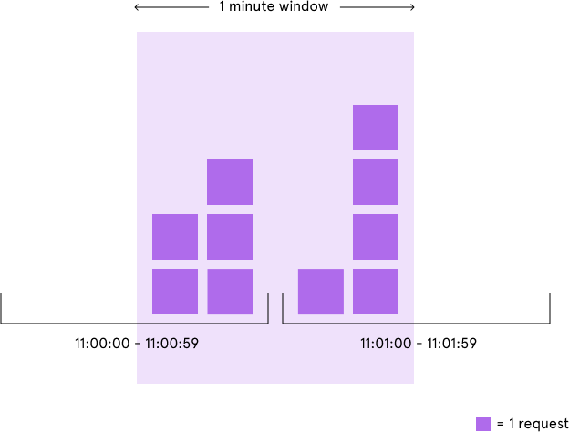
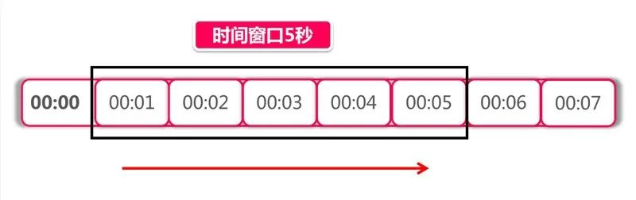
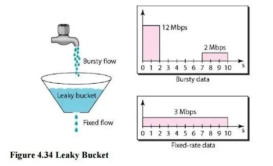

# SpringCloud微服务系列04-Alibaba架构01-Gateway-04-限流

可以看出 Spring Cloud Gateway 可以很方便的和 Spring Cloud 生态中的其他组件进行集成（比如：断路器和服务发现），而且提供了一套简单易写的 **断言**（**Predicates**，有的地方也翻译成 **谓词**）和 **过滤器**（**Filters**）机制，可以对每个 **路由**（**Routes**）进行特殊请求处理。

最近在项目中使用了 Spring Cloud Gateway，并在它的基础上实现了一些高级特性，如限流和留痕，在网关的使用过程中遇到了不少的挑战，于是趁着项目结束，抽点时间系统地学习并总结下。这篇文章主要学习限流技术，首先我会介绍一些常见的限流场景和限流算法，然后介绍一些关于限流的开源项目，学习别人是如何实现限流的，最后介绍我是如何在网关中实现限流的，并分享一些实现过程中的经验和遇到的坑。

## 简介

**缓存**、**降级** 和 **限流** 被称为高并发、分布式系统的三驾马车，网关作为整个分布式系统中的第一道关卡，限流功能自然必不可少。通过限流，可以控制服务请求的速率，从而提高系统应对突发大流量的能力，让系统更具弹性。限流有着很多实际的应用场景，比如双十一的秒杀活动， 12306 的抢票等。

### **限流的对象**

通过上面的介绍，我们对限流的概念可能感觉还是比较模糊，到底限流限的是什么？顾名思义，限流就是限制流量，但这里的流量是一个比较笼统的概念。如果考虑各种不同的场景，限流是非常复杂的，而且和具体的业务规则密切相关，可以考虑如下几种常见的场景：

- 限制某个接口一分钟内最多请求 100 次
- 限制某个用户的下载速度最多 100KB/S
- 限制某个用户同时只能对某个接口发起 5 路请求
- 限制某个 IP 来源禁止访问任何请求

从上面的例子可以看出，根据不同的请求者和请求资源，可以组合出不同的限流规则。可以根据请求者的 IP 来进行限流，或者根据请求对应的用户来限流，又或者根据某个特定的请求参数来限流。而限流的对象可以是请求的频率，传输的速率，或者并发量等，其中最常见的两个限流对象是请求频率和并发量，他们对应的限流被称为 **请求频率限流**（Request rate limiting）和 **并发量限流**（Concurrent requests limiting）。**传输速率限流** 在下载场景下比较常用，比如一些资源下载站会限制普通用户的下载速度，只有购买会员才能提速，这种限流的做法实际上和请求频率限流类似，只不过一个限制的是请求量的多少，一个限制的是请求数据报文的大小。这篇文章主要介绍请求频率限流和并发量限流。

### **限流的处理方式**

在系统中设计限流方案时，有一个问题值得设计者去仔细考虑，当请求者被限流规则拦截之后，我们该如何返回结果。一般我们有下面三种限流的处理方式：

- 拒绝服务
- 排队等待
- 服务降级

最简单的做法是拒绝服务，直接抛出异常，返回错误信息（比如返回 HTTP 状态码 429 Too Many Requests），或者给前端返回 302 重定向到一个错误页面，提示用户资源没有了或稍后再试。但是对于一些比较重要的接口不能直接拒绝，比如秒杀、下单等接口，我们既不希望用户请求太快，也不希望请求失败，这种情况一般会将请求放到一个消息队列中排队等待，消息队列可以起到削峰和限流的作用。第三种处理方式是服务降级，当触发限流条件时，直接返回兜底数据，比如查询商品库存的接口，可以默认返回有货。


## **常见的限流算法**

通过上面的学习，我们知道限流可以分为请求频率限流和并发量限流，根据系统架构的不同，又可以分为网关层限流和分布式限流。在不同的应用场景下，我们需要采用不同的限流算法。这一节将介绍一些主流的限流算法。

有一点要注意的是，利用池化技术也可以达到限流的目的，比如线程池或连接池，但这不是本文的重点。

### **固定窗口算法（Fixed Window）**

固定窗口算法是一种最简单的限流算法，它根据限流的条件，将请求时间映射到一个时间窗口，再使用计数器累加访问次数。譬如限流条件为每分钟 5 次，那么就按照分钟为单位映射时间窗口，假设一个请求时间为 11:00:45，时间窗口就是 11:00:00 ~ 11:00:59，在这个时间窗口内设定一个计数器，每来一个请求计数器加一，当这个时间窗口的计数器超过 5 时，就触发限流条件。当请求时间落在下一个时间窗口内时（11:01:00 ~ 11:01:59），上一个窗口的计数器失效，当前的计数器清零，重新开始计数。

计数器算法非常容易实现，在单机场景下可以使用 AtomicLong、LongAdder 或 Semaphore 来实现计数，而在分布式场景下可以通过 Redis 的 INCR 和 EXPIRE 等命令并结合 EVAL 或 lua 脚本来实现，Redis 官网提供了几种简单的实现方式。无论是请求频率限流还是并发量限流都可以使用这个算法。

不过这个算法的缺陷也比较明显，那就是存在严重的临界问题。由于每过一个时间窗口，计数器就会清零，这使得限流效果不够平滑，恶意用户可以利用这个特点绕过我们的限流规则。如下图所示，我们的限流条件本来是每分钟 5 次，但是恶意用户在 11:00:00 ~ 11:00:59 这个时间窗口的后半分钟发起 5 次请求，接下来又在 11:01:00 ~ 11:01:59 这个时间窗口的前半分钟发起 5 次请求，这样我们的系统就在 1 分钟内承受了 10 次请求。



### **滑动窗口算法（Rolling Window 或 Sliding Window）**

为了解决固定窗口算法的临界问题，可以将时间窗口划分成更小的时间窗口，然后随着时间的滑动删除相应的小窗口，而不是直接滑过一个大窗口，这就是滑动窗口算法。我们为每个小时间窗口都设置一个计数器，大时间窗口的总请求次数就是每个小时间窗口的计数器的和。如下图所示，我们的时间窗口是 5 秒，可以按秒进行划分，将其划分成 5 个小窗口，时间每过一秒，时间窗口就滑过一秒：



每次处理请求时，都需要计算所有小时间窗口的计数器的和，考虑到性能问题，划分的小时间窗口不宜过多，譬如限流条件是每小时 N 个，可以按分钟划分为 60 个窗口，而不是按秒划分成 3600 个。当然如果不考虑性能问题，划分粒度越细，限流效果就越平滑。相反，如果划分粒度越粗，限流效果就越不精确，出现临界问题的可能性也就越大，当划分粒度为 1 时，滑动窗口算法就退化成了固定窗口算法。由于这两种算法都使用了计数器，所以也被称为 **计数器算法**（Counters）。

进一步思考我们发现，如果划分粒度最粗，也就是只有一个时间窗口时，滑动窗口算法退化成了固定窗口算法；那如果我们把划分粒度调到最细，又会如何呢？那么怎样才能让划分的时间窗口最细呢？时间窗口细到一定地步时，意味着每个时间窗口中只能容纳一个请求，这样我们可以省略计数器，只记录每个请求的时间，然后统计一段时间内的请求数有多少个即可。具体的实现可以参考Redis sorted set 技巧 和Sliding window log 算法。

### 计数器算法

计数器算法采用计数器实现限流有点简单粗暴，一般我们会限制一秒钟的能够通过的请求数，比如限流qps为100，算法的实现思路就是从第一个请求进来开始计时，在接下去的1s内，每来一个请求，就把计数加1，如果累加的数字达到了100，那么后续的请求就会被全部拒绝。等到1s结束后，把计数恢复成0，重新开始计数。具体的实现可以是这样的：对于每次服务调用，可以通过AtomicLong#incrementAndGet()方法来给计数器加1并返回最新值，通过这个最新值和阈值进行比较。这种实现方式，相信大家都知道有一个弊端：如果我在单位时间1s内的前10ms，已经通过了100个请求，那后面的990ms，只能眼巴巴的把请求拒绝，我们把这种现象称为“突刺现象”


### **漏桶算法（Leaky Bucket）**

除了计数器算法，另一个很自然的限流思路是将所有的请求缓存到一个队列中，然后按某个固定的速度慢慢处理，这其实就是**漏桶算法**（Leaky Bucket）。漏桶算法假设将请求装到一个桶中，桶的容量为 M，当桶满时，请求被丢弃。在桶的底部有一个洞，桶中的请求像水一样按固定的速度（每秒 r 个）漏出来。我们用下面这个形象的图来表示漏桶算法：



桶的上面是个水龙头，我们的请求从水龙头流到桶中，水龙头流出的水速不定，有时快有时慢，这种忽快忽慢的流量叫做 **Bursty flow**。如果桶中的水满了，多余的水就会溢出去，相当于请求被丢弃。从桶底部漏出的水速是固定不变的，可以看出漏桶算法可以平滑请求的速率。

漏桶算法可以通过一个队列来实现，如下图所示：


当请求到达时，不直接处理请求，而是将其放入一个队列，然后另一个线程以固定的速率从队列中读取请求并处理，从而达到限流的目的。注意的是这个队列可以有不同的实现方式，比如设置请求的存活时间，或将队列改造成 PriorityQueue，根据请求的优先级排序而不是先进先出。当然队列也有满的时候，如果队列已经满了，那么请求只能被丢弃了。漏桶算法有一个缺陷，在处理突发流量时效率很低，于是人们又想出了下面的令牌桶算法。

### **令牌桶算法（Token Bucket）**

**令牌桶算法**（Token Bucket）是目前应用最广泛的一种限流算法，它的基本思想由两部分组成：**生成令牌** 和 **消费令牌**。

- 生成令牌：假设有一个装令牌的桶，最多能装 M 个，然后按某个固定的速度（每秒 r 个）往桶中放入令牌，桶满时不再放入；
- 消费令牌：我们的每次请求都需要从桶中拿一个令牌才能放行，当桶中没有令牌时即触发限流，这时可以将请求放入一个缓冲队列中排队等待，或者直接拒绝；

令牌桶算法的图示如下：


## 准备工作

- 之前使用的gateway项目

```xml
<?xml version="1.0" encoding="UTF-8"?>
<project xmlns="http://maven.apache.org/POM/4.0.0"
         xmlns:xsi="http://www.w3.org/2001/XMLSchema-instance"
         xsi:schemaLocation="http://maven.apache.org/POM/4.0.0 http://maven.apache.org/xsd/maven-4.0.0.xsd">
    <parent>
        <artifactId>Spring-Cloud-Alibaba</artifactId>
        <groupId>cn.zm</groupId>
        <version>1.0-SNAPSHOT</version>
    </parent>
    <modelVersion>4.0.0</modelVersion>

    <artifactId>Gateway</artifactId>

    <properties>
        <maven.compiler.source>8</maven.compiler.source>
        <maven.compiler.target>8</maven.compiler.target>
    </properties>

    <dependencies>

        <!--gateway 网关-->
        <dependency>
            <groupId>org.springframework.cloud</groupId>
            <artifactId>spring-cloud-starter-gateway</artifactId>
        </dependency>

        <!--熔断-->
        <dependency>
            <groupId>org.springframework.cloud</groupId>
            <artifactId>spring-cloud-starter-netflix-hystrix</artifactId>
        </dependency>

        <!--限流-->
        <dependency>
            <groupId>org.springframework.boot</groupId>
            <artifactId>spring-boot-starter-data-redis-reactive</artifactId>
        </dependency>

    </dependencies>


</project>
```

- 根据Hostname进行限流

HostAddrKeyResolver

```java
package cn.zm.gateway.config;


import org.springframework.cloud.gateway.filter.ratelimit.KeyResolver;
import org.springframework.web.server.ServerWebExchange;
import reactor.core.publisher.Mono;

/** 功能描述: <br>
 * <根据Hostname进行限流>
 *
 * @author 十渊
 * @date 2021/11/18 15:28
 * @return
 */
public class HostAddrKeyResolver implements KeyResolver {
  @Override
  public Mono<String> resolve(ServerWebExchange exchange) {
    return Mono.just(exchange.getRequest().getRemoteAddress().getAddress().getHostAddress());
  }
}
```

UriKeyResolver

```java
package cn.zm.gateway.config;

import org.springframework.cloud.gateway.filter.ratelimit.KeyResolver;
import org.springframework.web.server.ServerWebExchange;
import reactor.core.publisher.Mono;

/** 功能描述: <br>
 * <对uri进行限流>
 *
 * @author 十渊
 * @date 2021/11/18 15:33
 * @return
 */
public class UriKeyResolver implements KeyResolver {
  @Override
  public Mono<String> resolve(ServerWebExchange exchange) {
    return Mono.just(exchange.getRequest().getURI().getPath());
  }
}
```

UserKeyResolver

```java
package cn.zm.gateway.config;

import org.springframework.cloud.gateway.filter.ratelimit.KeyResolver;
import org.springframework.web.server.ServerWebExchange;
import reactor.core.publisher.Mono;

/**
 * 功能描述: <br>
 * <以用户的维度去限流>
 *
 * @author 十渊
 * @date 2021/11/18 15:35
 * @return
 */
public class UserKeyResolver implements KeyResolver {
  @Override
  public Mono<String> resolve(ServerWebExchange exchange) {
    return Mono.just(exchange.getRequest().getQueryParams().getFirst("user"));
  }
}

```

GatewayConfig

```java
package cn.zm.gateway.config;

import cn.zm.gateway.filter.RequestTimeFilter;
import cn.zm.gateway.filter.TokenFilter;
import cn.zm.gateway.filter.factory.RequestTimeGatewayFilterFactory;
import org.springframework.cloud.gateway.filter.ratelimit.KeyResolver;
import org.springframework.cloud.gateway.route.RouteLocator;
import org.springframework.cloud.gateway.route.builder.RouteLocatorBuilder;
import org.springframework.context.annotation.Bean;
import org.springframework.context.annotation.Configuration;
import reactor.core.publisher.Mono;

/**
 * 功能描述: <br>
 * <路由配置>
 *
 * @author 十渊
 * @date 2021/11/2 16:18
 * @return
 */
@Configuration
public class GatewayConfig {

  @Bean
  public HostAddrKeyResolver hostAddrKeyResolver() {
    return new HostAddrKeyResolver();
  }
}
```


application.yml

```yml
server:
  port: 8711
spring:
  profiles:
    active: gateway-limiter
  application:
    name: gateway-8711

---
spring:
  profiles: gateway-limiter
  cloud:
    gateway:
      routes:
        - id: limit_route
          uri: http://httpbin.org:80/get
          predicates:
            - After=2017-01-20T17:42:47.789-07:00[America/Denver]
          filters:
            - name: RequestRateLimiter
              args:
                key-resolver: '#{@hostAddrKeyResolver}'
                redis-rate-limiter.replenishRate: 1
                redis-rate-limiter.burstCapacity: 3
  redis:
    host: localhost
    port: 6379
    database: 0
```

## 测试


## 引用资料

>https://www.fangzhipeng.com/springcloud/2018/12/22/sc-f-gatway4.html
>
>https://blog.csdn.net/qq_42046105/article/details/120051893
