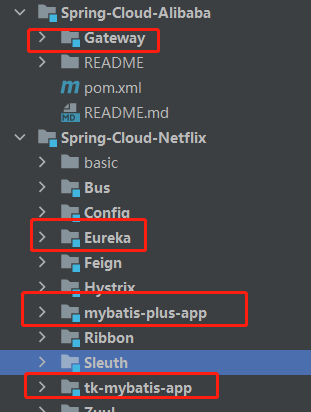
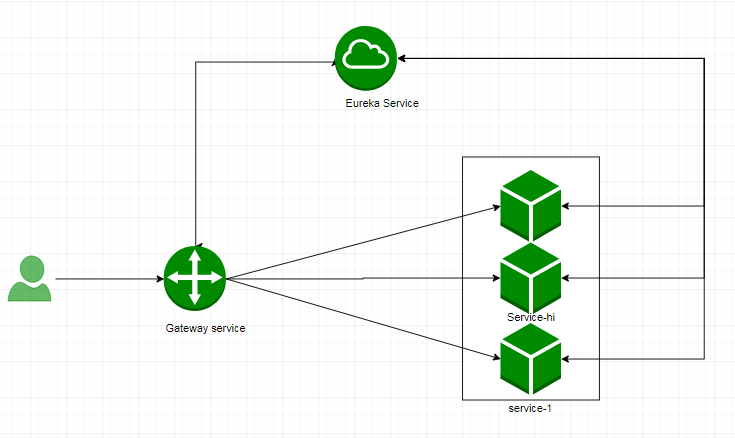
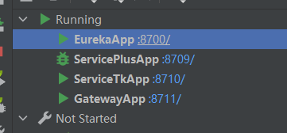
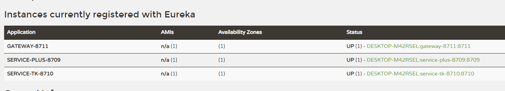
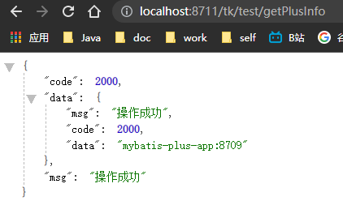
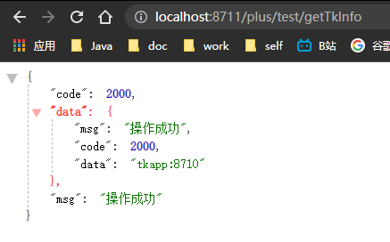

# SpringCloud微服务系列04-Alibaba架构01-Gateway-05-配合注册中心简单的使用

在之前的文章介绍了Spring Cloud Gateway的Predict（断言）、Filter（过滤器），大家对Spring Cloud Gateway有初步的认识，其中在对服务路由转发的这一块，在之前的文章是采用硬编码的方式进行路由转发。这篇文章以案例的形式来讲解Spring Cloud Gateway如何配合服务注册中心进行路由转发。

## 准备工作

- 本章alibaba下的gateway项目
- netflix章节的三个项目
  - ServicePlusApp :8709/
  - ServiceTkApp :8710/
  - EurekaApp :8700/

使用之前的项目测试方便快捷

## 目录结构




这三个工程中，其中service-tk ,service-plus, gateway向注册中心eureka注册。用户的请求首先经过gateway，根据路径由gateway的predict 去断言进到哪一个 router， router经过各种过滤器处理后，最后路由到具体的业务服务




## 快速开始

Gateway 项目的 pom.xml

```xml
<?xml version="1.0" encoding="UTF-8"?>
<project xmlns="http://maven.apache.org/POM/4.0.0"
         xmlns:xsi="http://www.w3.org/2001/XMLSchema-instance"
         xsi:schemaLocation="http://maven.apache.org/POM/4.0.0 http://maven.apache.org/xsd/maven-4.0.0.xsd">
    <parent>
        <artifactId>Spring-Cloud-Alibaba</artifactId>
        <groupId>cn.zm</groupId>
        <version>1.0-SNAPSHOT</version>
    </parent>
    <modelVersion>4.0.0</modelVersion>

    <artifactId>Gateway</artifactId>

    <properties>
        <maven.compiler.source>8</maven.compiler.source>
        <maven.compiler.target>8</maven.compiler.target>
    </properties>

    <dependencies>
        <!--eureka-->
        <dependency>
            <groupId>org.springframework.cloud</groupId>
            <artifactId>spring-cloud-starter-netflix-eureka-client</artifactId>
        </dependency>

        <!--gateway 网关-->
        <dependency>
            <groupId>org.springframework.cloud</groupId>
            <artifactId>spring-cloud-starter-gateway</artifactId>
        </dependency>

        <!--熔断-->
        <dependency>
            <groupId>org.springframework.cloud</groupId>
            <artifactId>spring-cloud-starter-netflix-hystrix</artifactId>
        </dependency>

        <!--限流-->
        <dependency>
            <groupId>org.springframework.boot</groupId>
            <artifactId>spring-boot-starter-data-redis-reactive</artifactId>
        </dependency>

    </dependencies>


</project>
```

application.yml

```yml
server:
  port: 8711
spring:
  profiles:
    active: gateway-router
  application:
    name: gateway-8711


---
spring:
  profiles: gateway-router
  cloud:
    gateway:
      discovery:
        locator:
#          表明gateway开启服务注册和发现的功能
          enabled: false
#          是将请求路径上的服务名配置为小写（因为服务注册的时候，向注册中心注册时将服务名转成大写的了）
          lowerCaseServiceId: true
      routes:
        - id: service-tk-8710
          uri: lb://service-tk-8710
          predicates:
            - Path=/tk/**
          filters:
            - StripPrefix=1
        - id: service-plus-8709
          uri: lb://service-plus-8709
          predicates:
            - Path=/plus/**
          filters:
            - StripPrefix=1
# eureka
eureka:
  client:
    serviceUrl:
      defaultZone: http://localhost:8700/eureka/

```

main

```java
package cn.zm;

import org.springframework.boot.SpringApplication;
import org.springframework.boot.autoconfigure.SpringBootApplication;
import org.springframework.cloud.netflix.eureka.EnableEurekaClient;

@EnableEurekaClient
@SpringBootApplication
public class GatewayApp {
    public static void main(String[] args) {
        SpringApplication.run(GatewayApp.class);
    }

}
```

**最后将之前的config自定义的bean全部注释**

因为在配置这个地方就已经启用断言然后路由了

### 启动测试



注册中心状态




通过网关访问tk项目



通过网关访问plus项目



一个简单的gateway项目最基本的功能就实现了

## 引用资料

>https://www.fangzhipeng.com/springcloud/2018/12/23/sc-f-gateway5.html
>
>
