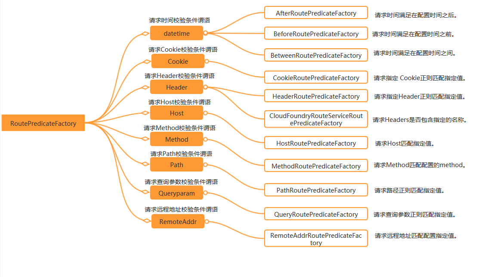
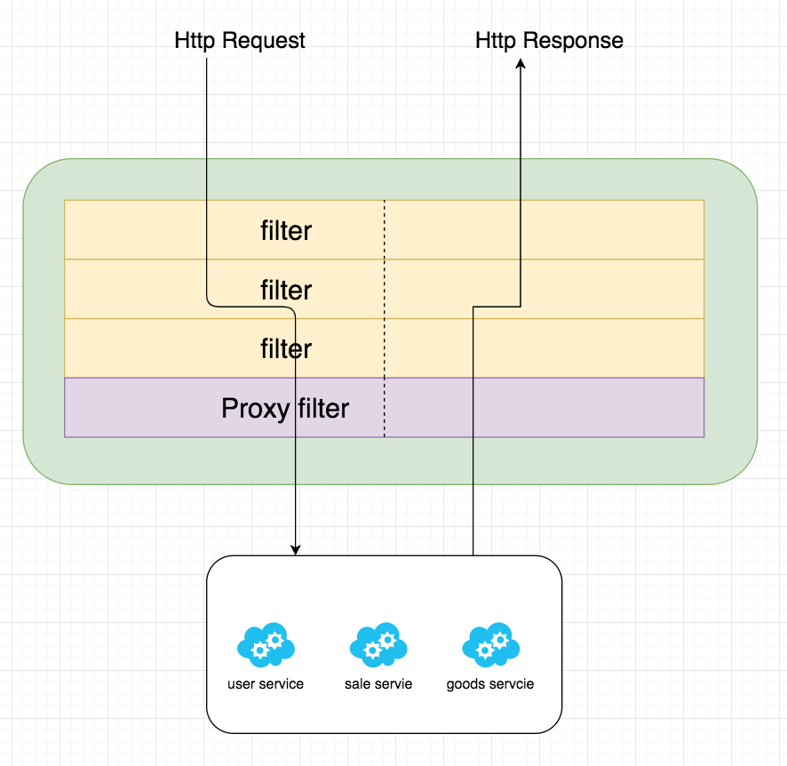
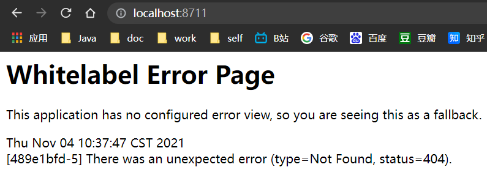

---

title: SpringCloud微服务系列04-Alibaba架构01-Gateway
subtitle: SpringCloud微服务系列04-Alibaba架构01-Gateway
catalog: true
tags: [SpringCloud, SpringCloudAlibaba, Gateway]
date: 2021-11-02 15:01:29
header-img:
---

# SpringCloud微服务系列04-Alibaba架构01-Gateway

Spring Cloud Gateway是Spring Cloud官方推出的第二代网关框架，取代Zuul网关。网关作为流量的，在微服务系统中有着非常作用，网关常见的功能有路由转发、权限校验、限流控制等作用。本文首先用官方的案例带领大家来体验下Spring Cloud的一些简单的功能，在后续文章我会使用详细的案例和源码解析来详细讲解Spring Cloud Gateway.

## 准备工作

- Gateway模块
- Spring-Cloud-Alibaba 父模块
- springboot springcloud springcloudalibaba的依赖关系(参考上一章节)
- SpringCloud-Seed模块

## 快速开始

### 总依赖SpringCloud-Seed模块

```xml
<?xml version="1.0" encoding="UTF-8"?>
<project xmlns="http://maven.apache.org/POM/4.0.0"
         xmlns:xsi="http://www.w3.org/2001/XMLSchema-instance"
         xsi:schemaLocation="http://maven.apache.org/POM/4.0.0 http://maven.apache.org/xsd/maven-4.0.0.xsd">
    <modelVersion>4.0.0</modelVersion>

    <parent>
        <groupId>org.springframework.boot</groupId>
        <artifactId>spring-boot-starter-parent</artifactId>
        <version>2.3.2.RELEASE</version>
        <!--<version>2.2.4.RELEASE</version>-->
        <!--<relativePath/> &lt;!&ndash; lookup parent from repository &ndash;&gt;-->
    </parent>

    <packaging>pom</packaging>
    <groupId>cn.zm</groupId>
    <artifactId>SpringCloud-Seed</artifactId>
    <version>1.0-SNAPSHOT</version>

    <description>
        三种主流方案的微服务种子项目
        1.Spring Cloud Netflix
        2.Spring-Cloud-Alibaba
        3.Apache-Dubbo-Zookeeper
    </description>

    <modules>
        <module>basic</module>
        <module>Micro-Service</module>
    </modules>

    <properties>
        <maven.compiler.source>8</maven.compiler.source>
        <maven.compiler.target>8</maven.compiler.target>
    </properties>

    <dependencyManagement>
        <dependencies>
            <!-- spring-boot -->
            <dependency>
                <groupId>org.springframework.boot</groupId>
                <artifactId>spring-boot-dependencies</artifactId>
                <version>${project.version}</version>
                <type>pom</type>
            </dependency>

            <dependency>
                <groupId>cn.zm</groupId>
                <artifactId>common</artifactId>
                <version>${project.version}</version>
            </dependency>

            <dependency>
                <groupId>cn.zm</groupId>
                <artifactId>mybatis-plus</artifactId>
                <version>${project.version}</version>
            </dependency>

            <dependency>
                <groupId>cn.zm</groupId>
                <artifactId>tk-mybatis</artifactId>
                <version>${project.version}</version>
            </dependency>

        </dependencies>
    </dependencyManagement>

    <build>
        <plugins>

            <!--文档工具-->
            <plugin>
                <groupId>org.apache.maven.plugins</groupId>
                <artifactId>maven-javadoc-plugin</artifactId>
            </plugin>

        </plugins>
    </build>
</project>
```

### Spring-Cloud-Alibaba 父模块 pom

```xml
<?xml version="1.0" encoding="UTF-8"?>
<project xmlns="http://maven.apache.org/POM/4.0.0"
         xmlns:xsi="http://www.w3.org/2001/XMLSchema-instance"
         xsi:schemaLocation="http://maven.apache.org/POM/4.0.0 http://maven.apache.org/xsd/maven-4.0.0.xsd">
    <parent>
        <artifactId>Micro-Service</artifactId>
        <groupId>cn.zm</groupId>
        <version>1.0-SNAPSHOT</version>
    </parent>
    <modelVersion>4.0.0</modelVersion>

    <artifactId>Spring-Cloud-Alibaba</artifactId>
    <packaging>pom</packaging>

    <modules>
        <module>Gateway</module>
    </modules>

    <properties>
        <maven.compiler.source>8</maven.compiler.source>
        <maven.compiler.target>8</maven.compiler.target>
        <spring-cloud.version>Hoxton.SR9</spring-cloud.version>
        <alibaba-cloud.version>2.2.6.RELEASE</alibaba-cloud.version>
    </properties>

    <dependencyManagement>
        <dependencies>

            <!--Spring Cloud Alibaba-->
            <dependency>
                <groupId>com.alibaba.cloud</groupId>
                <artifactId>spring-cloud-alibaba-dependencies</artifactId>
                <version>${alibaba-cloud.version}</version>
                <type>pom</type>
                <scope>import</scope>
            </dependency>

            <!--netflix cloud 统一基础依赖-->
            <dependency>
                <groupId>org.springframework.cloud</groupId>
                <artifactId>spring-cloud-dependencies</artifactId>
                <version>${spring-cloud.version}</version>
                <type>pom</type>
                <scope>import</scope>
            </dependency>

        </dependencies>
    </dependencyManagement>

</project>
```


### Gateway POM文件

```xml
<?xml version="1.0" encoding="UTF-8"?>
<project xmlns="http://maven.apache.org/POM/4.0.0"
         xmlns:xsi="http://www.w3.org/2001/XMLSchema-instance"
         xsi:schemaLocation="http://maven.apache.org/POM/4.0.0 http://maven.apache.org/xsd/maven-4.0.0.xsd">
    <parent>
        <artifactId>Spring-Cloud-Alibaba</artifactId>
        <groupId>cn.zm</groupId>
        <version>1.0-SNAPSHOT</version>
    </parent>
    <modelVersion>4.0.0</modelVersion>

    <artifactId>Gateway</artifactId>

    <properties>
        <maven.compiler.source>8</maven.compiler.source>
        <maven.compiler.target>8</maven.compiler.target>
    </properties>

    <dependencies>

        <!--gateway 网关-->
        <dependency>
            <groupId>org.springframework.cloud</groupId>
            <artifactId>spring-cloud-starter-gateway</artifactId>
        </dependency>

        <!--熔断-->
        <dependency>
            <groupId>org.springframework.cloud</groupId>
            <artifactId>spring-cloud-starter-netflix-hystrix</artifactId>
        </dependency>

    </dependencies>


</project>
```

### yml文件

```yml
server:
  port: 8711
spring:
  profiles:
    active: common
  application:
    name: gateway-8711
```

### RouteConfig类

```java
package cn.zm.gateway.config;

import org.springframework.cloud.gateway.route.RouteLocator;
import org.springframework.cloud.gateway.route.builder.RouteLocatorBuilder;
import org.springframework.context.annotation.Bean;
import org.springframework.context.annotation.Configuration;

/**
 * 功能描述: <br>
 * <路由配置>
 *
 * @author 十渊
 * @date 2021/11/2 16:18
 * @return
 */
@Configuration
public class RouteConfig {
  private final String URL = "http://httpbin.org";
  private final String URL1 = "http://www.baidu.com";
  private final String URL2 = "/error";
  private final String FORWARD = "/gateway/fallback";

  @Bean
  public RouteLocator gatewayRoute(RouteLocatorBuilder builder) {
    return builder.routes()
      .route(p -> p
        .path("/get")
        .filters(f -> f.addRequestHeader("Hello", "World"))
        .uri(URL))
      .build();
  }
}
```

### 测试route

~~~json
{
"args": {},
"headers": {
"Accept": "text/html,application/xhtml+xml,application/xml;q=0.9,image/avif,image/webp,image/apng,*/*;q=0.8,application/signed-exchange;v=b3;q=0.9",
"Accept-Encoding": "gzip, deflate, br",
"Accept-Language": "zh-CN,zh;q=0.9,en;q=0.8,be;q=0.7,ru;q=0.6",
"Content-Length": "0",
"Forwarded": "proto=http;host=\"localhost:8711\";for=\"0:0:0:0:0:0:0:1:51065\"",
"Hello": "World",
"Host": "httpbin.org",
"Sec-Ch-Ua": "\"Google Chrome\";v=\"95\", \"Chromium\";v=\"95\", \";Not A Brand\";v=\"99\"",
"Sec-Ch-Ua-Mobile": "?0",
"Sec-Ch-Ua-Platform": "\"Windows\"",
"Sec-Fetch-Dest": "document",
"Sec-Fetch-Mode": "navigate",
"Sec-Fetch-Site": "none",
"Sec-Fetch-User": "?1",
"Upgrade-Insecure-Requests": "1",
"User-Agent": "Mozilla/5.0 (Windows NT 10.0; Win64; x64) AppleWebKit/537.36 (KHTML, like Gecko) Chrome/95.0.4638.54 Safari/537.36",
"X-Amzn-Trace-Id": "Root=1-6181e804-1c9d89440999bae451ca50e6",
"X-Forwarded-Host": "localhost:8711"
},
"origin": "0:0:0:0:0:0:0:1, 222.212.94.23",
"url": "http://localhost:8711/get"
}
~~~


### 熔断配置

RouteConfig类添加

```java
package cn.zm.gateway.config;

import org.springframework.cloud.gateway.route.RouteLocator;
import org.springframework.cloud.gateway.route.builder.RouteLocatorBuilder;
import org.springframework.context.annotation.Bean;
import org.springframework.context.annotation.Configuration;

/**
 * 功能描述: <br>
 * <路由配置>
 *
 * @author 十渊
 * @date 2021/11/2 16:18
 * @return
 */
@Configuration
public class RouteConfig {
  private final String URL = "http://httpbin.org";
  private final String URL1 = "http://www.baidu.com";
  private final String URL2 = "/error";
  private final String FORWARD = "/gateway/fallback";

  @Bean
  public RouteLocator gatewayRoute(RouteLocatorBuilder builder) {
    return builder.routes()
      .route(p -> p
        .path("/get")
        .filters(f -> f.addRequestHeader("Hello", "World"))
        .uri(URL))
      .route(p -> p
        .host("*.hystrix.com")
        .filters(f -> f
          .hystrix(config -> config
            .setName("mycmd")
            .setFallbackUri("forward:/fallback")))
        .uri(URL))
      .build();
  }
}
```

### 熔断配置测试

```yml
spring:
  profiles: after_route
  cloud:
    gateway:
      routes:
      	- id: error_hystix
          uri: http://127.0.0.1:8083/
          predicates:
            - Path=/feign/**
          filters:
            - StripPrefix=1 #去掉Path前缀,参数为1代表去掉/ribbon
            - name: Hystrix
              args:
                name: test
                fallbackUri: forward:/gateway/fallback
```

windows下cmd打开命令行工具

~~~
Microsoft Windows [版本 10.0.19042.867]
(c) 2020 Microsoft Corporation. 保留所有权利。

C:\Users\DELL>curl
curl: try 'curl --help' for more information
~~~

~~~
测试结果
C:\Users\DELL>curl http://localhost:8711/feign/aaa
我是hystrix熔断后界面
~~~


## Gateway三个核心概念

- Route路由
  路由。路由是网关最基础的部分，路由信息有一个ID、一个目的URL、一组断言和一组Filter组成。如果断言路由为真，则说明请求的URL和配置匹配
- Predicate断言
  参考的是Java8中的断言函数。Spring Cloud Gateway中的断言函数输入类型是Spring5.0框架中的ServerWebExchange。Spring Cloud Gateway中的断言函数允许开发者去定义匹配来自于http request中的任何信息，比如请求头和参数等。如果请求与断言相匹配则进行该路由。
- Filter过滤
  一个标准的Spring webFilter。Spring cloud gateway中的filter分为两种类型的Filter，分别是Gateway Filter(路由过滤)和Global Filter(全局过滤)。过滤器Filter将会对请求和响应进行修改处理


### Gateway执行流程


客户端向Spring Cloud Gateway发出请求。然后在Gateway Handler Mapping中找到与请求相匹配的路由,将其发送到Gateway
Web Handler。Handler再通过指定的过滤器链来将请求发送到我们实际的服务执行业务逻辑，然后返回。
过滤器之间用虚线分开是因为过滤器可能会在发送代理请求之前( "pre" )或之后( "post" )执行业务逻辑。| I
Filter在 "pre" 类型的过滤器可以做参数校验、权限校验、流量监控、日志输出、协议转换等,
在"post"类型的过滤器中可以做响应内容、响应头的修改，日志的输出，流量监控等有着非常重要的作用。

## Route Predicate Factories

Spring Cloud Gateway 匹配路由作为 Spring WebFlux HandlerMapping 基础结构的一部分。 Spring Cloud Gateway 包括许多内置的路由谓词工厂。所有这些谓词都匹配 HTTP 请求的不同属性。可以组合多个路由谓词工厂，并通过逻辑与进行组合。

Spring Cloud Gateway matches routes as part of the Spring WebFlux `HandlerMapping` infrastructure. Spring Cloud Gateway includes many built-in Route Predicate Factories. All of these predicates match on different attributes of the HTTP request. Multiple Route Predicate Factories can be combined and are combined via logical `and`.

### After Route Predicate Factory

把RouteConfig.java注释掉

AfterRoutePredicateFactory，可配置一个时间，当请求的时间在配置时间之后，才交给 router去处理。否则则报错，不通过路由。

当请求的时间在这个配置的时间之后，请求会被路由到http://httpbin:org:80/get。:

在工程的application.yml配置如下：

```yml
server:
  port: 8711
spring:
  profiles:
    active: after_route
  application:
    name: gateway-8711

---

spring:
  profiles: after_route
  cloud:
    gateway:
      routes:
        - id: after_route
          uri: http://httpbin.org:80/get
#          当请求的时间在这个配置的时间之后，请求会被路由到http://httpbin:org:80/get。:
          predicates:
            - After=2017-01-20T17:42:47.789-07:00[America/Denver]
```

它实际被AfterRoutePredicateFactory这个类所处理，这个After就是指定了它的Gateway web handler类为AfterRoutePredicateFactory，同理，其他类型的predicate也遵循这个规则。

测试

进入服务http://localhost:8711/


after修改时间大于当前实际时间测试

```yml
#          当请求的时间在这个配置的时间之后，请求会被路由到http://httpbin:org:80/get。:
          predicates:
            - After=2022-01-20T17:42:47.789-07:00[America/Denver]
```

再次测试


### Before Route Predicate Factory

The Before Route Predicate Factory takes one parameter, a datetime. This predicate matches requests that happen before the current datetime.

和之前那个after的原理一养,只不过时间是方向


### Between Route Predicate Factory

```yml
predicates:
        - Between=2017-01-20T17:42:47.789-07:00[America/Denver], 2017-01-21T17:42:47.789-07:00[America/Denver]
```

在这个时间区间内可分发路由

### Cookie Route Predicate Factory

The Cookie Route Predicate Factory takes two parameters, the cookie name and a regular expression. This predicate matches cookies that have the given name and the value matches the regular expression.

Cookie Route Predicate Factory需要2个参数，一个时cookie名字，另一个时值，可以为正则表达式。它用于匹配请求中，带有该名称的cookie和cookie匹配正则表达式的请求。

```yml
spring:
  cloud:
    gateway:
      routes:
      - id: cookie_route
        uri: http://example.org
        predicates:
        - Cookie=chocolate, ch.p
```

在上面的配置中，请求带有cookie名为 name, cookie值为forezp 的请求将都会转发到uri为 http://httpbin.org:80/get的地址上。 使用curl命令进行请求，在请求中带上 cookie，会返回正确的结果，否则，请求报404错误。

当cookie匹配时转发

### Header Route Predicate Factory

The Header Route Predicate Factory takes two parameters, the header name and a regular expression. This predicate matches with a header that has the given name and the value matches the regular expression.

Header Route Predicate Factory需要2个参数，一个是header名，另外一个header值，该值可以是一个正则表达式。当此断言匹配了请求的header名和值时，断言通过，进入到router的规则中去。

```yml
spring:
  cloud:
    gateway:
      routes:
      - id: header_route
        uri: http://example.org
        predicates:
        - Header=X-Request-Id, \d+
```

在上面的配置中，当请求的Header中有X-Request-Id的header名，且header值为数字时，请求会被路由到配置的 uri. 使用curl执行以下命令:

~~~tex
C:\Users\DELL>curl -H Cookie:chocolate=ch.p http://localhost:8711/
<!DOCTYPE html>
<!--STATUS OK--><html> <head><meta http-equiv=content-type content=text/html;charset=utf-8><meta http-equiv=X-UA-Compatible content=IE=Edge><meta content=always name=referrer><link rel=stylesheet type=text/css href=http://s1.bdstatic.com/r/www/cache/bdorz/baidu.min.css><title>百度一下，你就知道</title></head> <body link=#0000cc> <div id=wrapper> <div id=head> <div class=head_wrapper> <div class=s_form> <div class=s_form_wrapper> <div id=lg>  </div> <form id=form name=f action=//www.baidu.com/s class=fm> <input type=hidden name=bdorz_come value=1> <input type=hidden name=ie value=utf-8> <input type=hidden name=f value=8> <input type=hidden name=rsv_bp value=1> <input type=hidden name=rsv_idx value=1> <input type=hidden name=tn value=baidu><span class="bg s_ipt_wr"><input id=kw name=wd class=s_ipt value maxlength=255 autocomplete=off autofocus></span><span class="bg s_btn_wr"><input type=submit id=su value=百度一下 class="bg s_btn"></span> </form> </div> </div> <div id=u1> <a href=http://news.baidu.com name=tj_trnews class=mnav>新闻</a> <a href=http://www.hao123.com name=tj_trhao123 class=mnav>hao123</a> <a href=http://map.baidu.com name=tj_trmap class=mnav>地图</a> <a href=http://v.baidu.com name=tj_trvideo class=mnav>视频</a> <a href=http://tieba.baidu.com name=tj_trtieba class=mnav>贴吧</a> <noscript> <a href=http://www.baidu.com/bdorz/login.gif?login&amp;tpl=mn&amp;u=http%3A%2F%2Fwww.baidu.com%2f%3fbdorz_come%3d1 name=tj_login class=lb>登录</a> </noscript> <script>document.write('<a href="http://www.baidu.com/bdorz/login.gif?login&tpl=mn&u='+ encodeURIComponent(window.location.href+ (window.location.search === "" ? "?" : "&")+ "bdorz_come=1")+ '" name="tj_login" class="lb">登录</a>');</script> <a href=//www.baidu.com/more/ name=tj_briicon class=bri style="display: block;">更多产品</a> </div> </div> </div> <div id=ftCon> <div id=ftConw> <p id=lh> <a href=http://home.baidu.com>关于百度</a> <a href=http://ir.baidu.com>About Baidu</a> </p> <p id=cp>&copy;2017&nbsp;Baidu&nbsp;<a href=http://www.baidu.com/duty/>使用百度前必读</a>&nbsp; <a href=http://jianyi.baidu.com/ class=cp-feedback>意见反馈</a>&nbsp;京ICP证030173号&nbsp;  </p> </div> </div> </div> </body> </html>
~~~


执行命令后，会正确的返回请求结果，结果省略。如果在请求中没有带上X-Request-Id的header名，并且值不为数字时，请求就会报404，路由没有被正确转发。

This route matches if the request has a header named `X-Request-Id` whos value matches the `\d+` regular expression (has a value of one or more digits).

### Host Route Predicate Factory

The Host Route Predicate Factory takes one parameter: the host name pattern. The pattern is an Ant style pattern with `.` as the separator. This predicates matches the `Host` header that matches the pattern.

```yml
spring:
  profiles:
    active: host_route
---
spring:
  cloud:
    gateway:
      routes:
      - id: host_route
        uri: http://httpbin.org:80/get
        predicates:
        - Host=**.jermaine.com
  profiles: host_route
```

在上面的配置中，请求头中含有Host为fangzhipeng.com的请求将会被路由转发转发到配置的uri。 启动工程，执行以下的curl命令，请求会返回正确的请求结果：

```txt
curl -H 'Host:www.fangzhipeng.com' localhost:8081
```

输入`curl -H Host:www.jerma.com http://localhost:8711` 结果如下

~~~txt
C:\Users\DELL>curl -H Host:www.jerma.com http://localhost:8711
{"timestamp":"2021-11-04T01:39:59.438+00:00","path":"/","status":404,"error":"Not Found","message":null,"requestId":"ed01fe77-5"}
~~~

输入`curl -H Host:www.jermaine.com http://localhost:8711`后结果如下

~~~txt
C:\Users\DELL>curl -H Host:www.jermaine.com http://localhost:8711
<!DOCTYPE html>
<html lang="en">
<head>
    <meta charset="UTF-8">
    <title>httpbin.org</title>
    <link href="https://fonts.googleapis.com/css?family=Open+Sans:400,700|Source+Code+Pro:300,600|Titillium+Web:400,600,700"
        rel="stylesheet">
    <link rel="stylesheet" type="text/css" href="/flasgger_static/swagger-ui.css">
    <link rel="icon" type="image/png" href="/static/favicon.ico" sizes="64x64 32x32 16x16" />
    <style>
        html {
            box-sizing: border-box;
            overflow: -moz-scrollbars-vertical;
            overflow-y: scroll;
        }
~~~

### Method Route Predicate Factory

The Method Route Predicate Factory takes one parameter: the HTTP method to match.

Method Route Predicate Factory 需要一个参数，即请求的类型。比如GET类型的请求都转发到此路由。在工程的配置文件加上以下的配置：

```yml
---
spring:
  cloud:
    gateway:
      routes:
      - id: method_route
        uri: http://httpbin.org:80/get
        predicates:
        - Method=GET
  profiles: method_route
```

` curl localhost:8081`

使用 curl命令模拟 post请求，则返回404结果。

`curl -XPOST localhost:8081`

### Path Route Predicate Factory

The Path Route Predicate Factory takes one parameter: a Spring `PathMatcher` pattern.

Path Route Predicate Factory 需要一个参数: 一个spel表达式，应用匹配路径。

在工程的配置文件application.yml文件中，做以下的配置：

这个是目前所有predicates中使用最频繁的:

```yml
---
spring:
  cloud:
    gateway:
      routes:
      - id: path_route
        uri: http://httpbin.org:80/get
        predicates:
        - Path=/foo/{segment}
  profiles: path_route
  
```

### Query Route Predicate Factory

The Query Route Predicate Factory takes two parameters: a required `param` and an optional `regexp`.

Query Route Predicate Factory 需要2个参数:一个参数名和一个参数值的正则表达式。在工程的配置文件application.yml做以下的配置：

```yml
---
spring:
  cloud:
    gateway:
      routes:
      - id: query_route
        uri: http://httpbin.org:80/get
        predicates:
        - Query=foo, ba.
  profiles: query_route
```

`curl localhost:8081?foo=bar`

Query Route Predicate Factory也可以只填一个参数，填一个参数时，则只匹配参数名，即请求的参数中含有配置的参数名，则命中路由。比如以下的配置中，配置了请求参数中含有参数名为foo 的参数将会被请求转发到uri为http://httpbin.org:80/get。

```yml
spring:
  cloud:
    gateway:
      routes:
      - id: query_route
        uri: http://httpbin.org:80/get
        predicates:
        - Query=foo
  profiles: query_route
```

### RemoteAddr Route Predicate Factory

he RemoteAddr Route Predicate Factory takes a list (min size 1) of CIDR-notation (IPv4 or IPv6) strings, e.g. `192.168.0.1/16` (where `192.168.0.1` is an IP address and `16` is a subnet mask).

**application.yml.** 

```
spring:
  cloud:
    gateway:
      routes:
      - id: remoteaddr_route
        uri: http://example.org
        predicates:
        - RemoteAddr=192.168.1.1/24
```


This route would match if the remote address of the request was, for example, `192.168.1.10`.

还有很多Predicate Factory可以参考https://cloud.spring.io/spring-cloud-static/spring-cloud-gateway/2.0.0.RELEASE/single/spring-cloud-gateway.html#gateway-starter

总结如一下图片



## gateway之filter

在上一篇文章详细的介绍了Gateway的Predict，Predict决定了请求由哪一个路由处理，在路由处理之前，需要经过“pre”类型的过滤器处理，处理返回响应之后，可以由“post”类型的过滤器处理。

### filter的作用和生命周期

由filter工作流程点，可以知道filter有着非常重要的作用，在“pre”类型的过滤器可以做参数校验、权限校验、流量监控、日志输出、协议转换等，在“post”类型的过滤器中可以做响应内容、响应头的修改，日志的输出，流量监控等。首先需要弄清一点为什么需要网关这一层，这就不得不说下filter的作用了。

### 作用

当我们有很多个服务时，比如下图中的user-service、goods-service、sales-service等服务，客户端请求各个服务的Api时，每个服务都需要做相同的事情，比如鉴权、限流、日志输出等。


对于这样重复的工作，有没有办法做的更好，答案是肯定的。在微服务的上一层加一个全局的权限控制、限流、日志输出的Api Gatewat服务，然后再将请求转发到具体的业务服务层。这个Api Gateway服务就是起到一个服务边界的作用，外接的请求访问系统，必须先通过网关层。


### 生命周期

Spring Cloud Gateway同zuul类似，有“pre”和“post”两种方式的filter。客户端的请求先经过“pre”类型的filter，然后将请求转发到具体的业务服务，比如上图中的user-service，收到业务服务的响应之后，再经过“post”类型的filter处理，最后返回响应到客户端。



与zuul不同的是，filter除了分为“pre”和“post”两种方式的filter外，在Spring Cloud Gateway中，filter从作用范围可分为另外两种，一种是针对于单个路由的gateway filter，它在配置文件中的写法同predict类似；另外一种是针对于所有路由的global gateway filer。现在从作用范围划分的维度来讲解这两种filter。

### gateway filter

过滤器允许以某种方式修改传入的HTTP请求或传出的HTTP响应。过滤器可以限定作用在某些特定请求路径上。 Spring Cloud Gateway包含许多内置的GatewayFilter工厂。

GatewayFilter工厂同上一篇介绍的Predicate工厂类似，都是在配置文件application.yml中配置，遵循了约定大于配置的思想，只需要在配置文件配置GatewayFilter Factory的名称，而不需要写全部的类名，比如AddRequestHeaderGatewayFilterFactory只需要在配置文件中写AddRequestHeader，而不是全部类名。在配置文件中配置的GatewayFilter Factory最终都会相应的过滤器工厂类处理。

Spring Cloud Gateway 内置的过滤器工厂一览表如下：


现在挑几个常见的过滤器工厂来讲解，每一个过滤器工厂在官方文档都给出了详细的使用案例，如果不清楚的还可以在org.springframework.cloud.gateway.filter.factory看每一个过滤器工厂的源码。

### AddRequestHeader GatewayFilter Factory

配置文件为add_request_header_route，在add_request_header_route配置中，配置了roter的id为add_request_header_route，路由地址为http://httpbin.org:80/get，该router有AfterPredictFactory，有一个filter为AddRequestHeaderGatewayFilterFactory(约定写成AddRequestHeader)，AddRequestHeader过滤器工厂会在请求头加上一对请求头，名称为X-Request-Foo，值为Bar。为了验证AddRequestHeaderGatewayFilterFactory是怎么样工作的，查

```yml
---
spring:
  cloud:
    gateway:
      routes:
      - id: add_request_header_route
        uri: http://httpbin.org:80/get
        filters:
        - AddRequestHeader=X-Request-Foo, Bar
        predicates:
        - After=2017-01-20T17:42:47.789-07:00[America/Denver]
  profiles: add_request_header_route
```

访问页面,请求自动加上了`"X-Request-Foo": "Bar"`


看它的源码，AddRequestHeaderGatewayFilterFactory的源码如下：

```java
public class AddRequestHeaderGatewayFilterFactory extends AbstractNameValueGatewayFilterFactory {

	@Override
	public GatewayFilter apply(NameValueConfig config) {
		return (exchange, chain) -> {
			ServerHttpRequest request = exchange.getRequest().mutate()
					.header(config.getName(), config.getValue())
					.build();

			return chain.filter(exchange.mutate().request(request).build());
		};
    }

}
```

由上面的代码可知，根据旧的ServerHttpRequest创建新的 ServerHttpRequest ，在新的ServerHttpRequest加了一个请求头，然后创建新的 ServerWebExchange ，提交过滤器链继续过滤。


### RewritePath GatewayFilter Factory

在Nginx服务启中有一个非常强大的功能就是重写路径，Spring Cloud Gateway默认也提供了这样的功能，这个功能是Zuul没有的。在配置文件中加上以下的配置：

```yml
---
spring:
  cloud:
    gateway:
      routes:
      - id: rewritepath_route
        uri: https://blog.csdn.net
        predicates:
        - Path=/foo/**
        filters:
        - RewritePath=/foo/(?<segment>.*), /$\{segment}
  profiles: rewritepath_route
```

上面的配置中，所有的/foo/**开始的路径都会命中配置的router，并执行过滤器的逻辑，在本案例中配置了RewritePath过滤器工厂，此工厂将/foo/(?.*)重写为{segment}，然后转发到https://blog.csdn.net。比如在网页上请求localhost:8081/foo/forezp，此时会将请求转发到https://blog.csdn.net/forezp的页面，比如在网页上请求localhost:8081/foo/forezp/1，页面显示404，就是因为不存在https://blog.csdn.net/forezp/1这个页面。




### 自定义过滤器

Spring Cloud Gateway内置了19种强大的过滤器工厂，能够满足很多场景的需求，那么能不能自定义自己的过滤器呢，当然是可以的。在spring Cloud Gateway中，过滤器需要实现GatewayFilter和Ordered2个接口。写一个RequestTimeFilter，代码如下：

```java
package cn.zm.gateway.filter;

import org.springframework.cloud.gateway.filter.GatewayFilter;
import org.springframework.cloud.gateway.filter.GatewayFilterChain;
import org.springframework.core.Ordered;
import org.springframework.web.server.ServerWebExchange;
import reactor.core.publisher.Mono;

public class RequestTimeFilter implements GatewayFilter, Ordered {
  @Override
  public Mono<Void> filter(ServerWebExchange exchange, GatewayFilterChain chain) {
    return null;
  }

  @Override
  public int getOrder() {
    return 0;
  }
}
```

在上面的代码中，Ordered中的int getOrder()方法是来给过滤器设定优先级别的，值越大则优先级越低。还有有一个filterI(exchange,chain)方法，在该方法中，先记录了请求的开始时间，并保存在ServerWebExchange中，此处是一个“pre”类型的过滤器，然后再chain.filter的内部类中的run()方法中相当于”post”过滤器，在此处打印了请求所消耗的时间。然后将该过滤器注册到router中，代码如下：

```java
package cn.zm.gateway.config;

import cn.zm.gateway.filter.RequestTimeFilter;
import org.springframework.cloud.gateway.route.RouteLocator;
import org.springframework.cloud.gateway.route.builder.RouteLocatorBuilder;
import org.springframework.context.annotation.Bean;
import org.springframework.context.annotation.Configuration;

/**
 * 功能描述: <br>
 * <路由配置>
 *
 * @author 十渊
 * @date 2021/11/2 16:18
 * @return
 */
@Configuration
public class RouteConfig {
  private final String URL = "http://httpbin.org";
  private final String URL1 = "http://www.baidu.com";
  private final String URL2 = "/error";
  private final String FORWARD = "/gateway/fallback";

  @Bean
  public RouteLocator customerRouteLocator(RouteLocatorBuilder builder) {
    // @formatter:off
    return builder.routes()
      .route(r -> r.path("/customer/**")
        .filters(f -> f.filter(new RequestTimeFilter())
          .addResponseHeader("X-Response-Default-Foo", "Default-Bar"))
        .uri("http://httpbin.org:80/get")
        .order(0)
        .id("customer_filter_router")
      )
      .build();
    // @formatter:on
  }


  // @Bean
  // public RouteLocator gatewayRoute(RouteLocatorBuilder builder) {
  //   return builder.routes()
  //     .route(p -> p
  //       .path("/get")
  //       .filters(f -> f.addRequestHeader("Hello", "World"))
  //       .uri(URL))
  //     .route(p -> p
  //       // .host("*.hystrix.com")
  //       .path("/err")
  //       .filters(f -> f
  //         .hystrix(config -> config
  //           .setName("mycmd")
  //           .setFallbackUri("forward:/fallback")))
  //       .uri(URL2))
  //     .build();
  // }
}
```

浏览器访问测试

日志输出结果如下


### 自定义过滤器工厂

查看gateway包下filter的factory的依赖关系


依赖关系如下


顶层接口未GatewayFilterFactory

抽象类代码如下

```java
package org.springframework.cloud.gateway.filter.factory;

import org.springframework.cloud.gateway.support.AbstractConfigurable;
import org.springframework.context.ApplicationEventPublisher;
import org.springframework.context.ApplicationEventPublisherAware;

/**
 * This class is BETA and may be subject to change in a future release.
 *
 * @param <C> {@link AbstractConfigurable} subtype
 */
public abstract class AbstractGatewayFilterFactory<C> extends AbstractConfigurable<C>
  implements GatewayFilterFactory<C>, ApplicationEventPublisherAware {

 private ApplicationEventPublisher publisher;

 @SuppressWarnings("unchecked")
 public AbstractGatewayFilterFactory() {
  super((Class<C>) Object.class);
 }

 public AbstractGatewayFilterFactory(Class<C> configClass) {
  super(configClass);
 }

 protected ApplicationEventPublisher getPublisher() {
  return this.publisher;
 }

 @Override
 public void setApplicationEventPublisher(ApplicationEventPublisher publisher) {
  this.publisher = publisher;
 }

 public static class NameConfig {

  private String name;

  public String getName() {
   return name;
  }

  public void setName(String name) {
   this.name = name;
  }

 }

}
```

RedirectToGatewayFilterFactory类的实现

```java
/*
 * Copyright 2013-2020 the original author or authors.
 *
 * Licensed under the Apache License, Version 2.0 (the "License");
 * you may not use this file except in compliance with the License.
 * You may obtain a copy of the License at
 *
 *      https://www.apache.org/licenses/LICENSE-2.0
 *
 * Unless required by applicable law or agreed to in writing, software
 * distributed under the License is distributed on an "AS IS" BASIS,
 * WITHOUT WARRANTIES OR CONDITIONS OF ANY KIND, either express or implied.
 * See the License for the specific language governing permissions and
 * limitations under the License.
 */

package org.springframework.cloud.gateway.filter.factory;

import java.net.URI;
import java.util.Arrays;
import java.util.List;

import reactor.core.publisher.Mono;

import org.springframework.cloud.gateway.filter.GatewayFilter;
import org.springframework.cloud.gateway.filter.GatewayFilterChain;
import org.springframework.cloud.gateway.support.HttpStatusHolder;
import org.springframework.http.HttpHeaders;
import org.springframework.http.HttpStatus;
import org.springframework.http.server.reactive.ServerHttpResponse;
import org.springframework.util.Assert;
import org.springframework.web.server.ServerWebExchange;

import static org.springframework.cloud.gateway.support.GatewayToStringStyler.filterToStringCreator;
import static org.springframework.cloud.gateway.support.ServerWebExchangeUtils.setResponseStatus;

/**
 * @author Spencer Gibb
 */
public class RedirectToGatewayFilterFactory
  extends AbstractGatewayFilterFactory<RedirectToGatewayFilterFactory.Config> {

 /**
  * Status key.
  */
 public static final String STATUS_KEY = "status";

 /**
  * URL key.
  */
 public static final String URL_KEY = "url";

 public RedirectToGatewayFilterFactory() {
  super(Config.class);
 }

 @Override
 public List<String> shortcutFieldOrder() {
  return Arrays.asList(STATUS_KEY, URL_KEY);
 }

 @Override
 public GatewayFilter apply(Config config) {
  return apply(config.status, config.url);
 }

 public GatewayFilter apply(String statusString, String urlString) {
  HttpStatusHolder httpStatus = HttpStatusHolder.parse(statusString);
  Assert.isTrue(httpStatus.is3xxRedirection(),
    "status must be a 3xx code, but was " + statusString);
  final URI url = URI.create(urlString);
  return apply(httpStatus, url);
 }

 public GatewayFilter apply(HttpStatus httpStatus, URI uri) {
  return apply(new HttpStatusHolder(httpStatus, null), uri);
 }

 public GatewayFilter apply(HttpStatusHolder httpStatus, URI uri) {
  return new GatewayFilter() {
   @Override
   public Mono<Void> filter(ServerWebExchange exchange,
     GatewayFilterChain chain) {
    if (!exchange.getResponse().isCommitted()) {
     setResponseStatus(exchange, httpStatus);

     final ServerHttpResponse response = exchange.getResponse();
     response.getHeaders().set(HttpHeaders.LOCATION, uri.toString());
     return response.setComplete();
    }
    return Mono.empty();
   }

   @Override
   public String toString() {
    String status;
    if (httpStatus.getHttpStatus() != null) {
     status = String.valueOf(httpStatus.getHttpStatus().value());
    }
    else {
     status = httpStatus.getStatus().toString();
    }
    return filterToStringCreator(RedirectToGatewayFilterFactory.this)
      .append(status, uri).toString();
   }
  };
 }

 public static class Config {

  String status;

  String url;

  public String getStatus() {
   return status;
  }

  public void setStatus(String status) {
   this.status = status;
  }

  public String getUrl() {
   return url;
  }

  public void setUrl(String url) {
   this.url = url;
  }

 }

}
```

现在模仿RedirectToGatewayFilterFactory实现一个将请求的日志打印出来的工厂类


在以下代码中 apply(Config config)方法内创建了一个GatewayFilter的匿名类，具体的实现逻辑跟之前一样，只不过加了是否打印请求参数的逻辑，而这个逻辑的开关是config.isWithParams()。静态内部类类Config就是为了接收那个boolean类型的参数服务的，里边的变量名可以随意写，但是要重写List shortcutFieldOrder()这个方法。 。

需要注意的是，在类的构造器中一定要调用下父类的构造器把Config类型传过去，否则会报ClassCastException

```java
package cn.zm.gateway.filter.factory;

import org.apache.commons.logging.Log;
import org.apache.commons.logging.LogFactory;
import org.springframework.cloud.gateway.filter.GatewayFilter;
import org.springframework.cloud.gateway.filter.factory.AbstractGatewayFilterFactory;
import reactor.core.publisher.Mono;

import java.util.Arrays;
import java.util.List;


/** 功能描述: <br>
 * <将请求的日志打印出来>
 *
 * @author 十渊
 * @date 2021/11/8 10:57
 * @return
 */

public class RequestTimeGatewayFilterFactory extends AbstractGatewayFilterFactory<RequestTimeGatewayFilterFactory.Config> {
  private static final Log log = LogFactory.getLog(GatewayFilter.class);
  private static final String REQUEST_TIME_BEGIN = "requestTimeBegin";
  private static final String KEY = "withParams";


  @Override
  public List<String> shortcutFieldOrder() {
    return Arrays.asList(KEY);
  }

  public RequestTimeGatewayFilterFactory() {
    super(Config.class);
  }

  @Override
  public GatewayFilter apply(Config config) {
    return (exchange, chain) -> {
      exchange.getAttributes().put(REQUEST_TIME_BEGIN, System.currentTimeMillis());
      return chain.filter(exchange).then(
        Mono.fromRunnable(() -> {
          Long startTime = exchange.getAttribute(REQUEST_TIME_BEGIN);
          if (startTime != null) {
            StringBuilder sb = new StringBuilder(exchange.getRequest().getURI().getRawPath())
              .append(": ")
              .append(System.currentTimeMillis() - startTime)
              .append("ms");
            if (config.isWithParams()) {
              sb.append(" params:").append(exchange.getRequest().getQueryParams());
            }
            log.info(sb.toString());
          }
        })
      );
    };
  }

  public static class Config {

    private boolean withParams;

    public boolean isWithParams() {
      return withParams;
    }

    public void setWithParams(boolean withParams) {
      this.withParams = withParams;
    }

  }
}
```

最后，需要在工程的启动文件Application类中，向Srping Ioc容器注册RequestTimeGatewayFilterFactory类的Bean。

```java
package cn.zm.gateway.config;

import cn.zm.gateway.filter.RequestTimeFilter;
import cn.zm.gateway.filter.factory.RequestTimeGatewayFilterFactory;
import org.springframework.cloud.gateway.route.RouteLocator;
import org.springframework.cloud.gateway.route.builder.RouteLocatorBuilder;
import org.springframework.context.annotation.Bean;
import org.springframework.context.annotation.Configuration;

/**
 * 功能描述: <br>
 * <路由配置>
 *
 * @author 十渊
 * @date 2021/11/2 16:18
 * @return
 */
@Configuration
public class RouteConfig {
  private final String URL = "http://httpbin.org";
  private final String URL1 = "http://www.baidu.com";
  private final String URL2 = "/error";
  private final String FORWARD = "/gateway/fallback";

  @Bean
  public RequestTimeGatewayFilterFactory elapsedGatewayFilterFactory() {
    return new RequestTimeGatewayFilterFactory();
  }

  @Bean
  public RouteLocator customerRouteLocator(RouteLocatorBuilder builder) {
    // @formatter:off
    return builder.routes()
      .route(r -> r.path("/customer/**")
        .filters(f -> f.filter(new RequestTimeFilter())
          .addResponseHeader("X-Response-Default-Foo", "Default-Bar"))
        .uri("http://httpbin.org:80/get")
        .order(0)
        .id("customer_filter_router")
      )
      .build();
    // @formatter:on
  }


  // @Bean
  // public RouteLocator gatewayRoute(RouteLocatorBuilder builder) {
  //   return builder.routes()
  //     .route(p -> p
  //       .path("/get")
  //       .filters(f -> f.addRequestHeader("Hello", "World"))
  //       .uri(URL))
  //     .route(p -> p
  //       // .host("*.hystrix.com")
  //       .path("/err")
  //       .filters(f -> f
  //         .hystrix(config -> config
  //           .setName("mycmd")
  //           .setFallbackUri("forward:/fallback")))
  //       .uri(URL2))
  //     .build();
  // }
}
```

启动项目访问 http://localhost:8711/ 查看日志


~~~
2021-11-08 11:15:17.396  INFO 16476 --- [ctor-http-nio-4] o.s.cloud.gateway.filter.GatewayFilter   : /: 617ms
2021-11-08 11:15:17.735  INFO 16476 --- [ctor-http-nio-4] o.s.cloud.gateway.filter.GatewayFilter   : /flasgger_static/swagger-ui.css: 268ms
2021-11-08 11:15:17.998  INFO 16476 --- [ctor-http-nio-3] o.s.cloud.gateway.filter.GatewayFilter   : /flasgger_static/swagger-ui-bundle.js: 530ms
2021-11-08 11:15:18.247  INFO 16476 --- [ctor-http-nio-5] o.s.cloud.gateway.filter.GatewayFilter   : /flasgger_static/swagger-ui-standalone-preset.js: 531ms
2021-11-08 11:15:18.534  INFO 16476 --- [ctor-http-nio-4] o.s.cloud.gateway.filter.GatewayFilter   : /flasgger_static/lib/jquery.min.js: 265ms
2021-11-08 11:15:21.083  INFO 16476 --- [ctor-http-nio-5] o.s.cloud.gateway.filter.GatewayFilter   : /static/favicon.ico: 269ms
2021-11-08 11:15:21.239  INFO 16476 --- [ctor-http-nio-4] o.s.cloud.gateway.filter.GatewayFilter   : /spec.json: 461ms
~~~

/: 617ms 为访问请求的操作

这个就是之前filterFactory中的编码内容

```java
StringBuilder sb = new StringBuilder(exchange.getRequest().getURI().getRawPath())
  .append(": ")
  .append(System.currentTimeMillis() - startTime)
  .append("ms");
```

### global filter

Spring Cloud Gateway根据作用范围划分为GatewayFilter和GlobalFilter，二者区别如下：

- GatewayFilter : 需要通过spring.cloud.routes.filters 配置在具体路由下，只作用在当前路由上或通过spring.cloud.default-filters配置在全局，作用在所有路由上
- GlobalFilter : 全局过滤器，不需要在配置文件中配置，作用在所有的路由上，最终通过GatewayFilterAdapter包装成GatewayFilterChain可识别的过滤器，它为请求业务以及路由的URI转换为真实业务服务的请求地址的核心过滤器，不需要配置，系统初始化时加载，并作用在每个路由上。

Spring Cloud Gateway框架内置的GlobalFilter如下：


上图中每一个GlobalFilter都作用在每一个router上，能够满足大多数的需求。但是如果遇到业务上的定制，可能需要编写满足自己需求的GlobalFilter。在下面的案例中将讲述如何编写自己GlobalFilter，该GlobalFilter会校验请求中是否包含了请求参数“token”，如何不包含请求参数“token”则不转发路由，否则执行正常的逻辑。代码如下：

```java
package cn.zm.gateway.filter;

import org.slf4j.Logger;
import org.slf4j.LoggerFactory;
import org.springframework.boot.web.servlet.filter.OrderedFilter;
import org.springframework.cloud.gateway.filter.GatewayFilterChain;
import org.springframework.cloud.gateway.filter.GlobalFilter;
import org.springframework.core.Ordered;
import org.springframework.http.HttpStatus;
import org.springframework.web.server.ServerWebExchange;
import reactor.core.publisher.Mono;

/**
 * 功能描述: <br>
 * <校验请求头token过滤器>
 *
 * @author 十渊
 * @date 2021/11/8 11:20
 * @return
 */
public class TokenFilter implements GlobalFilter, Ordered {
  Logger log = LoggerFactory.getLogger(TokenFilter.class);

  @Override
  public Mono<Void> filter(ServerWebExchange exchange, GatewayFilterChain chain) {
    String token = exchange.getRequest().getQueryParams().getFirst("token");
    if (token == null || token.isEmpty()) {
      log.info( "token is empty..." );
      exchange.getResponse().setStatusCode(HttpStatus.UNAUTHORIZED);
      return exchange.getResponse().setComplete();
    }
    return chain.filter(exchange);
  }

  /** 功能描述: <br>
   * <根据源码可知,越低的值具有越高的优先级>
   *
   * @author 十渊
   * @date 2021/11/8 11:23
   * @return int
   */
  @Override
  public int getOrder() {
    return -100;
  }
}
```

在上面的TokenFilter需要实现GlobalFilter和Ordered接口，这和实现GatewayFilter很类似。然后根据ServerWebExchange获取ServerHttpRequest，然后根据ServerHttpRequest中是否含有参数token，如果没有则完成请求，终止转发，否则执行正常的逻辑。


然后需要将TokenFilter在工程的启动类中注入到Spring Ioc容器中，代码如下：

```java
@Bean
public TokenFilter tokenFilter(){
        return new TokenFilter();
}

```

测试


进入断点,跑完


全库过滤器作用


## 目录结构


## 引用资料

>https://spring.io/guides/gs/gateway 
>
>https://www.fangzhipeng.com/springcloud/2018/11/06/sc-f-gateway1.html
>
>https://github.com/alibaba/spring-cloud-alibaba/blob/master/README-zh.md
>
>https://www.fangzhipeng.com/springcloud/2018/12/21/sc-f-gatway1.html
>
>https://www.fangzhipeng.com/springcloud/2018/12/05/sc-f-gateway2.html
>
>https://www.fangzhipeng.com/springcloud/2018/12/21/sc-f-gatway3.html
>
>springcloud之gateway路由熔断
>
>https://blog.csdn.net/guaniuqaq/article/details/88256226
