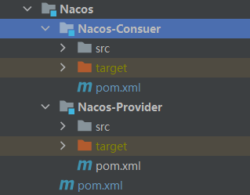
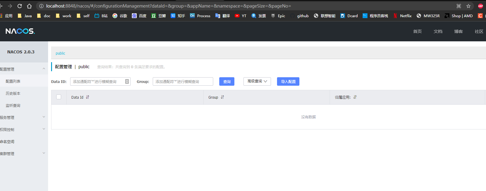
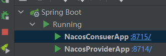
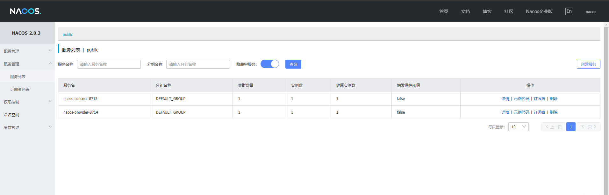
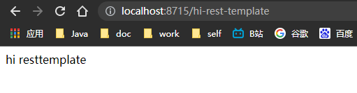

# SpringCloud微服务系列04-Alibaba架构02-Nacos-01-服务注册和发现

根据官方文档

Nacos 致力于帮助您发现、配置和管理微服务。Nacos 提供了一组简单易用的特性集，帮助您快速实现动态服务发现、服务配置、服务元数据及流量管理。

Nacos 帮助您更敏捷和容易地构建、交付和管理微服务平台。 Nacos 是构建以“服务”为中心的现代应用架构 (例如微服务范式、云原生范式) 的服务基础设施。

## 什么是 Nacos？

服务（Service）是 Nacos 世界的一等公民。Nacos 支持几乎所有主流类型的“服务”的发现、配置和管理：

[Kubernetes Service](https://kubernetes.io/docs/concepts/services-networking/service/)

[gRPC](https://grpc.io/docs/guides/concepts.html#service-definition) & [Dubbo RPC Service](https://dubbo.incubator.apache.org/)

[Spring Cloud RESTful Service](https://spring.io/understanding/REST)

Nacos 的关键特性包括:

- **服务发现和服务健康监测**

  Nacos 支持基于 DNS 和基于 RPC 的服务发现。服务提供者使用 [原生SDK](https://nacos.io/zh-cn/docs/sdk.html)、[OpenAPI](https://nacos.io/zh-cn/docs/open-api.html)、或一个[独立的Agent TODO](https://nacos.io/zh-cn/docs/other-language.html)注册 Service 后，服务消费者可以使用[DNS TODO](https://nacos.io/zh-cn/docs/xx) 或[HTTP&API](https://nacos.io/zh-cn/docs/open-api.html)查找和发现服务。

  Nacos 提供对服务的实时的健康检查，阻止向不健康的主机或服务实例发送请求。Nacos 支持传输层 (PING 或 TCP)和应用层 (如 HTTP、MySQL、用户自定义）的健康检查。 对于复杂的云环境和网络拓扑环境中（如 VPC、边缘网络等）服务的健康检查，Nacos 提供了 agent 上报模式和服务端主动检测2种健康检查模式。Nacos 还提供了统一的健康检查仪表盘，帮助您根据健康状态管理服务的可用性及流量。

- **动态配置服务**

  动态配置服务可以让您以中心化、外部化和动态化的方式管理所有环境的应用配置和服务配置。

  动态配置消除了配置变更时重新部署应用和服务的需要，让配置管理变得更加高效和敏捷。

  配置中心化管理让实现无状态服务变得更简单，让服务按需弹性扩展变得更容易。

  Nacos 提供了一个简洁易用的UI ([控制台样例 Demo](http://console.nacos.io/nacos/index.html)) 帮助您管理所有的服务和应用的配置。Nacos 还提供包括配置版本跟踪、金丝雀发布、一键回滚配置以及客户端配置更新状态跟踪在内的一系列开箱即用的配置管理特性，帮助您更安全地在生产环境中管理配置变更和降低配置变更带来的风险。

- **动态 DNS 服务**

  动态 DNS 服务支持权重路由，让您更容易地实现中间层负载均衡、更灵活的路由策略、流量控制以及数据中心内网的简单DNS解析服务。动态DNS服务还能让您更容易地实现以 DNS 协议为基础的服务发现，以帮助您消除耦合到厂商私有服务发现 API 上的风险。

  Nacos 提供了一些简单的 [DNS APIs TODO](https://nacos.io/zh-cn/docs/xx) 帮助您管理服务的关联域名和可用的 IP:PORT 列表.

- **服务及其元数据管理**

  Nacos 能让您从微服务平台建设的视角管理数据中心的所有服务及元数据，包括管理服务的描述、生命周期、服务的静态依赖分析、服务的健康状态、服务的流量管理、路由及安全策略、服务的 SLA 以及最首要的 metrics 统计数据。

- [更多的特性列表 ...](https://nacos.io/zh-cn/docs/roadmap.html)

## 准备工作

- nocos项目
  - provider项目
  - consuer
  - 
- nocos 服务
  - https://github.com/alibaba/nacos.git
  - releases地址: https://github.com/alibaba/nacos/releases

### 从 Github 上下载源码方式

```bash
git clone https://github.com/alibaba/nacos.git
cd nacos/
mvn -Prelease-nacos -Dmaven.test.skip=true clean install -U  
ls -al distribution/target/

// change the $version to your actual path
cd distribution/target/nacos-server-$version/nacos/bin
```

### 下载编译后压缩包方式

您可以从 [最新稳定版本](https://github.com/alibaba/nacos/releases) 下载 `nacos-server-$version.zip` 包。

```bash
  unzip nacos-server-$version.zip 或者 tar -xvf nacos-server-$version.tar.gz
  cd nacos/bin
```

### Linux/Unix/Mac

启动命令(standalone代表着单机模式运行，非集群模式):

```
sh startup.sh -m standalone
```

如果您使用的是ubuntu系统，或者运行脚本报错提示[[符号找不到，可尝试如下运行：

```
bash startup.sh -m standalone
```

### Windows

启动命令(standalone代表着单机模式运行，非集群模式):

```
startup.cmd -m standalone
```

### 打开nacos服务

http://localhost:8848/nacos

默认username: nacos

默认password: nacos

登陆后进入



## 快速开始

### 服务生产者

provider 项目 xml

```xml
<dependency>
    <groupId>org.springframework.cloud</groupId>
    <artifactId>spring-cloud-starter-alibaba-nacos-discovery</artifactId>
    <version>0.2.1.RELEASE</version>
</dependency>
```

application.yml

```yml
server:
  port: 8714
spring:
  application:
    name: nacos-provider-8714
  cloud:
    nacos:
      discovery:
        server-addr: 127.0.0.1:8848
```

启动类

```java
package cn.zm;

import org.springframework.boot.SpringApplication;
import org.springframework.boot.autoconfigure.SpringBootApplication;
import org.springframework.cloud.client.discovery.EnableDiscoveryClient;
import org.springframework.web.bind.annotation.GetMapping;
import org.springframework.web.bind.annotation.RequestParam;
import org.springframework.web.bind.annotation.RestController;

@RestController
@EnableDiscoveryClient
@SpringBootApplication
public class NacosProviderApp {
  public static void main(String[] args) {
    SpringApplication.run(NacosProviderApp.class);
  }

  @GetMapping("/hi")
  public String hi(@RequestParam(value = "name", defaultValue = "forezp", required = false) String name) {
    return "hi " + name;
  }
}
```

### 服务消费者

Nacos-Consuer 的 pom.xml

```xml
<?xml version="1.0" encoding="UTF-8"?>
<project xmlns="http://maven.apache.org/POM/4.0.0"
         xmlns:xsi="http://www.w3.org/2001/XMLSchema-instance"
         xsi:schemaLocation="http://maven.apache.org/POM/4.0.0 http://maven.apache.org/xsd/maven-4.0.0.xsd">
    <parent>
        <artifactId>Nacos</artifactId>
        <groupId>cn.zm</groupId>
        <version>1.0-SNAPSHOT</version>
    </parent>
    <modelVersion>4.0.0</modelVersion>

    <artifactId>Nacos-Consuer</artifactId>

    <properties>
        <maven.compiler.source>8</maven.compiler.source>
        <maven.compiler.target>8</maven.compiler.target>
    </properties>

    <dependencies>
        <!--nocos dis-->
        <dependency>
            <groupId>org.springframework.cloud</groupId>
            <artifactId>spring-cloud-starter-alibaba-nacos-discovery</artifactId>
            <version>0.2.1.RELEASE</version>
        </dependency>

        <!--feign 依赖-->
        <dependency>
            <groupId>org.springframework.cloud</groupId>
            <artifactId>spring-cloud-starter-openfeign</artifactId>
        </dependency>

        <!--ribbon 负载均衡依赖客户端集成-->
        <dependency>
            <groupId>org.springframework.cloud</groupId>
            <artifactId>spring-cloud-starter-netflix-ribbon</artifactId>
        </dependency>

    </dependencies>


</project>
```

application.yml

```yml
server:
  port: 8715
spring:
  application:
    name: nacos-consuer-8715
  cloud:
    nacos:
      discovery:
        server-addr: 127.0.0.1:8848
#        namespace: 333f1c20-282b-46f5-aeeb-c7ab6e6f5bac
  main:
    #允许存在多个Feign调用相同Service的接口
    allow-bean-definition-overriding: true
```

启动类

```java
package cn.zm;

import cn.zm.nacos.service.ProviderClient;
import org.springframework.boot.SpringApplication;
import org.springframework.boot.autoconfigure.SpringBootApplication;
import org.springframework.cloud.client.discovery.EnableDiscoveryClient;
import org.springframework.cloud.client.loadbalancer.LoadBalanced;
import org.springframework.cloud.openfeign.EnableFeignClients;
import org.springframework.context.annotation.Bean;
import org.springframework.web.bind.annotation.GetMapping;
import org.springframework.web.bind.annotation.RestController;
import org.springframework.web.client.RestTemplate;

import javax.annotation.Resource;

@EnableFeignClients
@EnableDiscoveryClient
@SpringBootApplication
public class NacosConsuerApp {
  public static void main(String[] args) {
    SpringApplication.run(NacosConsuerApp.class);
  }

  @Bean
  @LoadBalanced
  public RestTemplate restTemplate() {
    return new RestTemplate();
  }

  @RestController
  public class ConsumerController {

    @Resource
    RestTemplate restTemplate;

    @Resource
    ProviderClient providerClient;

    @GetMapping("/hi-feign")
    public String hiFeign(){
      return providerClient.hi("feign");
    }

    @GetMapping("/hi-rest-template")
    public String hiResttemplate() {
      return restTemplate.getForObject("http://nacos-provider-8714/hi?name=resttemplate", String.class);

    }
  }

}
```

### 启动测试



查看nocos注册信息



消费者接口测试


通过消费者项目消费服务



关键代码

```java
@Bean
@LoadBalanced
public RestTemplate restTemplate() {
    return new RestTemplate();
}

@GetMapping("/hi-rest-template")
public String hiResttemplate() {
  return restTemplate.getForObject("http://nacos-provider-8714/hi?name=resttemplate", String.class);

}
```


## 引用资料

>https://nacos.io/zh-cn/docs/quick-start.html
>
>https://github.com/alibaba/nacos
>
>https://nacos.io/zh-cn/docs/what-is-nacos.html
>
>https://www.fangzhipeng.com/springcloud/2019/05/30/sc-nacos-discovery.html


