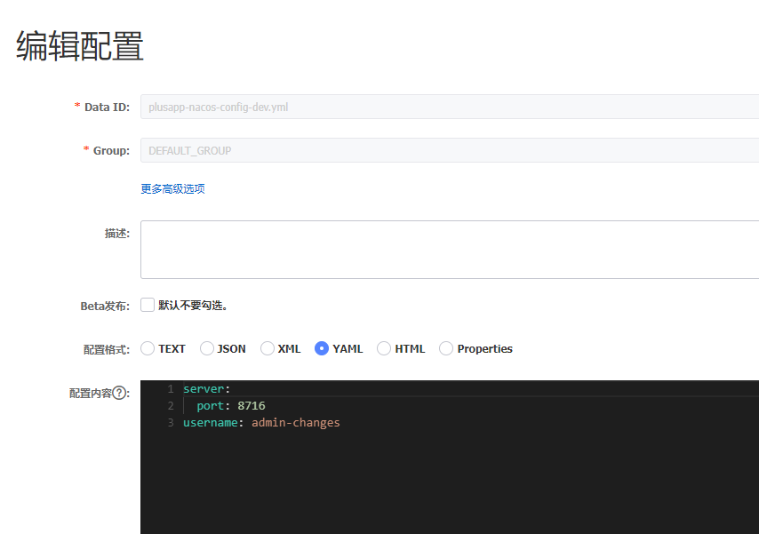
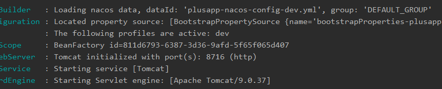
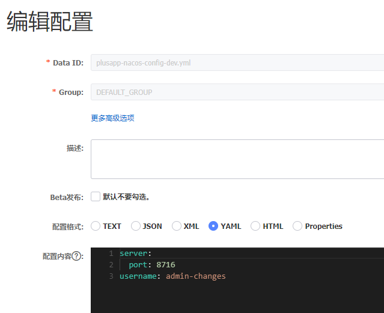
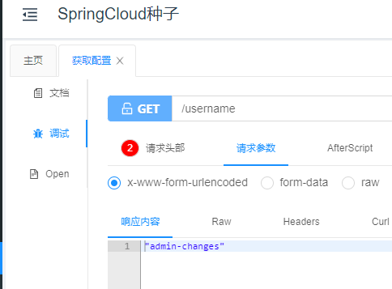
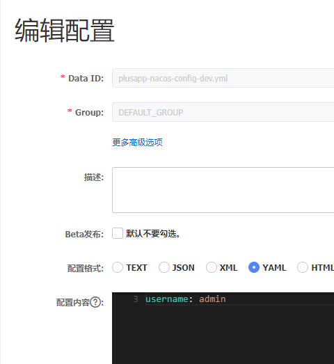
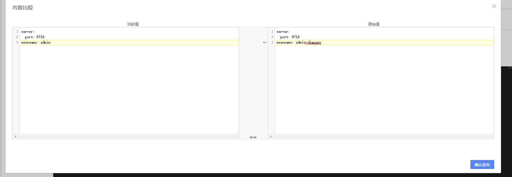
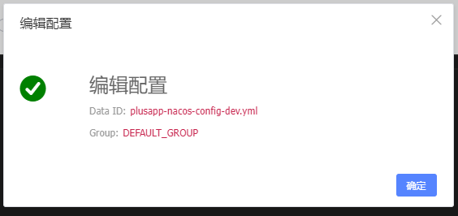
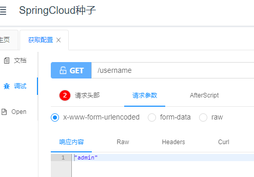
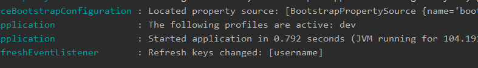

# SpringCloud微服务系列04-Alibaba架构02-Nacos-02-配置中心

Nacos除了可以作为服务注册中心，它还有服务配置中心的功能。类似于consul config，Nacos 是支持热加载的。本篇文章将讲述如何使用Nacos作为配置中心。


## 准备工作

- nacos服务
- 新建的nacos-config项目


## 快速开始

nacos-config项目的配置

```xml
<dependencies>
    <dependency>
        <groupId>cn.zm</groupId>
        <artifactId>common</artifactId>
        <exclusions>
            <exclusion>
                <groupId>com.alibaba</groupId>
                <artifactId>druid-spring-boot-starter</artifactId>
            </exclusion>

        </exclusions>
    </dependency>

    <dependency>
        <groupId>org.springframework.cloud</groupId>
        <artifactId>spring-cloud-alibaba-nacos-config</artifactId>
        <version>0.2.1.RELEASE</version>
    </dependency>
</dependencies>
```

bootstrap.yml **一定得是bootstrap.yml文件**

```yml
spring:
  application:
    name: plusapp-nacos-config-8716
  cloud:
    nacos:
      config:
        server-addr: 127.0.0.1:8848
        file-extension: yml
        prefix: plusapp-nacos-config
  profiles:
    active: dev
```

在上面的配置中，配置了nacos config server的地址，配置的扩展名是ymal（目前仅支持ymal和properties）。注意是没有配置server.port的，sever.port的属性在nacos中配置。上面的配置是和Nacos中的`dataId` 的格式是对应的，nacos的完整格式如下：

```yml
${prefix}-${spring.profile.active}.${file-extension}
```

### 规则:

- `prefix` 默认为 `spring.application.name` 的值，也可以通过配置项 `spring.cloud.nacos.config.prefix`来配置。
- `spring.profile.active` 即为当前环境对应的 profile，详情可以参考 [Spring Boot文档](https://docs.spring.io/spring-boot/docs/current/reference/html/boot-features-profiles.html#boot-features-profiles)。 **注意：当 `spring.profile.active` 为空时，对应的连接符 `-` 也将不存在，dataId 的拼接格式变成 `${prefix}.${file-extension}`**
- `file-exetension` 为配置内容的数据格式，可以通过配置项 `spring.cloud.nacos.config.file-extension` 来配置。目前只支持 `properties` 和 `yaml` 类型。

### 配置yml文件



### 启动类

```java
package cn.zm;

import org.springframework.boot.SpringApplication;
import org.springframework.boot.autoconfigure.SpringBootApplication;

@SpringBootApplication
public class NacosConfigApp {
    public static void main(String[] args) {
        SpringApplication.run(NacosConfigApp.class);
    }

}
```

### 接口

```java
package cn.zm.config.rest;

import io.swagger.annotations.Api;
import io.swagger.annotations.ApiOperation;
import org.springframework.beans.factory.annotation.Value;
import org.springframework.cloud.context.config.annotation.RefreshScope;
import org.springframework.web.bind.annotation.GetMapping;
import org.springframework.web.bind.annotation.RestController;


@Api(tags = "配置控制")
@RestController
@RefreshScope
public class ConfigController {
  @Value("${username}")
  private String username;

  @ApiOperation("获取配置")
  @GetMapping("/username")
  public String get() {
    return username;
  }

}
```

## 测试

启动成功拉取nacos的配置文件



未修改前读取












修改后读取




查看日志




## 引用资料

>此项目github https://github.com/niziming/SpringCloud-Seed
>
>https://www.fangzhipeng.com/springcloud/2019/06/01/sc-nacos-config.html
