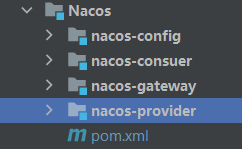
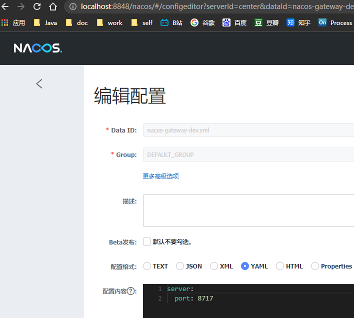
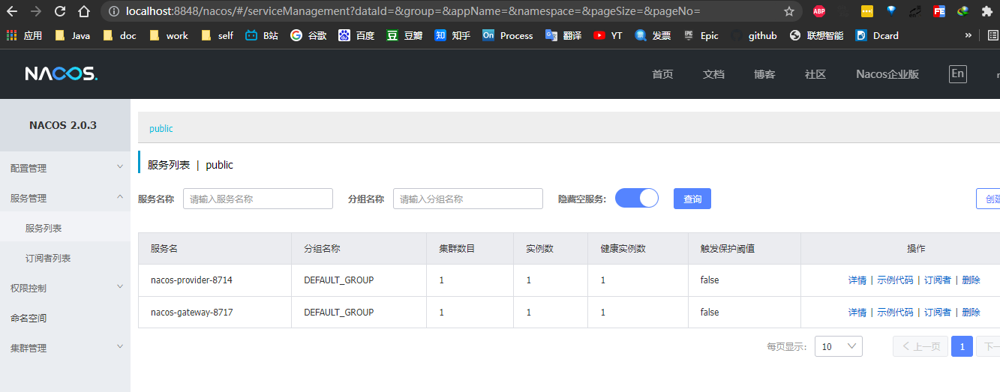

# SpringCloud微服务系列04-Alibaba架构02-Nacos-03-gateway作为服务网关

Spring Cloud Gateway是Spring Cloud官方推出的第二代网关框架，取代Zuul网关。网关作为流量的，在微服务系统中有着非常作用，网关常见的功能有路由转发、权限校验、限流控制等作用。

将Gateway整合进nacos项目

## 准备工作

- Nacos服务
- 前面章节的provider项目
- 拷贝的前面的gateway项目

目录结构如下



### 快速开始

nacos-gateway 项目配置 xml

```xml
<!--nacos-->
<dependency>
    <groupId>com.alibaba.cloud</groupId>
    <artifactId>spring-cloud-starter-alibaba-nacos-discovery</artifactId>
</dependency>

<!--config-->
<dependency>
    <groupId>org.springframework.cloud</groupId>
    <artifactId>Spring-Cloud-Alibaba-nacos-config</artifactId>
    <version>0.2.1.RELEASE</version>
</dependency>

<!--gateway 网关-->
<dependency>
    <groupId>org.springframework.cloud</groupId>
    <artifactId>spring-cloud-starter-gateway</artifactId>
</dependency>

```

bootstrap.yml

```yml
spring:
  application:
    name: nacos-gateway-8717
  profiles:
    active: dev
  cloud:
    nacos:
      config:
        server-addr: 127.0.0.1:8848
        file-extension: yml
        prefix: nacos-gateway-dev
    gateway:
      discovery:
        locator:
          enabled: false
          lowerCaseServiceId: true
      routes:
        - id: nacos-provider-8714
          uri: lb://nacos-provider-8714
          predicates:
            - Path=/provider/**
          filters:
            - StripPrefix=1
```


nacos 的 nacos-gateway-dev.yml 配置





启动类

```java
package cn.zm;

import org.springframework.boot.SpringApplication;
import org.springframework.boot.autoconfigure.SpringBootApplication;
import org.springframework.cloud.client.discovery.EnableDiscoveryClient;

@EnableDiscoveryClient
@SpringBootApplication
public class NacosGatewayApp {
    public static void main(String[] args) {
        SpringApplication.run(NacosGatewayApp.class);
    }

}
```


### 测试

启动

NacosGatewayApp :8717/
NacosProviderApp :8714/


查看注册中心


输入http://localhost:8714//hi查看结果

```java
@GetMapping("/hi")
public String hi(@RequestParam(value = "name", defaultValue = "forezp", required = false) String name) {
  return "hi " + name;
}
```


根据gateway的路由规则访问我们的provider服务


gateway的日志显示

~~~
2021-12-02 13:43:21.579  INFO 2128 --- [ctor-http-nio-2] c.n.l.DynamicServerListLoadBalancer      : DynamicServerListLoadBalancer for client nacos-provider-8714 initialized: DynamicServerListLoadBalancer:{NFLoadBalancer:name=nacos-provider-8714,current list of Servers=[192.168.13.14:8714],Load balancer stats=Zone stats: {unknown=[Zone:unknown;	Instance count:1;	Active connections count: 0;	Circuit breaker tripped count: 0;	Active connections per server: 0.0;]
},Server stats: [[Server:192.168.13.14:8714;	Zone:UNKNOWN;	Total Requests:0;	Successive connection failure:0;	Total blackout seconds:0;	Last connection made:Thu Jan 01 08:00:00 CST 1970;	First connection made: Thu Jan 01 08:00:00 CST 1970;	Active Connections:0;	total failure count in last (1000) msecs:0;	average resp time:0.0;	90 percentile resp time:0.0;	95 percentile resp time:0.0;	min resp time:0.0;	max resp time:0.0;	stddev resp time:0.0]
]}ServerList:com.alibaba.cloud.nacos.ribbon.NacosServerList@1a4fb33c
2021-12-02 13:43:22.572  INFO 2128 --- [erListUpdater-0] c.netflix.config.ChainedDynamicProperty  : Flipping property: nacos-provider-8714.ribbon.ActiveConnectionsLimit to use NEXT property: niws.loadbalancer.availabilityFilteringRule.activeConnectionsLimit = 2147483647

~~~

路由成功


## 引用资料

>https://www.fangzhipeng.com/springcloud/2021/04/03/sc-2020-gateway.html
>
>项目所有的文件
>
>https://github.com/niziming/SpringCloud-Seed
