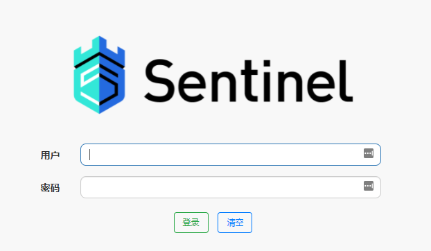
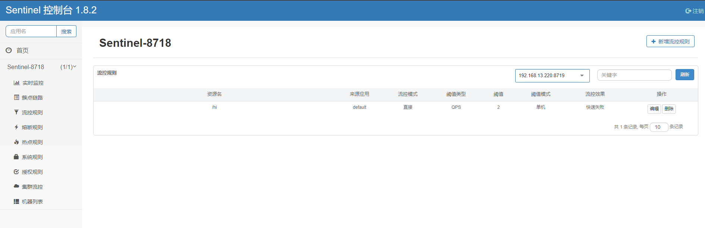
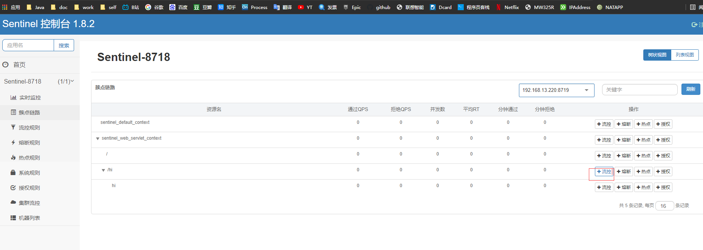
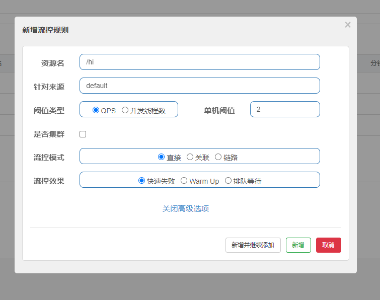
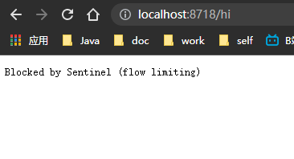
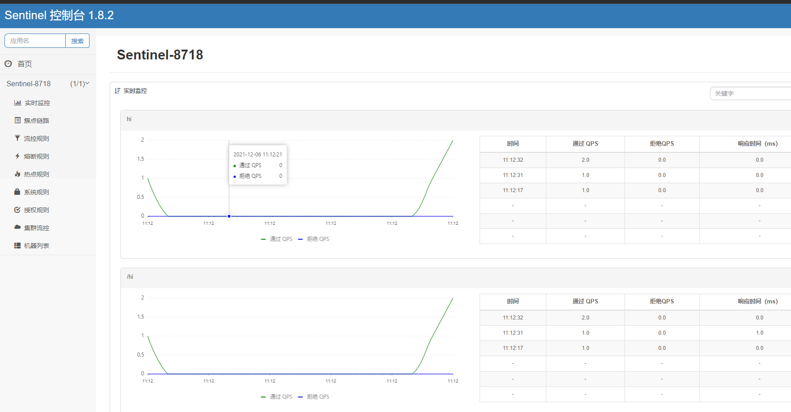

# SpringCloud微服务系列04-Alibaba架构03-Sentinel-01-流量控制和熔断降级

Sentinel，中文翻译为哨兵，是为微服务提供流量控制、熔断降级的功能，它和Hystrix提供的功能一样，可以有效的解决微服务调用产生的“雪崩”效应，为微服务系统提供了稳定性的解决方案。随着Hytrxi进入了维护期，不再提供新功能，Sentinel是一个不错的替代方案。通常情况，Hystrix采用线程池对服务的调用进行隔离，Sentinel才用了用户线程对接口进行隔离，二者相比，Hystrxi是服务级别的隔离，Sentinel提供了接口级别的隔离，Sentinel隔离级别更加精细，另外Sentinel直接使用用户线程进行限制，相比Hystrix的线程池隔离，减少了线程切换的开销。另外Sentinel的DashBoard提供了在线更改限流规则的配置，也更加的优化。

从官方文档的介绍，Sentinel 具有以下特征:

- 丰富的应用场景： Sentinel 承接了阿里巴巴近 10 年的双十一大促流量的核心场景，例如秒杀（即突发流量控制在系统容量可以承受的范围）、消息削峰填谷、实时熔断下游不可用应用等。
- 完备的实时监控： Sentinel 同时提供实时的监控功能。您可以在控制台中看到接入应用的单台机器秒级数据，甚至 500 台以下规模的集群的汇总运行情况。
- 广泛的开源生态： Sentinel 提供开箱即用的与其它开源框架/库的整合模块，例如与 Spring Cloud、Dubbo、gRPC 的整合。您只需要引入相应的依赖并进行简单的配置即可快速地接入 Sentinel。
- 完善的 SPI 扩展点： Sentinel 提供简单易用、完善的 SPI 扩展点。您可以通过实现扩展点，快速的定制逻辑。例如定制规则管理、适配数据源等。

## 准备工作

- sentinel 新建项目
- nacos 服务,之前章节使用的
- sentinel-dashboard 服务
  - https://github.com/alibaba/Sentinel/releases下载
  - 启动命令 `java -jar -Dserver.port=8090 sentinel-dashboard-1.8.2.jar` -Dserver.port=8090 指定端口启动
  - 登陆名为sentinel，密码为sentinel。



## 快速开始

Sentinel 项目 pom

```xml
<?xml version="1.0" encoding="UTF-8"?>
<project xmlns="http://maven.apache.org/POM/4.0.0"
         xmlns:xsi="http://www.w3.org/2001/XMLSchema-instance"
         xsi:schemaLocation="http://maven.apache.org/POM/4.0.0 http://maven.apache.org/xsd/maven-4.0.0.xsd">
    <parent>
        <artifactId>Spring-Cloud-Alibaba</artifactId>
        <groupId>cn.zm</groupId>
        <version>1.0-SNAPSHOT</version>
    </parent>
    <modelVersion>4.0.0</modelVersion>

    <artifactId>Sentinel</artifactId>

    <properties>
        <maven.compiler.source>8</maven.compiler.source>
        <maven.compiler.target>8</maven.compiler.target>
    </properties>

    <dependencies>
        <!--sentinel-->
        <dependency>
            <groupId>org.springframework.cloud</groupId>
            <artifactId>spring-cloud-starter-alibaba-sentinel</artifactId>
            <version>0.2.1.RELEASE</version>
        </dependency>

        <!--nacos-discovery-->
        <dependency>
            <groupId>org.springframework.cloud</groupId>
            <artifactId>spring-cloud-alibaba-nacos-discovery</artifactId>
            <version>0.2.1.RELEASE</version>
        </dependency>


        <!--web-->
        <dependency>
            <groupId>org.springframework.boot</groupId>
            <artifactId>spring-boot-starter-web</artifactId>
        </dependency>
    </dependencies>


</project>
```

application.yml这里选择dashboard端口为8090,,免得tomcat默认端口占用

```yml
server:
  port: 8718
spring:
  application:
    name: Sentinel-8718
  cloud:
    nacos:
      discovery:
        server-addr: 127.0.0.1:8848
    sentinel:
      transport:
        port: 8719
        dashboard: localhost:8090
```


ProviderController 测试接口

关于@SentinelResource 注解，有以下的属性：

- value：资源名称，必需项（不能为空）
- entryType：entry 类型，可选项（默认为 EntryType.OUT）
- blockHandler / blockHandlerClass: blockHandler 对应处理 BlockException 的函数名称，可选项
- fallback：fallback 函数名称，可选项，用于在抛出异常的时候提供 fallback 处理逻辑。

启动Nacos，并启动nacos-provider项目。文末有源码下载链接。

```java
package cn.zm.sentinel.rest;

import com.alibaba.csp.sentinel.annotation.SentinelResource;
import org.springframework.web.bind.annotation.GetMapping;
import org.springframework.web.bind.annotation.RequestParam;
import org.springframework.web.bind.annotation.RestController;

@RestController
public class ProviderController {
  @GetMapping("/hi")
  @SentinelResource(value="hi")
  public String hi(@RequestParam(value = "name",defaultValue = "forezp",required = false)String name){
    return "hi "+name;
  }
}
```

启动类

```java
package cn.zm;

import org.springframework.boot.SpringApplication;
import org.springframework.boot.autoconfigure.SpringBootApplication;
import org.springframework.cloud.client.discovery.EnableDiscoveryClient;

@EnableDiscoveryClient
@SpringBootApplication
public class SentinelApp {
    public static void main(String[] args) {
        SpringApplication.run(SentinelApp.class);
    }

}
```

### 测试

进入dashboard






设置阈值




多次快速访问nacos-provider的接口资源http://localhost:8718/hi，可以发现偶尔出现以下的信息：

> Blocked by Sentinel (flow limiting)

正常的返回逻辑为

> hi forezp





## 引用资料

>https://www.fangzhipeng.com/springcloud/2019/06/02/sc-sentinel.html
>
>https://github.com/alibaba/Sentinel/releases
>
>https://github.com/alibaba/Sentinel
