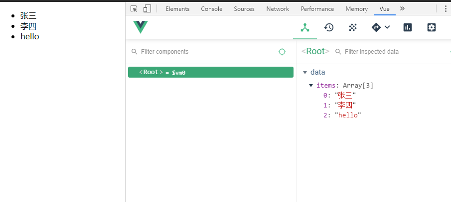

# Vue学习记录
这边博客为自己学习vue的记录.开始篇幅较大,如果基础好的同学可以直接点击vue内容开始浏览.

## Vue 语法
- `v-if`
~~~ vue
    

      
a

      
b

      
c

    

    
~~~

输出
~~~ 
b
~~~

- `v-for`
~~~ vue

      <ul>
        <li v-for="item in items">
          {{item}}
        </li>
      </ul>
    

    
~~~
输出

- `v-on`
~~~ vue

      <button v-on:click="say()">
        点击弹出
      </button>
    

    
    
~~~
输出

第二种
- `v-on`
~~~ vue

      <button v-on:click="say()">
        点击弹出
      </button>
    

    
    
~~~
输出

## 参考资料

> 李卫民的教程
> https://www.funtl.com/zh/vue-prepare/
> https://www.bilibili.com/video/av44230028/?p=1
> Vue官网教程
> https://cn.vuejs.org/v2/guide/installation.html
