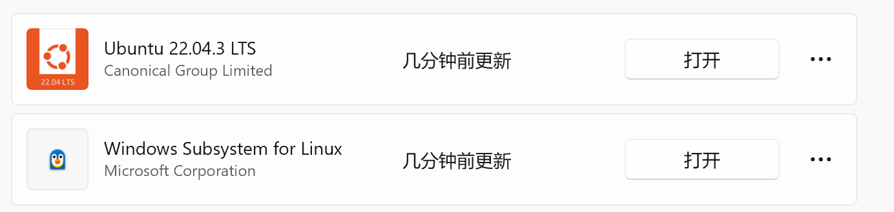
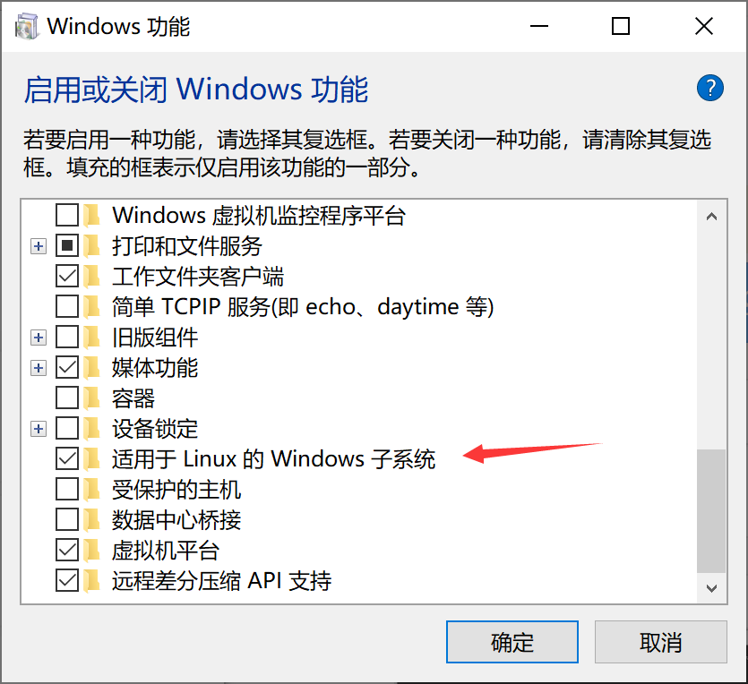
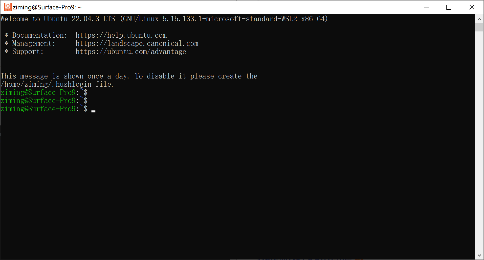

# windows subsystem for linux 01-wsl安装

## 简介

Windows Subsystem for Linux（简称WSL）是一个在Windows 10\11上能够运行原生Linux二进制[可执行文件](https://baike.baidu.com/item/可执行文件/2885816?fromModule=lemma_inlink)（[ELF](https://baike.baidu.com/item/ELF/7120560?fromModule=lemma_inlink)格式）的兼容层。它是由[微软](https://baike.baidu.com/item/微软/124767?fromModule=lemma_inlink)与[Canonical](https://baike.baidu.com/item/Canonical/6204449?fromModule=lemma_inlink)公司合作开发，其目标是使纯正的[Ubuntu](https://baike.baidu.com/item/Ubuntu/155795?fromModule=lemma_inlink)、[Debian](https://baike.baidu.com/item/Debian/748667?fromModule=lemma_inlink)等映像能下载和解压到用户的本地计算机，并且映像内的工具和实用工具能在此[子系统](https://baike.baidu.com/item/子系统/4670893?fromModule=lemma_inlink)上原生运行。 [1-3]

## 准备工作

- 打开Microsoft Store

- 安装 ubuntu 22.0403 LTS
- 安装 wsl

- 打开window 功能开启子系统

## 开始

安装好后直接打开 Ubuntu 22.04.3 LTS  设置好账户密码 成功进入系统

~~~shell
ziming@Surface-Pro9:~$ ll
total 24
drwxr-x--- 3 ziming ziming 4096 Dec 24 11:51 ./
drwxr-xr-x 3 root   root   4096 Dec 24 11:45 ../
-rw-r--r-- 1 ziming ziming  220 Dec 24 11:45 .bash_logout
-rw-r--r-- 1 ziming ziming 3771 Dec 24 11:45 .bashrc
drwx------ 2 ziming ziming 4096 Dec 24 11:51 .cache/
-rw-r--r-- 1 ziming ziming    0 Dec 24 11:51 .motd_shown
-rw-r--r-- 1 ziming ziming  807 Dec 24 11:45 .profile
ziming@Surface-Pro9:~$

~~~

### window商店位置转移

微软安装子系统后, 安装的东西会越来越多, C盘占用越来越大.

## 引用资料

>[体验linux，小白的WSL(Windows Subsystem for Linux)安装指南-CSDN博客](https://blog.csdn.net/weixin_63581421/article/details/133594410)
>
>[Windows Subsystem for Linux：让Linux在Windows下无缝运行-CSDN博客](https://blog.csdn.net/winkexin/article/details/131499983)
>
>
