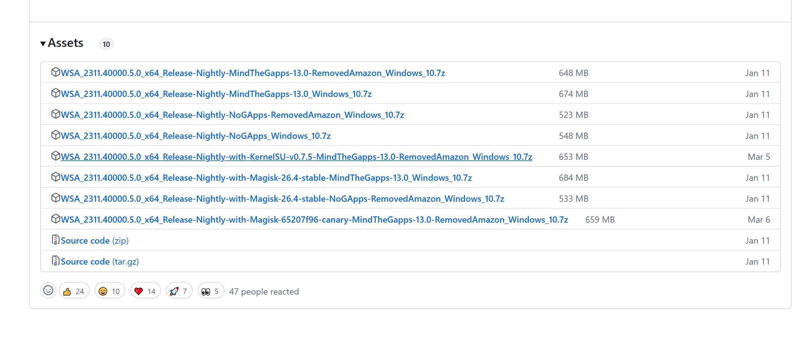
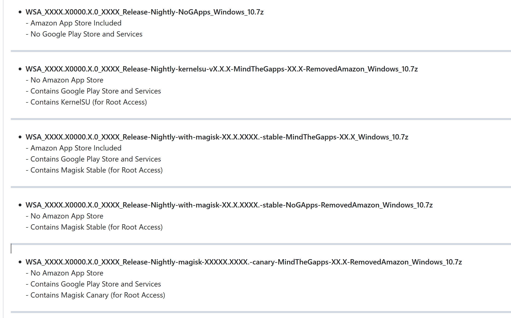
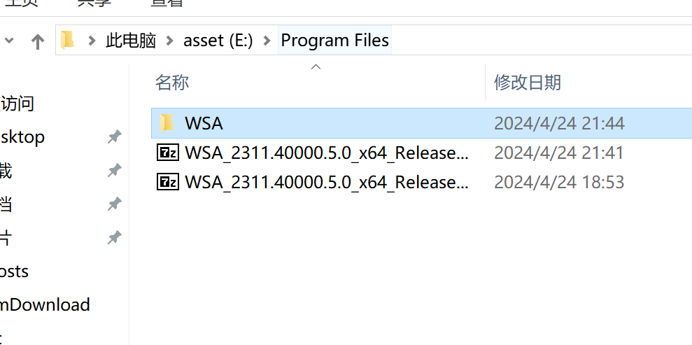
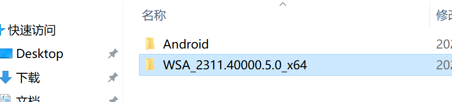
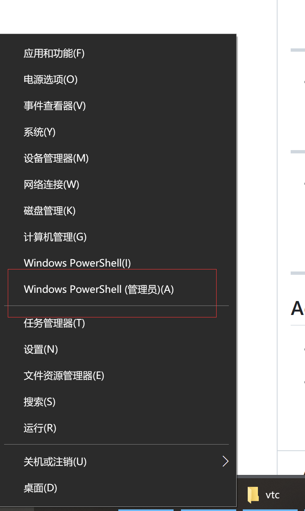
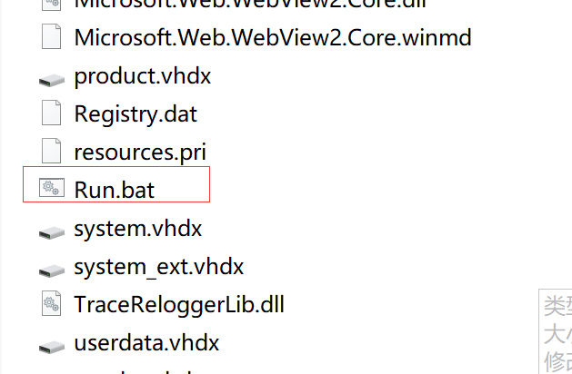
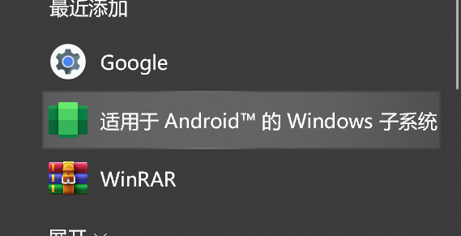

# 安卓子系统

如果原本安装了相关子系统可以进行卸载

步骤一：打开命令提示符
首先，我们需要打开命令提示符。这可以通过按下Win键，然后输入"cmd"并按Enter键来完成。

步骤二：检查当前子系统路径
在命令提示符中，我们可以使用以下命令来查看当前的子系统路径：

```
wsl --list --verbose
```

这将列出所有已安装的子系统及其详细信息，包括其安装路径。

步骤三：卸载子系统
如果需要更改子系统的安装目录，我们首先需要卸载当前的子系统。可以使用以下命令来卸载子系统：

```
wsl --unregister <DistroName>
```


其中，<DistroName>是你想要卸载的子系统的名称。例如，如果你想要卸载名为"Ubuntu"的子系统，你可以使用以下命令：

```
wsl --unregister Ubuntu
```


步骤四：更改子系统路径
卸载子系统后，我们可以更改其安装路径。首先，我们需要创建新的子系统目录。可以使用以下命令来创建新的子系统目录：

```
mkdir /path/to/new/directory
```


然后，我们可以使用以下命令来安装新的子系统：

```
wsl --install -d <DistroName> -u <Username> -p <Password> -e <EnvironmentVariables> /path/to/new/directory
```


其中，<DistroName>是你想要安装的子系统的名称，<Username>和<Password>是你的Windows用户名和密码，<EnvironmentVariables>是你想要设置的环境变量，/path/to/new/directory是你刚刚创建的新子系统目录的路径。

步骤五：验证更改
最后，我们可以再次使用以下命令来查看新的子系统路径：

```
wsl --list --verbose
```


## 简介


## 准备工作

[Release Windows Subsystem For Android 2311.40000.5.0 for Windows 10 x64 · MustardChef/WSABuilds (github.com)](https://github.com/MustardChef/WSABuilds/releases/tag/Windows_10_2311.40000.5.0)

先下载wsa的文件





按照自己需求选择自己需要的版本






下载好后解压




管理员方式启动shell 然后进入文件夹目录



直接运行run.bat即可

安装完成



## 引用资料

>[Release Windows Subsystem For Android 2311.40000.5.0 for Windows 10 x64 · MustardChef/WSABuilds (github.com)](https://github.com/MustardChef/WSABuilds/releases/tag/Windows_10_2311.40000.5.0)
>
>
