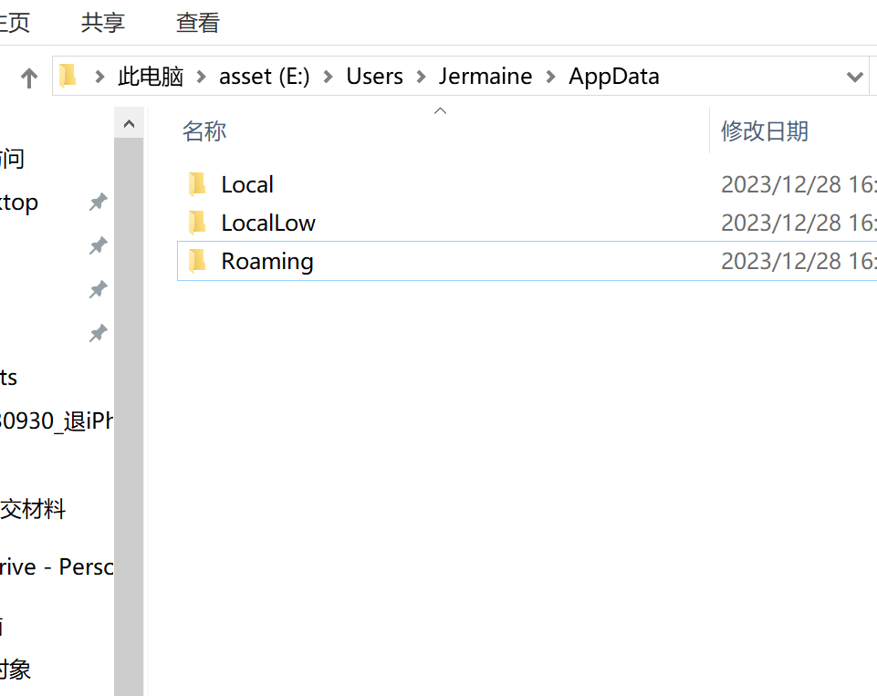
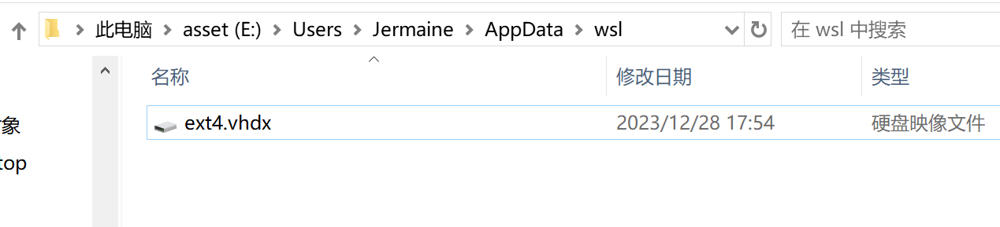
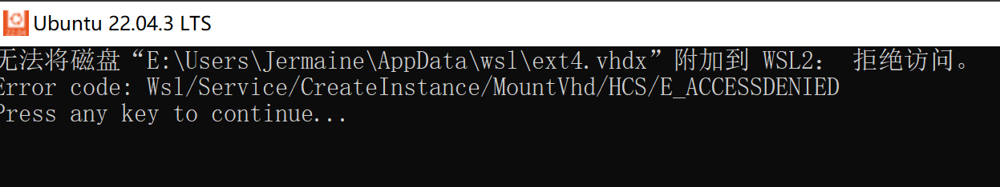
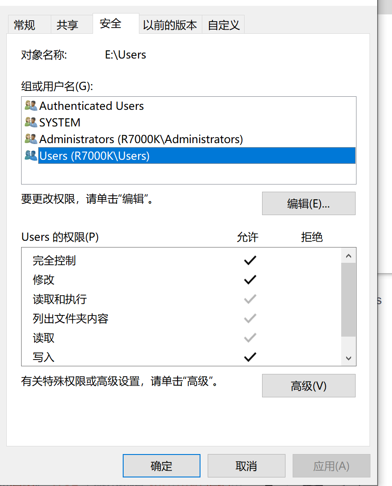
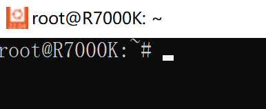

# windows10-subsystem-for-linux-03-C盘空间转移

下载安装的WLS默认在C盘，如果C盘重装就会导致WLS直接受影响，同时因为一般C盘空间有限，如果长期使用，可能会导致系统速度越来越慢，因此选择将WLS迁移到其他盘，我选择的是电脑自带的固态硬盘。

## 简介


### Win10 mklink

**mklink 命令是 Windows 自带的命令**，除了在 Win10 系统下使用，在比较早的系统比如 Win 7、Win Vista、Win 8 和 Win 8.1 也都是可以使用的。不过在除了 Win 10 之外的系统里使用，是必须使用管理员权限的，否则会提示“你没有足够的权限执行此操作。”，当然经过我验证，Win 10 有时候也是需要管理员权限的。

### LxRunOffline

A full-featured utility for managing *Windows Subsystem for Linux (WSL)*.

- Install any Linux distro to any directory on your computer.
- Move an existing installation to another directory.
- Duplicate(copy) an existing installation.
- Register an existing installation directory. This enables you to install to a USB stick and use it on different computers.
- Run arbitrary Linux commands in a specified installation.
- Configure default user, environment variables and [various flags](https://docs.microsoft.com/en-us/previous-versions/windows/desktop/api/wslapi/ne-wslapi-wsl_distribution_flags).
- Export configuration to an XML file and import from the file.
- Export an installation to a tar file.

## 准备工作

- Win10 mklink命令
- [Releases · DDoSolitary/LxRunOffline (github.com)](https://github.com/DDoSolitary/LxRunOffline/releases)

- wsl --shutdown 关闭所有子系统

## 使用 mklink 连接本地磁盘

```text
MKLINK [[/D] | [/H] | [/J]] Link Target
        /D        创建目录符号链接。默认为文件符号链接。
        /H        创建硬链接而非符号链接。
        /J        创建目录联接。
        Link      指定新的符号链接名称。
        Target    指定新链接引用的路径(相对或绝对)。
```

这个地方我们使用 /J创建一个目录联接 示例:

`mklink /J "C:\Users\Jermaine\AppData\Local\Packages" "E:\Users\Jermaine\AppData\Local\Packages"`


`mklink /D "C:\Users\Jermaine\AppData\Local\Packages" "E:\Users\Jermaine\AppData\Local\Packages"`

### windows 应用默认存储位置

C:\Users\Jermaine\AppData > E:\Users\Jermaine\AppData

将地下的文件直接复制到E盘相同路径




### WLS迁移

#### 下载LxRunOffline

[Releases · DDoSolitary/LxRunOffline (github.com)](https://github.com/DDoSolitary/LxRunOffline/releases)


~~~
Supported actions are:
    l, list            List all installed distributions.
    gd, get-default    Get the default distribution, which is used by bash.exe.
    sd, set-default    Set the default distribution, which is used by bash.exe.
    i, install         Install a new distribution.
    ui, uninstall      Uninstall a distribution.
    rg, register       Register an existing installation directory.
    ur, unregister     Unregister a distribution but not delete the installation directory.
    m, move            Move a distribution to a new directory.
    d, duplicate       Duplicate an existing distribution in a new directory.
    e, export          Export a distribution's filesystem to a .tar.gz file, which can be imported by the "install" command.
    r, run             Run a command in a distribution.
    di, get-dir        Get the installation directory of a distribution.
    gv, get-version    Get the filesystem version of a distribution.
    ge, get-env        Get the default environment variables of a distribution.
    se, set-env        Set the default environment variables of a distribution.
    ae, add-env        Add to the default environment variables of a distribution.
    re, remove-env     Remove from the default environment variables of a distribution.
    gu, get-uid        Get the UID of the default user of a distribution.
    su, set-uid        Set the UID of the default user of a distribution.
    gk, get-kernelcmd  Get the default kernel command line of a distribution.
    sk, set-kernelcmd  Set the default kernel command line of a distribution.
    gf, get-flags      Get some flags of a distribution. See https://docs.microsoft.com/en-us/previous-versions/windows/desktop/api/wslapi/ne-wslapi-wsl_distribution_flags for details.
    sf, set-flags      Set some flags of a distribution. See https://docs.microsoft.com/en-us/previous-versions/windows/desktop/api/wslapi/ne-wslapi-wsl_distribution_flags for details.
    s, shortcut        Create a shortcut to launch a distribution.
    ec, export-config  Export configuration of a distribution to an XML file.
    ic, import-config  Import configuration of a distribution from an XML file.
    sm, summary        Get general information of a distribution.
    version            Get version information about this LxRunOffline.exe.
~~~


#### 查看子系统安装位置

使用`lxrunoffline move`进行迁移 ， -n 指定你要迁移的系统名 ，-d 指定你新系统的迁移路径

`.\LxRunOffline.exe move -n Ubuntu-22.04 -d E:\Users\Jermaine\AppData\wsl`

~~~bash
PS D:\Program Files\LxRunOffline-v3.5.0-msvc_2> .\LxRunOffline.exe move -n Ubuntu-22.04 -d E:\Users\Jermaine\AppData\wsl
PS D:\Program Files\LxRunOffline-v3.5.0-msvc_2>

~~~

迁移结果




`LxRunOffline.exe get-dir`查询系统目录，查看是否迁移成功


## 问题





是因为文件没有权限



授权后再打开





## 引用资料

>[Win10 mklink命令怎么用，mklink使用教程 - 知乎 (zhihu.com)](https://zhuanlan.zhihu.com/p/659354569)
>
>[Win10子系统（linux）安装及迁移 - 知乎 (zhihu.com)](https://zhuanlan.zhihu.com/p/145753804)
>
>[DDoSolitary/LxRunOffline: A full-featured utility for managing Windows Subsystem for Linux (WSL) (github.com)](https://github.com/DDoSolitary/LxRunOffline)
>
>[Releases · DDoSolitary/LxRunOffline (github.com)](https://github.com/DDoSolitary/LxRunOffline/releases)
>
>[迁移wsl到D后无法正常启动_无法将磁盘“f:\os\ext4.vhdx”附加到 wsl2: 拒绝访问-CSDN博客](https://blog.csdn.net/weixin_37178320/article/details/128720616)
