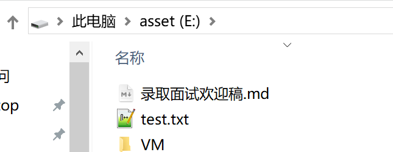

# windows linux子系统如何将文件导出到宿主系统?

windows linux子系统如何将文件导出到宿主系统?

例如 将linux下/home/test 导出到 E:\Users\Jermaine\AppData\wsl\output

## 简介


## 准备工作

在Windows中，可以使用Windows Linux子系统(WSL)来导出文件。以下是一个简单的步骤和示例代码，展示如何使用命令行将文件从WSL导出到Windows文件系统。

1. 打开Windows命令提示符或PowerShell。
2. 启动你的WSL实例（例如Ubuntu）。
3. 在WSL中使用`cp`或`scp`等命令来复制或移动文件。

示例代码：

```
bash# 启动你的WSL实例，例如Ubuntuwsl# 在WSL中，导出文件# 假设你想要导出的文件位于/home/username/documents/，你想要导出的文件是example.txtcp /home/username/documents/example.txt /mnt/c/Users/username/Documents/# 退出WSLexit
```

在上面的示例中，`/mnt/c/Users/username/Documents/`是Windows文件系统中的路径，你可以根据实际情况更改它。在WSL中执行`cp`命令时，文件`example.txt`将被复制到Windows的Documents文件夹中。


这个/mnt/c 表示挂载C盘的意思

~~~
root@R7000K:/home# cp test.txt  /mnt/e/
root@R7000K:/home#

~~~




## 引用资料

>
>
>
