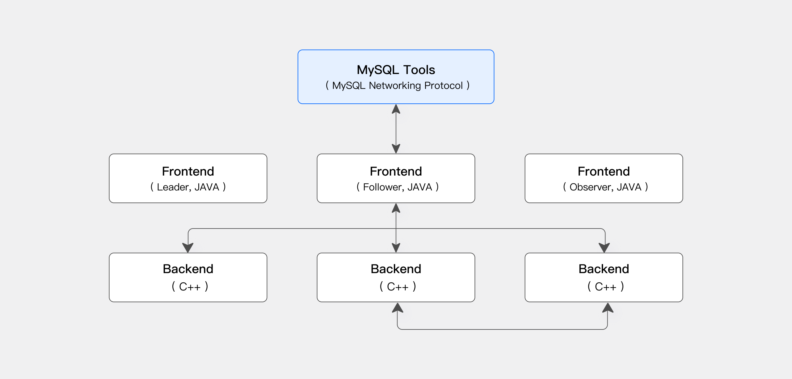

# 分析型数据库Apache Doris实战01-初体验

# Apache Doris 简介

## 什么是 Apache Doris

Apache Doris 是一个基于 MPP 的实时数据仓库，以查询速度快而闻名。对于大型数据集上的查询，它会在亚秒内返回结果。它支持高并发点查询和高吞吐量复杂分析。它可用于报表分析、即席查询、统一数据仓库和数据湖查询加速。基于 Apache Doris，用户可以构建用户行为分析、A/B 测试平台、日志分析、用户画像分析、电商订单分析等应用。

Apache Doris，前身为 Palo，最初是为了支持百度的广告报告业务而创建的。它于 2017 年正式开源，并于 2018 年 7 月由百度捐赠给 Apache 软件基金会，由 Apache 导师指导下的孵化器项目管理委员会成员运营。2022 年 6 月，Apache Doris 作为 Top Level Project 从 Apache 孵化器毕业。截至 2024 年，Apache Doris 社区已经聚集了来自不同行业数百家公司的 600 多名贡献者，每月活跃贡献者超过 120 人。

Apache Doris 拥有广泛的用户群。它已用于全球 5000 多家公司的生产环境中，包括 TikTok、百度、腾讯和网易等巨头。它还广泛用于从金融、零售和电信到能源、制造、医疗保健等行业。

## 使用场景

如下图所示，经过各种数据集成和处理后，数据源通常会被引入到实时数仓 Doris 和离线湖仓一体（如 Hive、Iceberg 和 Hudi）中。这些方法广泛用于 OLAP 分析场景。

Apache Doris 广泛应用于以下场景：

- **实时数据分析**：
  - **实时报告和决策**：Doris 提供实时更新的报表和仪表板供企业内部和外部使用，支持自动化流程中的实时决策。
  - **Ad Hoc Analysis**：Doris 提供多维度数据分析能力，实现快速的商业智能分析和 Ad Hoc 查询，帮助用户从复杂数据中快速发现洞察。
  - **用户画像和行为分析**：Doris 可以分析用户参与、留存、转化等行为，同时还支持人群洞察、人群选择等场景进行行为分析。
- **Lakehouse 分析**：
  - **Lakehouse 查询加速**：Doris 通过其高效的查询引擎加速 Lakehouse 数据查询。
  - **联邦分析**：Doris 支持跨多数据源的联邦查询，简化架构，消除数据孤岛。
  - **实时数据处理**：Doris 将实时数据流和批量数据处理能力相结合，满足高并发、低延迟的复杂业务需求。
- **基于 SQL 的可观测性**：
  - **日志和事件分析**：Doris 支持对分布式系统中的日志和事件进行实时或批量分析，帮助发现问题并优化性能。

## 整体架构

Apache Doris 使用 MySQL 协议，与 MySQL 语法高度兼容，支持标准 SQL。用户可以通过各种客户端工具访问 Apache Doris，并与 BI 工具无缝集成。

### 存储-计算集成架构

Apache Doris 的存算一体化架构精简且易于维护。如下图所示，它只由两种类型的进程组成：

- **前端 （FE）：**主要负责处理用户请求、查询解析和规划、元数据管理和节点管理任务。
- **后端 （BE）：**主要负责数据存储和查询执行。数据被分区到多个分片中，并与跨 BE 节点的多个副本一起存储。

在生产环境中，可以部署多个 FE 节点进行灾难恢复。每个 FE 节点都维护元数据的完整副本。FE 节点分为 3 个角色：

## 准备工作

## 引用资料

>[Introduction to Apache Doris - Apache Doris](https://doris.incubator.apache.org/docs/gettingStarted/what-is-apache-doris)
>
>
