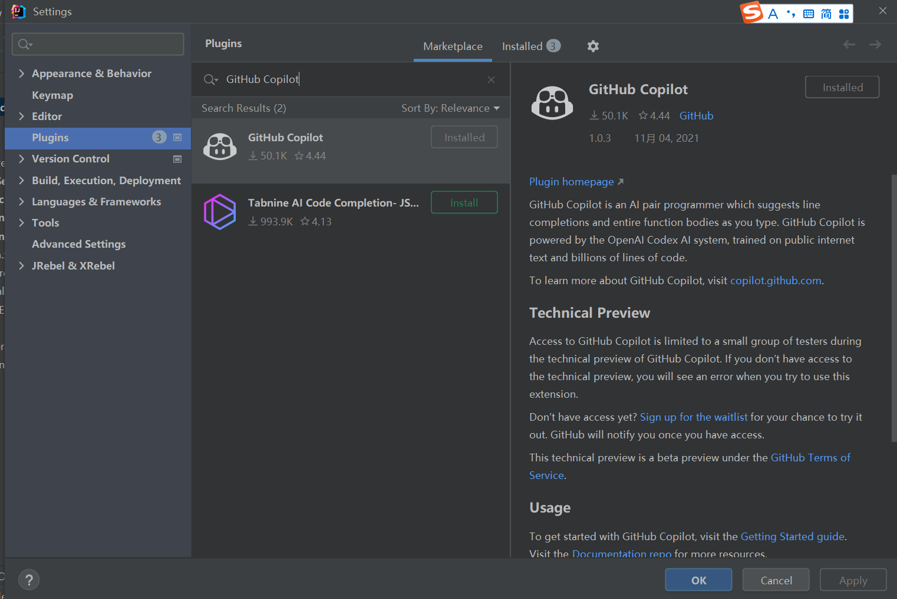
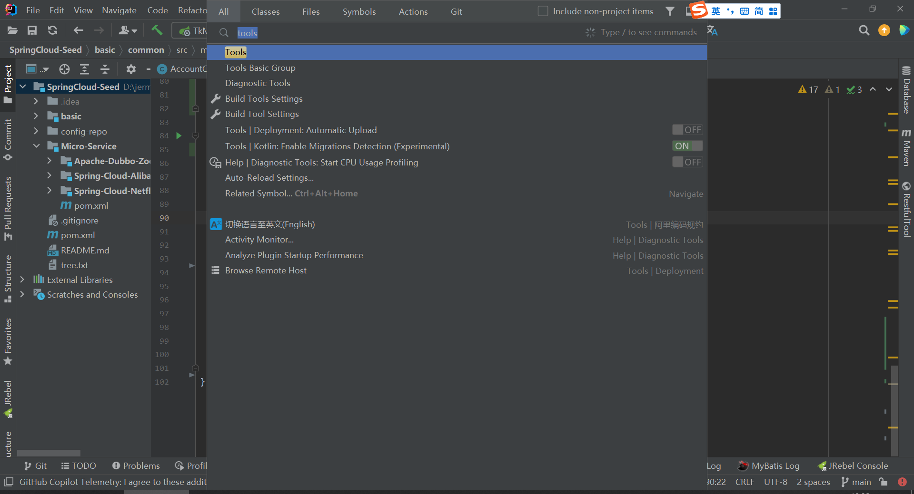
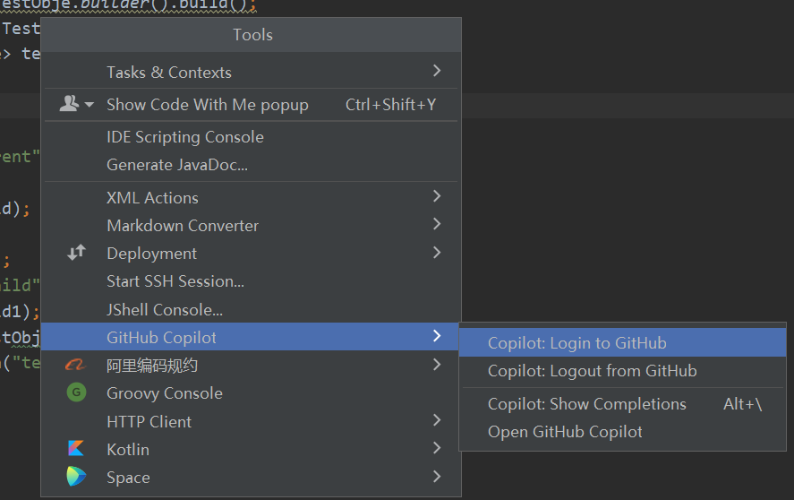
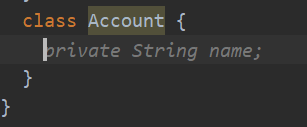
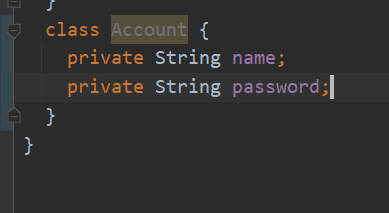

# GitHub Copilot

根据GitHub Copilot官方的介绍

> [What is GitHub Copilot?](https://copilot.github.com/#faq-what-is-github-copilot)
>
> GitHub Copilot is an AI pair programmer that helps you write code faster and with less work. GitHub Copilot draws context from comments and code, and suggests individual lines and whole functions instantly. GitHub Copilot is powered by OpenAI Codex, a new AI system created by OpenAI. The GitHub Copilot technical preview is available as an extension for Visual Studio Code, Neovim, and the JetBrains suite of IDEs.
>
> 什么是 GitHub Copilot？
>
> GitHub Copilot 是一个 AI 配对程序员，可帮助您以更少的工作更快地编写代码。 GitHub Copilot 从评论和代码中提取上下文，并立即建议单个行和整个函数。 GitHub Copilot 由 OpenAI Codex 提供支持，OpenAI Codex 是 OpenAI 创建的新 AI 系统。 GitHub Copilot 技术预览版可用作 Visual Studio Code、Neovim 和 JetBrains IDE 套件的扩展。

**注意事项: 根据官方文档, GitHub Copilot的IDEA插件只支持2021.2及以上版本 **

## Getting Started

To install GitHub Copilot, check out the Getting Started guides:

- [Visual Studio Code](https://github.com/github/copilot-docs/blob/main/docs/visualstudiocode/gettingstarted.md#getting-started-with-github-copilot-in-visual-studio-code)
- [JetBrains](https://github.com/github/copilot-docs/blob/main/docs/jetbrains/gettingstarted.md#getting-started-with-github-copilot-in-jetbrains)
- [Neovim](https://github.com/github/copilot.vim#getting-started)

For a tour of GitHub Copilot, visit the homepage at [copilot.github.com](https://copilot.github.com/).

## Full documentation

- [Visual Studio Code](https://github.com/github/copilot-docs/blob/main/docs/visualstudiocode)
- [JetBrains](https://github.com/github/copilot-docs/blob/main/docs/jetbrains)
- [Neovim](https://github.com/github/copilot.vim/blob/release/doc/copilot.txt)

## 准备工作

我这里使用的IDEA编辑器所以在IDEA中直接搜索安装

settings > plugins > marktplace

安装后重启idea

## 如何使用

双击shift搜索工具栏

### 登陆授权

跳转后输入device code授权登陆

### 开始使用

新建一个Account类,自动弹出后续编码,如果接收则按`Tab`键,如果不接受可以按`ESC`或者不用管提示,继续编码

按下`Tab`

它会自动提示此类需要的属性

## 引用资料

>https://copilot.github.com/#faqs
>
>https://github.com/github/copilot-docs
>
>https://github.com/github/copilot-docs/blob/main/docs/README.md
>
>
