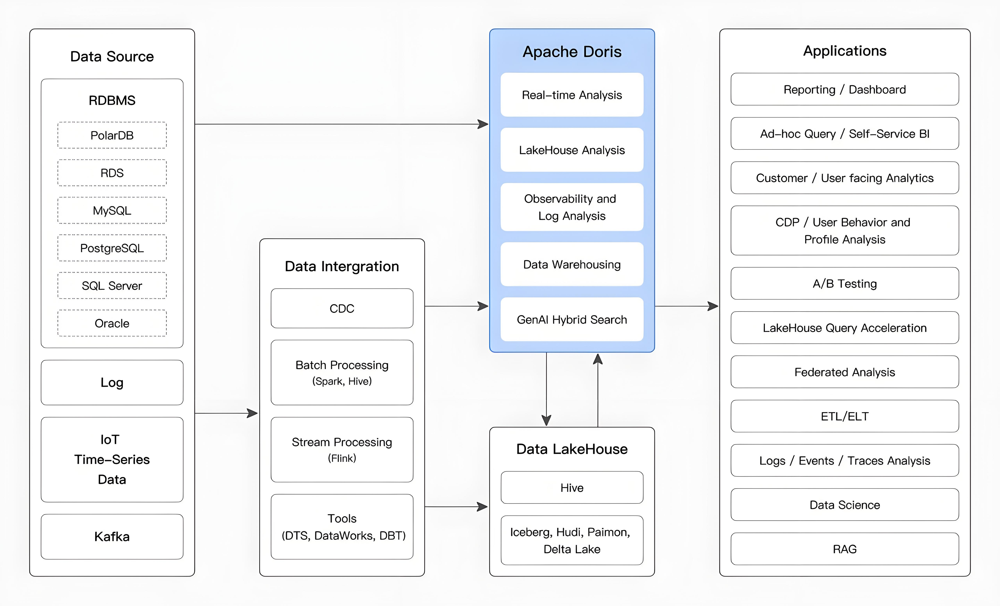
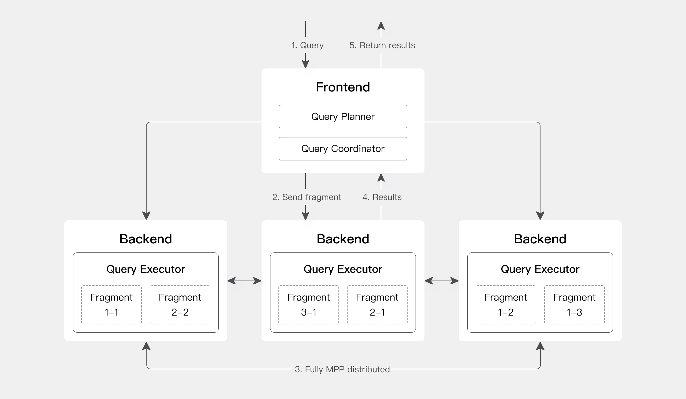
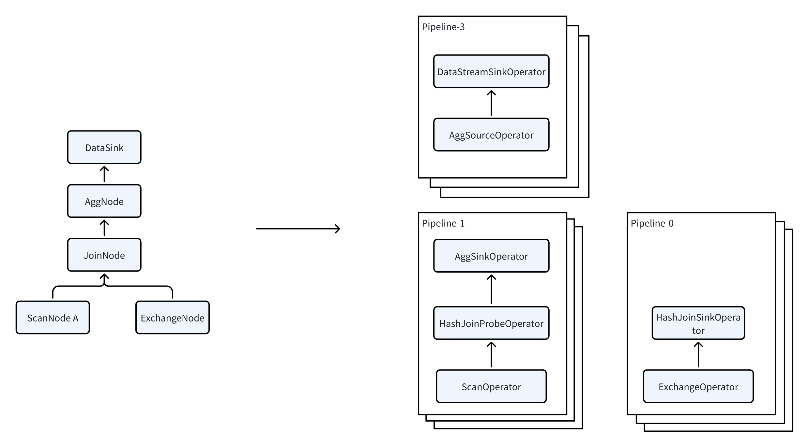

# 分析型数据库Apache Doris实战01-简介

# Apache Doris 简介

## 什么是 Apache Doris

Apache Doris 是一个基于 MPP 的实时数据仓库，以查询速度快而闻名。对于大型数据集上的查询，它会在亚秒内返回结果。它支持高并发点查询和高吞吐量复杂分析。它可用于报表分析、即席查询、统一数据仓库和数据湖查询加速。基于 Apache Doris，用户可以构建用户行为分析、A/B 测试平台、日志分析、用户画像分析、电商订单分析等应用。

Apache Doris，前身为 Palo，最初是为了支持百度的广告报告业务而创建的。它于 2017 年正式开源，并于 2018 年 7 月由百度捐赠给 Apache 软件基金会，由 Apache 导师指导下的孵化器项目管理委员会成员运营。2022 年 6 月，Apache Doris 作为 Top Level Project 从 Apache 孵化器毕业。截至 2024 年，Apache Doris 社区已经聚集了来自不同行业数百家公司的 600 多名贡献者，每月活跃贡献者超过 120 人。

Apache Doris 拥有广泛的用户群。它已用于全球 5000 多家公司的生产环境中，包括 TikTok、百度、腾讯和网易等巨头。它还广泛用于从金融、零售和电信到能源、制造、医疗保健等行业。

## 使用场景

如下图所示，经过各种数据集成和处理后，数据源通常会被引入到实时数仓 Doris 和离线湖仓一体（如 Hive、Iceberg 和 Hudi）中。这些方法广泛用于 OLAP 分析场景。

Apache Doris 广泛应用于以下场景：

- **实时数据分析**：
  - **实时报告和决策**：Doris 提供实时更新的报表和仪表板供企业内部和外部使用，支持自动化流程中的实时决策。
  - **Ad Hoc Analysis**：Doris 提供多维度数据分析能力，实现快速的商业智能分析和 Ad Hoc 查询，帮助用户从复杂数据中快速发现洞察。
  - **用户画像和行为分析**：Doris 可以分析用户参与、留存、转化等行为，同时还支持人群洞察、人群选择等场景进行行为分析。
- **Lakehouse 分析**：
  - **Lakehouse 查询加速**：Doris 通过其高效的查询引擎加速 Lakehouse 数据查询。
  - **联邦分析**：Doris 支持跨多数据源的联邦查询，简化架构，消除数据孤岛。
  - **实时数据处理**：Doris 将实时数据流和批量数据处理能力相结合，满足高并发、低延迟的复杂业务需求。
- **基于 SQL 的可观测性**：
  - **日志和事件分析**：Doris 支持对分布式系统中的日志和事件进行实时或批量分析，帮助发现问题并优化性能。

## 整体架构

Apache Doris 使用 MySQL 协议，与 MySQL 语法高度兼容，支持标准 SQL。用户可以通过各种客户端工具访问 Apache Doris，并与 BI 工具无缝集成。

### 存储-计算集成架构

Apache Doris 的存算一体化架构精简且易于维护。如下图所示，它只由两种类型的进程组成：

- **前端 （FE）：**主要负责处理用户请求、查询解析和规划、元数据管理和节点管理任务。
- **后端 （BE）：**主要负责数据存储和查询执行。数据被分区到多个分片中，并与跨 BE 节点的多个副本一起存储。

在生产环境中，可以部署多个 FE 节点进行灾难恢复。每个 FE 节点都维护元数据的完整副本。FE 节点分为 3 个角色：

| 角色    | 功能                                                         |
| ------- | ------------------------------------------------------------ |
| 主人    | FE Master 节点负责元数据的读写作。当 Master 中发生元数据更改时，它们会通过 BDB JE 协议同步到 Follower 或 Observer 节点。 |
| 追随 者 | Follower 节点负责读取元数据。如果 Master 节点失败，则可以选择 Follower 节点作为新的 Master。 |
| 观察者  | Observer 节点负责读取元数据，主要用于提高查询并发性。它不参加集群领导层选举。 |

FE 和 BE 进程都是可水平扩展的，使单个集群能够支持数百台机器和数十 PB 的存储容量。FE 和 BE 进程使用一致性协议来保证服务的高可用性和数据的高可靠性。存算一体化架构高度集成，显著降低了分布式系统的运维复杂度。

## Apache Doris 的核心特性

- **高可用**：在 Apache Doris 中，元数据和数据都以多个副本存储，通过 quorum 协议同步数据日志。一旦大多数副本完成写入，则认为数据写入成功，确保即使少数节点发生故障，集群也保持可用。Apache Doris 支持同城和跨地域容灾，支持双集群主从模式。当部分节点发生故障时，集群可以自动隔离故障节点，防止集群整体可用性受到影响。
- **高兼容性**：Apache Doris 高度兼容 MySQL 协议，支持标准 SQL 语法，覆盖大部分 MySQL 和 Hive 功能。这种高兼容性使用户能够无缝迁移和集成现有的应用程序和工具。Apache Doris 支持 MySQL 生态，用户可以使用 MySQL Client 工具连接 Doris，运维更便捷。它还支持 BI 报表工具和数据传输工具的 MySQL 协议兼容性，确保数据分析和数据传输过程的效率和稳定性。
- **实时数仓**：基于 Apache Doris，构建实时数仓服务。Apache Doris 提供秒级数据接入能力，秒级捕获上游在线事务数据库的增量变化到 Doris 中。利用向量化引擎、MPP 架构和 Pipeline 执行引擎，Doris 提供亚秒级的数据查询能力，从而构建一个高性能、低延迟的实时数仓平台。
- **统一湖屋**：Apache Doris 可以基于数据湖或关系数据库等外部数据源构建统一的湖仓一体架构。Doris 统一湖仓一体解决方案实现了数据湖与数据仓库之间的无缝集成和数据自由流动，帮助用户直接利用数据仓库能力解决数据湖中的数据分析问题，同时充分利用数据湖数据管理能力提升数据价值。
- **灵活的建模**：Apache Doris 提供了多种建模方式，如宽表模型、预聚合模型、星型 / 雪花型模式等。在数据导入过程中，数据可以展平成宽表，通过 Flink 或 Spark 等计算引擎写入 Doris，也可以将数据直接导入 Doris，通过视图、物化视图或实时多表连接进行数据建模作。

## 技术概述

Doris 提供高效的 SQL 接口，完全兼容 MySQL 协议。其查询引擎基于 MPP（Massively Parallel Processing）架构，能够高效执行复杂的分析查询并实现低延迟实时查询。通过对数据进行编码和压缩的列式存储技术，显著优化了查询性能和存储压缩率。

### 接口

Apache Doris 采用 MySQL 协议，支持标准 SQL，与 MySQL 语法高度兼容。用户可以通过各种客户端工具访问 Apache Doris，并与 BI 工具无缝集成，包括但不限于 Smartbi、DataEase、FineBI、Tableau、Power BI 和 Apache Superset。Apache Doris 可以作为任何支持 MySQL 协议的 BI 工具的数据源。

### 存储引擎

Apache Doris 有一个列式存储引擎，对数据进行逐列编码、压缩和读取。这实现了非常高的数据压缩率，并在很大程度上减少了不必要的数据扫描，从而更有效地利用 IO 和 CPU 资源。

Apache Doris 支持多种索引结构，以最大限度地减少数据扫描：

- **排序复合键索引**：用户最多可以指定 3 列来形成复合排序键。这可以有效地修剪数据，以更好地支持高度并发的报告场景。
- **Min/Max Index**：这支持在数值类型的等价和范围查询中进行有效的数据筛选。
- **BloomFilter Index**：这在等价筛选和高基数列的修剪中非常有效。
- **倒排索引**：这样可以快速搜索任何字段。

Apache Doris 支持多种数据模型，并针对不同的场景进行了优化：

- **详图模型（重复键模型）：**一种详细数据模型，旨在满足事实表的详细存储要求。
- **主键模型（Unique Key Model）：**确保键唯一;具有相同 key 的数据将被覆盖，从而启用行级数据更新。
- **聚合模型 （Aggregate Key Model）：**合并具有相同键的值列，通过预聚合显著提高性能。

Apache Doris 还支持强一致性单表物化视图和异步刷新的多表物化视图。单表物化视图由系统自动刷新和维护，无需用户手动干预。多表物化视图支持使用集群内调度或外部调度工具定期刷新，降低数据建模的复杂性。

### 查询引擎

Apache Doris 有一个基于 MPP 的查询引擎，用于节点之间和节点内部的并行执行。它支持大型表的分布式 shuffle join，以更好地处理复杂的查询。

Apache Doris 的查询引擎完全向量化，所有内存结构都以列式布局。这可以大大减少虚拟函数调用，提高缓存命中率，并有效利用 SIMD 指令。Apache Doris 在宽表聚合场景下的性能是非向量化引擎的 5~10 倍。

Apache Doris 使用自适应查询执行技术，根据运行时统计信息动态调整执行计划。例如，它可以生成一个运行时过滤器并将其推送到探测端。具体来说，它将过滤器推送到探测端的最低级 scan 节点，这大大减少了要处理的数据量并提高了连接性能。Apache Doris 的运行时过滤器支持 In/Min/Max/Bloom Filter。

Apache Doris 使用 Pipeline 执行引擎，将查询分解为多个子任务并行执行，充分利用多核 CPU 能力。它通过限制查询线程的数量同时解决了线程爆炸问题。Pipeline 执行引擎减少了数据复制和共享，优化了排序和聚合作，从而显著提高了查询效率和吞吐量。

在优化器方面，Apache Doris 采用了 CBO（Cost-Based Optimizer）、RBO（Rule-Based Optimizer）和 HBO（History-Based Optimizer）的组合优化策略。RBO 支持常量折叠、子查询重写、谓词下推等。CBO 支持 join 重新排序和其他优化。HBO 根据历史查询信息推荐最佳执行计划。这些多重的优化措施保证了 Doris 可以在各种类型的查询中枚举出高性能的查询计划。

## 准备工作

## 引用资料

>[Introduction to Apache Doris - Apache Doris](https://doris.incubator.apache.org/docs/gettingStarted/what-is-apache-doris)
>
>
