# 本地部署大型语音模型-LM Studio-01

🚀 LM Studio 的亮点功能
🌍 模型的多样性与灵活性
借助 LM Studio，你可以轻松获取和管理当今最受欢迎的各种大型语言模型，包括：

🦙 Llama 3 ：Meta 出品，拥有更强的性能与可靠性，是对话生成任务的绝佳选择。

🦁 Phi 3 ：Phi 根据大量自然语言和编程数据训练而成，致力于适用于多样化的语言生成任务。

🦅 Falcon ：以高性能和快速响应为亮点，适合需要快速生成的应用场景。

🌊 Mistral ：强大的多任务型语言模型，支持多种语言理解与生成任务。

✨ StarCoder ：特别设计用于编程任务的模型，代码生成、补全的得力助手。

💎 Gemma ：适用于翻译、对话生成等用途的通用型大型语言模型。

以下是 LM Studio 的本地部署安装步骤：

### 1. 准备环境

- **操作系统**：确保你的系统是 Ubuntu 22.04 或 Windows 11。
  - 这里使用window11
- **硬件需求**：建议使用至少 8GB RAM 和具备 CUDA 支持的 NVIDIA GPU，以便更好地运行。

### 2. 安装依赖

**LM Studio 安装教程**

1. **下载 LM Studio** 访问官方网站 [www.lmstudio.ai](http://www.lmstudio.ai )并点击 "Download" 按钮，选择合适的操作系统（Windows 或 macOS）。

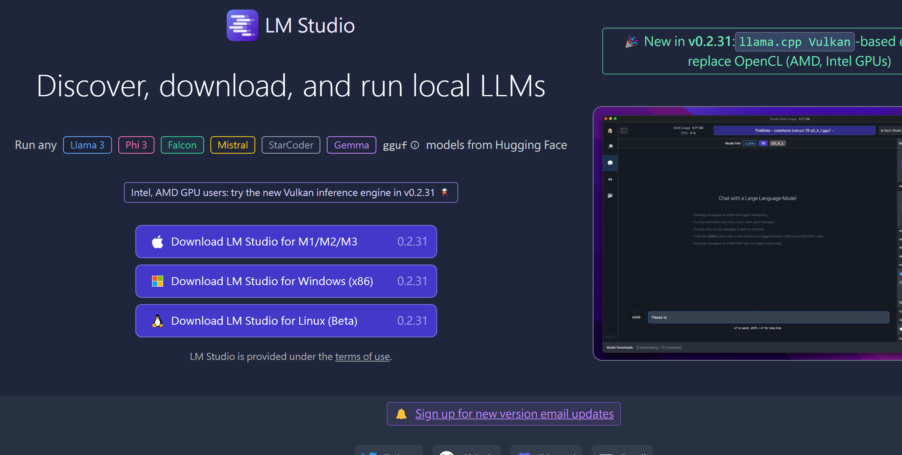

1. **保存文件** 将下载好的安装包保存到您的计算机上，例如桌面或下载文件夹。
2. **运行安装程序** 双击打开安装包，然后单击 "Run" 按钮以启动安装过程。

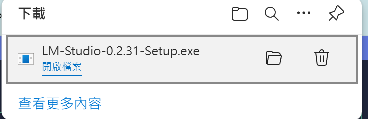

1. **选择语言** 在安装界面中，您需要选择语言（英语或其他语言）。请根据您的需求进行选择。
2. **同意协议** 阅读并接受 LM Studio 的使用条款和隐私政策。
3. **选择安装路径** 您可以选择安装 LM Studio 到计算机上的任何目录。建议将其安装到桌面或一个易于访问的文件夹中。
4. **开始安装** 单击 "Install" 按钮以开始安装过程。这可能需要一些时间，取决于您的计算机性能和网络速度。
5. **完成安装** 安装完成后，您会看到 LM Studio 的 logo 和一条成功信息。 Congratulations! 您已经成功地安装了 LM Studio。

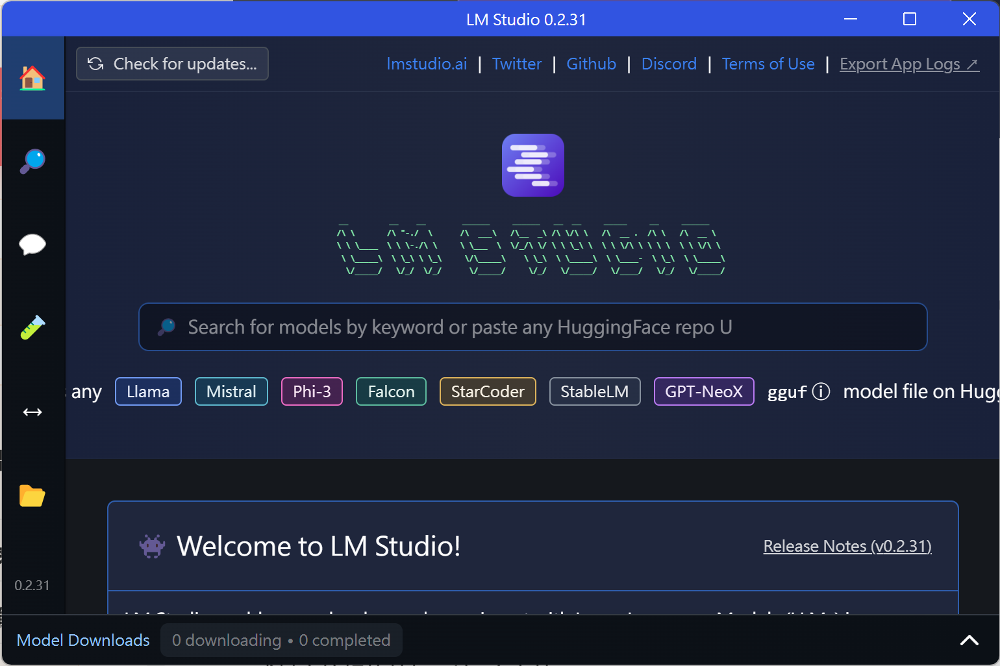

### 3*换源

LM-Studio 安装目录

 C:\Users\{username}\AppData\Local\LM-Studio 

修改huggingface.co 

`findstr /s /i /m /c:"huggingface.co" *.*`

查找结果 

~~~
PS C:\Users\xueql\AppData\Local\LM-Studio> findstr /s /i /m /c:"huggingface.co" *.*
app-0.2.31\resources\app\.webpack\lms.exe
app-0.2.31\resources\app\.webpack\main\index.js
app-0.2.31\resources\app\.webpack\main\llmworker.js
app-0.2.31\resources\app\.webpack\main\worker.js
app-0.2.31\resources\app\.webpack\renderer\main_window\index.js
~~~

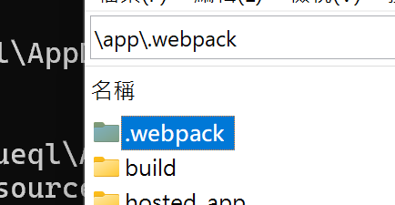

在找到的所有文件中进行查找替换 把所有的huggingface.co都替换成hf-mirror.com

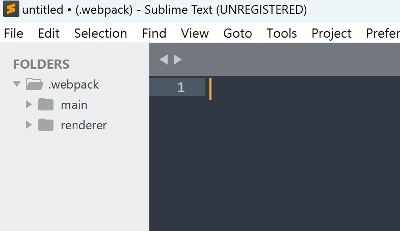

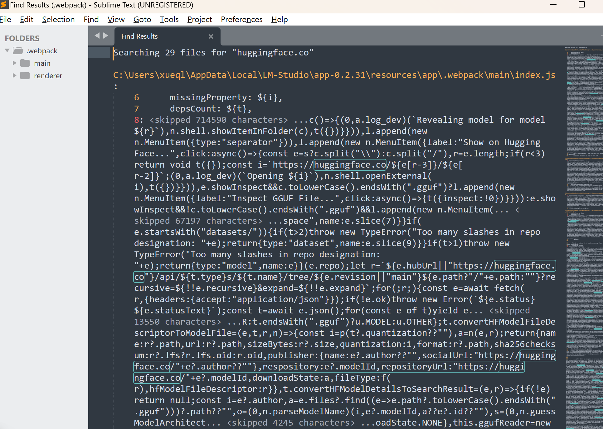

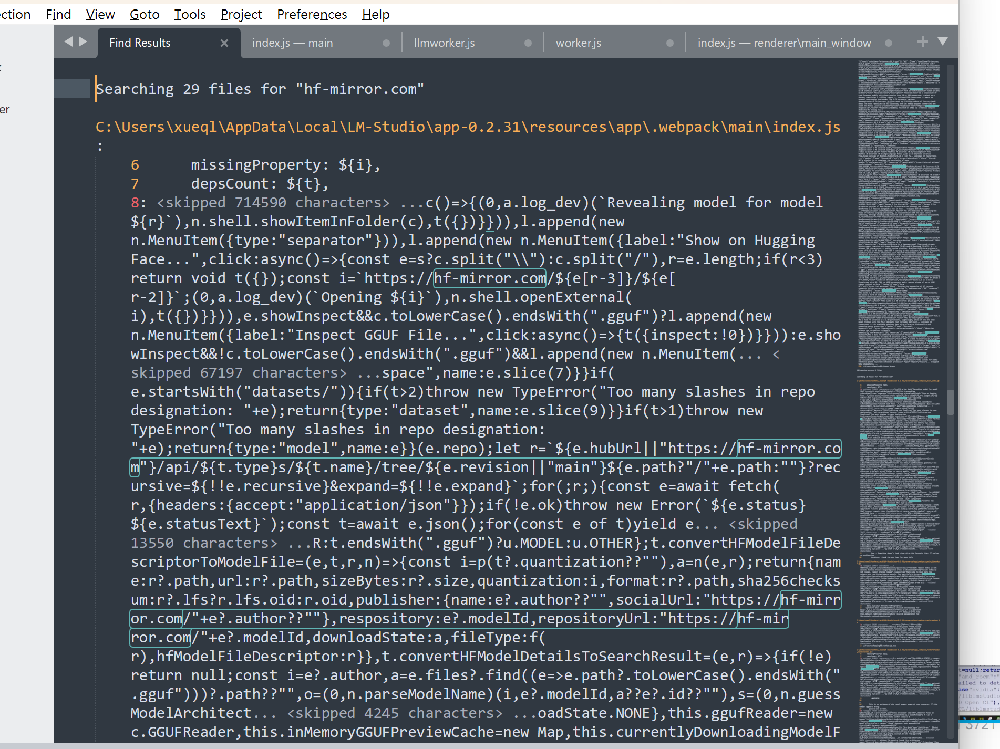

### 4 LM-Studio使用GPU

LM-Studio可以使用GPU加速计算，以下是一些基本的设置步骤：

1. 安装CUDA
2. 在LM-Studio中设置GPU
3. 在模型文件中添加 `--use_gpu` 选项

具体步骤如下：
首先下载并安装CUDA（https://developer.nvidia.com/cuda-downloads），然后在LM-Studio的偏好设置中，选择要使用的GPU，并将 `use_gpu` 选项添加到模型文件中。

这样，你的LM-Studio就可以使用GPU加速计算了！

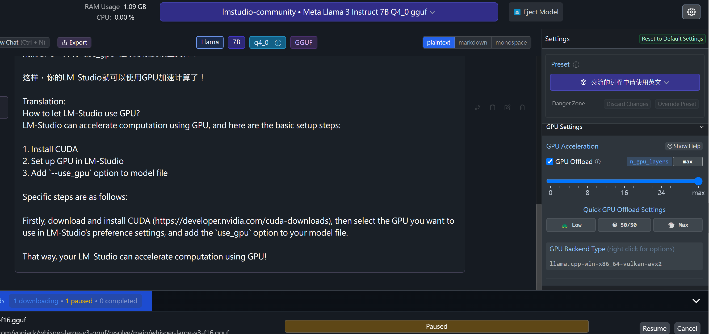

这里的GPU选项可以使用离线gpu加速

Translation:
How to let LM-Studio use GPU?
LM-Studio can accelerate computation using GPU, and here are the basic setup steps:

1. Install CUDA
2. Set up GPU in LM-Studio
3. Add `--use_gpu` option to model file

Specific steps are as follows

### 注意事项

- 确保你已正确配置 GPU 支持，以获得最佳性能。
- 如果没有 GPU，可以配置 CPU 模式，但可能会显著降低性能。

这样，你就可以在本地成功部署 LM Studio 了。

### 遇到的问题及解决方案

#### LM-Studio无法搜索以及下载失败的问题对策

- 更改下载配置

用everything 搜索 “cache\lm-studio”找到目录，

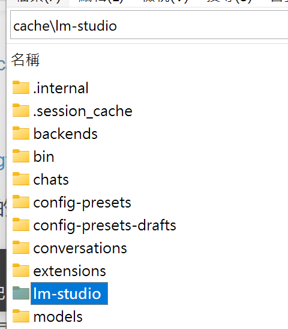

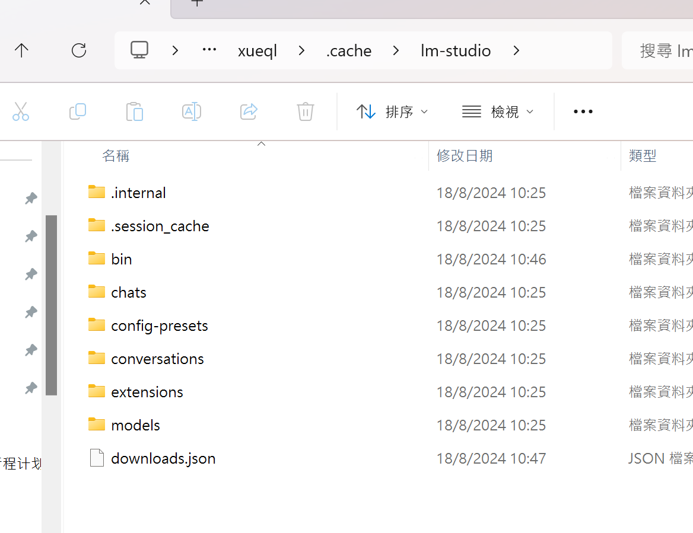

- sublime 格式化json

sublime 格式化json需要借助工具包pretty json. 具体步骤如下：

打开sublime，使用快捷键`shift+cmd+P`打开输入框，然后输入`install`，选择`install Package`

Sublime如何快速格式化JSON文件

然后输入：pretty，我们可以看到很多的格式化语言，选择JSON即可：

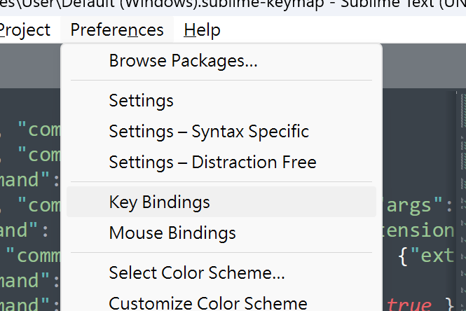

~~~
[
	{"keys":["ctrl+shift+j"], "command": "pretty_json"}
]

~~~

打开download.json `ctrl+shift+j` 格式化json

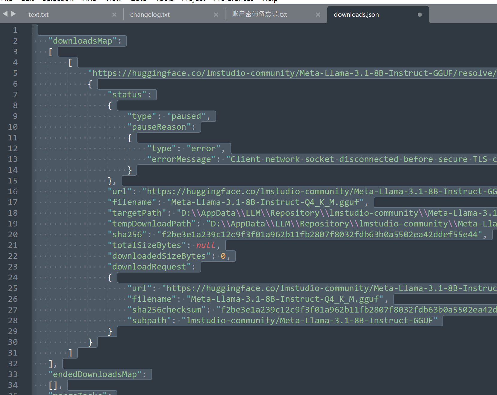

- ### 更改下载地址

用编辑器打开，我喜欢vscode

用hf-mirror.com替换huggingface.co 如下：

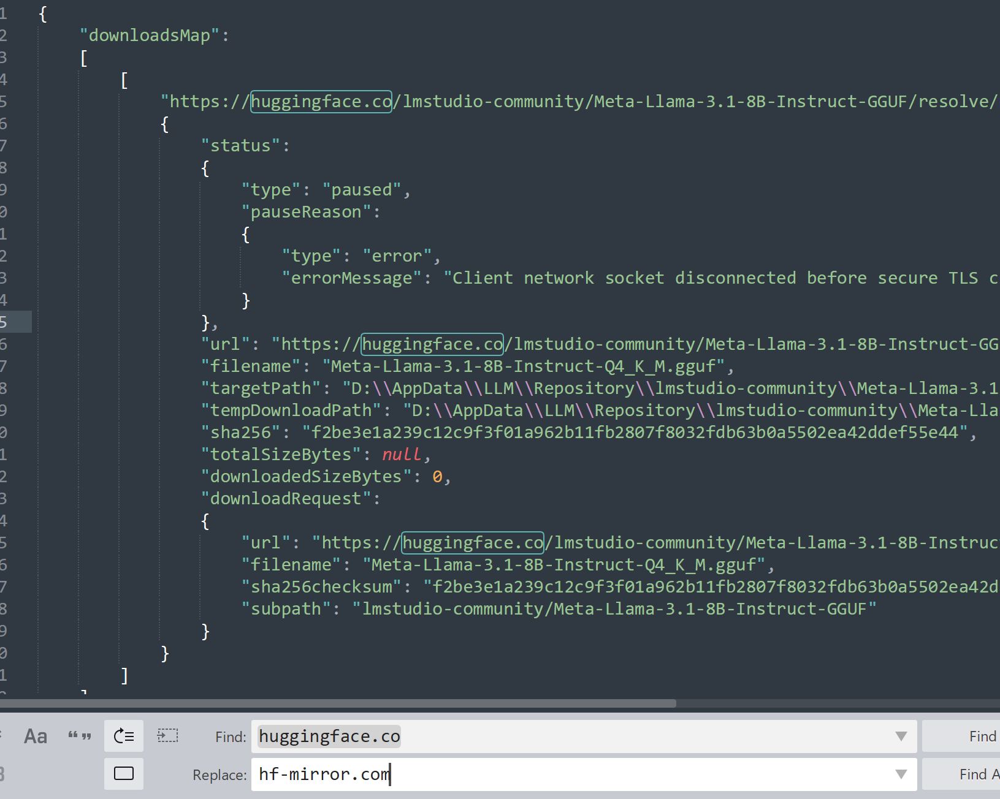

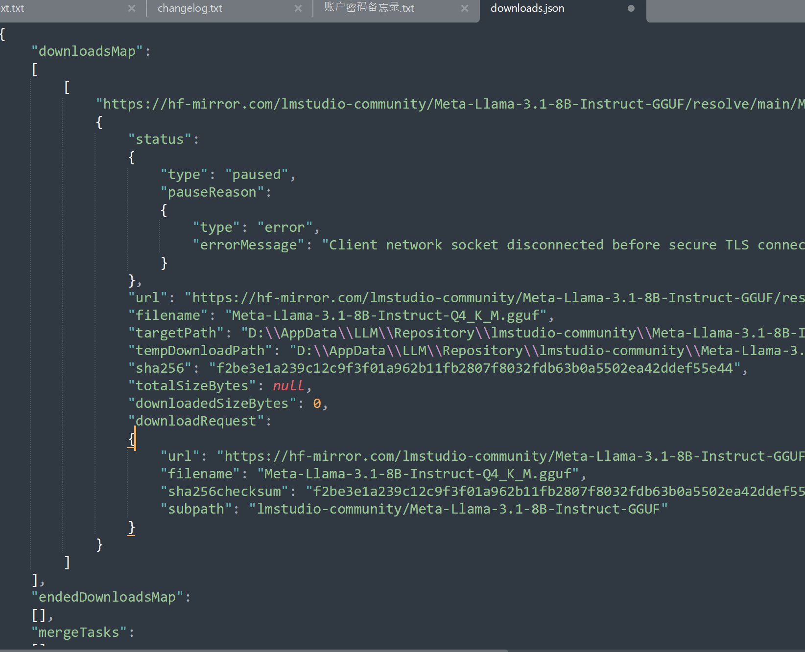

- 重启动软件，

点击Resume就可以了

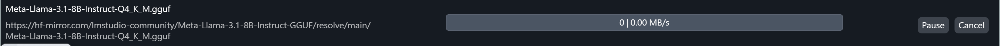

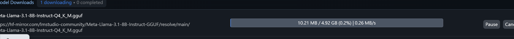

## 引用资料

>[LM-Studio无法搜索以及下载失败的问题对策_lmstudio无法下载模型-CSDN博客](https://blog.csdn.net/robinfoxnan/article/details/139336901)
>
>
