# 科学上网clash

## 前言

最早这篇文章写于2023年6月12日。 还有天的版本，有了很大的变化。现在更新一下这篇文章送给有需要的人使用。

## 免责声明

根据自己的需求选择你需要的服务。我的文章仅提供自己的操作步骤**不构成任何决策**。希望我的信息能够帮助到你。

代理服务不是一项稳定的服。在长城防火墙防御的过程中，有可能将域名污染无法访问。但长久以来。有些代理服务还是比较稳定一点，就算是域名被污染，他提供的代理链接也能正常。

- # Clash 教程：在安卓和苹果设备上进行连接

  ## 1. 前言

  - 简要介绍 Clash 和 Shadowrocket 的功能与用途。
  - 说明本教程适用于安卓和苹果设备。

  ## 2. 准备工作

  ### 2.1 设备要求

  - **安卓设备**：Android 版本要求。
  - **苹果设备**：iOS 版本要求。
  - **CYLINK**: 代理服务商 当你购买会员以后。他会给你发送一个会员的地址，如图所示。这个地址可以送给你在后面的教程中安卓和苹果和Windows。代理去软件中进行使用。
    - 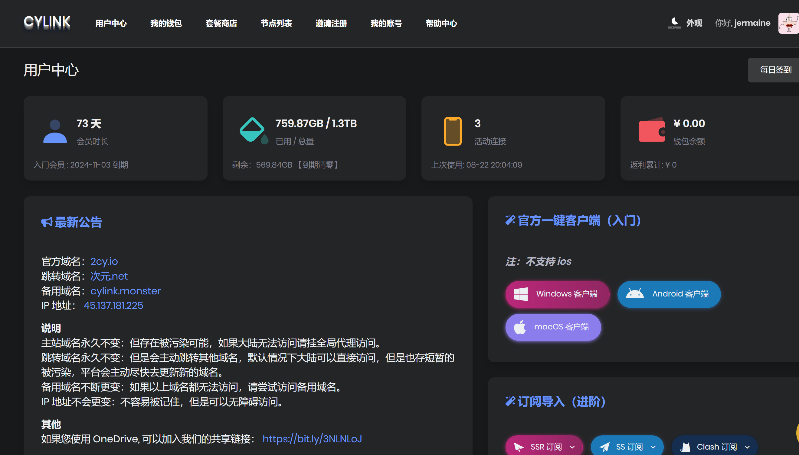
    - 服务地址 
      - 
      - 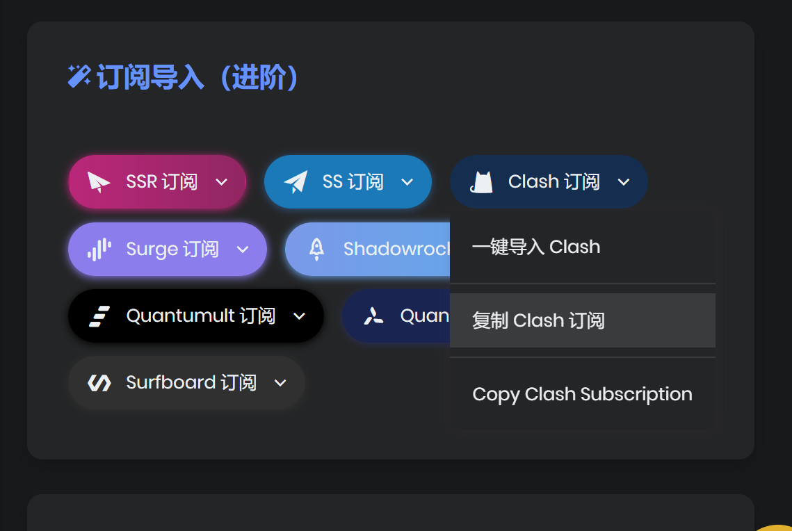

  ### 2.2 应用下载

  - **安卓设备**：从指定的应用商店或官网下载 Clash 应用的步骤。
    - https://chaoxi.cool/dl/cfa.apk
  - **苹果设备**：从 App Store 下载 Shadowrocket 的步骤。这里得使用非港澳台大陆的账户,后面教程有如何在大陆或者港澳台获取相应应用

  ## 3. 配置应用

  ### 3.1 获取配置文件

  - 介绍如何获取 Clash 和 Shadowrocket 的配置文件（如从订阅服务商处获取）。前文说到的配置连接
  - 复制clash订阅
  - 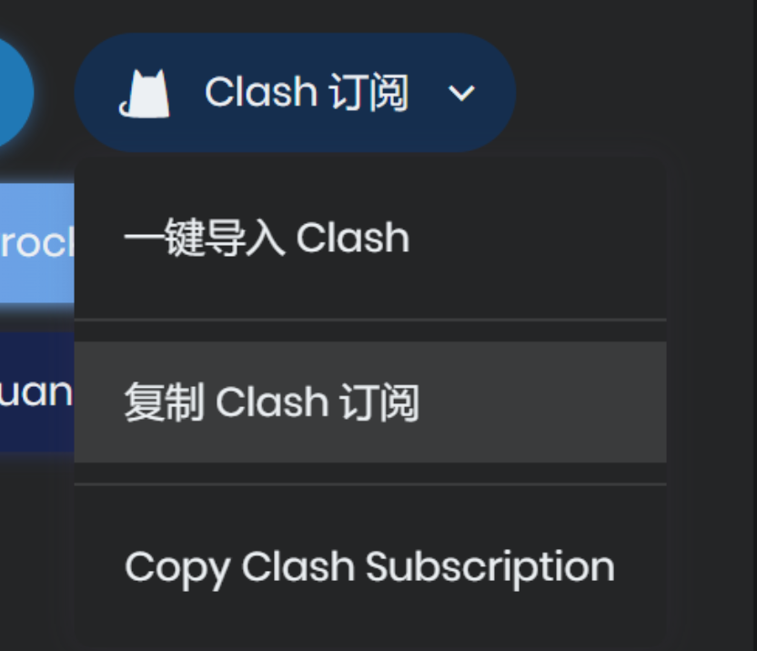

  

  ## 安卓Clash for Android 使用教程

  **1. 下载并安装 Clash for Android**

  [ 下载 Clash 客户端](https://chaoxi.cool/dl/cfa.apk)

  适用于 Android 7.0 及以上

  [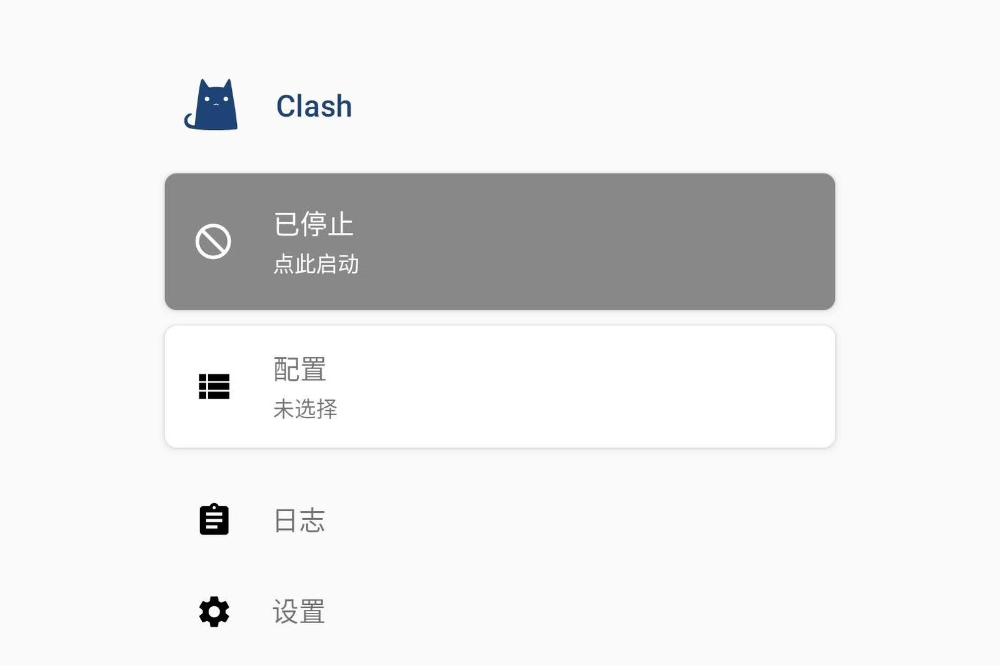](https://storage.crisp.chat/users/helpdesk/website/d516709242f0180/screenshot20200829-224057_sc0nd.jpg)

  **2. 添加 Clash 配置订阅**

   Clash 订阅 

  　

  点击上方按钮，一键导入 Clash 配置。

  `自动更新 (分钟)` 推荐填写 `1440` ，即每 24 小时自动从链接更新配置文件。

  点击右上角的保存按钮，Clash for Android 将下载配置文件，请点击选中添加的配置文件。

  　

  无法一键导入? 试试手动设置订阅

  \1. 复制 Clash 订阅链接，进入 `配置` - 选择 `新配置` - `URL`。

  \2. 在 `URL` 一栏中粘贴 Clash 订阅链接；`自动更新 (分钟)` 推荐填写 `1440` ，即每 24 小时自动从链接更新配置文件。

  \3. 点击右上角的保存按钮，Clash for Android 将下载配置文件，请点击选中添加的配置文件。

  [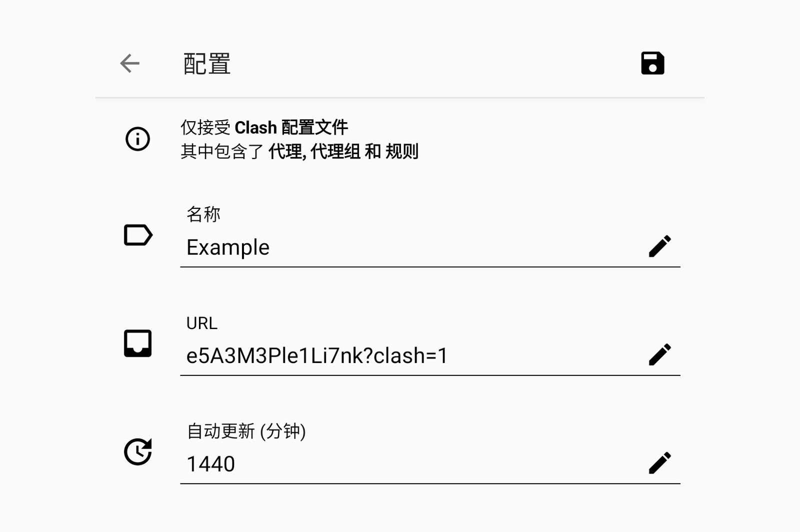](https://storage.crisp.chat/users/helpdesk/website/d516709242f0180/screenshot20210318-122935-01_u891wv.jpeg)

  **3. 开启代理**

  返回 Clash 首页，点击 `已停止` 按钮，将状态切换至`运行中`，Clash 便开始接管系统流量。

  可在 `代理` 页面中选择需要的节点。

  

  🍃 Proxies 为节点策略组，可在其中选择节点。

  🍂 Domestic 决策中国大陆网站，默认 DIRECT 直连。

  ☁️ Others 决策没有收录进规则的网站，默认使用 🍃 Proxies 代理访问。

  [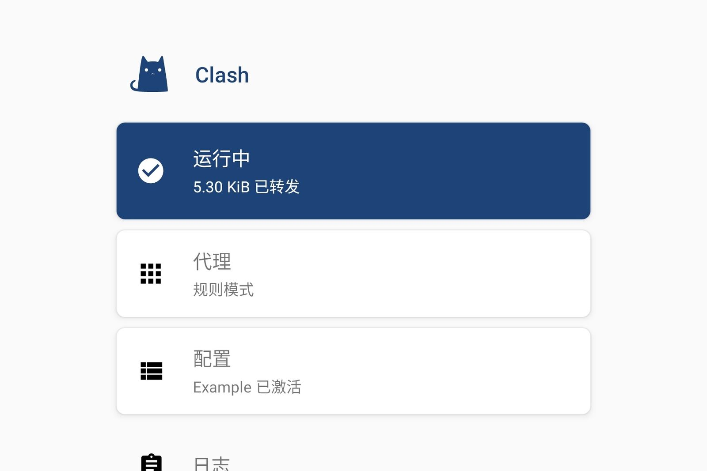](https://storage.crisp.chat/users/helpdesk/website/d516709242f0180/screenshot20210318-123705-01_1bfj3ut.jpeg)

  

## 苹果Ios for IPhone

**1.**在 App Store 中搜索 Shadowrocket（中国大陆地区不可用）。

这是一个付费软件，需要在 App Store 进行购买才能使用。

　

[ 打开 App Store 下载](https://apps.apple.com/us/app/shadowrocket/id932747118)

　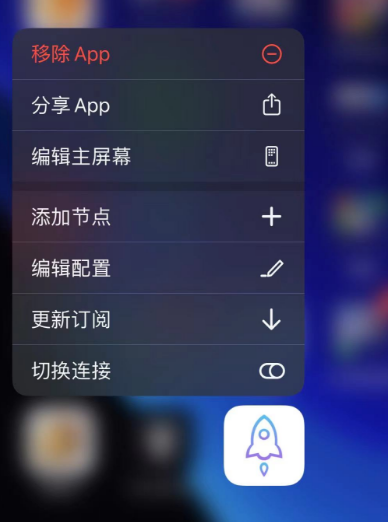

如果您的 App Store 是中国大陆地区，请切换 App Store 地区至非中国大陆地区（如美国、香港、日本地区），或新注册非中国大陆地区的 Apple ID，再进行下载。

可在 [shop.muus.one](https://shop.muus.one/product/) 使用人民币购买该软件的兑换码。

**2.** Shadowrocket 订阅 

　

点击上方按钮一键导入节点配置到 Shadowrocket，并选择需要使用的节点。

在底栏的 `设置` 中，将 `订阅` 菜单中的 `打开时更新` 与 `后台自动更新` 设置为开启。

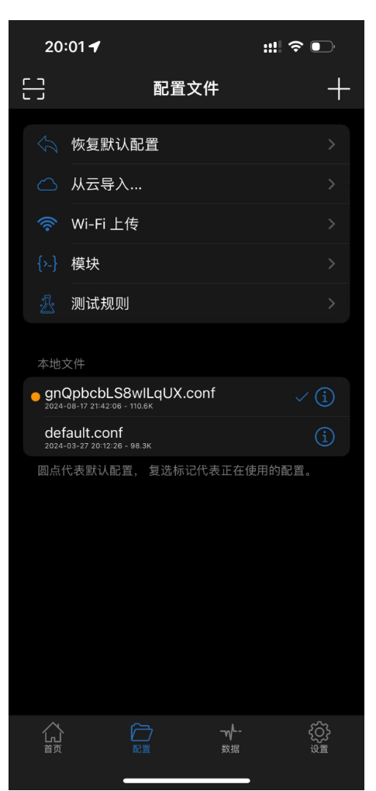

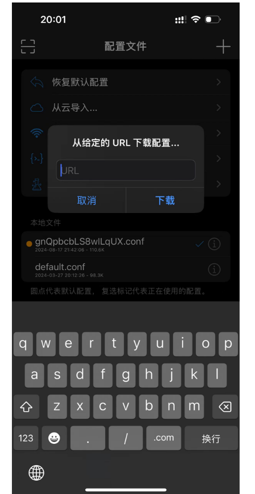

**3.**开启右上角开关，在弹出的 `添加 VPN 配置` 中点击 `允许`，即可开始使用。

### 个人电脑Clash for Windowd 链接

[Releases · Fndroid/clash_for_windows_pkg (github.com)](https://github.com/Fndroid/clash_for_windows_pkg/releases)

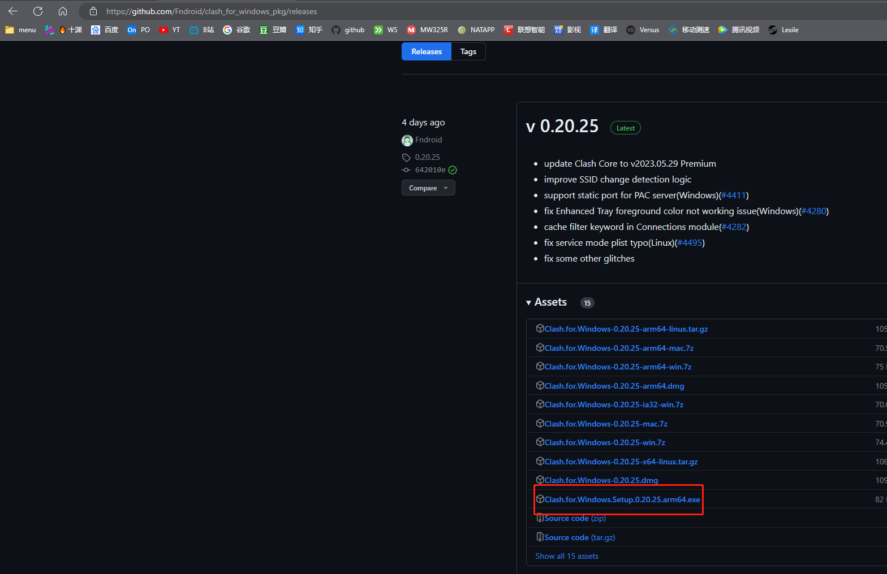

下载安装后

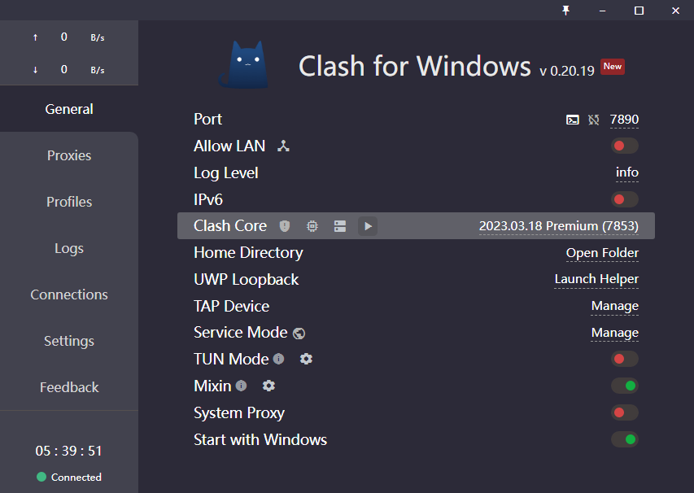

https://2cysub.pro/link/ndNzFYwV5r209eWd?clash=1

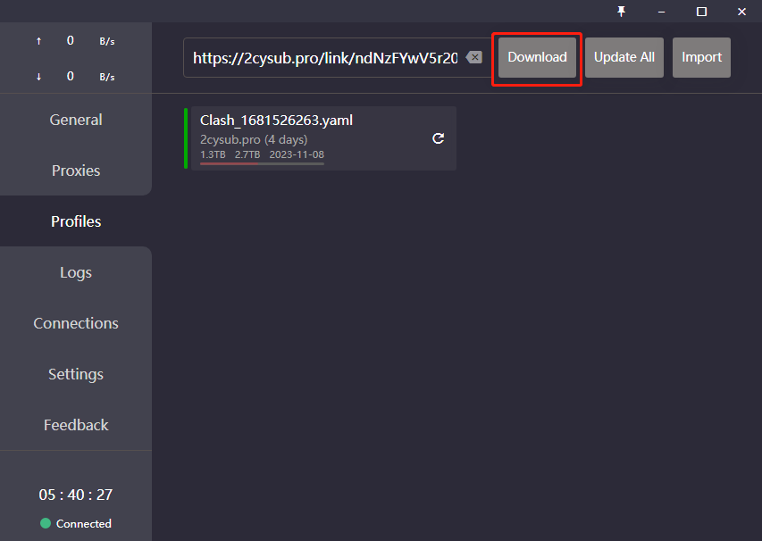

然后选择rule

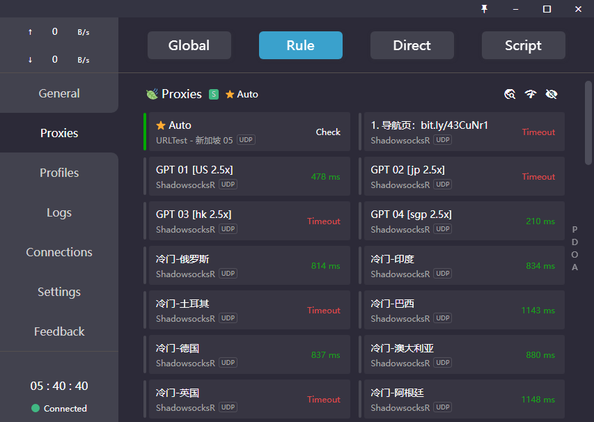

选择一个地区

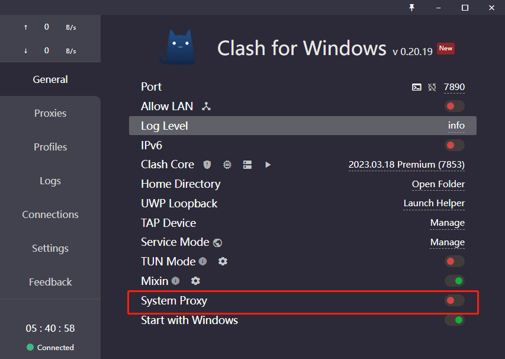

最后开启系统代理即可

## 简介

## 准备工作

## 引用资料

>
>
>
