~~~
---
title: 试用期&毕业汇报
catalog: true
date: 2021-12-28 14:01:33
subtitle:
header-img:
tags: [工作]
---
~~~

汇报流程:
1.转正人员汇报内容演讲
2.问答与交流环节
3.参与成员评分与点评记录(试用期汇报)
汇报内容参考:

# 1.试用期间工作阐述(工作内容展示、工作思路阐述)

试用期间总共负责了以下项目

- 1.九黄门户及后台
- 2.贵阳小程序
- 3.宜宾排班系统

## 1.九黄门户及后台

主要负责此项目的优化迭代功能

### 主要工作内容展示

| 1    | 门户航班号查询界面优化： 1）航班号与日期都不输入，默认查询当天全部航班。 2）航班号可模糊查询，日期默认当前； 3）结果字段增加“航班号”，“进出港”，“日期”，结果按先进/出港排序。 | 修改代码 |
| ---- | ------------------------------------------------------------ | -------- |
| 2    | 后台管理：旅客服务-旅游咨询页面增加分页；行数据可上移下移，后台数据异步更新。 | 修改代码 |
| 3    | 后台管理：旅客服务-意见反馈页面增加分页                      | 修改代码 |
| 4    | 后台管理：机场商业下购物、免税店、餐饮页面增加分页；行数据可上移下移，后台数据异步更新。 | 修改代码 |
| 5    | 后台管理：新闻咨询下公司新闻、党建群团、安全生产、纪检监察、公式公告页面增加分页；行数据可上移下移，后台数据异步更新。 | 修改代码 |
| 6    | 旅游咨询行级数据更新保存，数据库已有编号是，系统提示“数据已存在操作失败”；提示文字更新为“请重新编号，操作失败！” | 修改代码 |

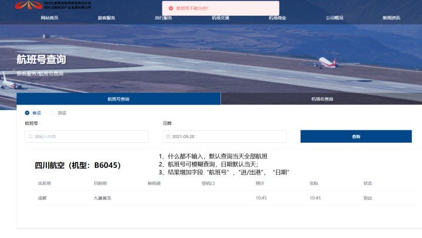

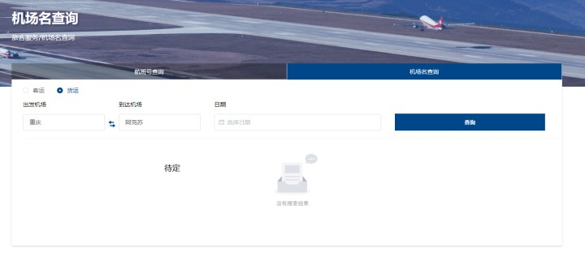 

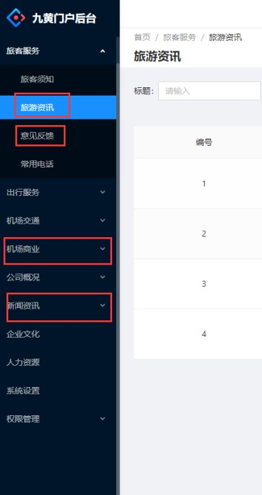 

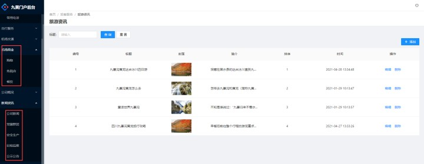 

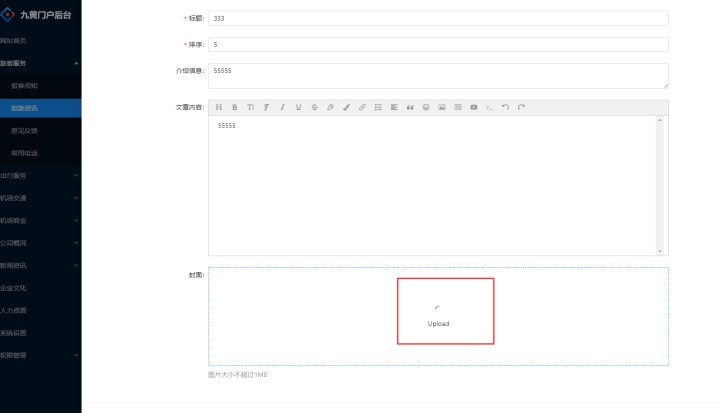 

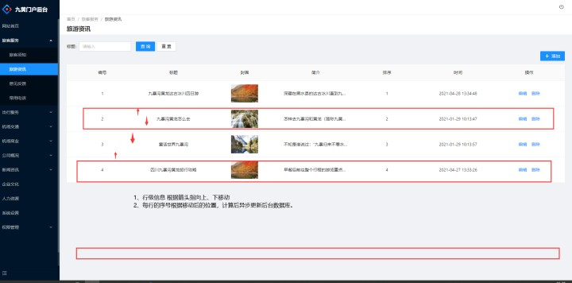 

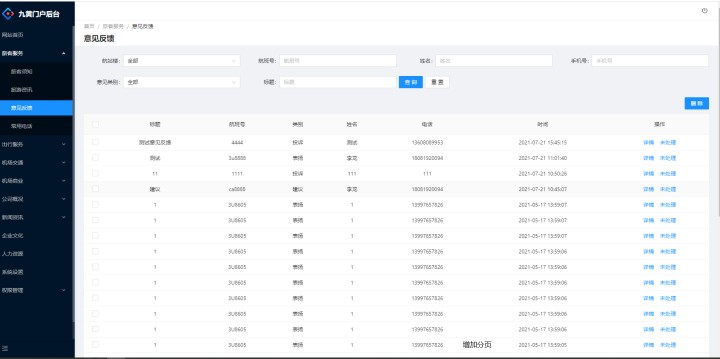 

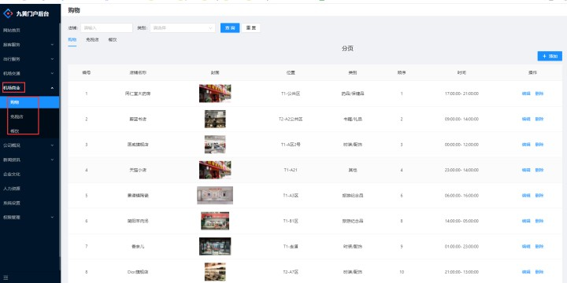 

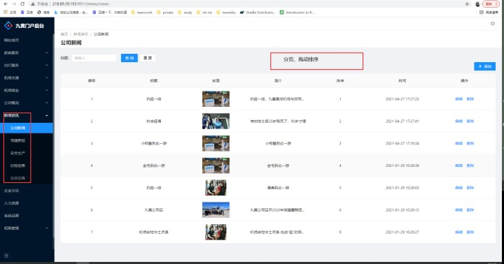 

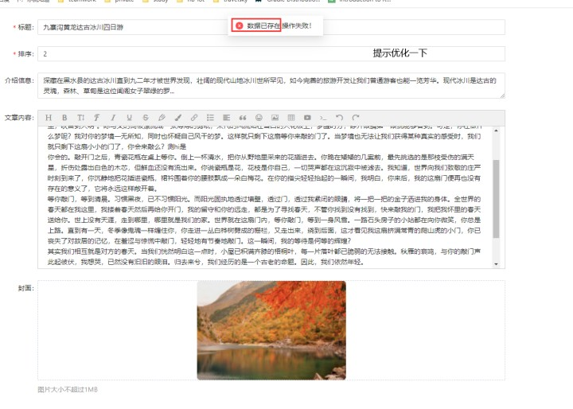 

### 工作思路阐述

其他几项基本没有什么难度,所有优化项目中稍微有点难以交流的就是上线移动这个需求

详细讲解下思路

此项目的的第二个需需要注意的点:门户网站只是整合项目的一个子项目,从项目的统一登录鉴权到子项目跳转的整个流程需要花时间摸索.

## 2.贵阳真情小程序

此项目主要是为已有的项目进行安全漏洞修复

漏洞列表如下

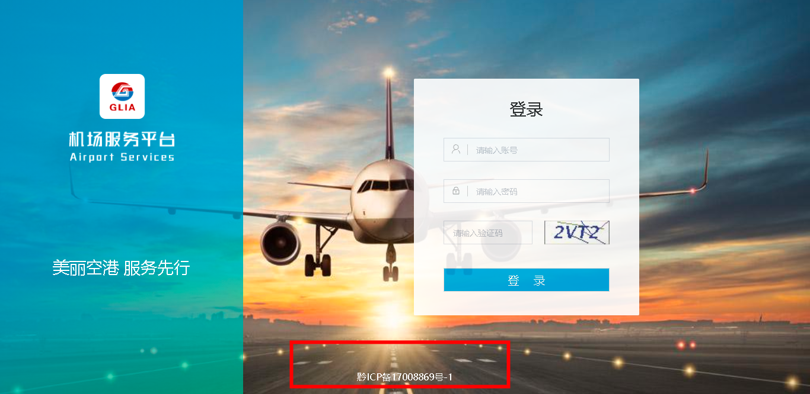

### 主要工作内容展示

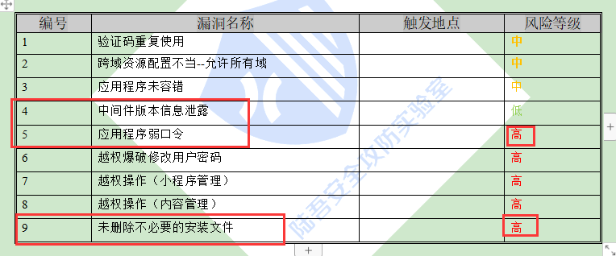

### 工作思路阐述

此项目的修复内容其实没有什么难度,主要是在修复的过程中会遇到一些其他的项目中的问题

比如验证码只可在火狐浏览器中显示

其他的浏览器的无法显示, 且无法校验

## 3.宜宾排班系统

一个新开发的项目

### 主要工作内容展示

- 与产品核对原型并设计数据库

- 对原型迭代后项目设计做出相应调整

- 将各个模块拆分方便其他同事协同开发

- 对接UC

  - 与UC用户中心核对此项目需要使用的接口

- 功能模块的开发

- 维护项目基本代码及依赖

  | 数据接入 | 用户中心                                                     | 组织架构、菜单权限、操作权限                                 |
  | -------- | ------------------------------------------------------------ | ------------------------------------------------------------ |
  | PC管理端 | 用户权限                                                     | 进行系统管理员、部门排班管理员数据权限设置                   |
  |          | 科室管理                                                     | 科室管理：科室列表，部门筛选，科室筛选，新增科室入口         |
  |          | 新增科室：录入科室名称，指派排班员                           |                                                              |
  |          | 编辑科室：修改科室名称及排班员                               |                                                              |
  |          | 基础数据设置                                                 | 资质设置：展示资质列表，可进行部门筛选、资质筛选，新增资质入口 新增资质：录入资质名称，选择已获此资质的员工 编辑资质：修改资质名称及已获此资质员工 |
  |          | 岗位设置：展示岗位列表，可进行部门筛选、岗位筛选，新增岗位入口 新增岗位：录入岗位名称，选择关联资质，设置性别要求 编辑岗位：修改岗位名称及关联资质及性别要求 |                                                              |
  |          | 班组设置：展示班组列表，可进行部门筛选、班组筛选，新增班组入口 新增班组：录入班组名称，设置班组负责人，设置班组人员。 编辑班组：对班组内设置的内容进行修改 |                                                              |
  |          | 排班规则设置                                                 | 排班规则设置：展示排班科室列表，可进行部门筛选、排班筛选     |
  |          | 编辑排班规则：进行排班岗位、班制、班次上班时段设置           |                                                              |
  |          | 排班管理                                                     | 排班管理：展示排班科室列表，可进行部门筛选、科室筛选         |
  | 移动端H5 | 排班表                                                       | 个人排班表：展示个人1周排班表，可按周切换                    |
  |          |                                                              | 部门排班表-展示部门内今日上班班组排班表，可以日为单位切换    |
  |          |                                                              | 部门排班表-换班编辑                                          |
  |          |                                                              | 部门排班表-加班编辑                                          |

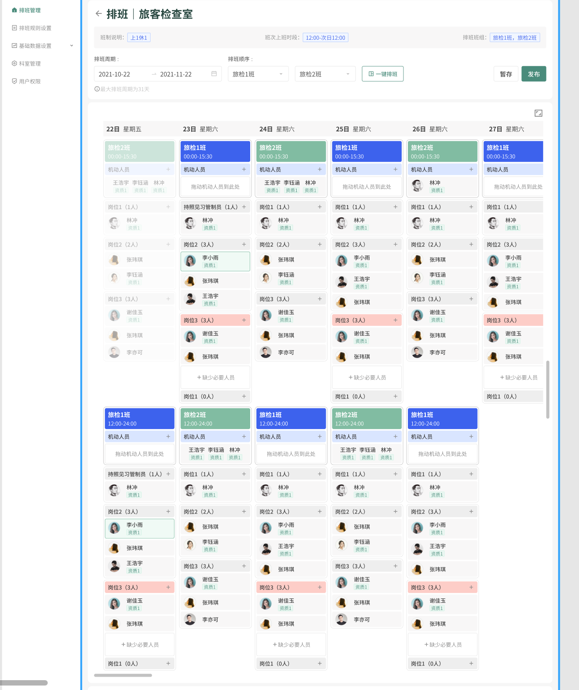

### 工作思路阐述

拆分模块后逐个击破

- 与产品核对原型并设计数据库
- 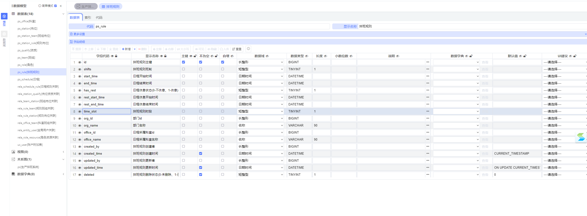
- 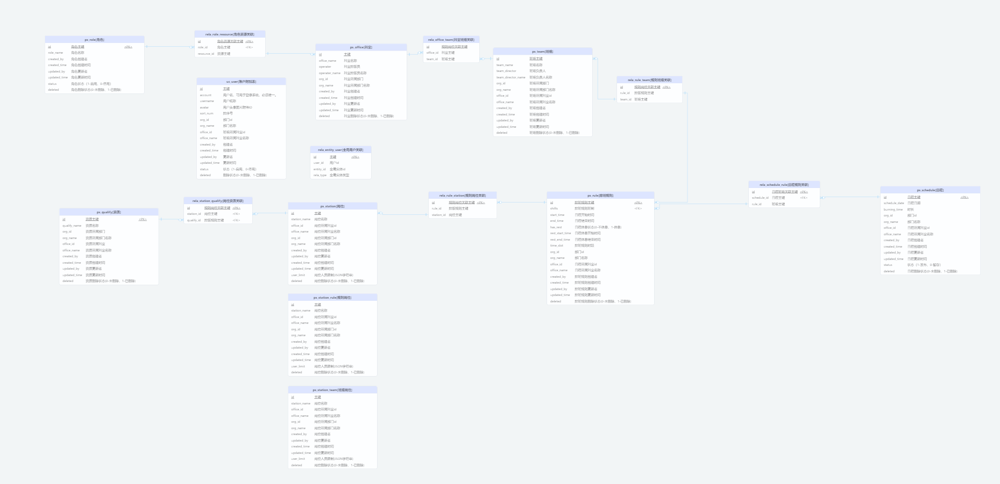
- 对原型迭代后项目设计做出相应调整
- 将各个模块拆分方便其他同事协同开发
- 对接UC
  - 与UC用户中心核对此项目需要使用的接口
- 功能模块的开发
- 维护项目基本代码及依赖

# 2.试用期洞察与收获(例如:组件库思维、设计规范、 前、后端框架等)

- 机场项目的接触

- UC建立的使用及理解

- 排版系统的数据库设计

  - chiner中国人的数据库设计工具 之前用的是 powerdesigner

- 基本框架及其依赖(杨哥搭建)

  - i18国际化结合逆向工程

    

# 3.工作过程中遇到的任何问题(难点痛点如何改进提升)

自己的: 工作中遇到的问题博客记录 https://niziming.github.io/

协同的:UC api那一块2.0.4有bug feign调用参数不对，和uc沟通后更新到2.0.5beta版本，项目也更新了的，后续需要的还得继续沟通.

# 4.对团队的建议(对部门、团队的建议、后续的提升计划)

目前对于整个技术团队的架构是比较满意的,也比较喜欢部门内氛围,公司的活动也比较对,总体而言比较满意.